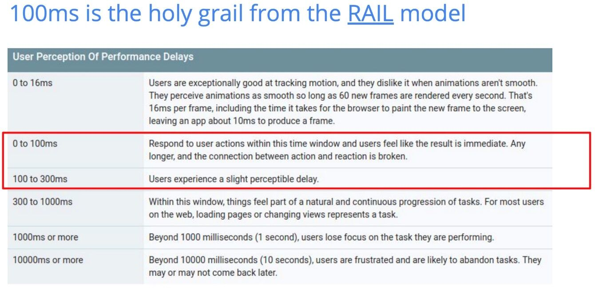

# Others

ISO 3103 - How to brew tea?

Pairwise distinct - All elements are unique

## Indirection

In [computer programming](https://en.wikipedia.org/wiki/Computer_programming), **indirection** (also called **dereferencing**) is the ability to reference something using a name, reference, or container instead of the value itself. The most common form of indirection is the act of manipulating a value through its [memory address](https://en.wikipedia.org/wiki/Memory_address). For example, accessing a [variable](https://en.wikipedia.org/wiki/Variable_(programming)) through the use of a [pointer](https://en.wikipedia.org/wiki/Pointer_(computer_programming)). A stored pointer that exists to provide a reference to an object by double indirection is called an *indirection node*. In some older computer architectures, indirect words supported a variety of more-or-less complicated [addressing modes](https://en.wikipedia.org/wiki/Addressing_mode).

https://en.wikipedia.org/wiki/Indirection

## Frequency Cap

It is a counter for unique users on a website based on session data (like cookies). There might be millions or tens of millions of users visiting a website. Frequency capping means you only show each user your ad once per day.

Redis has a [HyperLogLog data type](https://redis.io/commands/pfcount) that is perfect for a frequency cap. It approximates set membership with a very small error rate, in exchange for O(1) time and a very small memory footprint. PFADD adds an element to a HyperLogLog set. It returns 1 if your element is not in the set already, and 0 if it is in the set.

## Variadic

In [mathematics](https://en.wikipedia.org/wiki/Mathematics) and in [computer programming](https://en.wikipedia.org/wiki/Computer_programming), a **variadic function** is a [function](https://en.wikipedia.org/wiki/Function_(programming)) of indefinite [arity](https://en.wikipedia.org/wiki/Arity), i.e., one which accepts a variable number of [arguments](https://en.wikipedia.org/wiki/Argument_(computer_science)). Support for variadic functions differs widely among [programming languages](https://en.wikipedia.org/wiki/Programming_language).

https://en.wikipedia.org/wiki/Variadic_function

## GILT

### Globalization (G11N) -> T9N + L10N + I18N

### Internationalization ("i18n")

Internationalization ("i18n") is the process of adapting app code to other languages. For example, an app might need to display data in a different format, prices, or numbers with the correct decimal or thousands separators, or even handling whether text is written right-to-left or left-to-right. It also requires taking into account the user's timezone.

### Localization ("l10n")

Localization ("l10n"), is the process of preparing the content of the app to be available in different languages. This includes translating most of the app's resources, like texts, images, and sounds. Resources for different languages are usually kept in different files or directories, and the OS chooses the right one based on user settings.
Translation (T9N)

### Translation

The terms ‘Translation’ and ‘Localization’ are often mistakenly interchanged and misused when referring to the cross-linguistic interpretation and rendition of content. However, even though they share the same purpose, at their cores, their meaning and approach towards its achievement are different.

Translation can be defined as the literal word-for-word transformation of a source text into the target language, the first stepping stone on any content’s road towards a new audience, as it provides this new audience with the ability to understand the source text in their native language.

A typical application scenario for translation is exact texts. Examples include technical and medical documentation, where the focus is on specific terminology that has to be converted from language A to language B.

However, translation alone is not sufficient due to its word-for-word approach, in cases where the main focus is to deliver a message from language A to language B, hence the inextricable correlation with Localization.

### Difference

|   |   |
|---|---|
|**Term**|**Definition**|
|Globalization (G11N)|The process by which businesses or other organizations develop international influence or start operating on a global scale.|
|Internationalization (I18N)|The design and development of a product, application or document content that enables easy Localization for target audiences that vary in culture, region, or language.|
|Localization (L10N)|The linguistic adaptation of content for the target region, its languages, and cultural particularities in order to make it appropriate, easily understandable, and comfortable to use for local native language speakers.|
|Translation (T9N)|The literal word-for-word transformation of a source text into the target language.|

[GILT: Globalization, Internationalization, Localization, Translation - and the Difference Between them - AD VERBUM](https://www.adverbum.com/en/blog/globalization-internationalization-localization-translation)

## Time in human terms (Real cost)

| **Access type**                | **Actual time** | **Approximated time** |
|--------------------------------|-----------------|-----------------------|
| 1 CPU cycle                    | 0.3 ns          | 1 s                   |
| Level 1 cache access           | 0.9 ns          | 3 s                   |
| Level 2 cache access           | 2.8 ns          | 9 s                   |
| Level 3 cache access           | 12.9 ns         | 43 s                  |
| Main memory access             | 120 ns          | 6 min                 |
| Solid-state disk I/O           | 50-150 μs       | 2-6 days              |
| Rotational disk I/O            | 1-10 ms         | 1-12 months           |
| Internet: SF to NYC            | 40 ms           | 4 years               |
| Internet: SF to UK             | 81 ms           | 8 years               |
| Internet: SF to Australia      | 183 ms          | 19 years              |
| OS virtualization reboot       | 4 s             | 423 years             |
| SCSI command time-out          | 30 s            | 3000 years            |
| Hardware virtualization reboot | 40 s            | 4000 years            |
| Physical system reboot         | 5 m             | 32 millenia           |

https://blog.codinghorror.com/the-infinite-space-between-words

[Technology Size Comparison 🤯🤯 3D Animation - YouTube](https://www.youtube.com/watch?v=gfOD-Qpl6eg)

1 million seconds is about 11.5 days. And 1 billion seconds stretches to a whopping 31.7 years!

### Responsiveness matters

- Walmart has found a sharp decline in conversion rates as latency climbs from 1s to 4s.
- Amazon found that every 100ms of latency cost them 1% in sales.
- Estimates from Akamai show that a 1s delay in page response can result in a 7% reduction in conversions.

RAIL Model - https://web.dev/rail

## Fork Bomb (Rabbit Virus)

Fork Bomb is a program that harms a system by making it run out of memory. It forks processes infinitely to fill memory. The fork bomb is a form of denial-of-service (DoS) attack against a Linux based system.

Once a successful fork bomb has been activated in a system it may not be possible to resume normal operation without rebooting the system as the only solution to a fork bomb is to destroy all instances of it.

`:(){ :|:& };:`

[Fork() Bomb - GeeksforGeeks](https://www.geeksforgeeks.org/fork-bomb/)
