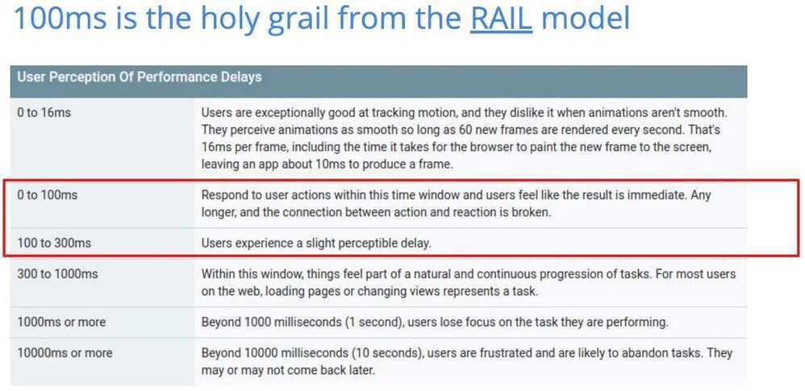

# Others

ISO 3103 - How to brew tea?

Pairwise distinct - All elements are unique

## Indirection

In [computer programming](https://en.wikipedia.org/wiki/Computer_programming), **indirection** (also called **dereferencing**) is the ability to reference something using a name, reference, or container instead of the value itself. The most common form of indirection is the act of manipulating a value through its [memory address](https://en.wikipedia.org/wiki/Memory_address). For example, accessing a [variable](https://en.wikipedia.org/wiki/Variable_(programming)) through the use of a [pointer](https://en.wikipedia.org/wiki/Pointer_(computer_programming)). A stored pointer that exists to provide a reference to an object by double indirection is called an *indirection node*. In some older computer architectures, indirect words supported a variety of more-or-less complicated [addressing modes](https://en.wikipedia.org/wiki/Addressing_mode).

<https://en.wikipedia.org/wiki/Indirection>

## Frequency Cap

It is a counter for unique users on a website based on session data (like cookies). There might be millions or tens of millions of users visiting a website. Frequency capping means you only show each user your ad once per day.

Redis has a [HyperLogLog data type](https://redis.io/commands/pfcount) that is perfect for a frequency cap. It approximates set membership with a very small error rate, in exchange for O(1) time and a very small memory footprint. PFADD adds an element to a HyperLogLog set. It returns 1 if your element is not in the set already, and 0 if it is in the set.

## Variadic

In [mathematics](https://en.wikipedia.org/wiki/Mathematics) and in [computer programming](https://en.wikipedia.org/wiki/Computer_programming), a **variadic function** is a [function](https://en.wikipedia.org/wiki/Function_(programming)) of indefinite [arity](https://en.wikipedia.org/wiki/Arity), i.e., one which accepts a variable number of [arguments](https://en.wikipedia.org/wiki/Argument_(computer_science)). Support for variadic functions differs widely among [programming languages](https://en.wikipedia.org/wiki/Programming_language).

<https://en.wikipedia.org/wiki/Variadic_function>

## Internationalization ("i18n")

Internationalization ("i18n") is the process of adapting app code to other languages. For example, an app might need to display data in a different format, prices, or numbers with the correct decimal or thousands separators, or even handling whether text is written right-to-left or left-to-right. It also requires taking into account the user's timezone.

## Localization ("l10n")

Localization ("l10n"), is the process of preparing the content of the app to be available in different languages. This includes translating most of the app's resources, like texts, images, and sounds. Resources for different languages are usually kept in different files or directories, and the OS chooses the right one based on user settings.
Translation (T9N)

## Globalization (G11N) -> T9N + L10N + I18N

## Time in human terms (Real cost)

| **Access type**                | **Actual time** | **Approximated time** |
|--------------------------------|-----------------|-----------------------|
| 1 CPU cycle                    | 0.3 ns          | 1 s                   |
| Level 1 cache access           | 0.9 ns          | 3 s                   |
| Level 2 cache access           | 2.8 ns          | 9 s                   |
| Level 3 cache access           | 12.9 ns         | 43 s                  |
| Main memory access             | 120 ns          | 6 min                 |
| Solid-state disk I/O           | 50-150 μs       | 2-6 days              |
| Rotational disk I/O            | 1-10 ms         | 1-12 months           |
| Internet: SF to NYC            | 40 ms           | 4 years               |
| Internet: SF to UK             | 81 ms           | 8 years               |
| Internet: SF to Australia      | 183 ms          | 19 years              |
| OS virtualization reboot       | 4 s             | 423 years             |
| SCSI command time-out          | 30 s            | 3000 years            |
| Hardware virtualization reboot | 40 s            | 4000 years            |
| Physical system reboot         | 5 m             | 32 millenia           |

<https://blog.codinghorror.com/the-infinite-space-between-words>

### Responsiveness matters

- Walmart has found a sharp decline in conversion rates as latency climbs from 1s to 4s.
- Amazon found that every 100ms of latency cost them 1% in sales.
- Estimates from Akamai show that a 1s delay in page response can result in a 7% reduction in conversions.

RAIL Model - <https://web.dev/rail>

## Linear-feedback shift register (LSFR)

In [computing](https://en.wikipedia.org/wiki/Computing), alinear-feedback shift register(LFSR) is a [shift register](https://en.wikipedia.org/wiki/Shift_register) whose input bit is a [linear function](https://en.wikipedia.org/wiki/Linear#Boolean_functions) of its previous state.

The most commonly used linear function of single bits is [exclusive-or](https://en.wikipedia.org/wiki/Exclusive-or)(XOR). Thus, an LFSR is most often a shift register whose input bit is driven by the XOR of some bits of the overall shift register value.

The initial value of the LFSR is called the seed, and because the operation of the register is deterministic, the stream of values produced by the register is completely determined by its current (or previous) state. Likewise, because the register has a finite number of possible states, it must eventually enter a repeating cycle. However, an LFSR with a [well-chosen feedback function](https://en.wikipedia.org/wiki/Primitive_polynomial_(field_theory)) can produce a sequence of bits that appears random and has a [very long cycle](https://en.wikipedia.org/wiki/Maximal_length_sequence).

Applications of LFSRs include generating [pseudo-random numbers](https://en.wikipedia.org/wiki/Pseudorandomness), [pseudo-noise sequences](https://en.wikipedia.org/wiki/Pseudorandom_noise), fast digital counters, and [whitening sequences](https://en.wikipedia.org/wiki/Whitening_sequences). Both hardware and software implementations of LFSRs are common.

The mathematics of a [cyclic redundancy check](https://en.wikipedia.org/wiki/Cyclic_redundancy_check), used to provide a quick check against transmission errors, are closely related to those of an LFSR.In general, the arithmetics behind LFSRs makes them very elegant as an object to study and implement. One can produce relatively complex logics with simple building blocks. However, other methods, that are less elegant but perform better, should be considered as well.

<https://en.wikipedia.org/wiki/Linear-feedback_shift_register>
