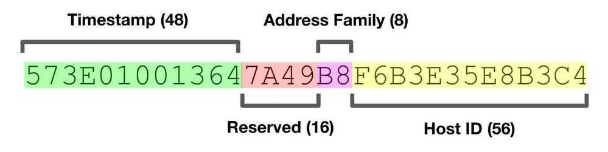

# UUID / GUID

A **Universally Unique IDentifier (UUID)** is a [128-bit](https://en.wikipedia.org/wiki/128-bit) number used to identify information in computer systems. The term **Globally Unique IDentifier(GUID)** is also used, typically in software created by Microsoft.

When generated according to the standard methods, UUIDs are for practical purposes unique, without depending for their uniqueness on a central registration authority or coordination between the parties generating them, unlike most other [numbering schemes](https://en.wikipedia.org/wiki/Numbering_scheme). While the probability that a UUID will be duplicated is not zero, it is close enough to zero to be negligible.

Thus, anyone can create a UUID and use it to identify something with near certainty that the identifier does not duplicate one that has already been, or will be, created to identify something else. Information labeled with UUIDs by independent parties can therefore be later combined into a single database or transmitted on the same channel, with a negligible probability of duplication.

#### Format

In its canonical textual representation, the 16 [octets](https://en.wikipedia.org/wiki/Octet_(computing)) of a UUID are represented as 32 [hexadecimal](https://en.wikipedia.org/wiki/Hexadecimal)(base-16) digits, displayed in 5 groups separated by hyphens, in the form 8-4-4-4-12 for a total of 36 characters (32 alphanumeric characters and 4 hyphens). For example:

123e4567-e89b-12d3-a456-426655440000

xxxxxxxx-xxxx-Mxxx-Nxxx-xxxxxxxxxxxx

The 4 bits of digit M indicate the UUID version, and the 1--3 most significant bits of digit N indicate the UUID variant. In the example, *M* is 1, and *N* isa(10xx~2~), meaning that the UUID is a variant-1, version-1 UUID; that is, a time-based DCE/RFC 4122 UUID.

The canonical 8-4-4-4-12 format string is based on the "record layout" for the 16 bytes of the UUID:

| **Name**                           | **Length (bytes)** | **Length (hex digits)** | **Contents**                                                                                 |
|-------------------|-----------|------------|------------------------------|
| time_low                           | 4                  | 8                       | integer giving the low 32 bits of the time                                                   |
| time_mid                           | 2                  | 4                       | integer giving the middle 16 bits of the time                                                |
| time_hi_and_version                | 2                  | 4                       | 4-bit "version" in the most significant bits, followed by the high 12 bits of the time     |
| clock_seq_hi_and_res clock_seq_low | 2                  | 4                       | 1--3-bit "variant" in the most significant bits, followed by the 13--15-bit clock sequence |
| node                               | 6                  | 12                      | the 48-bit node id                                                                           |


https://tools.ietf.org/html/rfc4122.html

### UUID V1 : Uniqueness

UUID v1 is generated by using a combination the host computers MAC address and the current date and time. In addition to this, it also introduces another random component just to be sure of its uniqueness.

This means you are guaranteed to get a completely unique ID, unless you generate it from the same computer, and at the exact same time. In that case, the chance of collision changes from impossible to very very small because of the random bits.

This guaranteed uniqueness comes at the cost of anonymity. Because UUID v1 takes the time and your MAC address into consideration, this also means that someone could potentially identify the time and place(i.e. computer) of creation.

### UUID V4 : Randomness

The generation of a v4 UUID is much simpler to comprehend. The bits that comprise a UUID v4 are generated randomly and with no inherent logic. Because of this, there is no way to identify information about the source by looking at the UUID.

However, there is now a chance that a UUID could be duplicated. The question is, do you need to worry about it?

The short answer is no. With the sheer number of possible combinations (2^128), it would be almost impossible to generate a duplicate unless you are generating trillions of IDs every second, for many years.

If your application is mission critical (for example, bank transactions or medical systems), you should still add a uniqueness constraint to avoid UUIDv4 collision

### UUID V5: Non-Random UUIDs

If you want a unique ID that's not random, UUID v5 could be the right choice.
Unlike v1 or v4, UUID v5 is generated by providing two pieces of input information:

- Input string: Any string that can change in your application.
- Namespace: A fixed UUID used in combination with the input string to differentiate between UUIDs generated in different applications, and to prevent [rainbow table hacks](https://www.hackingloops.com/what-are-rainbow-tables/)

These two pieces of information are converted to a UUID using the SHA1 hashing algorithm.

An important point to note is UUID v5 is consistent. This means that any given combination of input and namespace will result in the same UUID, every time.

This is great if you want to, for example, maintain a mapping of your users to their UUIDs without explicitly persisting that information to storage.

However, remember that these IDs are not random, and their uniqueness is now your responsibility.

### UUID Future

- UUID Version 6 (UUIDv6) - A simple reordering of the bits within a UUIDv1 to allow it to be sorted as an opaque sequence of bytes.
- UUID Version 7 (UUIDv7) - A new time-based UUID bit layout based on the Unix Epoch timestamp already widely used in the industry.
- UUID Version 8 (UUIDv8) - A free-form format whose only requirement is to keep backward compatibility.
- Max UUID - A specialty UUID that acts as the inverse of the [Nil UUID](https://www.rfc-editor.org/rfc/rfc4122#section-4.1.7) put forth in RFC 4122

With random ID’s, values that are near each other in the index are going to be inserted at totally different times, and be in totally different places in the table.

timestamp-based UUID method (using the soon-to-be-standardized UUID v7 method)

[Unexpected downsides of UUID keys in PostgreSQL - CYBERTEC](https://www.cybertec-postgresql.com/en/unexpected-downsides-of-uuid-keys-in-postgresql/)

[Analyzing New Unique Identifier Formats (UUIDv6, UUIDv7, and UUIDv8) | by Kyle Carter | Dev Genius](https://blog.devgenius.io/analyzing-new-unique-identifier-formats-uuidv6-uuidv7-and-uuidv8-d6cc5cd7391a)

[New UUID Formats](https://www.ietf.org/archive/id/draft-peabody-dispatch-new-uuid-format-01.html)

### Which Version Should You Use?

If you don't know what to go with, go with v4. It's good enough, and the chances of collision are practically none.

If you actually want your UUID to give some indication of the date and computer in which it was created, then UUID v1 may be for you (although it is).

UUID v5 is normally used only for very specific use cases, when you want to derive a UUID from another piece of information on the fly.

https://www.sohamkamani.com/uuid-versions-explained

### Universally Unique Lexicographically Sortable Identifier (ULID)

ULID, or Universally Unique Lexicographically Sortable Identifier, tries to strike a balance. The first part of a ULID is a timestamp, the second part is random. This makes them sortable like auto-increment IDs, but still unique like UUIDs. Yet, there's still the potential for collisions within the same millisecond.

### FlakeIDs / Snowflake IDs

Many distributed systems have a requirement to generate time sorted, unique ids of some kind - for distinguishing incoming events, for resolving conflicts, for using as keys in key/value stores, for logging, and a whole bunch more.

The basic idea behind flake ids is simple: instead of incrementing a counter each time you need an ID, use some of the top bits in an id to represent time, and then some others to represent a "node id", such that id generation across nodes is unique. The wonderful thing about the node id is that you can just coordinate once- very often just by writing to config files inside your orchestration tool (chef/puppet/ansible/etc).

The format was created by [Twitter](https://en.wikipedia.org/wiki/Twitter "Twitter") and is used for the IDs of tweets. The format has been adopted by other companies, including [Discord](https://en.wikipedia.org/wiki/Discord_(software) "Discord (software)") and [Instagram](https://en.wikipedia.org/wiki/Instagram "Instagram"). The [Mastodon](https://en.wikipedia.org/wiki/Mastodon_(software) "Mastodon (software)") social network uses a modified version.

Snowflake ID is a 64-bit unique identifier that consists of three parts: **timestamp, worker ID, and sequence number.** The timestamp is a 41-bit integer that represents the number of milliseconds since a certain epoch time.

The worker ID is a 10-bit integer that identifies the worker generating the ID, and the sequence number is a 12-bit integer that ensures uniqueness in case multiple IDs are generated within the same millisecond by the same worker.

The structure of a Snowflake ID can be represented in a binary format as follows:

```
0                                       41     51         64
+---------------------------------------+------+-----------+
| timestamp (milliseconds since epoch)  |worker| sequence  |
+---------------------------------------+------+-----------+
```

#### How Snowflake ID Works

Snowflake ID generator is a distributed system that consists of multiple workers, each responsible for generating unique IDs.

When a worker requests a new ID, it first retrieves the current timestamp, then combines it with its worker ID and a sequence number.

The sequence number ensures that if multiple IDs are generated within the same millisecond by the same worker, each ID will be unique.

If the worker generates more than one ID in the same millisecond, the sequence number is incremented to ensure that each ID is unique.

Finally if in the same millisecond, if the sequence number also reaches its max value, the generator waits for the next millisecond and then starts generating IDs again.

[Snowflake ID - Wikipedia](https://en.wikipedia.org/wiki/Snowflake_ID)

[Snowflake ID: Generating Unique IDs for Distributed Systems | Akash Rajpurohit](https://akashrajpurohit.com/blog/snowflake-id-generating-unique-ids-for-distributed-systems/)

[GitHub - erans/pysnowflake: Python implementation of Twitter's Snowflake Unique ID generation service](https://github.com/erans/pysnowflake)

## Links

[Choosing The Right ID Strategy: Auto-Increment, UUID, ULID or Snowflake ID](https://www.linkedin.com/pulse/choosing-right-id-strategy-auto-increment-uuid-ulid-valluru/)

[The effect of Random UUID on database performance - YouTube](https://www.youtube.com/watch?v=OAOQ7U0XAi0)
