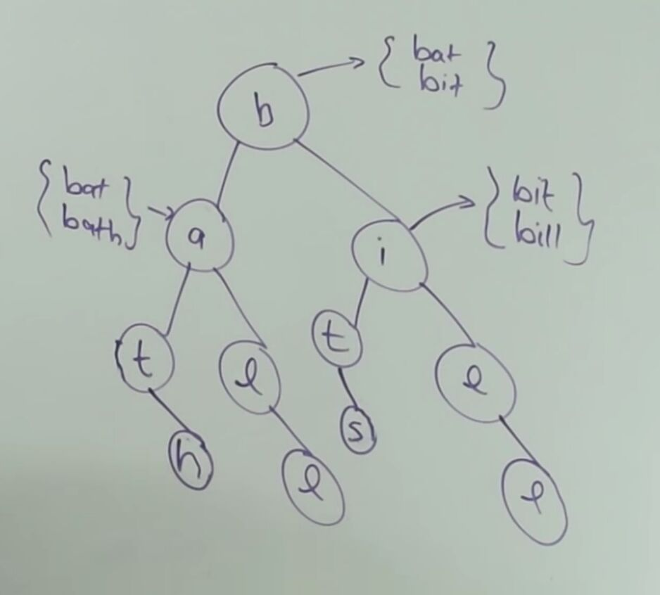

# System Design - Autocomplete or TypeAhead

[System design : Design Autocomplete or Typeahead Suggestions for Google search](https://www.youtube.com/watch?v=us0qySiUsGU)

## Use Case

1. Suggestions for Google Search

## Modules

1. Autocorrect for misspelled words
2. Location based results
3. Personalized results
4. More than one Language

## Data Structure

1. Distributed Trie

## Important Concepts

### Request Flow

- Get a prefix, look into distributed trie and return results
- Store top k prefixes on each node

### Data Collection Flow

- Getting list of strings from a background process, aggregate them and update trie
- Aggregators
- Appliers

## Request Flow

1. User types query in search bar
2. Query goes to Load Balancer
3. Load balancer routes the request to one of several nodes (using some algorithm like round robin algorithm)
4. Selected node looks into distributed cache (redis/memcached)
5. If not found, looks into zookeeper instance for finding the Trie that is reponsible for the given prefix.
6. Get the prefixes from Trie, populate the cache for future use and return the suggestions.

## Optimizations

1. Cache in CDN (Content Delivery Networks)
2. Cache results in Local Machine

