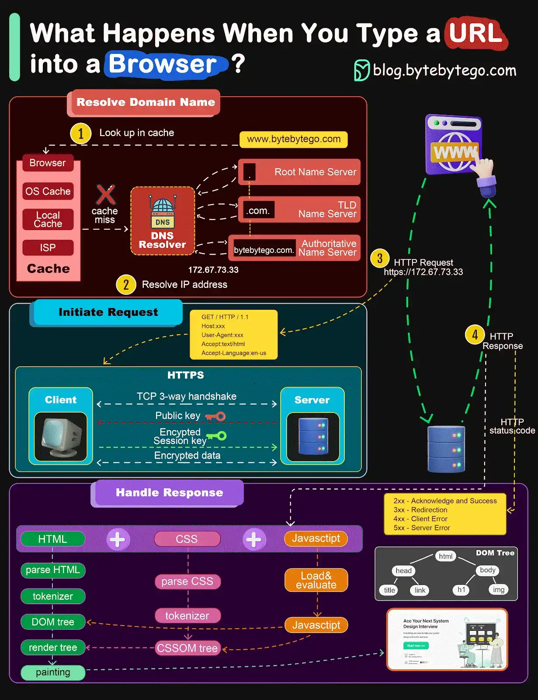

# System Design - What happens when you type google.com into your browser's address box and press enter?

Ever wondered what exactly happens when you type google.com into your browser's address box and press enter?

- The "g" key is pressed
- The "enter" key bottoms out
- Interrupt fires (NOT for USB keyboards)
- (On Windows) AWM_KEYDOWN message is sent to the app
- (On OS X) AKeyDownNSEvent is sent to the app
- (On GNU/Linux) the Xorg server listens for keycodes
- Parse URL
- Is it a URL or a search term?
- Convert non-ASCII Unicode characters in hostname
- Check HSTS list
- DNS lookup
- ARP process
- Opening of a socket
- TLS handshake
- HTTP protocol
- HTTP Server Request Handle
- Behind the scenes of the Browser
- Browser
- HTML parsing
- CSS interpretation
- Page Rendering
- GPU Rendering
- Window Server
- Post-rendering and user-induced execution

## Browser

Once the server supplies the resources (HTML, CSS, JS, images, etc.) to the browser it undergoes the below process:

- Parsing - HTML, CSS, JS
- Rendering - Construct DOM Tree → Render Tree → Layout of Render Tree → Painting the render tree

### Browser High Level Structure

The components of the browsers are:

- **User interface:** The user interface includes the address bar, back/forward button, bookmarking menu, etc. Every part of the browser display except the window where you see the requested page.
- **Browser engine:** The browser engine marshals actions between the UI and the rendering engine.
- **Rendering engine:** The rendering engine is responsible for displaying requested content. For example if the requested content is HTML, the rendering engine parses HTML and CSS, and displays the parsed content on the screen.
- **Networking:** The networking handles network calls such as HTTP requests, using different implementations for different platforms behind a platform-independent interface.
- **UI backend:** The UI backend is used for drawing basic widgets like combo boxes and windows. This backend exposes a generic interface that is not platform specific. Underneath it uses operating system user interface methods.
- **JavaScript engine:** The JavaScript engine is used to parse and execute JavaScript code.
- **Data storage:** The data storage is a persistence layer. The browser may need to save all sorts of data locally, such as cookies. Browsers also support storage mechanisms such as localStorage, IndexedDB, WebSQL and FileSystem.

## HTML parsing

The rendering engine starts getting the contents of the requested document from the networking layer. This will usually be done in 8kB chunks.
The primary job of HTML parser is to parse the HTML markup into a parse tree.
The output tree (the "parse tree") is a tree of DOM element and attribute nodes. DOM is short for Document Object Model. It is the object presentation of the HTML document and the interface of HTML elements to the outside world like JavaScript. The root of the tree is the "Document" object. Prior of any manipulation via scripting, the DOM has an almost one-to-one relation to the markup.

### The parsing algorithm

HTML cannot be parsed using the regular top-down or bottom-up parsers.
The reasons are:

- The forgiving nature of the language.
- The fact that browsers have traditional error tolerance to support well known cases of invalid HTML.
- The parsing process is reentrant. For other languages, the source doesn't change during parsing, but in HTML, dynamic code (such as script elements containing document.write() calls) can add extra tokens, so the parsing process actually modifies the input.

Unable to use the regular parsing techniques, the browser utilizes a custom parser for parsing HTML. The parsing algorithm is described in detail by the HTML5 specification.
The algorithm consists of two stages: tokenization and tree construction.

### Actions when the parsing is finished

The browser begins fetching external resources linked to the page (CSS, images, JavaScript files, etc.).
At this stage the browser marks the document as interactive and starts parsing scripts that are in "deferred" mode: those that should be executed after the document is parsed. The document state is set to "complete" and a "load" event is fired.
Note there is never an "Invalid Syntax" error on an HTML page. Browsers fix any invalid content and go on.

### CSS interpretation

- Parse CSS files, tag contents, and style attribute values using ["CSS lexical and syntax grammar"](http://www.w3.org/TR/CSS2/grammar.html)
- Each CSS file is parsed into a StyleSheet object, where each object contains CSS rules with selectors and objects corresponding CSS grammar.
- A CSS parser can be top-down or bottom-up when a specific parser generator is used.

### Page Rendering

- Create a 'Frame Tree' or 'Render Tree' by traversing the DOM nodes, and calculating the CSS style values for each node.
- Calculate the preferred width of each node in the 'Frame Tree' bottom up by summing the preferred width of the child nodes and the node's horizontal margins, borders, and padding.
- Calculate the actual width of each node top-down by allocating each node's available width to its children.
- Calculate the height of each node bottom-up by applying text wrapping and summing the child node heights and the node's margins, borders, and padding.
- Calculate the coordinates of each node using the information calculated above.
- More complicated steps are taken when elements are floated, positioned absolutely or relatively, or other complex features are used. See http://dev.w3.org/csswg/css2 and http://www.w3.org/Style/CSS/current-work for more details.
- Create layers to describe which parts of the page can be animated as a group without being re-rasterized. Each frame/render object is assigned to a layer.
- Textures are allocated for each layer of the page.
- The frame/render objects for each layer are traversed and drawing commands are executed for their respective layer. This may be rasterized by the CPU or drawn on the GPU directly using D2D/SkiaGL.
- All of the above steps may reuse calculated values from the last time the webpage was rendered, so that incremental changes require less work.
- The page layers are sent to the compositing process where they are combined with layers for other visible content like the browser chrome, iframes and addon panels.
- Final layer positions are computed and the composite commands are issued via Direct3D/OpenGL. The GPU command buffer(s) are flushed to the GPU for asynchronous rendering and the frame is sent to the window server.

### GPU Rendering

- During the rendering process the graphical computing layers can use general purposeCPUor the graphical processorGPUas well.
- When usingGPUfor graphical rendering computations the graphical software layers split the task into multiple pieces, so it can take advantage ofGPUmassive parallelism for float point calculations required for the rendering process.

### Post-rendering and user-induced execution

After rendering has completed, the browser executes JavaScript code as a result of some timing mechanism (such as a Google Doodle animation) or user interaction (typing a query into the search box and receiving suggestions). Plugins such as Flash or Java may execute as well, although not at this time on the Google homepage. Scripts can cause additional network requests to be performed, as well as modify the page or its layout, causing another round of page rendering and painting.

## Problems

- What is the use case of the hook in Godrej lock 6086 (only 2 page results)

## References

- [GitHub - alex/what-happens-when: An attempt to answer the age old interview question "What happens when you type google.com into your browser and press enter?"](https://github.com/alex/what-happens-when)
- [Post from ByteByteGo - YouTube](https://www.youtube.com/channel/UCZgt6AzoyjslHTC9dz0UoTw/community?lb=UgkxJDvMpF4jVEn4aKuBqgYa3mjJay5k8g7r)
