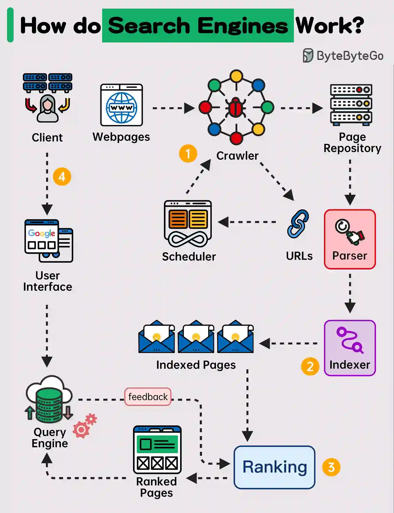

# System Design of Google Search Engine

Google Search is one of the most complex and powerful distributed systems ever created, handling billions of queries per day. Understanding its architecture can help you ace system design interviews and give you a solid grasp of how massive-scale systems operate. In this blog, we'll delve into the system design of Google Search, breaking it down into key components that will be especially useful for those preparing for interviews.

## Table of Contents

1. **High-Level Overview**
2. **Components of Google Search System**
    - Crawling
    - Indexing
    - Ranking
    - Query Processing
    - Caching
3. **Scalability and Fault Tolerance**
4. **Data Consistency**
5. **Challenges and Considerations**
6. **Interview Tips**

## 1. High-Level Overview

Google Search is a **distributed, real-time, web search engine**. Its key functionality is to return the most relevant results for user queries in a matter of milliseconds. It achieves this by breaking down the process into several stages:

- **Crawling**: Collecting web pages from across the internet.
- **Indexing**: Organizing these web pages for efficient retrieval.
- **Query Processing**: Interpreting user queries and returning ranked results.
- **Ranking**: Determining the relevance of results based on hundreds of factors.
- **Serving**: Delivering results to the end user.

The system operates on a global scale, consisting of thousands of distributed servers that ensure low latency and high availability.

## 2. Components of Google Search System

### a. Crawling

The first step in building a search engine is to gather the data, which is done by the **Googlebot**, the system's web crawler. It continuously scans websites, following links to discover new and updated pages. Key design aspects include:

- **Distributed Crawling**: To cover the vast internet, Googlebot runs in a massively parallel architecture across data centers.
- **Politeness**: Ensuring crawlers don't overwhelm websites.
- **Freshness**: Detecting new or updated content quickly.

**Interview Tip:**

Understand how **distributed crawlers** work and how you can scale such systems. Be ready to discuss how to handle failure in this process, such as retry mechanisms and maintaining a crawl queue.

### b. Indexing

Once pages are crawled, they are parsed and organized into an **index**. This is a critical step because searching a massive web of unstructured data in real-time is inefficient. Key aspects include:

- **Reverse Indexing**: Google builds an inverted index, mapping words to the documents in which they appear, similar to a book's index.
- **Sharding**: The index is so large that it must be distributed across thousands of machines. Pages and words are split using **sharding** mechanisms.
- **Compression**: Data is compressed to optimize storage and retrieval.

**Interview Tip:**

Be familiar with the concepts of **sharding** and **inverted indexing**, as well as how to ensure the index remains up-to-date while being efficient in terms of space and time complexity.

### c. Ranking

Google's secret sauce is its **PageRank algorithm**, but modern ranking systems also incorporate **hundreds of factors** like relevance, location, freshness, and user preferences. Key points:

- **Link Analysis**: PageRank evaluates the importance of a webpage based on backlinks.
- **User Signals**: User engagement metrics such as click-through rates and time spent on a page can adjust ranking dynamically.
- **Personalization**: Search results are tailored based on the user's past searches, location, and interests.

**Interview Tip:**

Be ready to discuss different ranking algorithms, including **PageRank**, and how you'd incorporate machine learning models to personalize search results.

### d. Query Processing

When a user types a query, the system needs to interpret it efficiently and accurately. This step involves:

- **Query Parsing**: Breaking down the query into interpretable tokens.
- **Synonym Matching**: Recognizing similar terms or common misspellings.
- **Natural Language Processing**: Understanding the intent behind queries, especially for conversational or long-tail queries.
- **Multilingual Search**: Handling searches in different languages.

**Interview Tip:**

Expect questions about how you'd design a system that can handle queries in multiple languages and recognize **synonyms** or **misspellings** efficiently. Discuss how **NLP techniques** like tokenization and stemming could improve search accuracy.

### e. Caching

Given the massive number of queries, caching is crucial for performance optimization. Google Search uses caching to reduce latency and save computational resources. Key techniques include:

- **Result Caching**: Storing frequently queried search results.
- **Query Suggestion Caching**: Predicting likely user queries and caching them.
- **Geographically Distributed Caches**: Using edge servers to store results closer to users for faster access.

**Interview Tip:**

Understand the types of caching strategies used in distributed systems, including **TTL (Time to Live)**, **eviction policies**, and how to handle **cache invalidation**.

## 3. Scalability and Fault Tolerance

At Google's scale, the system must handle **millions of queries per second** without downtime. Key aspects include:

- **Load Balancing**: Queries are routed to different servers based on load and proximity to users.
- **Fault Tolerance**: Google Search employs **replication** and **redundancy** across data centers to ensure high availability even in the case of hardware or network failure.
- **Horizontal Scaling**: Instead of upgrading a single machine’s capacity, Google adds more machines (horizontal scaling) to handle traffic surges.

**Interview Tip:**

Understand how to design systems that scale horizontally, using techniques like **distributed load balancing**, **replication**, and **partitioning**.

## 4. Data Consistency

Google Search ensures a balance between **consistency** and **availability**. Achieving **strong consistency** in a globally distributed system is challenging, so Google often favors **eventual consistency** for parts of its system, ensuring that data eventually converges to the correct state.

**Interview Tip:**

Be prepared to explain the trade-offs between **CAP theorem** (Consistency, Availability, Partition Tolerance) and how eventual consistency is often the more practical approach for systems like search engines.

## 5. Challenges and Considerations

Some additional challenges Google Search must solve include:

- **Latency**: Queries must be answered in milliseconds, requiring optimization at every level of the stack.
- **Index Updates**: Keeping the index up-to-date with new content from the web in near real-time.
- **Data Security**: Ensuring user data and queries are private and secure.
- **Multi-tenancy**: Handling multiple types of searches (e.g., images, videos, web) while maintaining quality across all.

## 6. Interview Tips

1. **Know the Fundamentals**: Start by understanding the core building blocks of distributed systems, such as **sharding**, **indexing**, and **caching**.
2. **Discuss Trade-offs**: During interviews, highlight the trade-offs between scalability, consistency, and performance.
3. **Think About Optimization**: Google is obsessed with speed. Show how you would optimize every part of the system to reduce latency.
4. **Follow a Structured Approach**: In interviews, start with a high-level design, break it down into components, and explain your choices clearly.

## Deep Dive - Know More

[System Design - What happens when you type google.com into your browser's address box and press enter?](computer-science/interview-question/system-design-google-com-into-browser-press-enter.md)

## References

- [How does Google Search work? - YouTube](https://www.youtube.com/watch?v=KyCYyoGusqs)
   	- Can crawl according to page ranks (high reputation, links from other sites to yours)
   	- Crawl top sites often
   	- Have supplemental index that are crawled after long periods of time
   	- Indexing is done in words consisting of documents order
   	- All the indexes are parallelized with each consisting some part of the web
- [EP104: How do Search Engines Work?](https://blog.bytebytego.com/p/ep104-how-do-search-engines-work)
- [system-design/notes/google-search-engine.md at master · jguamie/system-design · GitHub](https://github.com/jguamie/system-design/blob/master/notes/google-search-engine.md)
- [How I Would Design… A Search Engine! | by James Collerton | Medium](https://jc1175.medium.com/how-i-would-design-a-search-engine-9b423a18afe7)
- [Designing Distributed Search System | by Jyoti | Medium](https://medium.com/@jyoti1308/designing-a-distributed-search-system-92039ecfd273)
- [System Design: The Distributed Search - Grokking Modern System Design Interview for Engineers & Managers](https://www.educative.io/courses/grokking-modern-system-design-interview-for-engineers-managers/system-design-the-distributed-search)
