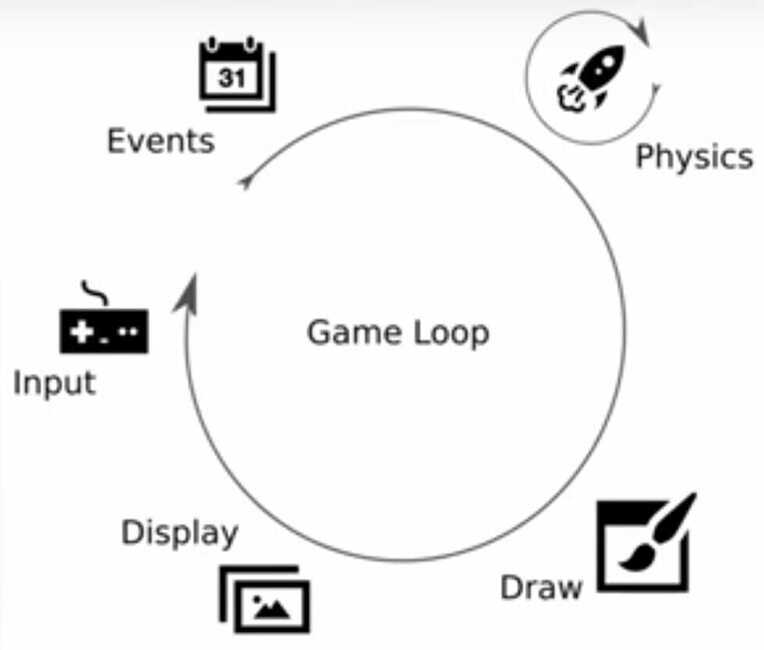
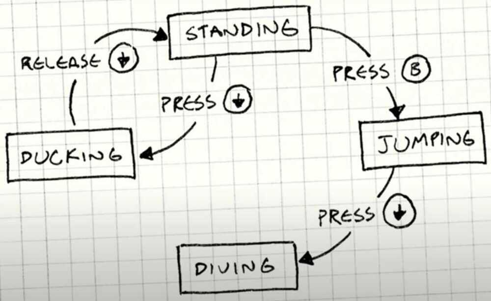
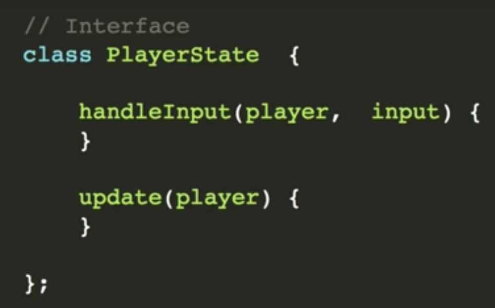
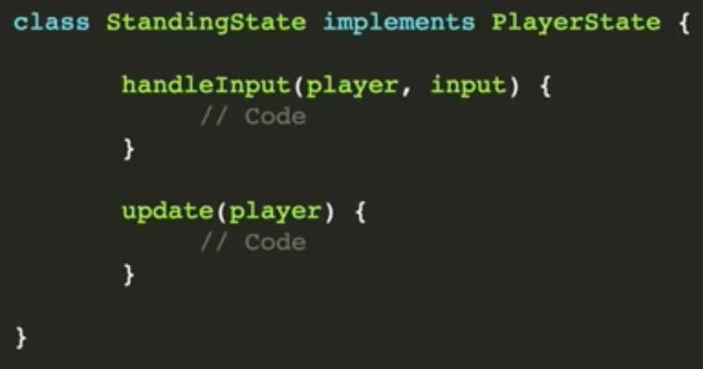
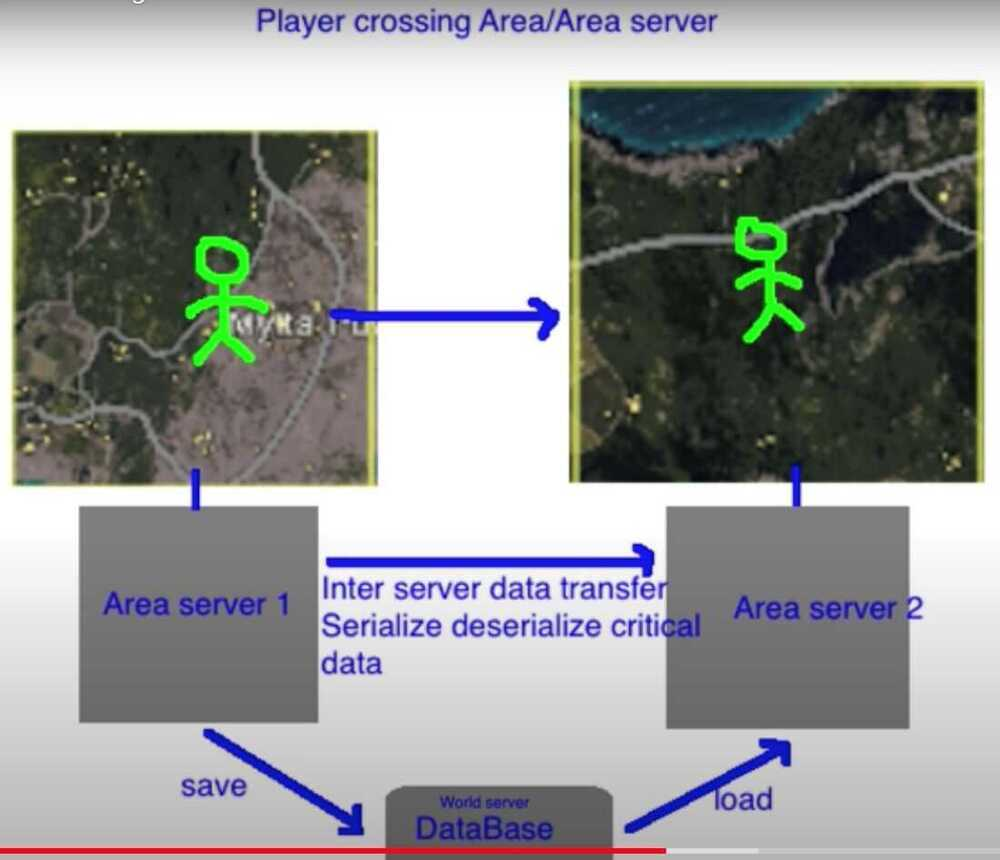

# System Design - MMOG - Game

[System design: Design Multiplayer game](https://www.youtube.com/playlist?list=PLkQkbY7JNJuCoOw3epgKcNIU6rFri4iQk)

## Game Loop



```java
while (true) {
check_input()
update_game_state()
render_screen()
}
```

## Physics Engines

- Unity
- Unreal Engine


1. Strategic games
2. Slow turn games
3. First person games

## Authoritative Server

- Holds all the state information and validates each state information with it's own state
- No one can hack the client and run mod commands
- Therefore can't have peer to peer connection between players

## Networking

- **Deterministic Lock Step**
- Sends only input only and not the new state of game character
- Encode each bit for each input thereby saving more bandwidth
- Using this other side can simulate their own environment
- Sampling size - 60 / sec

1. TCP (Head of line blocking), therefore can't use TCP

2. Playout Buffer (keep 5 sec in buffer like in youtube, netflix, that keeps preloaded some data beforehand, so intermittent network can be smoothened)

3. Can have a buffer space (park space) of 50 ms so the overall experience is smooth

4. Therefore instead of TCP use UDP,


- Send previous inputs in all packets
- Add timestamps for replay- **State Synchronization**
    - Sync state of the environments object
        - Object State
            - Position
            - Orientation
            - Linear Velocity
            - Angular Velocity
- **Jitters and lagging**
    - **Prediction**
        - Linear Interpolation
        - Polar Interpolation
        - Hermite Interpolation

## Handling states, corner cases, rules for objects

- Via if-else statement
    - Not maintainable
    - Not scalable
    - No design pattern








- World Server
- Game /Area Server
- Data Structure - Map Template



## Patch Servers

- Everyone should be in same version in MMOG
- Real time updates

## Game State Backup

1. Important bits
2. Only if changed
3. Individual
4. Async

## CDN

Game Sprites

## Database

- SQL
- Sharded SQL
- NoSQL
