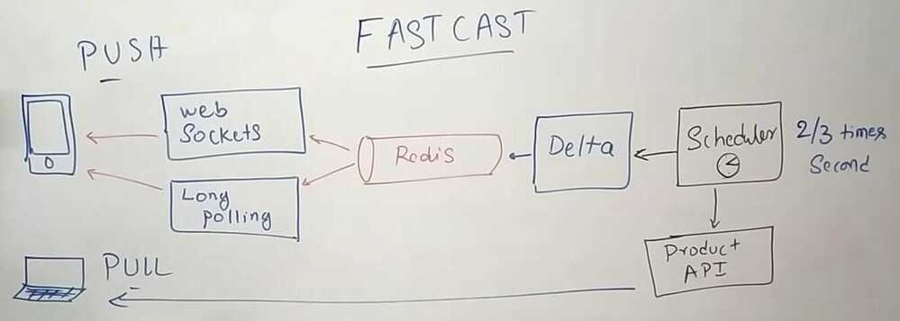
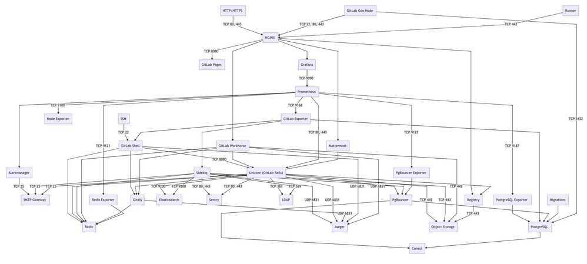
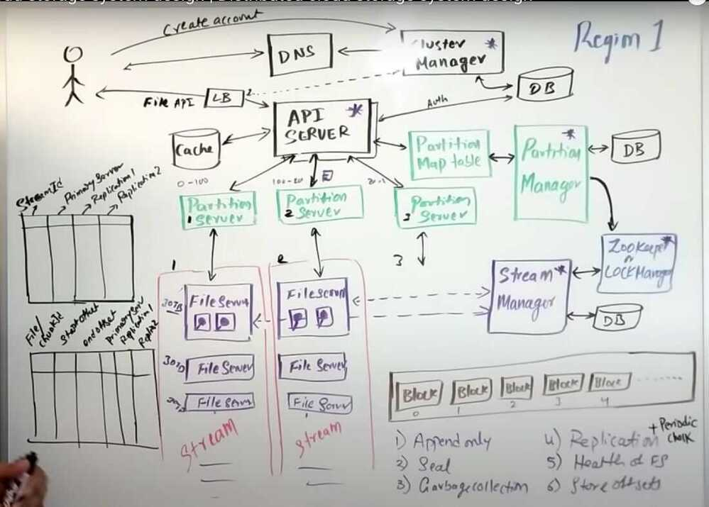
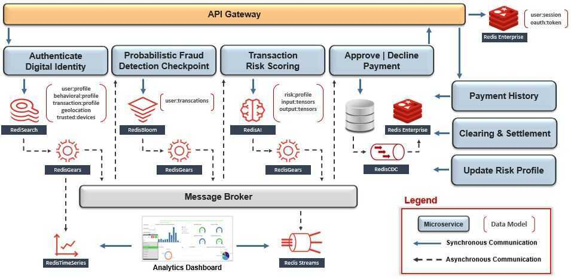

# System Design - Others

## CricInfo

[CRICINFO system design | CRICBUZZ System design](http://youtube.com/watch?v=exSwQtMxGd4)

## Netflix

1. AWS
2. OpenConnect (Netflix CDN)

   1. OC
   2. Backend
   3. Client

https://www.linkedin.com/pulse/system-design-netflix-narendra-l

https://netflixtechblog.com/netflixs-viewing-data-how-we-know-where-you-are-in-house-of-cards-608dd61077da

[NETFLIX System design | software architecture for netflix](https://www.youtube.com/watch?v=psQzyFfsUGU)

## Gitlab

## S3 system design (distributed cloud storage)

### Cluster Manager

1. Allocates account
2. Disaster recovery
3. Resource track
4. Holds policies Authentication + Authorization
5. Manages Cluster- **Hash(UUID) - Partition Map Table**

- Consistent Hashing
- **1 hit wonder (don't cache any request till a threshold)**
    - Maybe the request is only once/twice for a day

### Streaming layer (Stream Manager)

1. Append only
2. Seal
3. Garbage collection
4. Replication
5. Health of FS
6. Store offsets

[S3 system design | cloud storage system design | Distributed cloud storage system design - YouTube](https://www.youtube.com/watch?v=UmWtcgC96X8)

## Financial System

## TikTok

[System Design Interview: TikTok architecture with @sudoCODE](https://www.youtube.com/watch?v=07BVxmVFDGY&ab_channel=GauravSen)

- Intagram Reels
- Short TikTok Videos

## Challenges

- Ingestion
- Storage
- Distribution

### Functional requirements

- Upload videos
- Feed
- Profiles

### Non-functional requirements

- Scalability
- Availability
- Fault tolerant
- Performance

## Others

- HTTP + json is not good (because contract is not upheld from developers while sending apis)
- [Overview of Discord's data platform that daily processes petabytes of data and trillion points - YouTube](https://www.youtube.com/watch?v=yGpEzO32lU4)
- [10 Tips for Building Resilient Payment Systems (2023)](https://shopify.engineering/building-resilient-payment-systems)
- [How Shopify’s engineering improved database writes by 50% with ULID - YouTube](https://www.youtube.com/watch?v=f53-Iw_5ucA)
- [Ep 1 - @RazorpayEngineering's journey to microservices and ensuring data consistency - YouTube](https://www.youtube.com/watch?v=yqkyq8TPWbg)
- [How to NOT Fail a System Design Interview (By a Data Engineer) - YouTube](https://www.youtube.com/watch?v=WQBc2mY9Jng)
- [How Giphy uses CDN to serve 10 billion GIFs every day - YouTube](https://www.youtube.com/watch?v=-bo7oVejgRM)
- [What happens before the Backend gets the Request - YouTube](https://www.youtube.com/watch?v=gSQoA4SYhJY)
- [How Discord Serves 15-Million Users on One Server](https://blog.bytebytego.com/p/how-discord-serves-15-million-users?)
- [Capturing A Billion Emo(j)i-ons](https://highscalability.com/capturing-a-billion-emo-j-i-ons/)
- [How Uber Uses Integrated Redis Cache to Serve 40M Reads/Second?](https://blog.bytebytego.com/p/how-uber-uses-integrated-redis-cache)
- [System Design of a Delivery System like Zomato with @KeertiPurswani - YouTube](https://www.youtube.com/watch?v=nHh3DnjnPig&ab_channel=GauravSen)
- [Google Borg: Billions of Distributed Linux Containers - YouTube](https://youtu.be/l35hqwTY5W0)
