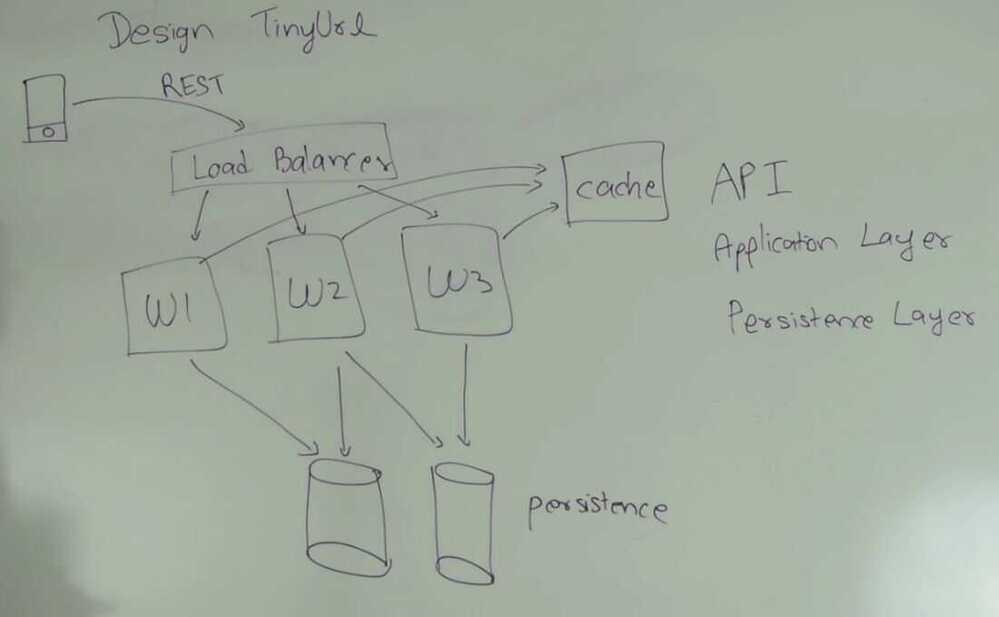
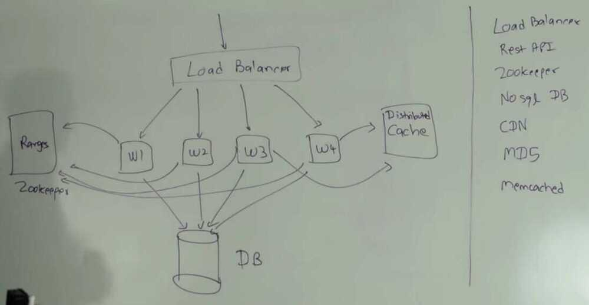

# System Design - TinyURL

[System Design : Design a service like TinyUrl](https://www.youtube.com/watch?v=fMZMm_0ZhK4)

## Problem Statement

Given a long url return a short url, and given a short url return the corresponding long url

- How to generate 7-8 Characters long and is unique
- How to design the persistance layer (where you would store the short url and long url)

## API

createTiny(longUrl) -> tinyUrl

getLong(tinyUrl) -> longUrl

- Add Expiration time

## Application layer

## Load Balancer

Delegate requests to one of the worker threads

- Software
- Software + Hardware

## Worker URL

1. Take longer url generate tiny url and store it in persistance layer and return tiny url

2. Take shorter url fetch it's corresponding long url and return back long url.

## Cache

- memcached
- redis

## How to generate a tinyURL

- Characters - a-zA-Z0-9 (Use a BASE 62 encoding since A-Za-z0-9 total are 62 characters.)
- Length of generated tinyURL - 7 characters long
- Total combinations - 62^7 - 3.5 trillion (million requests/second - 40 days, 1000 requests/second - 110 years exhaust)
- Any number from 0 to 3.5 trillion can be represented by 43 bits

## Database

- Key as tiny url
- value as longer url

1. Generate random tiny url & check db

    1. Technique 1

get a random tiny url and put tiny url with long url in database.

Problem - Other worker thread can do the same

2. Technique 2

Put if absent

3. Technique 3

put (tiny, long)

get(tiny) - if both are same than service worker is done

Otherwise again do put(tiny, long) and repeat

Problem - For every put you have to do atleast one get.
2. Pick first 43 bits of MD5

We calculate the MD5 of longer url then take the first 43 bits of that md5 and use that to generate the tiny url

MD5 is a hashing function that generate 128 bit long hash.

Probability of collision - smaller if more bits are taken, but than the length of tiny url gets longer.
Use md5 to generate tinyurl and than check database for collision.
Advantage of random generation vs MD5

Save some space in database

If two users want to generate two tiny urls for same long string, so in 1st technique there will be two tiny urls with 2 records, but in 2nd technique both will have same MD5 with same first 43 bits so we can have some **deduping (to remove duplicate entries from a list or database),** so we have to store only one row instead of two row in the database.
Convert 43 bits to 7 characters long url

1. Convert 43 bits binray to decimal

2. Convert decimal to base 62 (divide by 62 and mod by 62) - will get number from 0 to 61

3. Map 0 - 61 to characters
3. Counter

   - Single Host
        - a single maintainer is responsible to maintain the counter
        - Can be a database or a zookeeper instance
        - Every worker thread requests a counter maintainer to give it a counter, and using that counter worker creates the tiny url
        - Problem - Single point of contact, single point of failure, single point of bottleneck

   - All Host
        - Every worker will be responsible to generate a unique number according to there worker id, timestamp and some uniqueness
        - Problem - Can cause collision if requests increases

   - Range Based
         - We divide the total 3.5 trillion combinations into ranges, every worker will be alloted each range. Ranges can be divided into billions which will also be divided into millions
         - These all allotments of ranges is maintained by zookeeper
         - It guarantees that there are no collisions.
         - Also can add some random bits to increase security.

Get requests can be cached using CDN
[Paste bin system design | Software architecture for paste bin](https://www.youtube.com/watch?v=josjRSBqEBI)

## Non Functional

- Durability
- HA
- Low latency

## Functional

- Paste + Size max 10 MB
- Custom URL Path
- Paste expiry
- User login / Anonymous

## Capacity Estimation

Assumptions

- Pastes: 100K / day
- Reads: 10X per paste
Traffic

Hits: 100000/24 = 4166.6667 / hour

100000/(24*3600) = 1.1574 / sec

Read: 1000000/(24*3600) = 11.5741 / sec

Buffer: 30% more = 20 rps
Data Storage

10 MB * 100K = 1000 GB / day (worst)

100 KB * 100K = 10 GB / day (avg)

365 * 1000GB = 365 TB / year

## Cache

Save key, s3 location, along with some amount of data, that can quickly show some data to user while full data is fetched from s3
Paste

- pasteid
- content
- s3_link
- created_at
- expire_at
User
- id
- name
- created
- metadata

DKGS - Distributed Key Generation Service

8 byte/8char

- Millisec timestamp - 41 bits
- Node ID - 10 bits
- Local counter in each node - 12 bits
- = 64 bit random id for each key

Async cleanup service

- Every hour run through whole database to get expired keys and delete the same from s3/blob storage
