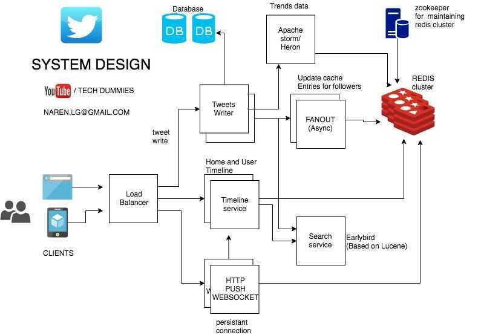

# System Design - Twitter

[System Design: How to design Twitter? Interview question at Facebook, Google, Microsoft](https://www.youtube.com/watch?v=KmAyPUv9gOY)

[Twitter system design | twitter Software architecture | twitter interview questions](https://www.youtube.com/watch?v=wYk0xPP_P_8)

## Core Features

1. Tweeting
2. Timeline
    - User (Own tweets in profile)
    - Home (All tweets from people you follow)

3. Following
4. Full Text Search
5. HashTags
6. Push Notifications
7. Text Notifications
8. How to incorporate Advertisments

## Database

1. Tweets database
2. Users database

Problem with this structure is that to get a tweet corresponding to user, if would take a lot of time because there would be a big select query. (Every time we open twitter home statement)

- This is not feasible

## Characteristics

- Twitter is ready heavy (showing home profile for a user should be super fast)
- Prefer availability over consitency. (Eventual Consistency - Consistency over a time frame)

## Optimized Solution

- When we tweet we do a Put / Post request
- Request goes to a Load Balancer
    - Does Fan Out - put tweet on every follower home timeline (in-memory DB / Redis)
- Twitter has redis cluster
    - Every user has a redis database
    - Every redis database for each user is replicated 3 times
    - Every redis database is in-memory
    - Can store the redis database for a period of time tied to user login activity
    - If a user has 100 followers than 3*100 = 300 redis databases will be updated
    - Problem - If a celebrity tweet there would be million of updates.
    - Solution - Can use a mixed approach, where sql can be used for very large updates.
    - In-memory + Syncronous calls
- Followers
    - Followers table will give all the redis database hashes where we have to update the home profile
- Tradeoffs
    - Read heavy
    - Eventual consistency
    - Space
- Accessing Timeline
    - Get Request
    - Load Balancer
        - Very fast hash lookup for getting redis databases
    - One of the three redis databases reponds with bob's timeline

## TwitterBot / Twitter Bot

### Pricing

- Minimum Basic - $100/month
    - Retrieve up to 10K Posts per month
    - 60 requests / 15 minsPER USER
    - 60 requests / 15 minsPER APP
    - X API v2
    - GET /2/tweets/search/recent
- Pro - $5000/month
    - Retrieve up to 1M Posts per month
    - 300 requests / 15 minsPER USER
    - 450 requests / 15 minsPER APP
    - GET /2/tweets/search/recent
    - FULL-ARCHIVE SEARCH available - GET /2/tweets/search/all
- [Twitter API | Products | Twitter Developer Platform](https://developer.twitter.com/en/products/twitter-api)

### Features / APIs

- [Search Tweets introduction | Docs | Twitter Developer Platform](https://developer.twitter.com/en/docs/twitter-api/tweets/search/introduction)
- [Filtered stream introduction | Docs | Twitter Developer Platform](https://developer.twitter.com/en/docs/twitter-api/tweets/filtered-stream/introduction)
- [Twitter API Tutorial - Aggregating tweets: Search API vs. Streaming API](http://140dev.com/twitter-api-programming-tutorials/aggregating-tweets-search-api-vs-streaming-api/#:~:text=The%20search%20API%20has%20a,or%20within%20a%20geographic%20area)
    - The search API has a fairly rich set of operators that can filter results based on attributes like location of sender, language, and various popularity measurements. The streaming API has a more limited approach of only collecting tweets containing words, sent by specific accounts, or within a geographic area.
- [Choosing a historical API | Docs | Twitter Developer Platform](https://developer.twitter.com/en/docs/tutorials/choosing-historical-api)

### Authentication

[Overview of the different authentication methods | Docs | Twitter Developer Platform](https://developer.twitter.com/en/docs/tutorials/authenticating-with-twitter-api-for-enterprise/authentication-method-overview)

1. [HTTP Basic Authentication](https://developer.twitter.com/en/docs/tutorials/authenticating-with-twitter-api-for-enterprise/authentication-method-overview#http-basic-authentication)
2. [OAuth 1.0a (user context)](https://developer.twitter.com/en/docs/tutorials/authenticating-with-twitter-api-for-enterprise/authentication-method-overview#oauth1.0a)
3. [OAuth 2.0 Bearer Token (application-only)](https://developer.twitter.com/en/docs/tutorials/authenticating-with-twitter-api-for-enterprise/authentication-method-overview#oauth2.0)

### Gotchas

#### Authentication Error

I have found the issue. I got this error because although I had the Twitter developer App, but it was a STANDALONE app without attaching to any projects.
So, creating a project first and then link to the app is essential to use Twitter API v2.

[When authenticating requests to the Twitter API v2 endpoints, you must use keys and tokens from a Twitter developer App that is attached to a Project · Issue #58 · twitterdev/Twitter-API-v2-sample-code · GitHub](https://github.com/twitterdev/Twitter-API-v2-sample-code/issues/58)

### Docs

- [Getting Started with the Twitter API | Docs | Twitter Developer Platform](https://developer.twitter.com/en/docs/twitter-api/getting-started/about-twitter-api)
- [GET /2/tweets/search/recent | Docs | Twitter Developer Platform](https://developer.twitter.com/en/docs/twitter-api/tweets/search/api-reference/get-tweets-search-recent)

### Links

- [GitHub - twitterdev/search-tweets-python at v2](https://github.com/twitterdev/search-tweets-python/tree/v2)
- https://www.labnol.org/twitter-bots-tutorial-4796
- https://www.labnol.org/twitter-search-examples-203
- [GitHub - twitterdev/Twitter-API-v2-sample-code: Sample code for the Twitter API v2 endpoints](https://github.com/twitterdev/Twitter-API-v2-sample-code)
- [GitHub - tweepy/tweepy: Twitter for Python!](https://github.com/tweepy/tweepy)
