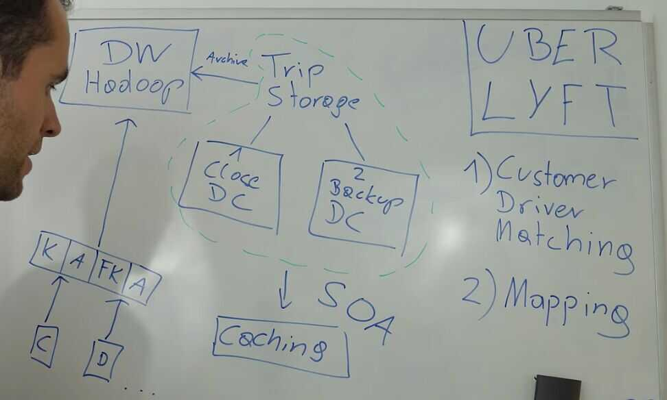
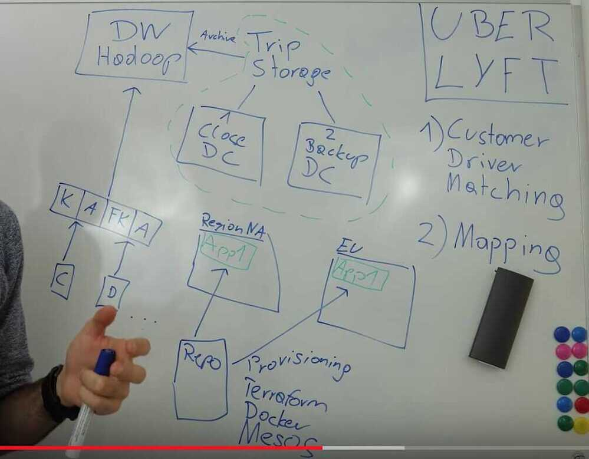

# System Design - Uber Lyft ride sharing services

[System Design: Uber Lyft ride sharing services - Interview question](https://www.youtube.com/watch?v=J3DY3Te3A_A)

## Core Features

1. Customer - Driver matching

2. Mapping
Bottom up (What do we need to store?)

## Storage

1. Trip Storage (needed immediately)
2. Analytics data - Cloud providers

- In house storage- Close data center
- Backup data center

When close data center is down, data can be fetched from backup data center. Providing high availability, Low latency
Uber uses mix of sql and nosql databases, fork of mysql which operates schemaless

Also use cassandra for low latency
perodically store data on data-warehouses, where they can run big expensive queries to find out trends in their services.

- Where people are using uber
- Where drivers are not enough drivers
- trends regarding time and day

Uber uses Hadoop as a Data Warehouse (for business analytics)

Whenever we have a service that needs to be highly available and serves million of customers, we need to think about some sort of caching layer, layer where data can be stored closer to the customers and probably in some sort of in-memory database, which is much faster than storing data on speeding disks.

Can be closer to customers, We can prewarm them before the customer queries it.

Position of driver, or live data is not feasible to store in cache, so it can be saved in an in-memory database like redis and then sent to customer.

Cache - map data, event data

## Logging (logging layer)

Legal perspective

As real time as possible

Endpoints - driver app, customer app

Kafka (ingest logging message), it is a service that can ingest a lot of messages in real time. (guarantee that it's not lost). Lot of servers in cluster and synchronize with each other.

Periodically dumps data to Data Warehouse (Hadoop)

## SOA (Service Oriented Architecture)

There are a lot of small machines distributed so one if goes down doesn't effect others. Service lives in many different machines and in many different regions

## Provisioning (Getting apps into machines)

Getting all the software (libraries, code, applications) into a newly started machine or container.
Repository of all applications and libraries is used to provision everything to individual systems

## Teraform is used to provision systems

## Containers (Shielded runtime environments) - Docker

## Apache Mesos (distributed systems kernel, manage distributed computer clusters) - manages collaboration and interfaces between services in distributed systems

## Network Routing (Route requests to backend) - needs to know state of each application

## Stateless - there is no state for each communication, therefore if one request is to one server, then another request can be routed to any other server

## Testing

Unit Tests

Suite of Integration tests

Resiliency testing - Case of failure testing

## Uber - Hailstorm - goes to a random set of services or hosts and turns them down

Use Shadow fleets, group of hosts that have some applications and gets all the data but doen't serve any customer. Get request, calls all the same services as in production.**Mapping (Graph problem)**

Travelling Salesman Problem (TSP - NP Complete Problem)

Optimization problem (no efficient solution)

Dijkstra's Algorithm

A* Search Algorithm

Directed Weighted Graph (Weights are speed limit/Traffic)

## Uber

Getting very precise ETA (driver to customer)

Include Traffic Congestion / Include Speed limits for roads

Precompute the data for maps

Use **historical data** for ETA calculation (pretty accurate)

Split the city into smaller blocks and then re-calculate the ETA's in real time. (Splitting the graph algorithm)

### Summary

1. Core features
   - Driver Customer matching
   - Mapping
   - Driver Customer Matching

2. Storage

   - Trip storage

       - Close Data Center
       - Backup Data Center
       - Cloud platforms
       - In-house data stores
       - Mix of SQL and NoSQL databases
       - Low Latency - Cassendra

   - Caching

       - In-memory database - redis
       - Map data
       - Event data

   - Analytics
       - Data Warehouse - Hadoop

   - Logging
       - Kafka - ingest logging message

3. SOA (Service Oriented Architecture)

4. Provisioning

   - Teraform (for installing apps from central repositories to distributed clusters)
   - Docker (Containerization)
   - Apache mesos (manage distributed system clusters)

5. Network Routing
   - Stateless servers

6. Testing
   - Unit Tests
   - Suite of integration tests
   - Resiliency testing
       - HailStorm
       - Shadow fleets

## Mapping

1. Algorithms

   - Dijkstra's Algorithm
   - A* Search Algorithm
   - Travelling Salesman Problem (TSP)
   - Optimization Problem

2. Directed Weighted Graph

   - Vertices - Intersections
   - Roads - Edges
   - Speed limit / Traffic / Blockage - Weights

3. Uber

   - Precompute the data for maps
   - Use historical data
   - Segment the city and do real time ETA calculation
