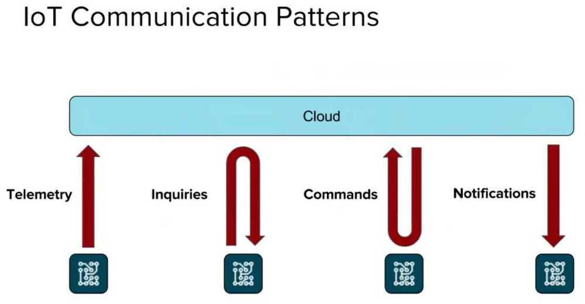

# IoT Intro

## Internet of Things (IoT)

IoT world is all about communication between devices, gateways and the cloud; messages are exchanged between all these parties in order to provide a comprehensive end-to-end solution.

## Shadow (Device Shadow)

A json file maintained on the cloud where all the updates are performed. These is synced with the devices on fields.

## Digital Twin

https://dzone.com/articles/apache-kafka-as-digital-twin-in-industrial-iot-iio

## TPM - Trusted Platform Module

Is an [international standard](https://en.wikipedia.org/wiki/International_standard) for a [secure cryptoprocessor](https://en.wikipedia.org/wiki/Secure_cryptoprocessor), a dedicated [microcontroller](https://en.wikipedia.org/wiki/Microcontroller) designed to secure hardware through integrated [cryptographic keys](https://en.wikipedia.org/wiki/Cryptographic_keys)

## Four basic architectural components

### Devices

Devices are the physical hardware elements that collect sensor data and might perform actuation.

### IoT Gateway

Gateways collect, preprocess, and transfer sensor data from devices and might deliver actuation requests from the cloud to devices.

### Cloud platform

The cloud platform - usually offered as a software-as-a-service solution - has a number of important roles, including data acquisition, data analytics, and device management and actuation.

### Applications

Applications range from simple web-based data visualization dashboards to highly domain-specific mobile apps.
On a high level, the software architecture choices for IoT client devices fall into the following seven categories, ranging from simple to more complex:

- no-OS architectures
- RTOS (real-time OS) architectures
    - [About the Zephyr Project – Zephyr Project](https://zephyrproject.org/learn-about/)
    - [FreeRTOS - Market leading RTOS (Real Time Operating System) for embedded systems with Internet of Things extensions](https://www.freertos.org/index.html)
    - [GitHub - mbed-ce/mbed-os: Arm Mbed OS is a platform operating system designed for the internet of things](https://github.com/mbed-ce/mbed-os)
- language-runtime architectures
- full-OS architectures
- app-OS architectures
- server-OS architectures
- container-OS architectures

## Software architecture options for IoT devices

| **Feature** | **Architecture option** |  |  |  |  |  |
|---|---|---|---|---|---|---|
| | No OS or RTOS | Language runtime | Full OS | App OS | Server OS | Container OS |
| **Typical devices** | Simple sensor devices, heartbeat sensors, lightbulbs, and so on | Feature watches, more advanced sensing devices | "Maker" devices, generic sensing solutions | High-end smartwatches | Solutions benefiting from a portable webserver and edge-computing capabilities | Solutions benefiting from fully isomorphic apps - that is, code that can be migrated between the cloud and the edge |
| **Minimum required RAM** | Tens of kilobytes | Hundreds of kilobytes | A few megabytes | Hundreds of megabytes | Tens of megabytes | Gigabytes |
| **Typical communication protocols** | Constrained (MQTT, LWM2M, CoAP) | Constrained (MQTT, LWM2M, CoAP) | Standard Internet protocols (HTTP, HTTPS) | Standard Internet protocols (HTTP, HTTPS) | Standard Internet protocols (HTTP, HTTPS) | Standard Internet protocols (HTTP, HTTPS) |
| **Typical development language** | C or assembly | Java, JavaScript, Python | C or C11 | Java, ObjectiveC, Swift | JavaScript | Various |
| **Libraries** | None or system- specific | Language- specific generic libraries | OS libraries, generic UI libraries | Platform libraries | Node.js npm modules | Various |
| **Dynamic software updates** | Firmware updates only | Yes | Yes | Yes | Yes | Yes |
| **Third-party apps supported** | No | Yes | Yes | Yes | Yes | Yes |
| **Isomorphic apps possible** | No | Yes | Only if the hardware architectures are binary compatible | Yes | Yes | Yes |

## Key points

- Windowing for streaming data

## Messaging mechanisms

1. Store and forward mechanism (using queues, topic/subscriptions in a broker)
2. Direct messaging (receiver needs to be online in order to allow the devices to send data)

## Messaging Patterns

1. competing consumers - A messaging pattern in which more consumers get messages from a common source (i.e. queue) but each message is delivered to only one consumer.
2. request/reply
3. pub/sub

## Communication patterns

### Telemetry

- Data flows in one direction from the device to other systems for conveying status changes in the device itself (i.e. sensors reading, ...)
- Direct Messaging mechanism can be used if data is not to be stored.

### Inquires

Requests from the device looking to gather required information or asking to initiate activities

- Requests and response

### Commands

- Commands from other systems sent to a device (or a group of devices) to perform specific activities expecting a result from the command execution, or at least a status for that
- Mainly store and forward mechanism is used, sometimes a TTL (Time To Live) on the command message is useful in order to avoid the possibility that an offline device will execute an "old" message that is not useful at the time the device comes back online.

### Notifications

Information flows in one direction from other systems to a device (or a group of devices) for conveying status changes

## Classifying Device States

| **Classifier** | **Description** |
|---|---|
| **Assumed State** | We are unable to get the state of the device. Best we can do is to assume the state based on our last command. Example - WattMan Lite which we deployed previously, we were controlling ACs based on infrared signal - during that time we used to work on "Assumed State". |
| **Cloud Polling** | Integration of this device happens via the cloud and requires an active internet connection. Polling the state means that an update might be noticed later. |
| **Cloud Push** | Integration of this device happens via the cloud and requires an active internet connection. Home Assistant will be notified as soon as a new state is available. |
| **Local Polling** | Offers direct communication with device. Polling the state means that an update might be noticed later. Example - For relay boards where we communicate over modbus protocol, we work on Local Polling. Periodically, we read the current status of values in relay board and ensure that it's the same state that we had last set. |
| **Local Push** | Offers direct communication with device. Home Assistant will be notified as soon as a new state is available. Example - For the smart plug that we are currently interfacing, device does "Local Push" on the mqtt server on Rpi. So it reports it's state on a mqtt topic in a periodic basis. |

## Tools

### Node-RED

- Flow-based programming for the Internet of Things
- Node-RED is a programming tool for wiring together hardware devices, APIs and online services in new and interesting ways.
- It provides a browser-based editor that makes it easy to wire together flows using the wide range of nodes in the palette that can be deployed to its runtime in a single-click.

## IoT Protocols

1. Infrastructure(ex: 6LowPAN, IPv4/IPv6, RPL)
2. Identification(ex: EPC, uCode, IPv6, URIs)
3. Comms / Transport(ex: Wifi, Bluetooth, LPWAN)
4. Discovery(ex: Physical Web, mDNS, DNS-SD)
5. Data Protocols(ex: MQTT, CoAP, AMQP, Websocket, Node)
6. Device Management(ex: TR-069, OMA-DM)
7. Semantic(ex: JSON-LD, Web Thing Model)
8. Multi-layer Frameworks(ex: Alljoyn, IoTivity, Weave, Homekit)

https://www.postscapes.com/internet-of-things-protocols

## References

- D2C - Device to Cloud
- C2C - Cloud to Cloud
- C2D - Cloud to Device
- https://cloudplatform.googleblog.com/2018/04/implementing-an-event-driven-architecture-on-serverless-the-Smart-Parking-story.html?m=1
- IoT Applications, Protocols, and Best Practices - DZone Research Guides
- https://www.home-assistant.io/blog/2016/02/12/classifying-the-internet-of-things
- End to end overview - https://cloud.google.com/solutions/iot-overview
- https://www.edx.org/course/iot-system-architecture-design-and-evaluation
- https://www.edx.org/microsoft-professional-program-certificate-in-iot
