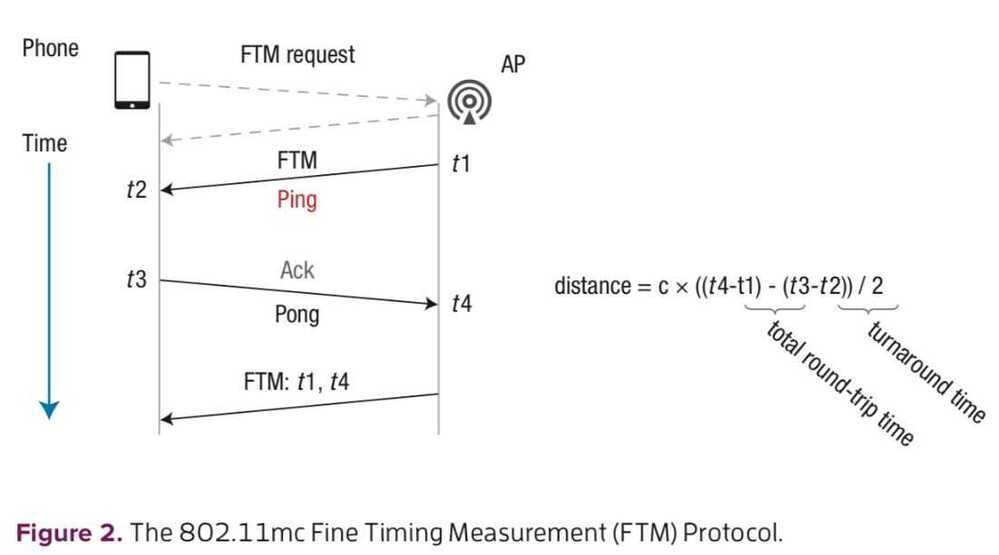

# Others

## CE - Accurate Indoor Location for the IoT (Jan 19)

802.11b - Received Signal Strength Indication (RSSI)

- Due to multipath fading, the RSSI fall-off from the antenna does not follow a uniform inverse square law and is distorted by the building materials that it travels through.
- Large errors of 10 to 20 meters

- Bluetooth low energy beacons
- Low Power Wide Area Network (LPWAN)
- LoRa Network Protocol (Long Range)

https://www.postscapes.com/long-range-wireless-iot-protocol-lora

## P2PLoc for Group-Motion Applications

P2PLoc (peer-to-peer localization) envisions wearable IoT devices on users' arms or wrists that exchange wireless messages to ultimately compute the relative positions of each group member. The outcome is a topology or configuration of mo- bile users that can be tracked in real time.

Using the time wireless signals take to travel between two devices as a measure of the distance between them. The precision of this time measurement directly correlates with the bandwidth of the wireless signal used. Therefore, we use ultra-wideband (UWB) radios with a 1 GHz bandwidth. When used with a packet-handshake protocol called two-way ranging (TWR), today's UWB platforms can estimate the distance between two devices with about 10 cm precision without clock synchronization.

P2PLoc: Peer-to-Peer Localization of Fast-Moving Entities - Computing Edge, Feb 2019

## Battery Powered Sensors

Managing Energy Consumption as an Architectural Quality Attribute -- Computing Edge, Feb 2019

- If used protocol buffers for sending data - 42% energy savings compared to plaintext
- Less polling time and sending buffered data

## IoT with Kafka

https://dzone.com/articles/iot-live-demo-100000-connected-cars-with-kubernete

## Others

https://github.com/home-assistant/core

https://www.home-assistant.io

https://developers.home.google.com/matter

[Search Engine for the Internet of Everything](https://www.shodan.io/)
