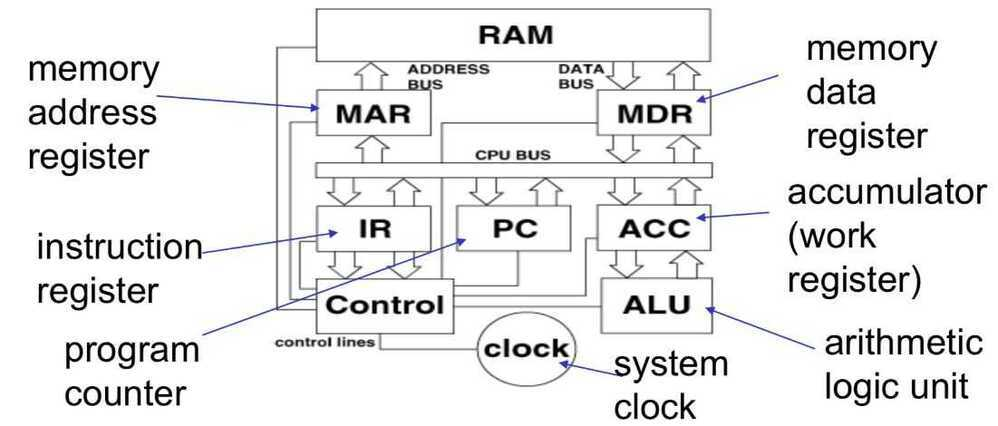
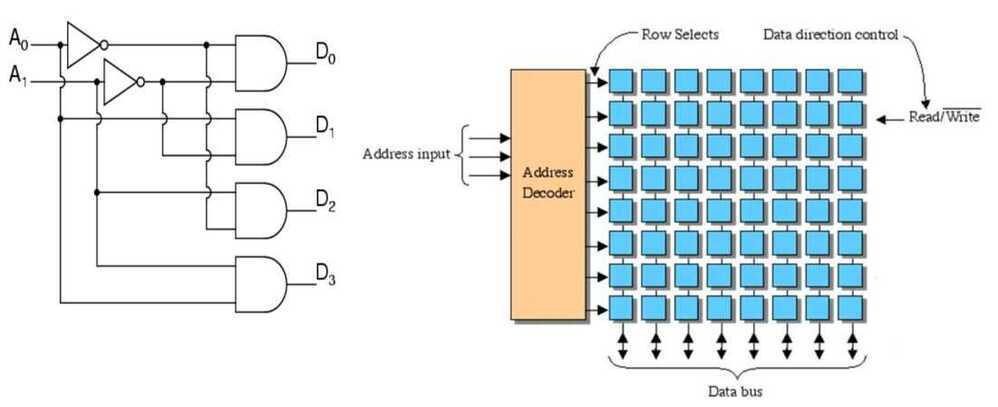
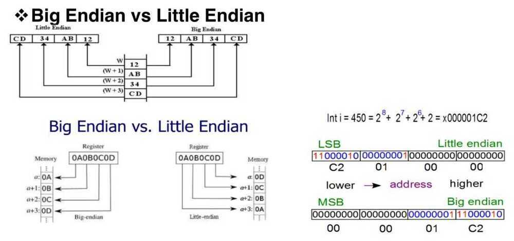
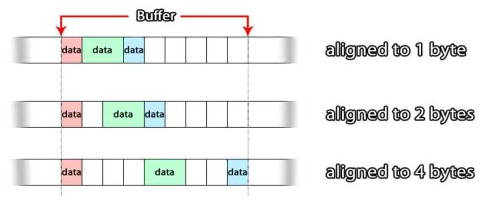
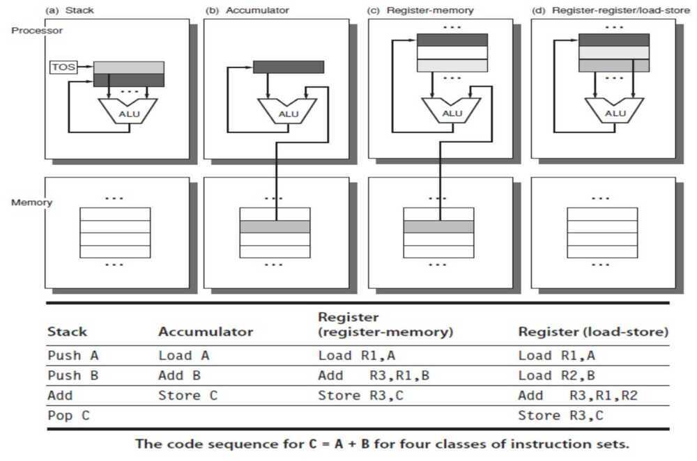
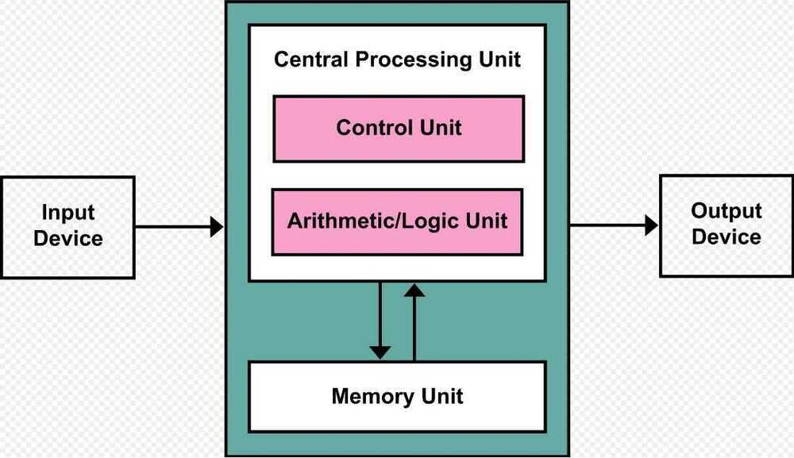

# Basic Computer Organization

## Instruction Execution Cycle

1. Instruction Fetch - Obtain instruction from program store

2. Instruction Decode - Determine required actions and instruction size

3. Operand Fetch - Locate and obtain operand data

4. Execute - Compute result value or status

5. Result Store - Deposit results in storage for later use

6. Next Instruction - Determine successor instruction

## Processor Memory Interaction

## Inside the CPU

**Instruction Execution Cycle**

1. Address of the next instruction is transferred from PC to MAR

2. The instruction is located in memory

3. Instruction is copied from memory to MDR

4. Instruction is transferred to and decoded in the IR

5. Control unit sends signals to appropriate devices to cause execution of the instruction

## Address Decoder is used to decode memory addresses

## Byte Ordering

## Byte/Word Alignment

## Types of Processor Operations

1. Arithmetic and Logical Operations

   - integer arithmetic

   - comparing two quantities

   - shifting, rotating bits in a quantity

   - testing, comparing, and converting bits

2. Data Movement Operations

   - moving data from memory to cpu

   - moving data from memory to memory

   - input and output

3. Program Control Operations

   - starting a program

   - halting a program

   - skipping to other instructions

   - testing data to decide whether to skip over some instructions

## Instruction Set Architecture (ISA)

An **ISA** is an abstract model of a [computer](https://en.wikipedia.org/wiki/Computer). It is also referred to as **architecture** or **computer architecture**. A realization of an ISA, such as a [central processing unit](https://en.wikipedia.org/wiki/Central_processing_unit)(CPU), is called an *implementation*.

https://en.wikipedia.org/wiki/Instruction_set_architecture
Based on where opcode and operand are

- Stack architecture

- Accumulator architecture

- Register-Memory architecture

- Register-Register / Load Store architecture

## Addressing Modes

- **Immediate Addressing**

The simplest addressing mode is**Immediate addressing** where you write the data value into the instruction.

In Pentium assembler this is the default and:

MOV EAX,04

- **Register Indirect Addressing**
- **Indexed Addressing**
https://www.i-programmer.info/babbages-bag/150.html

## Branch Predictor

In [computer architecture](https://en.wikipedia.org/wiki/Computer_architecture), a **branch predictor** is a [digital circuit](https://en.wikipedia.org/wiki/Digital_electronics) that tries to guess which way a [branch](https://en.wikipedia.org/wiki/Branch_(computer_science))(e.g. an [if--then--else structure](https://en.wikipedia.org/wiki/Conditional_(programming))) will go before this is known definitively. The purpose of the branch predictor is to improve the flow in the [instruction pipeline](https://en.wikipedia.org/wiki/Instruction_pipeline). Branch predictors play a critical role in achieving high effective [performance](https://en.wikipedia.org/wiki/Computer_performance) in many modern [pipelined](https://en.wikipedia.org/wiki/Pipeline_(computing))[microprocessor](https://en.wikipedia.org/wiki/Microprocessor) architectures such as [x86](https://en.wikipedia.org/wiki/X86).

Example of 4-stage pipeline. The colored boxes represent instructions independent of each other.
Two-way branching is usually implemented with a [conditional jump](https://en.wikipedia.org/wiki/Branch_(computer_science)) instruction. A conditional jump can either be "not taken" and continue execution with the first branch of code which follows immediately after the conditional jump, or it can be "taken" and jump to a different place in program memory where the second branch of code is stored. It is not known for certain whether a conditional jump will be taken or not taken until the condition has been calculated and the conditional jump has passed the execution stage in the instruction pipeline (see fig. 1).
Without branch prediction, the processor would have to wait until the conditional jump instruction has passed the execute stage before the next instruction can enter the fetch stage in the pipeline. The branch predictor attempts to avoid this waste of time by trying to guess whether the conditional jump is most likely to be taken or not taken. The branch that is guessed to be the most likely is then fetched and [speculatively executed](https://en.wikipedia.org/wiki/Speculative_execution). If it is later detected that the guess was wrong then the speculatively executed or partially executed instructions are discarded and the pipeline starts over with the correct branch, incurring a delay.
The time that is wasted in case of a**branch misprediction** is equal to the number of stages in the pipeline from the fetch stage to the execute stage. Modern microprocessors tend to have quite long pipelines so that the misprediction delay is between 10 and 20 [clock cycles](https://en.wikipedia.org/wiki/Clock_cycle). As a result, making a pipeline longer increases the need for a more advanced branch predictor.
The first time a conditional jump instruction is encountered, there is not much information to base a prediction on. But the branch predictor keeps records of whether branches are taken or not taken. When it encounters a conditional jump that has been seen several times before then it can base the prediction on the history. The branch predictor may, for example, recognize that the conditional jump is taken more often than not, or that it is taken every second time.
Branch prediction is not the same as [branch target prediction](https://en.wikipedia.org/wiki/Branch_target_predictor). Branch prediction attempts to guess whether a conditional jump will be taken or not. Branch target prediction attempts to guess the target of a taken conditional or unconditional jump before it is computed by decoding and executing the instruction itself. Branch prediction and branch target prediction are often combined into the same circuitry.
[Implementation](https://en.wikipedia.org/wiki/Branch_predictor#Implementation)

- [1.1 Static branch prediction](https://en.wikipedia.org/wiki/Branch_predictor#Static_branch_prediction)
- [1.2 Dynamic branch prediction](https://en.wikipedia.org/wiki/Branch_predictor#Dynamic_branch_prediction)
- [1.3 Random branch prediction](https://en.wikipedia.org/wiki/Branch_predictor#Random_branch_prediction)
- [1.4 Next line prediction](https://en.wikipedia.org/wiki/Branch_predictor#Next_line_prediction)
- [1.5 One-level branch prediction](https://en.wikipedia.org/wiki/Branch_predictor#One-level_branch_prediction)
    - [1.5.1 Saturating counter](https://en.wikipedia.org/wiki/Branch_predictor#Saturating_counter)
- [1.6 Two-level predictor](https://en.wikipedia.org/wiki/Branch_predictor#Two-level_predictor)
    - [1.6.1 Two-level adaptive predictor](https://en.wikipedia.org/wiki/Branch_predictor#Two-level_adaptive_predictor)
- [1.7 Local branch prediction](https://en.wikipedia.org/wiki/Branch_predictor#Local_branch_prediction)
- [1.8 Global branch prediction](https://en.wikipedia.org/wiki/Branch_predictor#Global_branch_prediction)
- [1.9 Alloyed branch prediction](https://en.wikipedia.org/wiki/Branch_predictor#Alloyed_branch_prediction)
- [1.10 Agree predictor](https://en.wikipedia.org/wiki/Branch_predictor#Agree_predictor)
- [1.11 Hybrid predictor](https://en.wikipedia.org/wiki/Branch_predictor#Hybrid_predictor)
- [1.12 Loop predictor](https://en.wikipedia.org/wiki/Branch_predictor#Loop_predictor)
- [1.13 Indirect branch predictor](https://en.wikipedia.org/wiki/Branch_predictor#Indirect_branch_predictor)
- [1.14 Prediction of function returns](https://en.wikipedia.org/wiki/Branch_predictor#Prediction_of_function_returns)
- [1.15 Overriding branch prediction](https://en.wikipedia.org/wiki/Branch_predictor#Overriding_branch_prediction)
- [1.16 Neural branch prediction](https://en.wikipedia.org/wiki/Branch_predictor#Neural_branch_prediction)

https://en.wikipedia.org/wiki/Branch_predictor

## Application Binary Interface (ABI)

In [computer software](https://en.wikipedia.org/wiki/Computer_software), anapplication binary interface(ABI) is an [interface](https://en.wikipedia.org/wiki/Interface_(computing)) between two binary program modules; often, one of these modules is a [library](https://en.wikipedia.org/wiki/Library_(computing)) or [operating system](https://en.wikipedia.org/wiki/Operating_system) facility, and the other is a program that is being run by a user.
AnABIdefines how data structures or computational routines are accessed in [machine code](https://en.wikipedia.org/wiki/Machine_code), which is a low-level, hardware-dependent format; in contrast, an [API](https://en.wikipedia.org/wiki/Application_programming_interface) defines this access in [source code](https://en.wikipedia.org/wiki/Source_code), which is a relatively high-level, hardware-independent, often [human-readable](https://en.wikipedia.org/wiki/Human-readable) format. A common aspect of an ABI is the [calling convention](https://en.wikipedia.org/wiki/Calling_convention), which determines how data is provided as input to or read as output from computational routines; examples are the [x86 calling conventions](https://en.wikipedia.org/wiki/X86_calling_conventions).
Adhering to an ABI (which may or may not be officially standardized) is usually the job of a [compiler](https://en.wikipedia.org/wiki/Compiler), operating system, or library author; however, an application programmer may have to deal with an ABI directly when writing a program in a mix of programming languages, which can be achieved by using [foreign function calls](https://en.wikipedia.org/wiki/Foreign_function_call).

https://en.wikipedia.org/wiki/Application_binary_interface

## ELF (Executable and Linkable Format)

In [computing](https://en.wikipedia.org/wiki/Computing), theExecutable and Linkable Format(ELF, formerly namedExtensible Linking Format), is a common standard [file format](https://en.wikipedia.org/wiki/File_format) for [executable](https://en.wikipedia.org/wiki/Executable) files, [object code](https://en.wikipedia.org/wiki/Object_code), [shared libraries](https://en.wikipedia.org/wiki/Library_(computing)), and [core dumps](https://en.wikipedia.org/wiki/Core_dump). First published in the specification for the [application binary interface](https://en.wikipedia.org/wiki/Application_binary_interface)(ABI) of the [Unix](https://en.wikipedia.org/wiki/Unix) operating system version named [System V Release 4](https://en.wikipedia.org/wiki/System_V_Release_4) (SVR4), and later in the Tool Interface Standard, it was quickly accepted among different vendors of [Unix](https://en.wikipedia.org/wiki/Unix) systems. In 1999, it was chosen as the standard binary file format for Unix and [Unix-like](https://en.wikipedia.org/wiki/Unix-like) systems on [x86](https://en.wikipedia.org/wiki/X86) processors by the [86open](https://en.wikipedia.org/wiki/Executable_and_Linkable_Format#86open) project.

By design, the ELF format is flexible, extensible, and [cross-platform](https://en.wikipedia.org/wiki/Cross-platform). For instance it supports different endiannesses and address sizes so it does not exclude any particular [central processing unit](https://en.wikipedia.org/wiki/Central_processing_unit) (CPU) or [instruction set architecture](https://en.wikipedia.org/wiki/Instruction_set_architecture). This has allowed it to be adopted by many different [operating systems](https://en.wikipedia.org/wiki/Operating_system) on many different hardware [platforms](https://en.wikipedia.org/wiki/Computing_platform)

ELF is used as standard file format for object files on Linux. Prior to this, the a.out file format was being used as a standard but lately ELF took over the charge as a standard.

ELF supports :

- Different processors
- Different data encoding
- Different classes of machines

## File Layout

Each ELF file is made up of one ELF header, followed by file data. The data can include:

- Program header table, describing zero or more [memory segments](https://en.wikipedia.org/wiki/Memory_segmentation)
- Section header table, describing zero or more sections
- Data referred to by entries in the program header table or section header table

https://en.wikipedia.org/wiki/Executable_and_Linkable_Format

https://www.thegeekstuff.com/2012/07/elf-object-file-format

## Von Neumann Architecture

Thevon Neumann architecture - also known as thevon Neumann modelorPrinceton architecture - is a [computer architecture](https://en.wikipedia.org/wiki/Computer_architecture) based on a 1945 description by [John von Neumann](https://en.wikipedia.org/wiki/John_von_Neumann) and others in the [First Draft of a Report on the EDVAC](https://en.wikipedia.org/wiki/First_Draft_of_a_Report_on_the_EDVAC). That document describes a design architecture for an electronic [digital computer](https://en.wikipedia.org/wiki/Digital_computer) with these components:

- A [processing unit](https://en.wikipedia.org/wiki/Central_processing_unit) that contains an [arithmetic logic unit](https://en.wikipedia.org/wiki/Arithmetic_logic_unit) and [processor registers](https://en.wikipedia.org/wiki/Processor_register)
- A [control unit](https://en.wikipedia.org/wiki/Control_unit) that contains an [instruction register](https://en.wikipedia.org/wiki/Instruction_register) and [program counter](https://en.wikipedia.org/wiki/Program_counter)
- [Memory](https://en.wikipedia.org/wiki/Computer_memory) that stores [data](https://en.wikipedia.org/wiki/Data_(computing)) and [instructions](https://en.wikipedia.org/wiki/Instruction_set)
- External [mass storage](https://en.wikipedia.org/wiki/Mass_storage)
- [Input and output](https://en.wikipedia.org/wiki/Input_and_output) mechanisms

The term "von Neumann architecture" has evolved to mean any [stored-program computer](https://en.wikipedia.org/wiki/Stored-program_computer) in which an [instruction fetch](https://en.wikipedia.org/wiki/Instruction_fetch) and a data operation cannot occur at the same time because they share a common [bus](https://en.wikipedia.org/wiki/Bus_(computing)). This is referred to as the [von Neumann bottleneck](https://en.wikipedia.org/wiki/Von_Neumann_architecture#Von_Neumann_bottleneck), and often limits the performance of the system.

The design of a von Neumann architecture machine is simpler than a [Harvard architecture](https://en.wikipedia.org/wiki/Harvard_architecture) machine - which is also a stored-program system but has one dedicated set of address and data buses for reading and writing to memory, and another set of address and [data buses](https://en.wikipedia.org/wiki/Memory_bus) to fetch [instructions](https://en.wikipedia.org/wiki/Instruction_fetch).

A stored-program digital computer keeps both [program instructions](https://en.wikipedia.org/wiki/Computer_program) and data in [read--write](https://en.wikipedia.org/wiki/Read%E2%80%93write_memory), [random-access memory](https://en.wikipedia.org/wiki/Random-access_memory)(RAM). Stored-program computers were an advancement over the program-controlled computers of the 1940s, such as the [Colossus](https://en.wikipedia.org/wiki/Colossus_computer) and the [ENIAC](https://en.wikipedia.org/wiki/ENIAC). Those were programmed by setting switches and inserting patch cables to route data and control signals between various functional units. The vast majority of modern computers use the same memory for both data and program instructions, but have [caches](https://en.wikipedia.org/wiki/CPU_cache) between the CPU and memory, and, for the caches closest to the CPU, have separate caches for instructions and data, so that most instruction and data fetches use separate buses ([split cache architecture](https://en.wikipedia.org/wiki/Modified_Harvard_architecture#Split-cache_(or_almost-von-Neumann) _architecture)).

Historically there have been 2 types of Computers:

1. **Fixed Program Computers --** Their function is very specific and they couldn't be programmed, e.g. Calculators.

2. **Stored Program Computers --** These can be programmed to carry out many different tasks, applications are stored on them, hence the name.

## Main Memory Unit (Registers)

1. **Accumulator:**Stores the results of calculations made by ALU

2. **Program Counter (PC):**Keeps track of the memory location of the next instructions to be dealt with. The PC then passes this next address to Memory Address Register (MAR)

3. **Memory Address Register (MAR):**It stores the memory locations of instructions that need to be fetched from memory or stored into memory

4. **Memory Data Register (MDR):**It stores instructions fetched from memory or any data that is to be transferred to, and stored in, memory

5. **Current Instruction Register (CIR):**It stores the most recently fetched instructions while it is waiting to be coded and executed

6. **Instruction Buffer Register (IBR):**The instruction that is not to be executed immediately is placed in the instruction buffer register IBR

https://en.wikipedia.org/wiki/Von_Neumann_architecture

https://www.geeksforgeeks.org/computer-organization-von-neumann-architecture
