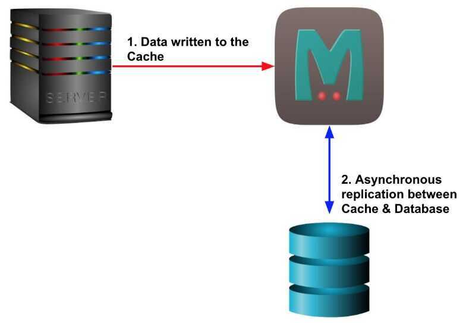

# Cache Access Patterns (Writing Policies)

When a system writes data to cache, it must at some point write that data to the backing store as well. The timing of this write is controlled by what is known as thewrite policy.

## Write-through

write is done synchronously both to the cache and to the backing store. The significance here is not the order in which it happens or whether it happens in parallel. The significance is that I/O completion is only confirmed once the data has been written to both places.

**Advantage:**

Ensures fast retrieval while making sure the data is in the backing store and is not lost in case the cache is disrupted.

**Disadvantage:**

Writing data will experience latency as you have to write to two places every time.

**What is it good for?**

The write-through policy is good for applications that has more reads than writes. This will result in slightly higher write latency but low read latency. So, it's ok to spend a bit longer writing once, but then benefit from reading frequently with low latency.

## Write-back (write-behind)

Initially, writing is done only to the cache. The write to the backing store is postponed until the modified content is about to be replaced by another cache block.

Using the write-back policy, data is written to the cache and immediately I/O completion is confirmed. The data is then typically also written to the backing store in the background but the completion confirmation is not blocked on that.

**Advantage:**

Low latency and high throughput for write-intensive applications.

**Disadvantage:**

There is data availability risk because the cache could fail (and so suffer from data loss) before the data is persisted to the backing store. This result in the data being lost.

**What is it good for?**

The write-back policy is the best performer for mixed workloads as both read and write I/O have similar response time levels. In reality, you can add resiliency (e.g. by duplicating writes) to reduce the likelihood of data loss.

## Write-around

Using the write-around policy, data is written only to the backing store without writing to the cache. So, I/O completion is confirmed as soon as the data is written to the backing store.

**Advantage:**

Good for not flooding the cache with data that may not subsequently be re-read.

**Disadvantage:**

Reading recently written data will result in a cache miss (and so a higher latency) because the data can only be read from the slower backing store.

**What is it good for?**

The write-around policy is good for applications that don't frequently re-read recently written data. This will result in lower write latency but higher read latency which is a acceptable trade-off for these scenarios.
