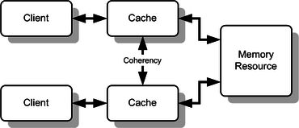

# Cache Coherence

In [computer architecture](https://en.wikipedia.org/wiki/Computer_architecture), cache coherence is the uniformity of shared resource data that ends up stored in multiple [local caches](https://en.wikipedia.org/wiki/Cache_(computing)). When clients in a system maintain [caches](https://en.wikipedia.org/wiki/CPU_cache) of a common memory resource, problems may arise with incoherent data, which is particularly the case with [CPUs](https://en.wikipedia.org/wiki/Central_processing_unit) in a [multiprocessing](https://en.wikipedia.org/wiki/Multiprocessing) system.

In the illustration, consider both the clients have a cached copy of a particular memory block from a previous read. Suppose the client on the bottom updates/changes that memory block, the client on the top could be left with an invalid cache of memory without any notification of the change. Cache coherence is intended to manage such conflicts by maintaining a coherent view of the data values in multiple caches.

## Requirements for cache coherence

### Write Propagation

Changes to the data in any cache must be propagated to other copies (of that cache line) in the peer caches.

### Transaction Serialization

Reads/Writes to a single memory location must be seen by all processors in the same order.

## Coherence Mechanisms

### Snooping

Main article: [Bus snooping](https://en.wikipedia.org/wiki/Bus_snooping)

First introduced in 1983, snooping is a process where the individual caches monitor address lines for accesses to memory locations that they have cached. The write-invalidate protocols and write-update protocols make use of this mechanism.
For the snooping mechanism, a snoop filter reduces the snooping traffic by maintaining a plurality of entries, each representing a cache line that may be owned by one or more nodes. When replacement of one of the entries is required, the snoop filter selects for the replacement the entry representing the cache line or lines owned by the fewest nodes, as determined from a presence vector in each of the entries. A temporal or other type of algorithm is used to refine the selection if more than one cache line is owned by the fewest nodes.

### Directory-based

Main article: [Directory-based cache coherence](https://en.wikipedia.org/wiki/Directory-based_cache_coherence)

In a directory-based system, the data being shared is placed in a common directory that maintains the coherence between caches. The directory acts as a filter through which the processor must ask permission to load an entry from the primary memory to its cache. When an entry is changed, the directory either updates or invalidates the other caches with that entry.

https://en.wikipedia.org/wiki/Cache_coherence

### Cache Invalidation

Cache invalidation is a process in a [computer system](https://en.wikipedia.org/wiki/Computer_system) whereby entries in a [cache](https://en.wikipedia.org/wiki/Cache_(computing)) are replaced or removed.

It can be done explicitly, as part of a [cache coherence](https://en.wikipedia.org/wiki/Cache_coherence) protocol. In such a case, a processor changes a memory location and then invalidates the cached [values](https://en.wikipedia.org/wiki/Value_(computer_science)) of that memory location across the rest of the computer system.

### Explicit invalidation

Cache invalidation can be used to [push](https://en.wikipedia.org/wiki/Push_technology) new content to a [client](https://en.wikipedia.org/wiki/Client_(computing)). This method functions as an alternative to other methods of displaying new content to connected clients. Invalidation is carried out by changing the application data, which in turn marks the information received by the client as out-of-date. After the cache is invalidated, if the client requests the cache, they are delivered a new version.

### Methods

There are three specific methods to invalidate a cache, but not all [caching proxies](https://en.wikipedia.org/wiki/Caching_proxy) support these methods.

#### 1. Purge

Removes content from caching proxy immediately. When the client requests the data again, it is [fetched](https://en.wikipedia.org/wiki/Instruction_cycle) from the application and stored in the caching proxy. This method removes all variants of the cached content.

#### 2. Refresh

Fetches requested content from the application, even if cached content is available. The content previously stored in the cache is replaced with a new version from the application. This method affects only one variant of the cached content.

#### 3. Ban

A reference to the cached content is added to a [blacklist](https://en.wikipedia.org/wiki/Blacklist_(computing))(or ban list). Client requests are then checked against this blacklist, and if a request matches, new content is fetched from the application, returned to the client, and added to the cache.

This method, unlike purge, does not immediately remove cached content from the caching proxy. Instead, the cached content is updated after a client requests that specific information.

### Alternatives

There are a few alternatives to cache invalidation that still deliver updated content to the client. One alternative is to expire the cached content quickly by reducing the [time-to-live (TTL)](https://en.wikipedia.org/wiki/Time_to_live) to a very low value. Another alternative is to validate the cached content at each request. A third option is to not cache content requested by the client. These alternatives can cause issues, as they create high load on the application due to more frequent requests for information.

### Disadvantages

Using invalidation to transfer new content can be difficult when invalidating multiple objects. Invalidating multiple representations adds a level of complexity to the application. Cache invalidation must be carried out through a caching proxy; these requests can impact performance of the caching proxy, causing information to be transferred at a slower rate to clients.

https://en.wikipedia.org/wiki/Cache_invalidation
