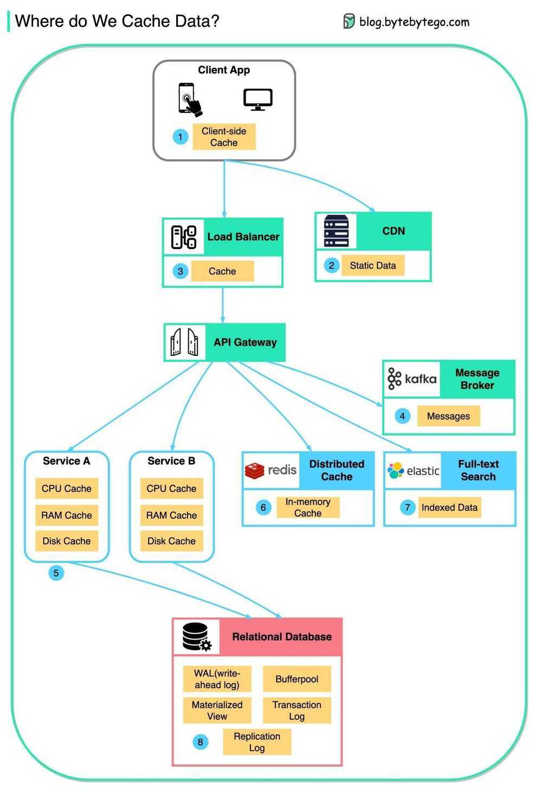

# Caching Strategies

### 1. Cooperative/Distributed caching

Cache data is distributed between nodes

In Cooperative Caching, also known as Distributed Caching, multiple distinct systems (normally referred to as cluster-nodes) work together to build a huge, shared cache.

### 2. Partial caching

Partial Caching describes a type of caching where not all data is stored inside the cache. Depending on certain criteria, responses might not be cacheable or are not expected to be cached (like temporary failures).

A typical example for data where not everything is cacheable is websites. Some pages are "static" and

only change if some manual or regular action happens. Those pages can easily be cached and invalidated whenever this particular action happened. Apart from that, other pages consist of mostly dynamic content or frequently updated content (like stock market tickers) and shouldn't be cached at all.

### 3. Geographical caching

Geographical Caches are located in strategically chosen locations to optimize latency on requests, therefore this kind of cache will mostly be used for website content. It is also known as CDN (Content Delivery Network).

### 4. Preemptive caching

A Preemptive Cache itself is not a caching type like the others above but is mostly used in conjunction with a Geographical Cache.

Using a warm-up engine a Preemptive Cache is populated on startup and tries to update itself based on rules or events. The idea behind this cache addition is to reload data from any backend service or central cluster even before a requestor wants to retrieve the element. This keeps access time to the cached elements constant and prevents accesses to single elements from becoming unexpectedly long.

Building a Preemptive Cache is not easy and requires a lot of knowledge of the cached domain and the update workflows.

### 5. Latency SLA caching

A Latency SLA Cache is able to maintain latency SLAs even if the cache is slow or overloaded. This type of cache can be build in two different ways.

The first option is to have a timeout to exceed before the system either requests the potentially cached element from the original source (in parallel to the already running cache request) or provides a simple default answer, and uses whatever returns first.

The other option is to always fire both requests in parallel and take whatever returns first. This option is not the preferred way of implementation since it mostly works against the idea of caching and won't reduce load on the backend system. This option might still make sense if multiple caching layers are available, like always try the first and second nearest caches in parallel.

## Caching Topologies

### IN-PROCESS CACHES

The In-Process Cache is most oftenly used in non-distributed systems. The cache is kept inside the application's memory space itself and offers the fastest possible access speed.

This type of cache is used for caching database entities but can also be used as some kind of an object pool, for instance pooling most recently used network connections to be reused at a later point.

Advantages:

- Highest access speed
- Data available locally
- Easy to maintain

Disadvantages:

- Data duplication if multiple applications
- High memory consumption on a single node
- Data cached inside the applications memory
- Seems easy to build but has a lot of hidden challenges

### EMBEDDED NODE CACHES

Using an Embedded Node Cache the application itself will be part of the cluster. This caching topology is a kind of combination between an In-Process Cache and the Cooperative Caching and it can either use partitioning or full dataset replication.

Using full replication the application will get all the benefits of an In-Process Cache since all data is available locally (highest access speed) but for the sake of memory consumption and heap size.

By using data partitioning the application knows about the owner of a requested record and will ask directly using an existing data stream. Speed is lower than locally available data but still accessible quickly.

Advantages:

- Data can be replicated for highest access speed
- Data can be partitioned to create bigger datasets
- Cached data might be used a shared state lookup between applications U Possible to scale out the application itself

Disadvantages:

- High duplication rate on replication
- Application and cache cannot be scaled independently U Data cached inside the applications memory

### CLIENT-SERVER CACHES

A Client-Server Cache is one of the most typical setups these days (next to a pure In-Process Cache). In general these systems tend to be Cooperative Caches by having a multi-server architecture to scale out and have the same feature set as the Embedded Node Caches but with the client layer on top.

This architecture keeps separate clusters of the applications using the cached data and the data itself, offering the possibility to scale the application cluster and the caching cluster independently. Instead of a caching cluster it is also possible to have a single caching server however this situation slowly losing traction.

Having a Client-Server Cache architecture is quite similar to the common usage patterns of an external relational database or other network-connected backend resources.

Advantages:

- Data can be replicated for highest access speed
- Data can be partitioned to create bigger datasets
- Cached data might be used a shared state lookup between applications U Applications and cache can be scaled out independently
- Applications can be restarted without losing data

Disadvantages:

- High duplication rate on replication
- Always an additional network round trip (fast network)

## Caching places

- Client Side Caching
- Server Side Caching
- Network Caching

## Caching Layers

Data is cached everywhere, from the front end to the back end!

There are multiple layers along the flow.

1. Client apps: HTTP responses can be cached by the browser. We request data over HTTP for the first time, and it is returned with an expiry policy in the HTTP header; we request data again, and the client app tries to retrieve the data from the browser cache first.

2. CDN: CDN caches static web resources. The clients can retrieve data from a CDN node nearby.

3. Load Balancer: The load Balancer can cache resources as well.

4. Messaging infra: Message brokers store messages on disk first, and then consumers retrieve them at their own pace. Depending on the retention policy, the data is cached in Kafka clusters for a period of time.

5. Services: There are multiple layers of cache in a service. If the data is not cached in the CPU cache, the service will try to retrieve the data from memory. Sometimes the service has a second-level cache to store data on disk.

6. Distributed Cache: Distributed cache like Redis hold key-value pairs for multiple services in memory. It provides much better read/write performance than the database.

7. Full-text Search: we sometimes need to use full-text searches like Elastic Search for document search or log search. A copy of data is indexed in the search engine as well.

8. Database: Even in the database, we have different levels of caches:

- WAL(Write-ahead Log): data is written to WAL first before building the B tree index
- Bufferpool: A memory area allocated to cache query results
- Materialized View: Pre-compute query results and store them in the database tables for better query performance
- Transaction log: record all the transactions and database updates
- Replication Log: used to record the replication state in a database cluster

## Integrated Redis Cache

### 1. CacheFront Read and Writes with CDC

- Uber built CacheFront - an integrated caching solution with Redis, Docstore, and MySQL.

- Rather than the microservice, Docstore’s query engine communicates with Redis for read requests.
- For cache hits, the query engine fetches data from Redis. For cache misses, the request goes to the storage engine and the database.
- In the case of writes, Docstore’s CDC service (Flux) invalidates the records in Redis. It tails MySQL binlog events to trigger the invalidation.

### 2. Multi-Region Cache Warming with Redis Streaming

- A region fail-over can result in cache misses and overload the database.
- To handle this, Uber’s engineering team uses cross-region Redis replication. This is done by tailing the Redis write stream to replicate keys to the remote region.
- In the remote region, the stream consumer issues read requests to the query engine that reads the database and updates the cache.

### 3. Redis and Docstore Sharding

- All teams in Uber use Docstore and some generate a huge number of requests.
- Both Redis and Docstore instances are sharded or partitioned to handle the load. But a single Redis cluster going down may create a hot DB shard.
- To prevent this, they partitioned the Redis cluster using a scheme that was different from the DB sharding. This ensures that the load is evenly distributed.

[EP131: How Uber Served 40 Million Reads with Integrated Redis Cache?](https://blog.bytebytego.com/p/ep131-how-uber-served-40-million)
