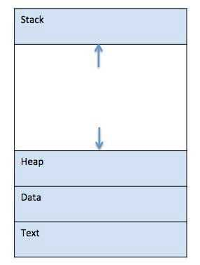

# Concepts

## Processes and Process Management

A process is basically a program in execution. The execution of a process must progress in a sequential fashion. To put it in simple terms, we write our computer programs in a text file, and when we execute this program, it becomes a process which performs all the tasks mentioned in the program.

When a program is loaded into the memory and it becomes a process, it can be divided into four sections ─ stack, heap, text, and data.

- Stack:The process Stack contains the temporary data, such as method/function parameters, return address, and local variables.
- Heap:This is dynamically allocated memory to a process during its run time.
- Text:This includes the current activity represented by the value of Program Counter and the contents of the processor's registers.
- Data:This section contains the global and static variables.
When a process executes, it passes through different states. These stages may differ in different operating systems, and the names of these states are also not standardized. In general, a process can have one of the following five states at a time:

- Start:The initial state when a process is first started/created.
- Ready:The process is waiting to be assigned to a processor. Ready processes are waiting to have the processor allocated to them by the operating system so that they can run. A process may come into this state after theStartstate, or while running it by but getting interrupted by the scheduler to assign CPU to some other process.
- Running:Once the process has been assigned to a processor by the OS scheduler, the process state is set to running and the processor executes its instructions.
- Waiting:the process moves into the waiting state if it needs to wait for a resource, such as waiting for user input, or waiting for a file to become available.
- Terminated or Exit:Once the process finishes its execution, or it is terminated by the operating system, it is moved to the terminated state where it waits to be removed from main memory.
A Process Control Block is a data structure maintained by the Operating System for every process. The PCB is identified by an integer process ID (PID). A PCB keeps all the information needed to keep track of a process as listed below:

- Process State:The current state of the process - whether it is ready, running, waiting, or whatever.
- Process Privileges:This is required to allow/disallow access to system resources.
- Process ID:Unique identification for each of the processes in the operating system.
- Pointer:A pointer to the parent process.
- Program Counter:Program Counter is a pointer to the address of the next instruction to be executed for this process.
- CPU Registers:Various CPU registers where processes need to be stored for execution for running state.
- CPU Scheduling Information:Process priority and other scheduling information which is required to schedule the process.
- Memory Management Information:This includes the information of page table, memory limits, and segment table, depending on the memory used by the operating system.
- Accounting Information:This includes the amount of CPU used for process execution, time limits, execution ID, and so on.
- IO Status Information:This includes a list of I/O devices allocated to the process.

## Inter Process Communication (IPC)

There are two types of processes: **Independent and Cooperating**. An independent process is not affected by the execution of other processes, while a cooperating process can be affected by other executing processes.

You might think that those processes, which are running independently, would execute very efficiently. But in reality, there are many situations when a process' cooperative nature can be utilized for increasing computational speed, convenience, and modularity.Inter-process communication (IPC)is a mechanism which allows processes to communicate with each other and synchronize their actions. The communication between these processes can be seen as a method of cooperation between them.

Processes can communicate with each other in two ways: Shared Memory and Message Parsing.

## Shared Memory Method

Let's say there are two processes: the Producer and the Consumer. The producer produces some item and the Consumer consumes that item. The two processes shares a common space or memory location known as the "buffer," where the item produced by the Producer is stored and from where the Consumer consumes the item if needed.

There are two versions of this problem: the first one is known as the unbounded buffer problem, in which the Producer can keep on producing items and there is no limit on the size of the buffer. The second one is known as the bounded buffer problem, in which the Producer can produce up to a certain number of items, and after that it starts waiting for the Consumer to consume them.

In the bounded buffer problem, the Producer and the Consumer will share some common memory. Then the Producer will start producing items. If the total number of produced items is equal to the size of buffer, the Producer will wait until they're consumed by the Consumer.

Similarly, the Consumer first checks for the availability of the item, and if no item is available, the Consumer will wait for the Producer to produce it. If there are items available, the Consumer will consume them.

## Message Parsing Method

In this method, processes communicate with each other without using any kind of of shared memory. If two processes p1 and p2 want to communicate with each other, they proceed as follows:

- Establish a communication link (if a link already exists, no need to establish it again.)
- Start exchanging messages using basic primitives. We need at least two primitives: send(message, destination) orsend(message) andreceive(message, host) or receive(message)

The message size can be fixed or variable. If it is a fixed size, it is easy for the OS designer but complicated for the programmer. If it is a variable size, then it is easy for the programmer but complicated for the OS designer. A standard message has two parts: aheaderand abody.

The header is used for storing the Message type, destination id, source id, message length, and control information. The control information contains information like what to do if it runs out of buffer space, the sequence number, and its priority. Generally, the message is sent using the FIFO style.

## Input/Output Management

One of the important jobs of an Operating System is to manage various input/output (I/O) devices, including the mouse, keyboards, touch pad, disk drives, display adapters, USB devices, Bit-mapped screen, LED, Analog-to-digital converter, On/off switch, network connections, audio I/O, printers, and so on.

An I/O system is required to take an application I/O request and send it to the physical device, then take whatever response comes back from the device and send it to the application. I/O devices can be divided into two categories:

- **Block devices:** A block device is one with which the driver communicates by sending entire blocks of data. For example, hard disks, USB cameras, Disk-On-Key, and so on.
- **Character Devices:** A character device is one with which the driver communicates by sending and receiving single characters (bytes, octets). For example, serial ports, parallel ports, sounds cards, and so on.

The CPU must have a way to pass information to and from an I/O device. There are three approaches available to communicate with the CPU and Device.

1. **Special Instruction I/O**

    This uses CPU instructions that are specifically made for controlling I/O devices. These instructions typically allow data to be sent to an I/O device or be read from an I/O device.

2. **Memory-mapped I/O**

    When using memory-mapped I/O, the same address space is shared by memory and I/O devices. The device is connected directly to certain main memory locations so that the I/O device can transfer block of data to/from the memory without going through the CPU.

    

    While using memory mapped I/O, the OS allocates buffer in the memory and informs the I/O device to use that buffer to send data to the CPU. The I/O device operates asynchronously with the CPU, and interrupts the CPU when finished.

    The advantage to this method is that every instruction which can access memory can be used to manipulate an I/O device. Memory-mapped I/O is used for most high-speed I/O devices like disks and communication interfaces.

3. **Direct memory access (DMA)**

    Slow devices like keyboards will generate an interruption to the main CPU after each byte is transferred. If a fast device, such as a disk, generated an interruption for each byte, the operating system would spend most of its time handling these interruptions. So a typical computer uses direct memory access (DMA) hardware to reduce this overhead.

    Direct Memory Access (DMA) means the CPU grants the I/O module authority to read from or write to memory without involvement. The DMA module itself controls the exchange of data between the main memory and the I/O device. The CPU is only involved at the beginning and end of the transfer and interrupted only after the entire block has been transferred.

    Direct Memory Access needs special hardware called a DMA controller (DMAC) that manages the data transfers and arbitrates access to the system bus. The controllers are programmed with source and destination pointers (where to read/write the data), counters to track the number of transferred bytes, and various settings. These include the I/O and memory types and the interruptions and states for the CPU cycles.

## Virtualization

Virtualization is technology that allows you to create multiple simulated environments or dedicated resources from a single, physical hardware system.

Software called a **hypervisor** connects directly to that hardware and allows you to split one system into separate, distinct, and secure environments known as **virtual machines(VMs).** These VMs rely on the hypervisor's ability to separate the machine's resources from the hardware and distribute them appropriately.

The original, physical machine equipped with the hypervisor is called the **host**, while the many VMs that use its resources are called **guests**. These guests treat computing resources - like CPU, memory, and storage - as a hangar of resources that can easily be relocated. Operators can control virtual instances of CPU, memory, storage, and other resources so that guests receive the resources they need when they need them.

Ideally, all related VMs are managed through a single web-based virtualization management console, which speeds things up. Virtualization lets you dictate how much processing power, storage, and memory to give to VMs, and environments are better protected since VMs are separated from their supporting hardware and each other.

Simply put, virtualization creates the environments and resources you need from underused hardware.

### Types of Virtualization

1. **Data Virtualization:** Data that's spread all over can be consolidated into a single source. Data virtualization allows companies to treat data as a dynamic supply - providing processing capabilities that can bring together data from multiple sources, easily accommodate new data sources, and transform data according to user needs. Data virtualization tools sit in front of multiple data sources and allow them to be treated as single source. They deliver the needed data - in the required form - at the right time to any application or user.
2. **Desktop Virtualization:** Easily confused with operating system virtualization - which allows you to deploy multiple operating systems on a single machine - desktop virtualization allows a central administrator (or automated administration tool) to deploy simulated desktop environments to hundreds of physical machines at once. Unlike traditional desktop environments that are physically installed, configured, and updated on each machine, desktop virtualization allows admins to perform mass configurations, updates, and security checks on all virtual desktops.
3. **Server Virtualization:** Servers are computers designed to process a high volume of specific tasks really well so other computers - like laptops and desktops - can do a variety of other tasks. Virtualizing a server lets it to do more of those specific functions and involves partitioning it so that the components can be used to serve multiple functions.
4. **Operating System Virtualization:** Operating system virtualization happens at the kernel - the central task managers of operating systems. It's a useful way to run Linux and Windows environments side-by-side. Enterprises can also push virtual operating systems to computers, which: (1) Reduces bulk hardware costs, since the computers don't require such high out-of-the-box capabilities, (2) Increases security, since all virtual instances can be monitored and isolated, and (3) Limits time spent on IT services like software updates.
5. **Network Functions Virtualization:** Network functions virtualization (NFV) separates a network's key functions (like directory services, file sharing, and IP configuration) so they can be distributed among environments. Once software functions are independent of the physical machines they once lived on, specific functions can be packaged together into a new network and assigned to an environment. Virtualizing networks reduces the number of physical components - like switches, routers, servers, cables, and hubs - that are needed to create multiple, independent networks, and it's particularly popular in the telecommunications industry.

https://www.redhat.com/en/topics/virtualization/what-is-nfv

## Distributed File Systems

A distributed file system is a client/server-based application that allows clients to access and process data stored on the server as if it were on their own computer. When a user accesses a file on the server, the server sends the user a copy of the file, which is cached on the user's computer while the data is being processed and is then returned to the server.

Ideally, a distributed file system organizes file and directory services of individual servers into a global directory in such a way that remote data access is not location-specific but is identical from any client. All files are accessible to all users of the global file system and organization is hierarchical and directory-based.

Since more than one client may access the same data simultaneously, the server must have a mechanism in place (such as maintaining information about the times of access) to organize updates so that the client always receives the most current version of data and that data conflicts do not arise. Distributed file systems typically use file or database replication (distributing copies of data on multiple servers) to protect against data access failures.

Sun Microsystems' Network File System ([NFS](http://searchenterprisedesktop.techtarget.com/definition/Network-File-System)), Novell [NetWare](http://searchnetworking.techtarget.com/definition/NetWare), Microsoft's Distributed File System, and IBM's DFS are some examples of distributed file systems.

## Distributed Shared Memory

Distributed Shared Memory (DSM) is a resource management component of a distributed operating system that implements the shared memory model in distributed systems, which have no physically shared memory. The shared memory provides a virtual address space that is shared among all computers in a distributed system.

In DSM, data is accessed from a shared space similar to the way that virtual memory is accessed. Data moves between secondary and main memory, as well as, between the distributed main memories of different nodes. Ownership of pages in memory starts out in some pre-defined state but changes during the course of normal operation. Ownership changes take place when data moves from one node to another due to an access by a particular process.

### Advantages of Distributed Shared Memory

- Hide data movement and provide a simpler abstraction for sharing data. Programmers don't need to worry about memory transfers between machines like when using the message passing model.
- Allows the passing of complex structures by reference, simplifying algorithm development for distributed applications.
- Takes advantage of "locality of reference" by moving the entire page containing the data referenced rather than just the piece of data.
- Cheaper to build than multiprocessor systems. Ideas can be implemented using normal hardware and do not require anything complex to connect the shared memory to the processors.
- Larger memory sizes are available to programs, by combining all physical memory of all nodes. This large memory will not incur disk latency due to swapping like in traditional distributed systems.
- Unlimited number of nodes can be used. Unlike multiprocessor systems where main memory is accessed via a common bus, thus limiting the size of the multiprocessor system.
- Programs written for shared memory multiprocessors can be run on DSM systems.

There are two different ways that nodes can be informed of who owns what page: invalidation and broadcast. Invalidation is a method that invalidates a page when some process asks for write access to that page and becomes its new owner. This way the next time some other process tries to read or write to a copy of the page it thought it had, the page will not be available and the process will have to re-request access to that page. Broadcasting will automatically update all copies of a memory page when a process writes to it. This is also called write-update. This method is a lot less efficient more difficult to implement because a new value has to sent instead of an invalidation message.

https://medium.com/cracking-the-data-science-interview/how-operating-systems-work-10-concepts-you-should-know-as-a-developer-8d63bb38331f
