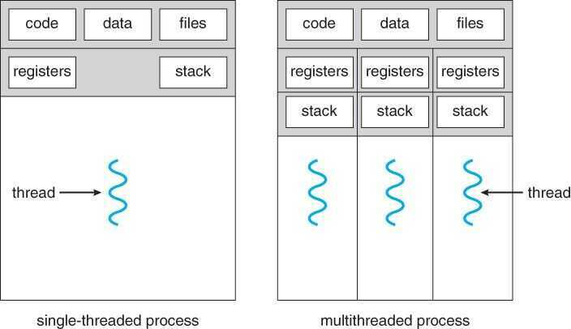
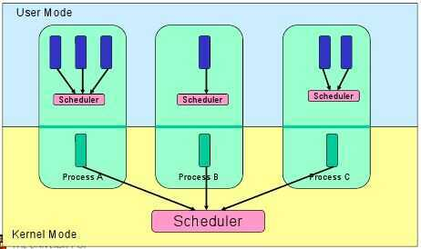

# Concurrency / Threading

## Concurrency

- Composition of independently executing functions/processes
- Parallelism is the simultaneous execution of multiple things, possible related and possibly not.
- Concurrency is about dealing with a lot of things at once while parallelism is about doing a lot of things at once
- Concurrent - Mouse, keyboard, display and disk drivers
- Parallel - Vector dot product
- Adding some design can increase the speed of program execution (Analogy is of grofers working together to load books into the incinerator)

## Process

In general, most processes can be described as either **[I/O-bound](https://en.wikipedia.org/wiki/I/O-bound) or [CPU-bound](https://en.wikipedia.org/wiki/CPU-bound)**.

An I/O-bound process is one that spends more of its time doing I/O than it spends doing computations.

A CPU-bound process, in contrast, generates I/O requests infrequently, using more of its time doing computations. It is important that a long-term scheduler selects a good process mix of I/O-bound and CPU-bound processes.

If all processes are I/O-bound, the ready queue will almost always be empty, and the short-term scheduler will have little to do. On the other hand, if all processes are CPU-bound, the I/O waiting queue will almost always be empty, devices will go unused, and again the system will be unbalanced.

The system with the best performance will thus have a combination of CPU-bound and I/O-bound processes. In modern operating systems, this is used to make sure that real-time processes get enough CPU time to finish their tasks.

## Threads

A thread is just a sequence of instructions that can be executed independently by a processor. Threads are lighter than the process and so you can spawn a lot of them.

A real life application would be a web server.

A webserver typically is designed to handle multiple requests at the same time. And these requests normally don't depend on each other.

So a Thread can be created (or taken from a Thread pool) and requests can be delegated, to achieve concurrency.

Modern processors can executed multiple threads at once (multi-threading) and also switch between threads to achieve parallelism.A thread is a flow of execution through the process code. It has its own program counter that keeps track of which instruction to execute next. It also has system registers which hold its current working variables, and a stack which contains the execution history.

A thread shares with its peer threads various information like code segment, data segment, and open files. When one thread alters a code segment memory item, all other threads see that.

A thread is also called a**lightweight process**. Threads provide a way to improve application performance through parallelism. Threads represent a software approach to improving the performance of operating systems by reducing the overhead. A thread is equivalent to a classical process.

Each thread belongs to exactly one process, and no thread can exist outside a process. Each thread represents a separate flow of control. Threads have been successfully used in implementing network servers and web servers. They also provide a suitable foundation for parallel execution of applications on shared memory multiprocessors.

## Advantages of threads

- They minimize the context switching time.
- Using them provides concurrency within a process.
- They provide efficient communication.
- It is more economical to create and context switch threads.
- Threads allow utilization of multiprocessor architectures to a greater scale and efficiency.

## Threads are implemented in the following two ways

- User Level Threads:User-managed threads.
- Kernel Level Threads:Operating System-managed threads acting on a kernel, an operating system core.

## User Level Threads

In this case, the thread management kernel is not aware of the existence of threads. The thread library contains code for creating and destroying threads, for passing messages and data between threads, for scheduling thread execution, and for saving and restoring thread contexts. The application starts with a single thread.

## Advantages

- Thread switching does not require Kernel mode privileges.
- User level thread can run on any operating system.
- Scheduling can be application-specific in the user level thread.
- User level threads are fast to create and manage.

## Disadvantages

- In a typical operating system, most system calls are blocking.
- Multithreaded application cannot take advantage of multiprocessing.

## Kernel Level Threads

In this case, thread management is done by the Kernel. There is no thread management code in the application area. Kernel threads are supported directly by the operating system. Any application can be programmed to be multithreaded. All of the threads within an application are supported within a single process.

The Kernel maintains context information for the process as a whole and for individuals threads within the process. Scheduling by the Kernel is done on a thread basis. The Kernel performs thread creation, scheduling, and management in Kernel space. Kernel threads are generally slower to create and manage than the user threads.

## Advantages

- The Kernel can simultaneously schedule multiple threads from the same process on multiple processes.
- If one thread in a process is blocked, the Kernel can schedule another thread of the same process.
- Kernel routines themselves can be multithreaded.

## Disadvantages

- Kernel threads are generally slower to create and manage than the user threads.
- Transfer of control from one thread to another within the same process requires a mode switch to the Kernel.

## Threads vs Processes

- Threads **uses shared state**, so there is an ease of communication between multiple threads, but the disadvantage of shared state is that there can be race condition, multiple threads can race with each other to get access to resources.
- Processes **doesn't have shared state**, they are fully independent from each other. The weakness of processes is lack of communication (hence the need for IPC and object pickling and other overhead)- Threads are more lightweight and have lower overhead compared to processes. Spawning processes is a bit slower than spawning threads.

| **Bottleneck** | **Example**                        | **Optimize with** |
|----------------|------------------------------------|-------------------|
| IO             | Network connection, file operation | Multithreading    |
| CPU            | Complex math problem, search       | Multiprocessing   |

https://zacs.site/blog/linear-python.html

### Programs vs Threads vs Processes

A Program is an executable file containing a set of instructions and passively stored on disk. One program can have multiple processes. For example, the Chrome browser creates a different process for every single tab.

A Process means a program is in execution. When a program is loaded into the memory and becomes active, the program becomes a process. The process requires some essential resources such as registers, program counter, and stack.

A Thread is the smallest unit of execution within a process.

The following process explains the relationship between program, process, and thread.

1. The program contains a set of instructions.
2. The program is loaded into memory. It becomes one or more running processes.
3. When a process starts, it is assigned memory and resources. A process can have one or more threads. For example, in the Microsoft Word app, a thread might be responsible for spelling checking and the other thread for inserting text into the doc.

Main differences between process and thread:

- Processes are usually independent, while threads exist as subsets of a process.
- Each process has its own memory space. Threads that belong to the same process share the same memory.
- A process is a heavyweight operation. It takes more time to create and terminate.
- Context switching is more expensive between processes.
- Inter-thread communication is faster for threads.

## Are Threads Lighter than Processes

Yes and No.

In concept,

1. Threads share memory and don't need to create a new virtual memory space when they are created and thus don't require a MMU (memory management unit) context switch

2. Communication between threads is simpler as they have a shared memory while processes requires various modes of IPC (Inter-Process Communications) like semaphores, message queues, pipes etc.

That being said, this doesn't always guarantee a better performance than processes in this multi-core processor world.

e.g. Linux doesn't distinguish between threads and processes and both are called tasks. Each task can have a minimum to maximum level of sharing when cloned.

When you callfork(), a new task is created with no shared file descriptors, PIDs and memory space. When you callpthread_create(), a new task is created with all of the above shared.

Also, synchronising data in [shared memory](https://users.cs.cf.ac.uk/Dave.Marshall/C/node27.html) as well as in [L1 cache](https://www.quora.com/What-is-the-L1-L2-and-L3-cache-of-a-microprocessor-and-how-does-it-affect-the-performance-of-it-For-example-I-have-a-laptop-with-an-Intel-4700MQ-microprocessor-with-a-6MB-L3-cache-What-does-this-value-indicate) of tasks running on multiple cores takes a bigger toll than running different processes on isolated memory.

Linux developers have tried to minimise the cost between task switch and have succeeded at it. Creating a new task is still a bigger overhead than a new thread but switching is not.

## What can be improved in Threads?

There are three things which make threads slow:

1. Threads consume a lot of memory due to their large stack size (≥ 1MB). So creating 1000s of thread means you already need 1GB of memory.
2. Threads need to restore a lot of registers some of which include AVX( Advanced vector extension), SSE (Streaming SIMD Ext.), Floating Point registers, Program Counter (PC), Stack Pointer (SP) which hurts the application performance.
3. Threads setup and teardown requires call to OS for resources (such as memory) which is slow.

## Threads vs Async

## Threads

Threads switch preemptively. This is convenient because you don't need to add explicit code to cause a task switch.

The cost of this convenience is that you have to assume a switch can happen at any time. Accordingly, critical sections have to be guarded with locks. Dinning Philosophers Problem.

The limit on threads is total CPU power minus the cost of task switches and synchronization overhead.

## Async

Async switches cooperatively, so you do need to add explicit code "yield" or "await" to cause a task switch.

Now you control when task switches occur, so locks and other synchronization are no longer needed.

Also, the cost task switches is very low. Calling a pure Python function has more overhead than restarting a generator or awaitable.

This means that async is very cheap.

In return, you'll need a non-blocking version of just about everything you do. Accordingly, the async world has a huge ecosystem of support tools. This increases the learning curve.

## Comparison

- Async maximizes CPU utilization because it has less overhead than threads.
- Threading typically works with existing code and tools as long as locks are added around critical sections.
- For complex systems, async ismucheasier to get right than threads with locks.
- Threads require very little tooling (locks and queues).
- Async needs a great deal of tooling (futures, event loops, and non-blocking versions of just about everything).
- In a threaded system the decision to suspend one thread and execute another is largely outside of the programmer's control. Rather, it is under the control of the operating system, and the programmer must assume that a thread may be suspended and replaced with another at almost any time. In contrast, under the asynchronous model a task will continue to run until it explicitly relinquishes control to other tasks.- The problem with locks is that it just a flag, and it should be checked to access the resources. If you don't check then there would be problems.

## Considerations

- Threading
- Multiprocessing
- Async

## Amdahl's Law

Amdahl's law is often used in parallel computing to predict the theoretical speedup when using multiple processors. For example, if a program needs 20 hours using a single processor core, and a particular part of the program which takes one hour to execute cannot be parallelized, while the remaining 19 hours (p = 0.95) of execution time can be parallelized, then regardless of how many processors are devoted to a parallelized execution of this program, the minimum execution time cannot be less than that critical one hour. Hence, the theoretical speedup is limited to at most 20 times(1/(1−p)=20). For this reason parallel computing is relevant only for a low number of processors and very parallelizable programs

## Process Control Block

1. Process State
2. Process Number
3. Program Counter
4. Registers
5. Memory Limits
6. List of open Files
7. Signal Mask
8. CPU Scheduling info

## Synchronization

Synchronizationrefers to one of two distinct but related concepts

### Process Synchronization

Process synchronization refers to the idea that multiple processes are to join up or [handshake](https://en.wikipedia.org/wiki/Handshaking) at a certain point, in order to reach an agreement or commit to a certain sequence of action.

### Data Synchronization

[Data synchronization](https://en.wikipedia.org/wiki/Data_synchronization) refers to the idea of keeping multiple copies of a dataset in coherence with one another, or to maintain [data integrity](https://en.wikipedia.org/wiki/Data_integrity)

Process synchronization primitives are commonly used to implement data synchronization.

## Need for synchronization

The need for synchronization does not arise merely in multi-processor systems but for any kind of concurrent processes; even in single processor systems. Mentioned below are some of the main needs for synchronization:

- [Forks and Joins](https://en.wikipedia.org/wiki/Fork-join_model):When a job arrives at a fork point, it is split into N sub-jobs which are then serviced by n tasks. After being serviced, each sub-job waits until all other sub-jobs are done processing. Then, they are joined again and leave the system. Thus, in parallel programming, we require synchronization as all the parallel processes wait for several other processes to occur.
- [Producer-Consumer:](https://en.wikipedia.org/wiki/Producer%E2%80%93consumer_problem) In a producer-consumer relationship, the consumer process is dependent on the producer process till the necessary data has been produced.
- Exclusive use resources:When multiple processes are dependent on a resource and they need to access it at the same time the operating system needs to ensure that only one processor accesses it at a given point in time.This reduces concurrency.

## Implementation of Synchronization

### Spinlock

Another effective way of implementing synchronization is by using spinlocks. Before accessing any shared resource or piece of code, every processor checks a flag. If the flag is reset, then the processor sets the flag and continues executing the thread. But, if the flag is set (locked), the threads would keep spinning in a loop and keep checking if the flag is set or not. But, spinlocks are effective only if the flag is reset for lower cycles otherwise it can lead to performance issues as it wastes many processor cycles waiting.

### Barriers

Barriers are simple to implement and provide good responsiveness. They are based on the concept of implementing wait cycles to provide synchronization. Consider three threads running simultaneously, starting from barrier 1. After time t, thread1 reaches barrier 2 but it still has to wait for thread 2 and 3 to reach barrier2 as it does not have the correct data. Once all the threads reach barrier 2 they all start again. After time t, thread 1 reaches barrier3 but it will have to wait for threads 2 and 3 and the correct data again.

Thus, in barrier synchronization of multiple threads there will always be a few threads that will end up waiting for other threads as in the above example thread 1 keeps waiting for thread 2 and 3. This results in severe degradation of the process performance.

In [parallel computing](https://en.wikipedia.org/wiki/Parallel_computing), abarrieris a type of [synchronization](https://en.wikipedia.org/wiki/Synchronization_(computer_science)) method. A barrier for a group of threads or processes in the source code means any thread/process must stop at this point and cannot proceed until all other threads/processes reach this barrier.

Many collective routines and directive-based parallel languages impose implicit barriers. For example, a paralleldoloop in [Fortran](https://en.wikipedia.org/wiki/Fortran) with [OpenMP](https://en.wikipedia.org/wiki/OpenMP) will not be allowed to continue on any thread until the last iteration is completed. This is in case the program relies on the result of the loop immediately after its completion. In [message passing](https://en.wikipedia.org/wiki/Message_passing), any global communication (such as reduction or scatter) may imply a barrier.

https://en.wikipedia.org/wiki/Barrier_(computer_science)

### Semaphores

Semaphores are signalling mechanisms which can allow one or more threads/processors to access a section. A Semaphore has a flag which has a certain fixed value associated with it and each time a thread wishes to access the section, it decrements the flag. Similarly, when the thread leaves the section, the flag is incremented. If the flag is zero, the thread cannot access the section and gets blocked if it chooses to wait.

Some semaphores would allow only one thread or process in the code section. Such Semaphores are called binary semaphore and are very similar to Mutex. Here, if the value of semaphore is 1, the thread is allowed to access and if the value is 0, the access is denied.

https://en.wikipedia.org/wiki/Synchronization_(computer_science)

## Hyper - Threading Technology (HTT)

Hyper-threading(officially calledHyper-Threading TechnologyorHT Technologyand abbreviated asHTTorHT) is [Intel's](https://en.wikipedia.org/wiki/Intel)[proprietary](https://en.wikipedia.org/wiki/Proprietary_hardware)[simultaneous multithreading](https://en.wikipedia.org/wiki/Simultaneous_multithreading)(SMT) implementation used to improve [parallelization](https://en.wikipedia.org/wiki/Parallel_computation) of computations (doing multiple tasks at once) performed on [x86](https://en.wikipedia.org/wiki/X86) microprocessors. It first appeared in February 2002 on [Xeon](https://en.wikipedia.org/wiki/Xeon) server [processors](https://en.wikipedia.org/wiki/Central_processing_unit) and in November 2002 on [Pentium4](https://en.wikipedia.org/wiki/Pentium_4) desktop CPUs.Later, Intel included this technology in [Itanium](https://en.wikipedia.org/wiki/Itanium), [Atom](https://en.wikipedia.org/wiki/Intel_Atom), and [Core 'i' Series](https://en.wikipedia.org/wiki/Intel_Core) CPUs, among others.

For each [processor core](https://en.wikipedia.org/wiki/Processor_core) that is physically present, the [operating system](https://en.wikipedia.org/wiki/Operating_system) addresses two virtual (logical) cores and shares the workload between them when possible. The main function of hyper-threading is to increase the number of independent instructions in the pipeline; it takes advantage of [superscalar](https://en.wikipedia.org/wiki/Superscalar_processor) architecture, in which multiple instructions operate on separate data [in parallel](https://en.wikipedia.org/wiki/Parallel_computing). With HTT, one physical core appears as two processors to the operating system, allowing [concurrent](https://en.wikipedia.org/wiki/Concurrent_computing) scheduling of two processes per core. In addition, two or more processes can use the same resources: If resources for one process are not available, then another process can continue if its resources are available.

In addition to requiring simultaneous multithreading (SMT) support in the operating system, hyper-threading can be properly utilized only with an operating system specifically optimized for it.Furthermore, Intel recommends HTT to be disabled when using operating systems unaware of this hardware feature.

https://en.wikipedia.org/wiki/Hyper-threading

Multithreading, concurrency, locks, synchronization

## Compare and Swap (CAS)

Compare and Swap is an atomic structure used in multithreading to achieve synchronization. It compares the contents of a memory location with a given value and, only if they are the same, modifies the contents of that memory location to a new given value. This is done as a single atomic operation. The atomicity guarantees that the new value is calculated based on up-to-date information; if the value had been updated by another thread in the meantime, the write would fail. The result of the operation must indicate whether it performed the substitution; this can be done either with a simple [boolean](https://en.wikipedia.org/wiki/Boolean_logic) response (this variant is often called**compare-and-set**), or by returning the value read from the memory location (*not*the value written to it).

Atomic instruction that compares contents of a memory location M to a given value V

- If values are equal, installs new given value V' in M
- Otherwise operation fails

`__sync_bool_compare_and_swap(&M, 20, 30)`

`__sync_bool_compare_and_swap(Address, Compare Value, New Value)`

https://en.wikipedia.org/wiki/Compare-and-swap

## References

[Concurrency](python/advanced/concurrency.md)

[https://schneems.com/2017/10/23/wtf-is-a-thread/#](https://schneems.com/2017/10/23/wtf-is-a-thread/)

Dijkstra's Guarded Commands - https://en.wikipedia.org/wiki/Guarded_Command_Language

[Communicating Sequential Processes, by C. A. R. Hoare (PDF Version)](http://www.usingcsp.com/)

[Rob Pike - 'Concurrency Is Not Parallelism'](https://vimeo.com/49718712)

[Demystifying Python Multiprocessing and Multithreading | by David Chong | Towards Data Science](https://towardsdatascience.com/demystifying-python-multiprocessing-and-multithreading-9b62f9875a27)

[Peeking into assembly code to understand why count++ is not atomic - YouTube](https://www.youtube.com/watch?v=kBHd7kn_1EU)

[How to write deadlock free code? - YouTube](https://www.youtube.com/watch?v=Vk2BEiYGeQc)
