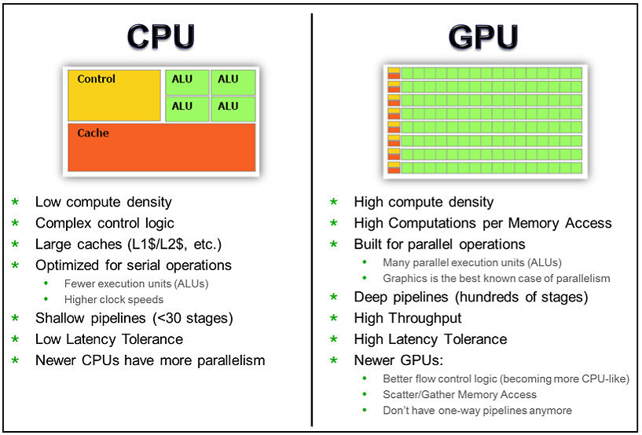
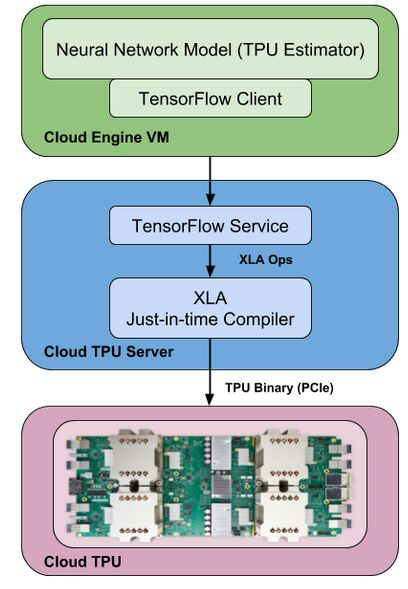
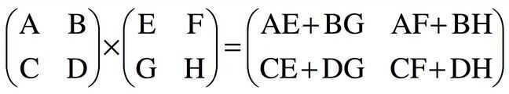

# CPU | GPU | TPU

MAC - Multiplier, Adder, Accumulator

Tensor - n-dimensional array

Specifically for matrix operations

## CPU / GPU

- A CPU is a scalar machine, which means it processes instructions one step at a time.
- A GPU is composed of hundreds of cores that can handle thousands of threads simultaneously.
    - Thats because GPUs were designed for 3d game rendering, which often involves parallel operations -The ability of a GPU with 100+ cores to process thousands of threads can accelerate some software by 100x over a CPU alone.
    - What's more, the GPU achieves this acceleration while being more power- and cost-efficient than a CPU.
    - So when neural networks run on GPUs, they run much faster than on CPUs
- 
- A GPU is a vector machine. You can give it a long list of data - a 1D vector - and run computations on the entire list at the same time.
- This way, we can perform more computations per second, but we have to perform the same computation on a vector of data in parallel.
- GPUs are general purpose chips. They don't just perform matrix operations, they can really do any kind of computation.
- GPUs are optimized for taking huge batches of data and performing the same operation over and over very quickly

## TPU

- TPU hardware is comprised of four independent chips.
- Each chip consists of two compute cores called Tensor Cores.
- A Tensor Core consists of scalar, vector and matrix units (MXU).
- In addition, 8 GB of on-chip memory (HBM) is associated with each Tensor Core.
- The bulk of the compute horsepower in a Cloud TPU is provided by the MXU.
- Each MXU is capable of performing 16K multiply-accumulate operations in each cycle.
- While the MXU's inputs and outputs are 32-bit floating point values, the MXU performs multiplies at reduced bfloat16 precision.
- Bfloat16 is a 16-bit floating point representation that provides better training and model accuracy than the IEEE half-precision representation. -From a software perspective, each of the 8 cores on a Cloud TPU can execute user computations (XLA ops) independently.
- High-bandwidth interconnects allow the chips to communicate directly with each other.- 

## The Systolic Array

- The way to achieve that matrix performance is through a piece of architecture called a systolic array.
- This is the interesting bit, and it's why a TPU is performant.
- A systolic array is a kind of hardware algorithm, and it describes a pattern of cells on a chip that computes matrix multiplication.
- "Systolic" describes how data moves in waves across the chip, like the beating of a human heart.

## Use Cases

CPUs:

- Quick prototyping that requires maximum flexibility
- Simple models that do not take long to train
- Small models with small effective batch sizes
- Models that are dominated by custom TensorFlow operations written in C++
- Models that are limited by available I/O or the networking bandwidth of the host system

GPUs:

- Models that are not written in TensorFlow or cannot be written in TensorFlow
- Models for which source does not exist or is too onerous to change
- Models with a significant number of custom TensorFlow operations that must run at least partially on CPUs
- Models with TensorFlow ops that are not available on Cloud TPU (see the list of available TensorFlow ops)
- Medium-to-large models with larger effective batch sizes

TPUs:

- Models dominated by matrix computations
- Models with no custom TensorFlow operations inside the main training loop
- Models that train for weeks or months
- Larger and very large models with very large effective batch sizes

## CPU Time

https://dzone.com/articles/nice-cpu-time-ni-time-in-top

## Links

[Chasing Silicon: The Race for GPUs](https://www.youtube.com/watch?v=IPre5287P3I)

[5 reasons why Google's Trillium could transform AI and cloud computing - and 2 obstacles | ZDNET](https://www.zdnet.com/article/5-reasons-why-googles-trillium-could-transform-ai-and-cloud-computing-and-2-obstacles/)
