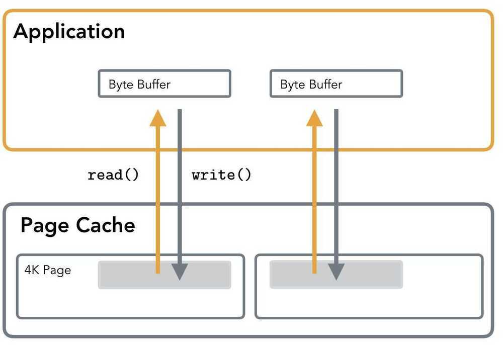
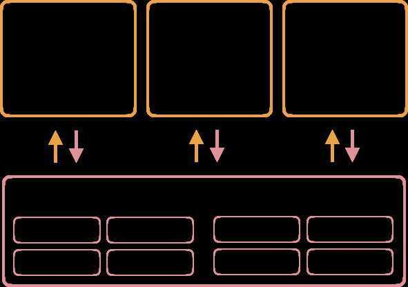

# Disk IO

## IO

- Syscalls: [open](http://man7.org/linux/man-pages/man2/open.2.html), [write](http://man7.org/linux/man-pages/man2/write.2.html), [read](http://man7.org/linux/man-pages/man2/read.2.html), [fsync](http://man7.org/linux/man-pages/man2/fsync.2.html), [sync](http://man7.org/linux/man-pages/man2/sync.2.html), [close](http://man7.org/linux/man-pages/man2/close.2.html)
- Standard IO: [fopen](https://linux.die.net/man/3/fopen), [fwrite](https://linux.die.net/man/3/fwrite), [fread](https://linux.die.net/man/3/fread), [fflush](https://linux.die.net/man/3/fflush), [fclose](https://linux.die.net/man/3/fclose)
- Vectored IO: [writev](https://linux.die.net/man/2/writev), [readv](https://linux.die.net/man/2/readv)
- Memory mapped IO: [open](http://man7.org/linux/man-pages/man2/open.2.html), [mmap](http://man7.org/linux/man-pages/man2/mmap.2.html), [msync](http://man7.org/linux/man-pages/man2/msync.2.html), [munmap](http://man7.org/linux/man-pages/man2/munmap.2.html)

## Buffered IO

setvbuf

The three types of buffering available are unbuffered, block buffered, and line buffered. When an output stream is unbuffered, information appears on the destination file or terminal as soon as written; when it is block buffered many characters are saved up and written as a block; when it is line buffered characters are saved up until a newline is output or input is read from any stream attached to a terminal device (typicallystdin)

## Sector/Block/Page

*Block Device* is a special file type providing buffered access to hardware devices such as HDDs or SSDs. Block Devices work act upon *sectors*, group of adjacent bytes. Most disk devices have a sector size of 512 bytes. Sector is the smallest unit of data transfer for block device, it is not possible to transfer less than one sector worth of data. However, often it is possible to fetch multiple adjacent segments at a time. The smallest addressable unit ofFile Systemis *block*.Block is a group of multiple adjacent sectors requested by a device driver. Typical block sizes are 512, 1024, 2048 and 4096 bytes. Usually IO is done through the *Virtual Memory*, which caches requested filesystem blocks in memory and serves as a buffer for intermediate operations. Virtual Memory works with pages, which map to filesystem blocks. Typical page size is 4096 bytes.

In summary, Virtual Memory *pages* map to Filesystem *blocks*, which map to Block Device *sectors*

## Standard IO

Standard IO usesread()andwrite()syscalls for performing IO operations. When reading the data, Page Cache is addressed first. If the data is absent, thePage Faultis triggered and contents are paged in. This means that reads, performed against the currently unmapped area will take longer, as caching layer is transparent to user.

During writes, buffer contents are first written to Page Cache. This means that data does not reach the disk right away. The actual hardware write is done when Kernel decides it's time to perform awritebackof thedirty page.

Standard IO takes a user space buffer and then copies it's content to the page cache. When the O_DIRECT flag is used, the buffer is written directly to the blockdevice.

## Page Cache

[Page Cache](https://github.com/torvalds/linux/blob/master/include/linux/buffer_head.h) stores the recently accessed fragments of files that are more likely to be accessed in the nearest time. When working with disk files, read() andwrite() calls do not initiate disk accesses directly and go through Page Cache instead.

How Buffered IO works: Applications perform reads and writes through the Kernel Page Cache, which allows sharing pages processes, serving reads from cache and throttling writes to reduceIO.

When the read operation is performed, the Page Cache is consulted first. If the data is already loaded in the Page Cache, it is simply copied out for the user: no disk access is performed and read is served entirely from memory. Otherwise file contents are loaded in Page Cache and then returned to the user. If Page Cache is full, least recently used pages are flushed on disk and evicted from cache to free space for new pages.

write() call simply copies user-space buffer to kernel Page Cache, marking the written page asdirty. Later, kernel writes modifications on disk in a process calledflushorwriteback. Actual IO normally does not happen immediately. Meanwhile, read()will supply data from the Page Cache instead of reading (now outdated) disk contents. As you can see, Page Cache is loaded both on reads and writes.

Pages markeddirtywill beflushedto disk as since their cached representation is now different from the one on disk. This process is called *writeback*. writeback might have potential drawbacks, such as queuing up IO requests, so it's worth understanding thresholds and ratios that used for writeback when it's in use and check queue depths to make sure you can avoid throttling and high latencies. You can find more information on tuning Virtual Memory in [Linux Kernel Documentation](https://www.kernel.org/doc/Documentation/sysctl/vm.txt).

Logic behind Page Cache is explained by**Temporal localityprinciple**, that states that recently accessed pages will be accessed again at some point in nearest future.

Another principle, **Spatial Locality**, implies that the elements physically located nearby have a good chance of being located close to each other. This principle is used in a process called "prefetch" that loads file contents ahead of time anticipating their access and amortizing some of the IO costs.

Page Cache also improves IO performance by delaying writes and coalescing adjacent reads.

Disambiguation: Buffer Cache and Page Cache: previously entirely separate concepts, [got unified in 2.4 Linux kernel](https://lwn.net/Articles/712467/). Right now it's mostly referred to as Page Cache, but some people people still use term Buffer Cache, which became synonymous.

Page Cache, depending on the access pattern, holds file chunks that were recently accessed or may be accessed soon (prefetched or marked with [fadvise](https://medium.com/@ifesdjeen/on-disk-io-part-2-more-flavours-of-io-c945db3edb13)). Since all IO operations are happening through Page Cache, operations sequences such asread-write-readcan be served from memory, without subsequent disk accesses.

## Delaying Errors

When performing a write that's backed by the kernel and/or a library buffer, it is important to make sure that the data actually reaches the disk, since it might be buffered or cached somewhere. The errors will appear when the data is flushed to disk, which can be whilefsyncing or closing the file.

## Direct IO

There are situations when it's undesirable to use the Kernel Page Cache to perform IO. In such cases, one can use [O_DIRECT](https://ext4.wiki.kernel.org/index.php/Clarifying_Direct_IO%27s_Semantics) flag when opening a file. It instructs the Operating Systems to bypass thePage Cache, avoid storing extra copy of data and perform IO operations directly against the block device. This means that buffers are flushed directly on disk, without copying their contents to the corresponding cached page first and waiting for the Kernel to trigger a writeback.

For a "traditional" application using Direct IO will most likely cause a performance degradation rather than the speedup, but in the right hands it can help to gain a fine-grained control over IO operations and improve performance. Usually applications using this type of IO implement their own application-specific caching layer.

How Direct IO works: Application bypasses the Page Cache, so the writes are made towards the hardware storage right away. This might result into performance degradation, since the Kernel buffers and caches the writes, sharing the cache contents between application. When used well, can result into major performance gains and improved memoryusage.

Using Direct IO is often frowned upon by the Kernel developers. It goes so far, that Linux man page quotes Linus Torwalds: "[The thing that has always disturbed me about O_DIRECT is that the whole interface is just stupid](http://yarchive.net/comp/linux/o_direct.html)".

However, databases such as [PostgreSQL](https://www.postgresql.org/message-id/529F7D58.1060301%40agliodbs.com) and [MySQL](https://dev.mysql.com/doc/refman/5.5/en/optimizing-innodb-diskio.html) use Direct IO for a reason. Developers can ensure fine-grained control over the data access, possibly using a custom IO Scheduler and an application-specific Buffer Cache. For example, PostgreSQL uses Direct IO for [WAL](https://www.postgresql.org/docs/9.5/static/runtime-config-wal.html)(write-ahead-log), since they have to perform writes as fast as possible while ensuring its durability and can use this optimization since they know for sure that the data won't be immediately reused, so writing it bypassing Page Cache won't cause performance degradation.

It is discouraged to open the same file with Direct IO and Page Cache simultaneously, since direct operations will be performed against disk device even if the data is in Page Cache, which may lead to undesired results.

## Block Alignment

Because Direct IO involves direct access to backing store, bypassing intermediate buffers in Page Cache, it is required that all operations are aligned to sector boundary.

Examples of unaligned writes (highlighted). Left to right: the write neither starts, nor ends on the block boundary; the write starts on the block boundary, but the write size isn't a multiple of the block size; the write doesn't start on the block boundary.

In other words, every operation has to have a starting offset of a multiple of 512 and a buffer size has to be a multiple of 512 as well. When using Page Cache, because writes first go to memory, alignment is not important: when actual block device write is performed, Kernel will make sure to split the page into parts of the right size and perform aligned writes towards hardware.

Examples of aligned writes (highlighted). Left to right: the write starts and ends on the block boundary and is exactly the size of the block; the write starts and ends on the block boundary and has a size that is a multiple of the blocksize.

For example, RocksDB is making sure that the operations are block-aligned [by checking it upfront](https://github.com/facebook/rocksdb/blob/master/env/io_posix.cc#L312-L316)(older versions were allowing unaligned access by aligning in the background).

Whether or not O_DIRECT flag is used, it is always a good idea to make sure your reads and writes are block aligned. Crossing segment boundary will cause multiple sectors to be loaded from (or written back on) disk as shown on images above. Using the block size or a value that fits neatly inside of a block guarantees block-aligned I/O requests, and prevents extraneous work inside the kernel.

## Nonblocking Filesystem IO

I'm adding this part here since I very often hear "nonblocking" in the context of Filesystem IO. It's quite normal, since most of the programming interface for Network and Filesystem IO is the same. But it's worth mentioning that there's [no true "nonblocking" Filesystem IO](https://www.remlab.net/op/nonblock.shtml), which can be understood in the same sense.

O_NONBLOCK is generally ignored for regular files, because block device operations are considered non-blocking (unlike socket operations, for example). Filesystem IO delays are not taken into account by the system. Possibly this decision was made because there's a more or less hard time bound on operation completion.

For same reason, something you would usually use in Network context, likeselectandepoll, does not allow monitoring and/or checking status of regular files.

## I/O buffering

In order to program for data integrity, it is crucial to have an understanding of the overall system architecture. Data can travel through several layers before it finally reaches stable storage, as seen below:

At the top is the running application which has data that it needs to save to stable storage. That data starts out as one or more blocks of memory, or buffers, in the application itself. Those buffers can also be handed to a library, which may perform its own buffering. Regardless of whether data is buffered in application buffers or by a library, the data lives in the application's address space. The next layer that the data goes through is the kernel, which keeps its own version of a write-back cache called the page cache. Dirty pages can live in the page cache for an indeterminate amount of time, depending on overall system load and I/O patterns. When dirty data is finally evicted from the kernel's page cache, it is written to a storage device (such as a hard disk). The storage device may further buffer the data in a volatile write-back cache. If power is lost while data is in this cache, the data will be lost. Finally, at the very bottom of the stack is the non-volatile storage. When the data hits this layer, it is considered to be "safe."

https://lwn.net/Articles/457667

## Access Patterns

Access patterns are patterns with which a program reads and writes the data. In general, we distinguish between the **random and sequential access patterns**. But, of course, nothing is absolute. Having fully sequential reads is not possible for ad-hoc queries, since the data has to be located first, but as soon as it is located, it can be read sequentially.

By sequential access we usually mean reads monotonically going from lower offsets to the higher ones and the higher offsets are immediately following the lower ones.

Random access is reading non-contiguous chunks of data. It usually involves disk seeks, skipping portions of the file in order to locate the data. Hop size is often hard to predict and spans many pages (for example, when traversing a B-Tree on disk, we have to skip entire levels in order to continue the search). In summary, sequential access implies reading contiguous blocks monotonically and random access is pretty much anything else.

Sequential access is often preferred because of it's predictability. In [one of previous posts](https://medium.com/@ifesdjeen/on-disk-io-part-2-more-flavours-of-io-c945db3edb13) we've discussed the fact that avoiding Page Faults allows for a better performance, since reads are served from RAM rather than disk. When reading data sequentially, Kernel may load the pages ahead of time in the process called prefetching: speculative reading from disk based on some prediction of future requests. In addition, sequential reads avoid additional seeks.

Optimising for sequential reads and for sequential writes are orthogonal problems. Records written sequentially are not always read together (for example, point queries in sequentially written LSM Tree are still random). Similarly, data read together wasn't necessarily put on disk in a sequential manner (for example, a sequential read of the level in a B-Tree, which might have been updated randomly).

## Random Reads on SSDs

On HDDs, sequential access is preferred to random because of their physical organisation and the way they work. Read/write head is attached to the mechanical arm that has to travel across the disk in order to read the blocks of data; disk has to rotate in to position the track sector under read/write head. This all involves a non-trivial amount of movement. Operating System tries to amortise the costs by caching, buffering and scheduling operations optimally.

SSDs are made of electronics and do not have any moving components. In this regard, SSDs are inherently different from HDDs and there's no performance degradation caused by where data is stored on disk physically. However, current SSD technology suffers from the performance degradation caused by write amplification. Lack of moving parts allows for several other characteristics, such as parallelism, but we won't be discussing them in this article.

Minimal read unit on SSD is page. Reads and writes are performed in pages. Deleting a page worth of data does not immediately remove data physically. Instead, a page is marked as stale and will wait for Garbage Collection to reclaim free space.

Because writes are performed in pages, even if a single byte has to be updated, the whole page will be written anyway. At the same time, because of the specifics of NAND storage, pages can not be updated in place, so writes can be performed only into the empty pages. These two properties attribute for the write amplification on SSDs.

After an extensive amount of random writes, an FTL (Flash Transportation Layer) runs out of free pages and has to perform Garbage Collection: a process that reads, consolidates then and writes active pages in free blocks, freeing blocks, occupied by stale pages and reclaiming disk space.

Some SSDs implement background Garbage Collection, which takes advantage of idle time in order to consolidate blocks and reclaim stale pages before new data has to be written, which ensures that future foreground write processes have enough free pages available. But given enough write pressure, Garbage Collection process may not keep up with the amount of work, negatively impacting write performance.

A key goal of log-structured systems is sequentialising writes. However, if the FTL is shared by two log- structured applications (or even a single application with multiple append streams), the incoming data into the FTL is likely to look random or disjoint. You can read more about "stacking" log operations in [this paper](https://www.usenix.org/system/files/conference/inflow14/inflow14-yang.pdf).

We've discussed multiple things one has to take into consideration when working with SSDs.Writing complete pages is better than writing data smaller than the page size, since the smallest SSD unit storage is a page. Because updating page will effectively allocate a new page and invalidate the previous one, updates may result into Garbage Collection. It's better to keep the write operations page-aligned in order to avoid additional write multiplication. And last, keeping the data with similar lifecycle together(e.g. the data that would be both written and discarded at the same time) will be beneficial for performance. Most of these points are points speak favour of immutable LSM-like Storage, rather than systems that allows in-place updates: writes are batched and SSTables are written sequentially, files are immutable and, when deleted, the whole file is invalidated at once.

https://medium.com/databasss/on-disk-io-part-1-flavours-of-io-8e1ace1de017

https://medium.com/databasss/on-disk-io-part-3-lsm-trees-8b2da218496f

https://medium.com/databasss/on-disk-storage-part-4-b-trees-30791060741

https://medium.com/databasss/on-disk-io-access-patterns-in-lsm-trees-2ba8dffc05f9

## IOPS

Input/output operations per second(IOPS, pronouncedeye-ops) is an [input/output](https://en.wikipedia.org/wiki/Input/output) performance measurement used to characterize [computer storage](https://en.wikipedia.org/wiki/Data_storage_device) devices like [hard disk drives](https://en.wikipedia.org/wiki/Hard_disk_drive)(HDD), [solid state drives](https://en.wikipedia.org/wiki/Solid_state_drives)(SSD), and [storage area networks](https://en.wikipedia.org/wiki/Storage_area_network)(SAN). Like [benchmarks](https://en.wikipedia.org/wiki/Benchmark), IOPS numbers published by storage device manufacturers do not directly relate to real-world application performance.

https://en.wikipedia.org/wiki/IOPS

## Wear Leveling

Wear leveling (also written aswear levelling) is a technique  for prolonging the [service life](https://en.wikipedia.org/wiki/Service_life) of some kinds of erasable [computer storage](https://en.wikipedia.org/wiki/Computer_storage) media, such as [flash memory](https://en.wikipedia.org/wiki/Flash_memory), which is used in [solid-state drives](https://en.wikipedia.org/wiki/Solid-state_drive)(SSDs) and [USB flash drives](https://en.wikipedia.org/wiki/USB_flash_drive), and [phase-change memory](https://en.wikipedia.org/wiki/Phase-change_memory). There are several wear leveling mechanisms that provide varying levels of longevity enhancement in such memory systems

## Monitoring

- Writes/sec-- write operations rate.
- Reads/sec-- read operations rate.
- Busy time-- the % of the elapsed time when your particular disk drive was busy in servicing write or read requests.
- Queue length-- the number of requests on the disk that are in the queue.

## P/E Cycles

A solid-state-storage program-erase cycle is a sequence of events in which data is written to [solid-state](https://searchstorage.techtarget.com/definition/solid-state-storage)[NAND flash memory](https://searchstorage.techtarget.com/definition/NAND-flash-memory) cell (such as the type found in a so-called flash or thumb drive), then erased, and then rewritten. Program-erase (PE) cycles can serve as a criterion for quantifying the endurance of a [flash storage](https://searchstorage.techtarget.com/definition/flash-storage) device.

[Flash memory](https://searchstorage.techtarget.com/definition/flash-memory) devices are capable of a limited number of PE cycles because each cycle causes a small amount of physical damage to the medium. This damage accumulates over time, eventually rendering the device unusable. The number of PE cycles that a given device can sustain before problems become prohibitive varies with the type of technology. The least reliable technology is called multi-level cell (MLC). Enterprise-grade MLC (or E-MLC) offers an improvement over MLC; the most reliable technology is known as single-level cell (SLC).

Some disagreement exists in the literature as to the maximum number of PE cycles that each type of technology can execute while maintaining satisfactory performance. For MLC, typical maximum PE-cycle-per-[block](https://searchsqlserver.techtarget.com/definition/block) numbers range from 1500 to 10,000. For E-MLC, numbers range up to approximately 30,000 PE cycles per block. For SLC, devices can execute up to roughly 100,000 PE cycles per block.

https://www.mydigitaldiscount.com/everything-you-need-to-know-about-slc-mlc-and-tlc-nand-flash.html

## Distributed Asynchronous Object Storage (DAOS)

The Distributed Asynchronous Object Storage (DAOS) is an open-source software-defined object store designed from the ground up for massively distributed Non Volatile Memory (NVM). DAOS takes advantage of next generation NVM technology like Storage Class Memory (SCM) and NVM express (NVMe) while presenting a key-value storage interface and providing features such as transactional non-blocking I/O, advanced data protection with self healing on top of commodity hardware, end-to-end data integrity, fine grained data control and elastic storage to optimize performance and cost.

https://github.com/daos-stack/daos

https://www.sigarch.org/from-flops-to-iops-the-new-bottlenecks-of-scientific-computing

## Anatomy of SSD / HDD

https://www.techspot.com/amp/article/1985-anatomy-ssd

[How does this SSD store 8TB of Data? || Inside the Engineering of Solid-State Drive Architecture - YouTube](https://www.youtube.com/watch?v=r-SivgEpA1Q)

[The Engineering Puzzle of Storing Trillions of Bits in your Smartphone / SSD using Quantum Mechanics - YouTube](https://www.youtube.com/watch?v=5f2xOxRGKqk)

## Links

[How do Hard Disk Drives Work? 💻💿🛠 - YouTube](https://www.youtube.com/watch?v=wtdnatmVdIg)

[How does Computer Memory Work? 💻🛠 - YouTube](https://www.youtube.com/watch?v=7J7X7aZvMXQ)

[How does NAND Flash Work? Reading from TLC : Triple Level Cells || Exploring Solid State Drives - YouTube](https://www.youtube.com/watch?v=YtBysgPOKx4)
