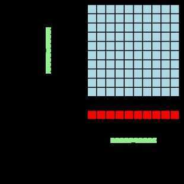

# DRAM

Dynamic random-access memory (DRAM) is a type of [random access](https://en.wikipedia.org/wiki/Random-access_memory)[semiconductor memory](https://en.wikipedia.org/wiki/Semiconductor_memory) that stores each [bit](https://en.wikipedia.org/wiki/Bit) of data in a [memory cell](https://en.wikipedia.org/wiki/Memory_cell_(computing)) consisting of a tiny [capacitor](https://en.wikipedia.org/wiki/Capacitor) and a [transistor](https://en.wikipedia.org/wiki/Transistor), both typically based on [metal-oxide-semiconductor](https://en.wikipedia.org/wiki/Metal-oxide-semiconductor)(MOS) technology. The capacitor can either be charged or discharged; these two states are taken to represent the two values of a bit, conventionally called 0 and 1. The [electric charge](https://en.wikipedia.org/wiki/Electric_charge) on the capacitors slowly leaks off, so without intervention the data on the chip would soon be lost. To prevent this, DRAM requires an external [memory refresh](https://en.wikipedia.org/wiki/Memory_refresh) circuit which periodically rewrites the data in the capacitors, restoring them to their original charge. This refresh process is the defining characteristic of dynamic random-access memory, in contrast to [static random-access memory](https://en.wikipedia.org/wiki/Static_random-access_memory)(SRAM) which does not require data to be refreshed. Unlike [flash memory](https://en.wikipedia.org/wiki/Flash_memory), DRAM is [volatile memory](https://en.wikipedia.org/wiki/Volatile_memory)(vs.[non-volatile memory](https://en.wikipedia.org/wiki/Non-volatile_memory)), since it loses its data quickly when power is removed. However, DRAM does exhibit limited [data remanence](https://en.wikipedia.org/wiki/Data_remanence).

DRAM typically takes the form of an [integrated circuit](https://en.wikipedia.org/wiki/Integrated_circuit) chip, which can consist of dozens to billions of DRAM memory cells. DRAM chips are widely used in [digital electronics](https://en.wikipedia.org/wiki/Digital_electronics) where low-cost and high-capacity [computer memory](https://en.wikipedia.org/wiki/Computer_memory) is required. One of the largest applications for DRAM is the [main memory](https://en.wikipedia.org/wiki/Main_memory)(colloquially called the "RAM") in modern [computers](https://en.wikipedia.org/wiki/Computer) and [graphics cards](https://en.wikipedia.org/wiki/Graphics_card)(where the "main memory" is called thegraphics memory). It is also used in many portable devices and [video game](https://en.wikipedia.org/wiki/Video_game) consoles. In contrast, SRAM, which is faster and more expensive than DRAM, is typically used where speed is of greater concern than cost and size, such as the [cache memories](https://en.wikipedia.org/wiki/CPU_cache) in [processors](https://en.wikipedia.org/wiki/Central_processing_unit).

Due to its need of a system to perform refreshing, DRAM has more complicated circuitry and timing requirements than SRAM, but it is much more widely used. The advantage of DRAM is the structural simplicity of its [memory cells](https://en.wikipedia.org/wiki/Memory_cell_(computing)): only one [transistor](https://en.wikipedia.org/wiki/Transistor) and a capacitor are required per bit, compared to four or six transistors in SRAM. This allows DRAM to reach very high [densities](https://en.wikipedia.org/wiki/Computer_storage_density), making DRAM much cheaper per bit. The transistors and capacitors used are extremely small; billions can fit on a single memory chip. Due to the dynamic nature of its [memory cells](https://en.wikipedia.org/wiki/Memory_cell_(computing)), DRAM consumes relatively large amounts of power, with different ways for managing the power consumption.
DRAM had a 47% increase in the price-per-bit in 2017, the largest jump in 30 years since the 45% percent jump in 1988, while in recent years the price has been going down.

https://en.wikipedia.org/wiki/Dynamic_random-access_memory

In [dynamic RAM](https://en.wikipedia.org/wiki/Dynamic_RAM)(DRAM), each [bit](https://en.wikipedia.org/wiki/Bit) of stored data occupies a separate memory cell that is electrically implemented with one [capacitor](https://en.wikipedia.org/wiki/Capacitor) and one [transistor](https://en.wikipedia.org/wiki/Transistor). The charge state of a capacitor (charged or discharged) is what determines whether a DRAM cell stores "1" or "0" as a [binary value](https://en.wikipedia.org/wiki/Binary_value). Huge numbers of DRAM memory cells are packed into [integrated circuits](https://en.wikipedia.org/wiki/Integrated_circuit), together with some additional logic that organises the cells for the purposes of reading, writing, and [refreshing](https://en.wikipedia.org/wiki/Memory_refresh) the data.

Memory cells (blue squares in the illustration) are further organised into [matrices](https://en.wikipedia.org/wiki/Matrix_(mathematics)) and addressed through rows and columns. A memory address applied to a matrix is broken into the row address and column address, which are processed by the row and column [address decoders](https://en.wikipedia.org/wiki/Address_decoder)(in the illustration, vertical and horizontal green rectangles, respectively). After a row address selects the row for a read operation (the selection is also known as [row activation](https://en.wikipedia.org/wiki/Row_activation)), bits from all cells in the row are transferred into the [sense amplifiers](https://en.wikipedia.org/wiki/Sense_amplifier) that form the row buffer (red squares in the illustration), from which the exact bit is selected using the column address. Consequently, read operations are of a destructive nature because the design of DRAM requires memory cells to be rewritten after their values have been read by transferring the cell charges into the row buffer. Write operations decode the addresses in a similar way, but as a result of the design entire rows must be rewritten for the value of a single bit to be changed.

As a result of storing data bits using capacitors that have a natural discharge rate, DRAM memory cells lose their state over time and require periodic [rewriting](https://en.wikipedia.org/wiki/Memory_refresh) of all memory cells, which is a process known as refreshing.As another result of the design, DRAM memory is susceptible to random changes in stored data, which are known as [soft memory errors](https://en.wikipedia.org/wiki/Soft_error) and attributed to [cosmic rays](https://en.wikipedia.org/wiki/Cosmic_ray#Effect_on_electronics) and other causes. There are different techniques that counteract soft memory errors and improve the reliability of DRAM, of which [error-correcting code (ECC) memory](https://en.wikipedia.org/wiki/ECC_memory) and its advanced variants (such as [lockstep memory](https://en.wikipedia.org/wiki/Lockstep_memory)) are most commonly used.

A high-level illustration of DRAM organization, which includes [memory cells](https://en.wikipedia.org/wiki/Memory_cell_(computing))(blue squares), [address decoders](https://en.wikipedia.org/wiki/Address_decoder)(green rectangles), and [sense amplifiers](https://en.wikipedia.org/wiki/Sense_amplifier)(red squares)
