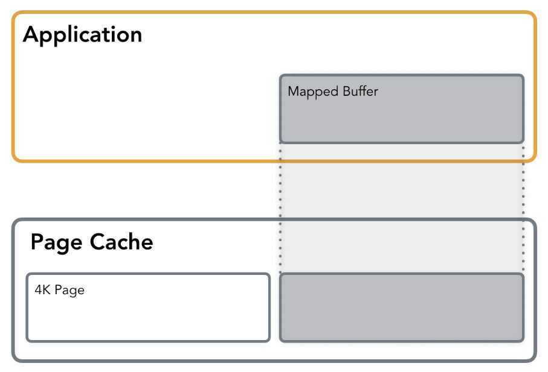

# Memory Mapping mmap

## Memory Mapping (mmap)

Memory mapping ([mmap](http://man7.org/linux/man-pages/man2/mmap.2.html)) allows you to access a file as if it was loaded in memory entirely.It simplies file access and is frequently used by database and application developers.

Memory mapping maps the process virtual pages directly to the Kernel Page Cache, avoiding additional copy from and to user-space buffer as it is done with StandardIO.
Withmmapa file can be mapped to a memory segmentprivatelyor in shared mode. Private mapping allows reading from the file, but any write would trigger copy-on-write of the page in question in order to leave the original page intact and keep the changes private, so none of the changes will get reflected on the file itself. Insharedmode, the file mapping is shared with other processes so they can see updates to the mapped memory segment. Additionally, changes are carried through to the underlying file (precise control over which requires the use of [msync](http://man7.org/linux/man-pages/man2/msync.2.html)).

Unless specified otherwise, file contents are not loaded into memory right away, but in a lazy manner. Space required for the memory mapping is reserved, but is not allocated right away. The first read or write operation results in a page-fault, triggering the allocation of the appropriate page. By passingMAP_POPULATEit is possible to pre-fault the mapped area and force a file read-ahead.

Memory Mapping is done through the page cache, the same way as the Standard IO operations such asreadandwriteand is using a [demand paging](https://en.wikipedia.org/wiki/Demand_paging).

During the first memory access, aPage Faultis issued, which signals the kernel that the requested page is currently not loaded into memory and will have to be loaded. The kernel identifies where which data has to be loaded from. Page Faults are transparent to the developer: The program flow will carry on as if nothing happened. Sometimes, Page Faults may have a negative impact on performance,

It's also possible to map a file into memory with protection flags (for example, in a read-only mode). If an operation on the mapped memory segment violates the requested protection, a Segmentation Faultis issued.

mmapis a very useful tool for working with IO: It avoids creating an extraneous copy of the buffer in memory (unlike Standard IO, where the data has to be copied into the user-space buffers before the system call is made). Besides, it avoids a system call (and subsequent context switch) overhead for triggering actual IO operation, except when Page Faults occur. From a developers perspective, issuing a random read using anmmapped file looks just like a normal pointer operation and doesn't involve [lseek](http://man7.org/linux/man-pages/man2/lseek.2.html) calls.

The disadvantages ofmmapthat are mentioned most of the time are less relevant with modern hardware:

- mmap imposes overhead of the kernel data structures required for managing the memory mappings: In today's realities and memory sizes, this argument does not play a major role.
- Memory-mapped file size limit: Most of the time, the kernel code is much more memory-friendly anyways and 64 bit architectures allow mapping larger files.

Of course, this doesn't imply that everything has to be done with the memory-mapped files.
mmapis quite frequently used by database implementers. For example, the [MongoDB](https://docs.mongodb.com/manual/faq/storage/) default storage engine wasmmap-backed, and [SQLite](https://sqlite.org/mmap.html) is using memory mapping extensively.

## Page Cache Optimizations

From what we discussed so far, it looks like using Standard IO simplifies many things and has some benefits, but at the cost of control loss: you're at the grace of the kernel and the page cache. This is true, but only to a certain extend. Usually, the kernel can do a much better job predicting when to perform a write-back and prefetch pages, using internal statistics. However, sometimes it's possible to help the kernel to manage the page cache in a way that would be beneficial for the application.

One of the ways of informing the kernel about your intentions is using [fadvise](https://linux.die.net/man/2/fadvise). Using the following flags, it is possible to instruct the kernel about your intentions and let it optimize the use of the page cache:

- FADV_SEQUENTIALspecifies that the file is read sequentially, from lower offsets to higher ones, so the kernel can make sure to fetch the pages in advance, before the actual read occurs.
- FADV_RANDOMdisables read-ahead, evicting pages that are unlikely to be accessed any time soon from the page cache.
- FADV_WILLNEEDnotifies the OS that the page will be needed by the process in the near future. This gives the kernel an opportunity to cache the page ahead of time and, when the read operation occurs, to serve it from the page cache instead of page-faulting.
- FADV_DONTNEEDadvises the kernel that it can free the cache for the corresponding pages (making sure that the data is synchronised with the disk beforehand).
- There's one more flag (FADV_NOREUSE), but on Linux it has no effect.

Just as the name suggests, fadviseis only acting advisory. The kernel is not obligated to do exactly as fadvise suggests.

Since database developers often can predict accesses, fadvise issuch a useful tool. For example, [RocksDB uses](https://github.com/facebook/rocksdb/blob/master/env/io_posix.cc#L377-L401) it for notifying the kernel about access patterns, depending on the file type (SSTable or HintFile), mode (Random or Sequential) and operation (Write or Compaction).

Another useful call is [mlock](https://linux.die.net/man/2/mlock).It allows you to force pages to be held in memory. This means that once the page is loaded into memory, all subsequent operations will be served from the page cache. It has to be used with caution, since calling it on every page will simply exhaust the system resources.

## AIO (Linux Asynchronous IO)

AIO is an interface allowing to initiate multiple IO operations and register callbacks that will be triggered on their completion. Operations will be performed asynchronously (e.g. the system call will return immediately). Using async IO helps the application to continue work on the main thread while the submitted IO job is processed.

The two main syscalls responsible for Linux AIO are io_submit and io_getevents. io_submit allows passing one or multiple commands, holding a buffer, offset and an operation that has to be performed. Completions can be queried by usingio_getevents, a call that allows to collect result events for corresponding commands. This allows for a fully asynchronous interface for handling IO, pipelining IO operations and freeing application threads, potentially reducing the amount of context switches and wake-ups.

Unfortunately, Linux AIO has several shortcomings: the syscalls API isn't exposed by the glibc and requires a library for wiring them up [(libaio](https://pagure.io/libaio/commits/master) seems to be the most popular).[Despite several attempts to fix that](https://lwn.net/Articles/671649/), only file descriptors with O_DIRECT flag are supported, so buffered asynchronous operations won't work. Besides, some operations, such asstat, fsync, openand some others aren't fully asynchronous.

It's worth mentioning that Linux AIO shouldn't be confused with [Posix AIO](http://man7.org/linux/man-pages/man7/aio.7.html), which is a different thing altogether. The Posix AIO implementation on Linux is implemented completely in user space and does not use this Linux-specific AIO subsystem at all.

## Vectored IO

One, possibly less popular, method of performing IO operations is Vectored IO (also known as Scatter/Gather). It is called this way because it operates on a vector of buffers and allows reading and writing data to/from disk using multiple buffers per system call.

When performing a vectored read, bytes will be read from the source into the buffer first (up to first buffers's length offset). Then, bytes from the source starting at the first buffer's length and up to the second buffer's length offset will be read into the second buffer and so on, as ifthe source was filling up buffers one after another (although operation order and parallelism are not deterministic). A vectored write works in a similar manner: Buffers will be written as if they were concatenated before the write.

Vectored IO example: userspace buffers of different size are mapped to the contiguous file region, allowing filling up and flushing multiple buffers with a single sys call.

Such an approach can help by allowing reading smaller chunks (therefore avoiding allocation of large memory areas for contiguous blocks) and, at the same time, reducing the amount of system calls required to fill up all these buffers with data from disk. Another advantage is that both reads and writes are atomic: The kernel prevents other processes from performing IO on the same descriptor during read and write operations, guaranteeing data integrity.

From the development perspective, if data is laid out in a certain way in the file (say, it's split out into a fixed-size header and multiple fixed size blocks), it is possible to issue a single call that will fill up separate buffers allocated for these parts.

This sounds rather useful but, somehow, just a few databases use the Vectored IO. This might be because general purpose databases work with a bunch of files simultaneously, trying to guarantee liveness for each running operation and reduce their latencies, so and data is accessed and cached block-wise. Vectored IO is more useful for analytics workloads and/or columnar databases, where the data is stored on disk contiguously, and its processing can be done in parallel in sparse blocks. One of the examples is [Apache Arrow](https://github.com/apache/arrow/blob/master/java/memory/src/main/java/io/netty/buffer/ArrowBuf.java#L26-L27).

## Demand Paging

In [computer](https://en.wikipedia.org/wiki/Computer)[operating systems](https://en.wikipedia.org/wiki/Operating_systems), **demand paging** (as opposed to [anticipatory](https://en.wikipedia.org/wiki/Paging#Page_replacement_techniques) paging) is a method of [virtual memory](https://en.wikipedia.org/wiki/Virtual_memory) management. In a system that uses demand paging, the operating system copies a disk [page](https://en.wikipedia.org/wiki/Paging) into physical memory only if an attempt is made to access it and that page is not already in memory (*i.e.*, if a [page fault](https://en.wikipedia.org/wiki/Page_fault) occurs). It follows that a [process](https://en.wikipedia.org/wiki/Process_(computing)) begins execution with none of its pages in physical memory, and many page faults will occur until most of a process's [working set](https://en.wikipedia.org/wiki/Working_set) of pages are located in physical memory. This is an example of a [lazy loading](https://en.wikipedia.org/wiki/Lazy_loading) technique.

https://en.wikipedia.org/wiki/Demand_paging

## References

https://medium.com/databasss/on-disk-io-part-2-more-flavours-of-io-c945db3edb13

https://www.youtube.com/watch?v=2RYT_ZfrYFk

When you mmap() a 2GB file to load it into memory, does 2GB of RAM get used right away?

- no, the exiting thing about mmap is that you can load a file into memory, but it only actually get reads into memory lazily when you access the memory. So no memory gets used right away.
