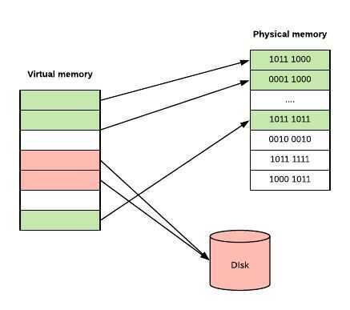

# Memory

## Stack Allocation

The allocation happens on contiguous blocks of memory. We call it stack memory allocation because the allocation happens in function call stack. The size of memory to be allocated is known to compiler and whenever a function is called, its variables get memory allocated on the stack. And whenever the function call is over, the memory for the variables is deallocated. This all happens using some predefined routines in compiler. Programmer does not have to worry about memory allocation and deallocation of stack variables.

## Heap Allocation

The memory is allocated during execution of instructions written by programmers. Note that the name heap has nothing to do with heap data structure. It is called heap because it is a pile of memory space available to programmers to allocated and de-allocate. If a programmer does not handle this memory well, [memory leak](https://www.geeksforgeeks.org/what-is-memory-leak-how-can-we-avoid/) can happen in the program.

## Heap

Heapis the portion of memory wheredynamically allocated memory resides (i.e. memory allocated via **malloc**). Memory allocated from the heap will remain allocated until one of the following occurs:

1. The memory isfree'd

2. The program terminates
If all references to allocated memory are lost (e.g. you don't store a pointer to it anymore), you have what is called amemory leak. This is where the memory has still been allocated, but you have no easy way of accessing it anymore. Leaked memory cannot be reclaimed for future memory allocations, but when the program ends the memory will be free'd up by the operating system.
Contrast this withstackmemory which is where local variables (those defined within a method) live. Memory allocated on the stack generally only lives until the function returns (there are some exceptions to this, e.g. static local variables).

## Key Differences Between Stack and Heap Allocations

1. In a stack, the allocation and deallocation is automatically done by whereas, in heap, it needs to be done by the programmer manually.
2. Handling of Heap frame is costlier than handling of stack frame.
3. Memory shortage problem is more likely to happen in stack whereas the main issue in heap memory is fragmentation.
4. Stack frame access is easier than the heap frame as the stack have small region of memory and is cache friendly, but in case of heap frames which are dispersed throughout the memory so it cause more cache misses.
5. Stack is not flexible, the memory size allotted cannot be changed whereas a heap is flexible, and the allotted memory can be altered.
6. Accessing time of heap takes is more than a stack.

## Comparison Chart

| PARAMETER                   | STACK                                      | HEAP                                     |
|--------------------|---------------------------|--------------------------|
| Basic                       | Memory is allocated in a contiguous block. | Memory is allocated in any random order. |
| Allocation and Deallocation | Automatic by compiler instructions.        | Manual by programmer.                    |
| Cost                        | Less                                       | More                                     |
| Implementation              | Hard                                       | Easy                                     |
| Access time                 | Faster                                     | Slower                                   |
| Main Issue                  | Shortage of memory                         | Memory fragmentation                     |
| Locality of reference       | Excellent                                  | Adequate                                 |
| Flexibility                 | Fixed size                                 | Resizing is possible                     |

## Virtual Memory Size(VSZ)

Is all memory that the process can access, including memory that is swapped out, memory that is allocated, but not used, and memory that is from shared libraries.

**Address space allocated - this has addresses allocated in the process's memory map, but there isn't necessarily any actual memory behind it all right now**

## Resident Set Size(RSS)

Is number of memory pages the process has in real memory multiplied by pagesize. This excludes swapped out memory pages.

## Physically resident memory - this is currently occupying space in the machine's physical memory

## TOP command

- %MEM is directly related to RES, it's the percentage use of total physical memory by the process
- VIRT is the total memory that this process has access to shared memory, mapped pages, swapped out pages, etc
- RES is the total physical memory used shared or private that the process has access to
- SHR is the total physical shared memory that the process has access to
- DATA is the total private memory mapped to process physical or not
- CODE also known as "textresident set" is total physical memory used to load application code

So, to sum up, **RES** is most close to the memory used by the process in memory, excluding what's swapped out. but keep in mind that includes the **SHR** (shared physical memory) which mean it could have been used by some other process as well.

## Utilities

```bash
cat /proc/meminfo

free

top
```

## Memory Management

As computers typically are running multiple tasks, reading and writing directly from/to physical memory is a bad idea. Imagine how easy is to write a program, which reads all the stuff (including your passwords) out of memory or a program, which would write at different program's memory addresses.

So, instead of doing things with Physical Memory we have a concept ofVirtual Memory. When your program runs, it only sees it's memory and it thinks that it's the only one in here. Also, not all of your program's stored memory bytes could be in RAM. If you don't access specific memory block often enough, Operating System can put some block of memory into slower storage (like disk) saving precious RAM. And OS won't even admit to your application that OS did it. But we all know that OS did it.



Virtual memory can be implemented usingSegmentationorPage tablesbased on your CPU architecture and OS. Page tables are way more common than segmentation.

In Paged Virtual Memory, we divide virtual memory into blocks, calledPages. Pages can vary in size based on hardware, but usually pages are4-64 KB, often with the capability to use huge pages from2 MB to 1 GB. The division into blocks is useful as it would require a lot more memory to manage each memory slot individually and would slow down performance of your computer.

In order to implement Paged Virtual Memory, there is a chip calledMemory Management Unit (MMU), which sits between CPU and your memory. MMU holds mapping from virtual address to physical address in a table (which it stores in memory) calledPage Table, containing onePage Table Entry (PTE)per page. Also MMU has a physical cache calledTranslation Lookaside Buffer (TLB), which store recent translations from Virtual Memory to Physical. Schematically it looks like this:


So let's say OS decides to put some virtual memory page into disk and your program tries to access it. This process looks like this:

1. CPU issues a command to access the virtual address, MMU check's it in it's Page Table and prohibits access, because no Physical RAM has been allocated to that virtual page.
2. Then MMU sends a Page Fault to the CPU.
3. The Operating System then handles the Page fault, by finding a spare memory block of RAM (called frame) and setting up new PTE (Page Table Entry) to map it.
4. If no RAM is free, it may choose an existing page, using some replacement algorithm, and save it to disk (this process is called paging).
5. With some Memory Management Units, there can also be a shortage of Page Table Entrys, in which case the OS will have to free one for the new mapping.

Operating systems usually manages multiple applications(processes) so the whole memory management bit looks like this:


Each process has one linear virtual address space, with addresses running from0 to some huge maximum. Virtual address space doesn't need to be contiguous, so that not all of these virtual addresses are actually used to store data and they don't consume space in RAM or disk. What's really cool about this is that the same frame of real memory can back multiple virtual pages belonging to multiple processes.

[https://povilasv.me/go-memory-management/#](https://povilasv.me/go-memory-management/)

Memory management is the functionality of an operating system which handles or manages primary memory. It moves processes back and forth between the main memory and the disk during execution.

Memory management keeps track of each and every memory location, regardless of whether it is allocated to some process or free. It checks how much memory is to be allocated to processes. It decides which process will get memory at what time. And it tracks whenever memory gets freed up or unallocated, and correspondingly updates the status.

The process address spaceis the set of logical addresses that a process references in its code. For example, when 32-bit addressing is in use, addresses can range from 0 to 0x7fffffff; that is, ²³¹ possible numbers, for a total theoretical size of 2 gigabytes.

The operating system takes care of mapping the logical addresses to physical addresses at the time of memory allocation to the program. There are three types of addresses used in a program before and after memory is allocated:

- **Symbolic addresses:** The addresses used in a source code. The variable names, constants, and instruction labels are the basic elements of the symbolic address space.
- **Relative addresses:** At the time of compilation, a compiler converts symbolic addresses into relative addresses.
- **Physical addresses:** The loader generates these addresses at the time when a program is loaded into main memory.

Virtual and physical addresses are the same in compile-time and load-time address binding schemes. Virtual and physical addresses differ in execution-time address-binding schemes.

The set of all logical addresses generated by a program is referred to as alogical address space. The set of all physical addresses corresponding to these logical addresses is referred to as aphysical address space.

## Memory Management Unit (MMU)

A memory management unit(MMU), sometimes calledpaged memory management unit(PMMU), is a [computer hardware](https://en.wikipedia.org/wiki/Computer_hardware) unit having all [memory](https://en.wikipedia.org/wiki/Computer_memory) references passed through itself, primarily performing the translation of [virtual memory addresses](https://en.wikipedia.org/wiki/Virtual_address) to [physical addresses](https://en.wikipedia.org/wiki/Physical_address).

An MMU effectively performs [virtual memory](https://en.wikipedia.org/wiki/Virtual_memory) management, handling at the same time [memory protection](https://en.wikipedia.org/wiki/Memory_protection), [cache](https://en.wikipedia.org/wiki/CPU_cache) control, [bus](https://en.wikipedia.org/wiki/Computer_bus)[arbitration](https://en.wikipedia.org/wiki/Arbiter_(electronics)) and, in simpler computer architectures (especially [8-bit](https://en.wikipedia.org/wiki/8-bit) systems), [bank switching](https://en.wikipedia.org/wiki/Bank_switching).

Memory management is a form of [resource management](https://en.wikipedia.org/wiki/Resource_management_(computing)) applied to [computer memory](https://en.wikipedia.org/wiki/Computer_memory). The essential requirement of memory management is to provide ways to dynamically allocate portions of memory to programs at their request, and free it for reuse when no longer needed. This is critical to any advanced computer system where more than a single [process](https://en.wikipedia.org/wiki/Process_(computing)) might be underway at any time

Several methods have been devised that increase the effectiveness of memory management.[Virtual memory](https://en.wikipedia.org/wiki/Virtual_memory) systems separate the memory addresses used by a process from actual physical addresses, allowing separation of processes and increasing the size of the [virtual address space](https://en.wikipedia.org/wiki/Virtual_address_space) beyond the available amount of [RAM](https://en.wikipedia.org/wiki/Random-access_memory) using [paging](https://en.wikipedia.org/wiki/Paging) or swapping to [secondary storage](https://en.wikipedia.org/wiki/Secondary_storage). The quality of the virtual memory manager can have an extensive effect on overall system performance.

Application-level memory management is generally categorized as either automatic memory management, usually involving [garbage collection](https://en.wikipedia.org/wiki/Garbage_collection_(computer_science)), or [manual memory management](https://en.wikipedia.org/wiki/Manual_memory_management).

[https://en.wikipedia.org/wiki/Memory_management](https://en.wikipedia.org/wiki/Memory_management#HEAP)

https://gceasy.io

## Memory Hierarchy

- **[Processor registers](https://en.wikipedia.org/wiki/Processor_register)--** the fastest possible access (usually 1 CPU cycle). A few thousand bytes in size
- [**Cache**](https://en.wikipedia.org/wiki/CPU_cache)
    - Level 0 (L0)[Micro operations](https://en.wikipedia.org/wiki/Micro-operation) cache -- 6 [KiB](https://en.wikipedia.org/wiki/KiB) in size
    - Level 1 (L1)[Instruction](https://en.wikipedia.org/wiki/Opcode) cache -- 128 KiB in size
    - Level 1 (L1) Data cache -- 128 KiB in size. Best access speed is around 700 [GiB](https://en.wikipedia.org/wiki/GiB)/second
    - Level 2 (L2) Instruction and data (shared) -- 1 [MiB](https://en.wikipedia.org/wiki/MiB) in size. Best access speed is around 200 GiB/second
    - Level 3 (L3) Shared cache -- 6 MiB in size. Best access speed is around 100 GB/second
    - Level 4 (L4) Shared cache -- 128 MiB in size. Best access speed is around 40 GB/second
- **[Main memory](https://en.wikipedia.org/wiki/Computer_memory)([Primary storage](https://en.wikipedia.org/wiki/Primary_storage)) --**[Gigabytes](https://en.wikipedia.org/wiki/GiB) in size. Best access speed is around 10 GB/second.In the case of a [NUMA](https://en.wikipedia.org/wiki/Non-Uniform_Memory_Access) machine, access times may not be uniform
- **[Disk storage](https://en.wikipedia.org/wiki/Disk_storage)([Secondary storage](https://en.wikipedia.org/wiki/Secondary_storage)) --**[Terabytes](https://en.wikipedia.org/wiki/TiB) in size. As of 2017, best access speed is from a consumer [solid state drive](https://en.wikipedia.org/wiki/Solid-state_drive) is about 2000 MB/second
- **[Nearline storage](https://en.wikipedia.org/wiki/Nearline_storage)([Tertiary storage](https://en.wikipedia.org/wiki/Tertiary_storage)) --** Up to [exabytes](https://en.wikipedia.org/wiki/Exabytes) in size. As of 2013, best access speed is about 160 MB/second
- [**Offline storage**](https://en.wikipedia.org/wiki/Offline_storage)

The lower levels of the hierarchy -- from disks downwards -- are also known as [tiered storage](https://en.wikipedia.org/wiki/Tiered_storage). The formal distinction between online, nearline, and offline storage is:

- Online storage is immediately available for I/O.
- Nearline storage is not immediately available, but can be made online quickly without human intervention
- Offline storage is not immediately available, and requires some human intervention to bring online.

https://en.wikipedia.org/wiki/Memory_hierarchy

https://www.thegeekstuff.com/2012/02/linux-memory-swap-cache-shared-vm

## Transparent Huge Pages (THP)

Transparent Huge Pages (THP) is a Linux memory management system that reduces the overhead of Translation Lookaside Buffer (TLB) lookups on machines with large amounts of memory by using larger memory pages.

A **compressible resource** can be throttled, but an impressible resource - not so much. For example, CPU is considered compressible and memory is incompressible.

CPU is considered a "compressible" resource. If your app starts hitting your CPU limits, Kubernetes starts throttling your container. This means the CPU will be artificially restricted, giving your app potentially worse performance! However, it won't be terminated or evicted. You can use a [liveness health check](https://cloudplatform.googleblog.com/2018/05/Kubernetes-best-practices-Setting-up-health-checks-with-readiness-and-liveness-probes.html) to make sure performance has not been impacted.

- **[Disk Cache memory](http://en.wikipedia.org/wiki/Page_cache):** This are chunks of the physical memory, the RAM, used to store files. That way when a program needs to read the file, it's fetched from memory instead of the hard disk. This is done because memory is way faster.

- **[Swap](http://en.wikipedia.org/wiki/Paging):** This is a place on the hard disk (usually a dedicated partition) that is used to store programs or data that can't fit in memory, like when a program grows more than the available memory. SWAP is way slower than RAM, so when you hit swap the computer gets slower, but at least the program can work. In linux swap is also used to hibernate, or to move low used program out of memory to allow more space to the disk cache.


