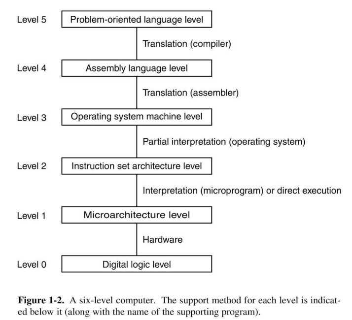
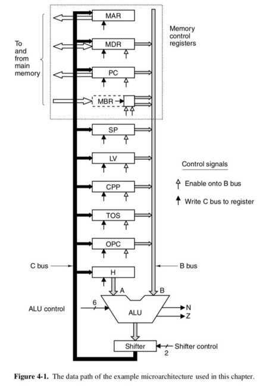
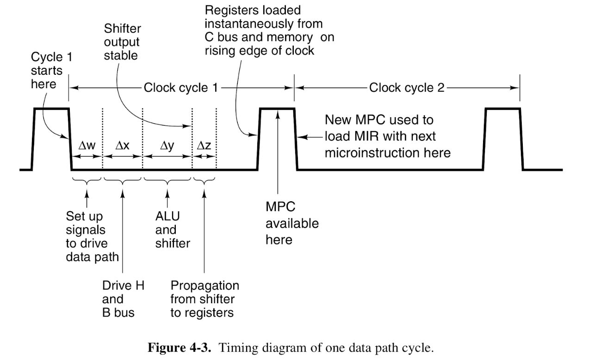
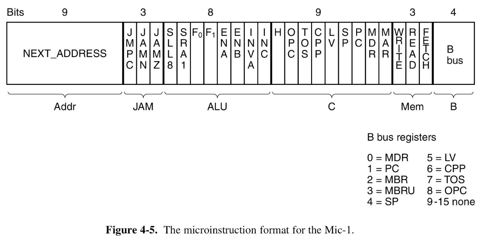
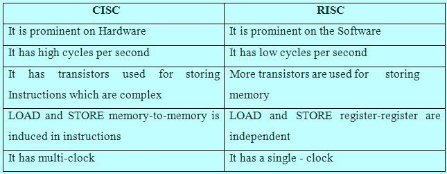

# Microprocessor

## Course - NPTEL - IIT-Guwahati, by Dr. John Jose

## Multilevel Machine Architecture

## Data Path

## Data Path Timing

## Microinstructions

## Two types of CPU architecture

1. RISC Architecture
2. CISC Architecture

## RISC & CISC Comparison

## ARM - Advanced RISC Machine

## IBM MainFrame

A mainframe is a large computer that runs critical business applications requiring a significant amount of processing power. Banks and other large organizations often require this computing power for data processing, transactions, and enterprise apps, exceeding the demands of a server.  Organizations migrate their legacy on-premises mainframes to modern cloud infrastructure to increase usability, scalability, and reduce operational costs.

IBM mainframe prices vary widely based on configuration, ranging from **roughly $100,000 for entry-level models to over $4 million for enterprise-level systems**. Costs are highly customized and negotiated, often exceeding millions when factoring in processors, storage, and specialized software, with significant discounts common.

- [What Is a Mainframe? \| IBM](https://www.ibm.com/think/topics/mainframe)
- [What is a Mainframe - Mainframe Explained - AWS](https://aws.amazon.com/what-is/mainframe/)

## References

https://www.edgefxkits.com/blog/what-is-risc-and-cisc-architecture
