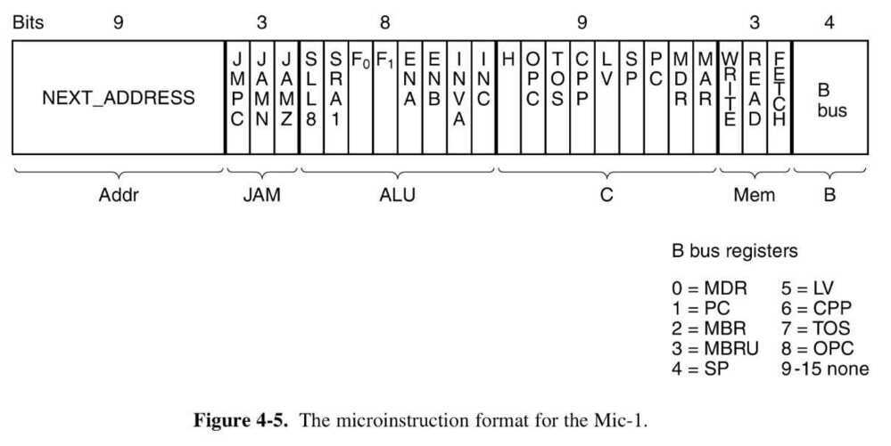
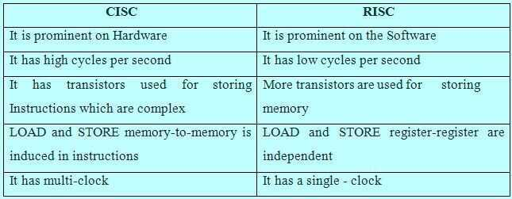

# Microprocessor

## Course - NPTEL - IIT-Guwahati, by Dr. John Jose

## Multilevel Machine Architecture

## Data Path

## Data Path Timing

## Microinstructions

## Two types of CPU architecture

1. RISC Architecture
2. CISC Architecture

## RISC & CISC Comparison

## ARM - Advanced RISC Machine

## References

https://www.edgefxkits.com/blog/what-is-risc-and-cisc-architecture
