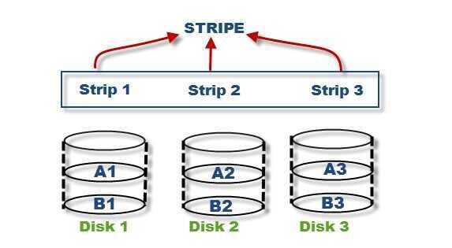
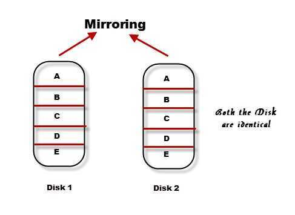
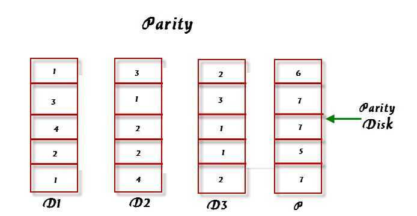

# RAID

RAID (Redundant Array of Inexpensive Disks or Drives, or Redundant Array of Independent Disks) is a data [storage virtualization](https://en.wikipedia.org/wiki/Storage_virtualization) technology that combines multiple physical [disk drive](https://en.wikipedia.org/wiki/Disk_drive) components into one or more logical units for the purposes of [data redundancy](https://en.wikipedia.org/wiki/Data_redundancy), performance improvement, or both. This was in contrast to the previous concept of highly reliable mainframe disk drives referred to as "single large expensive disk" (SLED).

Data is distributed across the drives in one of several ways, referred to as RAID levels, depending on the required level of [redundancy](https://en.wikipedia.org/wiki/Redundancy_(engineering)) and performance. The different schemes, or data distribution layouts, are named by the word "RAID" followed by a number, for example RAID0 or RAID1. Each scheme, or RAID level, provides a different balance among the key goals:[reliability](https://en.wikipedia.org/wiki/Reliability_engineering), [availability](https://en.wikipedia.org/wiki/Availability), [performance](https://en.wikipedia.org/wiki/Computer_performance), and [capacity](https://en.wikipedia.org/wiki/Computer_data_storage#Capacity). RAID levels greater than RAID0 provide protection against unrecoverable [sector](https://en.wikipedia.org/wiki/Disk_sector) read errors, as well as against failures of whole physical drives.

Many RAID levels employ an error protection scheme called "[parity](https://en.wikipedia.org/wiki/Parity_bit)", a widely used method in information technology to provide [fault tolerance](https://en.wikipedia.org/wiki/Fault_tolerance) in a given set of data. Most use simple [XOR](https://en.wikipedia.org/wiki/Exclusive_or), but RAID6 uses two separate parities based respectively on addition and multiplication in a particular [Galois field](https://en.wikipedia.org/wiki/Galois_field) or [Reed--Solomon error correction](https://en.wikipedia.org/wiki/Reed%E2%80%93Solomon_error_correction).

RAID can also provide data security with [solid-state drives](https://en.wikipedia.org/wiki/Solid-state_drive)(SSDs) without the expense of an all-SSD system. For example, a fast SSD can be mirrored with a mechanical drive. For this configuration to provide a significant speed advantage an appropriate controller is needed that uses the fast SSD for all read operations.[Adaptec](https://en.wikipedia.org/wiki/Adaptec) calls this "hybrid RAID".

## Standard levels

A number of standard schemes have evolved. These are calledlevels. Originally, there were five RAID levels, but many variations have evolved, notably several [nested levels](https://en.wikipedia.org/wiki/Nested_RAID_levels) and many [non-standard levels](https://en.wikipedia.org/wiki/Non-standard_RAID_levels)(mostly [proprietary](https://en.wikipedia.org/wiki/Proprietary_software)). RAID levels and their associated data formats are standardized by the [Storage Networking Industry Association](https://en.wikipedia.org/wiki/Storage_Networking_Industry_Association)(SNIA) in the Common RAID Disk Drive Format (DDF) standard:

## RAID0

[RAID0](https://en.wikipedia.org/wiki/RAID_0) consists of [striping](https://en.wikipedia.org/wiki/Data_striping), but no [mirroring](https://en.wikipedia.org/wiki/Disk_mirroring) or [parity](https://en.wikipedia.org/wiki/Parity_bit). Compared to a [spanned volume](https://en.wikipedia.org/wiki/Spanned_volume), thecapacityof a RAID0 volume is the same; it is the sum of the capacities of the disks in the set. But because striping distributes the contents ofeachfile amongalldisks in the set, the failure of any disk causesallfiles, the entire RAID0 volume, to be lost. A broken spanned volume at least preserves the files on the unfailing disks. The benefit of RAID0 is that the [throughput](https://en.wikipedia.org/wiki/Throughput) of read and write operations to any file is multiplied by the number of disks because, unlike spanned volumes, reads and writes are done [concurrently](https://en.wikipedia.org/wiki/Concurrency_(computer_science)), and the cost is complete vulnerability to drive failures. Indeed, the average failure rate is worse than that of an equivalent single non-RAID drive.

## RAID1

[RAID1](https://en.wikipedia.org/wiki/RAID_1) consists of data mirroring, without parity or striping. Data is written identically to two drives, thereby producing a "mirrored set" of drives. Thus, any read request can be serviced by any drive in the set. If a request is broadcast to every drive in the set, it can be serviced by the drive that accesses the data first (depending on its [seek time](https://en.wikipedia.org/wiki/Seek_time) and [rotational latency](https://en.wikipedia.org/wiki/Rotational_latency)), improving performance. Sustained read throughput, if the controller or software is optimized for it, approaches the sum of throughputs of every drive in the set, just as for RAID0. Actual read throughput of most RAID1 implementations is slower than the fastest drive. Write throughput is always slower because every drive must be updated, and the slowest drive limits the write performance. The array continues to operate as long as at least one drive is functioning.

## RAID2

[RAID2](https://en.wikipedia.org/wiki/RAID_2) consists of bit-level striping with dedicated [Hamming-code](https://en.wikipedia.org/wiki/Hamming_code) parity. All disk spindle rotation is synchronized and data is [striped](https://en.wikipedia.org/wiki/Data_striping) such that each sequential [bit](https://en.wikipedia.org/wiki/Bit) is on a different drive. Hamming-code parity is calculated across corresponding bits and stored on at least one parity drive.This level is of historical significance only; although it was used on some early machines (for example, the [Thinking Machines](https://en.wikipedia.org/wiki/Thinking_Machines_Corporation) CM-2), as of 2014it is not used by any commercially available system.

## RAID3

[RAID3](https://en.wikipedia.org/wiki/RAID_3) consists of byte-level striping with dedicated parity. All disk spindle rotation is synchronized and data is striped such that each sequential [byte](https://en.wikipedia.org/wiki/Byte) is on a different drive. Parity is calculated across corresponding bytes and stored on a dedicated parity drive.Although implementations exist, RAID3 is not commonly used in practice.

## RAID4

[RAID4](https://en.wikipedia.org/wiki/RAID_4) consists of block-level striping with dedicated parity. This level was previously used by [NetApp](https://en.wikipedia.org/wiki/NetApp), but has now been largely replaced by a proprietary implementation of RAID4 with two parity disks, called [RAID-DP](https://en.wikipedia.org/wiki/RAID-DP). The main advantage of RAID4 over RAID2 and 3 is I/O parallelism: in RAID2 and 3, a single read I/O operation requires reading the whole group of data drives, while in RAID4 one I/O read operation does not have to spread across all data drives. As a result, more I/O operations can be executed in parallel, improving the performance of small transfers.

## RAID5

[RAID5](https://en.wikipedia.org/wiki/RAID_5) consists of block-level striping with distributed parity. Unlike RAID4, parity information is distributed among the drives, requiring all drives but one to be present to operate. Upon failure of a single drive, subsequent reads can be calculated from the distributed parity such that no data is lost. RAID5 requires at least three disks.Like all single-parity concepts, large RAID5 implementations are susceptible to system failures because of trends regarding array rebuild time and the chance of drive failure during rebuild (see "[Increasing rebuild time and failure probability](https://en.wikipedia.org/wiki/RAID#Increasing_rebuild_time_and_failure_probability)" section, below).Rebuilding an array requires reading all data from all disks, opening a chance for a second drive failure and the loss of the entire array.

## RAID6

[RAID6](https://en.wikipedia.org/wiki/RAID_6) consists of block-level striping with double distributed parity. Double parity provides fault tolerance up to two failed drives. This makes larger RAID groups more practical, especially for high-availability systems, as large-capacity drives take longer to restore. RAID6 requires a minimum of four disks. As with RAID5, a single drive failure results in reduced performance of the entire array until the failed drive has been replaced.With a RAID6 array, using drives from multiple sources and manufacturers, it is possible to mitigate most of the problems associated with RAID5. The larger the drive capacities and the larger the array size, the more important it becomes to choose RAID6 instead of RAID5.RAID10 also minimizes these problems.

## Nested (hybrid) RAID

In what was originally termedhybrid RAID, many storage controllers allow RAID levels to be nested. The elements of aRAIDmay be either individual drives or arrays themselves. Arrays are rarely nested more than one level deep.

The final array is known as the top array. When the top array is RAID0 (such as in RAID1+0 and RAID5+0), most vendors omit the "+" (yielding [RAID10](https://en.wikipedia.org/wiki/RAID_10) and RAID50, respectively).

### RAID0+1

Creates two stripes and mirrors them. If a single drive failure occurs then one of the stripes has failed, at this point it is running effectively as RAID 0 with no redundancy. Significantly higher risk is introduced during a rebuild than RAID 1+0 as all the data from all the drives in the remaining stripe has to be read rather than just from one drive, increasing the chance of an unrecoverable read error (URE) and significantly extending the rebuild window.

### RAID1+0 (see:[RAID10](https://en.wikipedia.org/wiki/RAID_10))

Creates a striped set from a series of mirrored drives. The array can sustain multiple drive losses so long as no mirror loses all its drives.

RAID 10 is a nested RAID system created by combining RAID 1 and RAID 0. The combination is known as a stripe of mirrors.

### [JBOD](https://en.wikipedia.org/wiki/JBOD) RAID N+N

With **JBOD (just a bunch of disks)**, it is possible to concatenate disks, but also volumes such as RAID sets. With larger drive capacities, write delay and rebuilding time increase dramatically (especially, as described above, with RAID 5 and RAID 6). By splitting a larger RAID N set into smaller subsets and concatenating them with linear JBOD, write and rebuilding time will be reduced. If a hardware RAID controller is not capable of nesting linear JBOD with RAID N, then linear JBOD can be achieved with OS-level software RAID in combination with separate RAID N subset volumes created within one, or more, hardware RAID controller(s). Besides a drastic speed increase, this also provides a substantial advantage: the possibility to start a linear JBOD with a small set of disks and to be able to expand the total set with disks of different size, later on (in time, disks of bigger size become available on the market). There is another advantage in the form of disaster recovery (if a RAID N subset happens to fail, then the data on the other RAID N subsets is not lost, reducing restore time).

## Non-standard levels

Many configurations other than the basic numbered RAID levels are possible, and many companies, organizations, and groups have created their own non-standard configurations, in many cases designed to meet the specialized needs of a small niche group. Such configurations include the following:

- [Linux MD RAID 10](https://en.wikipedia.org/wiki/Linux_MD_RAID_10) provides a general RAID driver that in its "near" layout defaults to a standard RAID1 with two drives, and a standard RAID1+0 with four drives; however, it can include any number of drives, including odd numbers. With its "far" layout, MD RAID10 can run both striped and mirrored, even with only two drives inf2layout; this runs mirroring with striped reads, giving the read performance of RAID0. Regular RAID1, as provided by [Linux software RAID](https://en.wikipedia.org/wiki/Linux_software_RAID), does not stripe reads, but can perform reads in parallel.
- [Hadoop](https://en.wikipedia.org/wiki/Hadoop) has a RAID system that generates a parity file by xor-ing a stripe of blocks in a single HDFS file.
- [BeeGFS](https://en.wikipedia.org/wiki/BeeGFS), the parallel file system, has internal striping (comparable to file-based RAID0) and replication (comparable to file-based RAID10) options to aggregate throughput and capacity of multiple servers and is typically based on top of an underlying RAID to make disk failures transparent.

## Implementations

1. Hardware based
2. Software based
3. Firmware and driver based

## Integrity

[Data scrubbing](https://en.wikipedia.org/wiki/Data_scrubbing)(referred to in some environments aspatrol read) involves periodic reading and checking by the RAID controller of all the blocks in an array, including those not otherwise accessed. This detects bad blocks before use.Data scrubbing checks for bad blocks on each storage device in an array, but also uses the redundancy of the array to recover bad blocks on a single drive and to reassign the recovered data to spare blocks elsewhere on the drive.

## Weaknesses

1. Correlated failures
2. Unrecoverable read errors during rebuild
3. Increasing rebuild time and failure probability
4. Atomicity: including parity inconsistency due to system crashes
5. Write-cache reliability

https://en.wikipedia.org/wiki/RAID

## Striping

We all know that, RAID is collection of multiple disk'sand in these disk predefined number of contiguously addressable disk blocks are defined which are called asstripsand collection of such strips in aligned in multiple disk is called stripe.

Suppose you have [hard disk](https://www.storagetutorials.com/add-storage-vm-host-without-reboot/), which is a collection of multiple addressable block and these blocks are stacked together and called strip and you have multiple such hard disk, which are place parallel or serially. Then such combination of disk is called stripe.

Note: Without mirroring and parity, Striped RAID cannot protect data but striping may significantly improve I/O performance.

## Mirroring

Mirroring is very simple to understand and one of the most reliable way of data protection. In this technique, you just make amirror copy of diskwhich you want to protect and in this way you have two copies of data. In the time of failure, the controller use second disk to serve the data, thus making data availability continuous.

When the failed disk is replaced with a new disk, the controller copies the data from the surviving disk of themirrored pair. Data is simultaneously recorded on both the disk. Though this type of RAID gives you highest availability of data but it is costly as it requires double amount of disk space and thus increasing the cost.

## Parity

As explained above, mirroring involves high cost, so to protect the data new technique is used with striping called parity. This is reliable andlow cost solution for data protection. In this method and additional HDD or disk is added to the stripe width to hold parity bit.

Parity is a redundancy check that ensures full protection of data without maintaining a full set of duplicate data.

The parity bits are used to re-create the data at the time of failure. Parity information can be stored on separate, dedicated HDDsor distributed across all the drives in a RAID set. In the above image, parity is stored on a separate disk.

The first three disks, labeled D, contain the data. The fourth disk, labeled P, stores the parity information, which in this case is the sum of the elements in each row. Now, if one of the Disks (D) fails, the missing value can be calculated by subtracting the sum of the rest of the elements from the parity value.

https://www.storagetutorials.com/understanding-concept-striping-mirroring-parity

## JBOD

### Just a Bunch Of Disks

JBOD (stands for "Just a Bunch Of Disks") is referred as the collection of hard disks with one single storage enclosure that are not configured to acts as [Redundant Array of Independent Disks (RAID array)](https://www.geeksforgeeks.org/raid-redundant-arrays-of-independent-disks/). The multiple disks in array are connected to a single server that provides higher storage capacity.

JBODs make the disk appear to be single one by combining all the disks. Like in RAID system the data is stored redundantly in multiple disks which appear as single disk in operating system.

### Advantages of JBOD

Some possible benefits from JBOD are :

- JBOD helps in minimizing data loss, e.g. we can combine 10GB drive and 40GB drive to get a 50GB volume from JBOD. It’s a very small advantage as there may be a issue while expanding the existing system provided nowadays drives are cheap.
- With JBOD we may recover missing files, if drive falls in JBOD enclosure. This depends on how operating system manages the disk. Considering JBOD recovery can be difficult, it is a negligible disadvantage.
- The SATA disks and controllers are cheap in nature which makes JBOD cost effective as compared to RAID.

### Disadvantages in JBOD

- With multiple drives acting, there is no increase in drive performance.
- If by mistake any disk is lost, you should search for backups. If there is no backup the data is permanently gone.

### JBOD v/s RAID

JBOD and RAID are the two major data storage configurations. Some differences & similarities between JBOD & RAID includes:

### Similarity

1. Both are applicable on data storage.
2. Both JBOD and RAID enhance the usage of disk space.
3. In RAID data stored in multiple disks which will appear on operating systems like a single disk, similarly in case of JBOD also the disks are displayed on operating system like a single disk.

### Difference

1. RAID are comparatively expensive than JBOD as RAID uses components like [SATA disks](https://www.geeksforgeeks.org/sata-full-form/) and controllers which are highly priced.
2. JBOD allows room for combination of drives of mixed sizes while RAID configurations allow only similar sized disks to be used in array.
3. Mostly JBOD are preferred over RAID as they are easily to scale which is done by just adding another drive.
4. RAID has certain features like supporting hard disk failure, enhancing performance, which are missing in JBOD.

### Which configuration is right for you ?

If there is a need of huge amount of local storage for a application, JBOD should be chosen. With NVME SSDs, JBOD jobs are fast in nature. In RAID there is limited data storage as data undergo parity. In case of RAID, RAID 0 is the only level where total storage capacity is preserved, but we have to lose all data from each drive while removing disk drives from RAID 0. RAIDs are more expensive and if any drive dies in RAID array it will take long time to rebuilt. So, with all this in view JBOD might be a right choice for you which allow easy swaps, fast read and write speeds, more data storage etc.

[Overview of Just a Bunch Of Disks (JBOD) - GeeksforGeeks](https://www.geeksforgeeks.org/overview-of-just-a-bunch-of-disks-jbod/)

[What is JBOD (Just a Bunch of Disks)?](https://www.techtarget.com/searchstorage/definition/JBOD)

[JBOD vs. RAID: What Are the Differences?](https://www.trentonsystems.com/en-us/resource-hub/blog/jbod-vs-raid-what-are-the-differences)

## Links

- [How to Recover Data from a Failed Hard Drive: A Comprehensive Guide](https://www.linkedin.com/pulse/how-recover-data-from-failed-hard-drive/)
