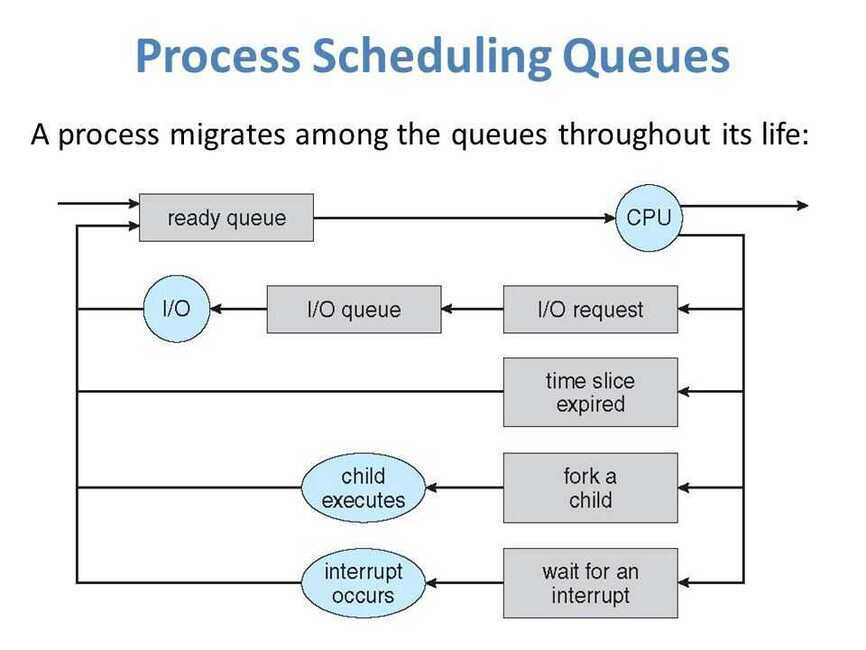

# Scheduling

In [computing](https://en.wikipedia.org/wiki/Computing), schedulingis the method by which work is assigned to resources that complete the work. The work may be virtual computation elements such as [threads](https://en.wikipedia.org/wiki/Thread_(computer_science)), [processes](https://en.wikipedia.org/wiki/Process_(computing)) or data [flows](https://en.wikipedia.org/wiki/Flow_(computer_networking)), which are in turn scheduled onto hardware resources such as [processors](https://en.wikipedia.org/wiki/Central_processing_unit), [network links](https://en.wikipedia.org/wiki/Telecommunications_link) or [expansion cards](https://en.wikipedia.org/wiki/Expansion_card).

A scheduler is what carries out the scheduling activity. Schedulers are often implemented so they keep all computer resources busy (as in [load balancing](https://en.wikipedia.org/wiki/Load_balancing_(computing))), allow multiple users to share system resources effectively, or to achieve a target [quality of service](https://en.wikipedia.org/wiki/Quality_of_service). Scheduling is fundamental to computation itself, and an intrinsic part of the [execution model](https://en.wikipedia.org/wiki/Execution_model) of a computer system; the concept of scheduling makes it possible to have [computer multitasking](https://en.wikipedia.org/wiki/Computer_multitasking) with a single [central processing unit](https://en.wikipedia.org/wiki/Central_processing_unit)(CPU).

The process of scheduling is the responsibility of the process manager that handles the removal of the running process from the CPU and the selection of another process on the basis of a particular strategy.

Process scheduling is an essential part of a Multiprogramming operating system. These operating systems allow more than one process to be loaded into the executable memory at a time, and the loaded process shares the CPU using time multiplexing.

The OS maintains all Process Control Blocks (PCBs) in**Process Scheduling Queues.** The OS maintains a separate queue for each of the process states, and PCBs of all processes in the same execution state are placed in the same queue. When the state of a process is changed, its PCB is unlinked from its current queue and moved to its new state queue.

The Operating System maintains the following important process scheduling queues:

- Job queue: This queue keeps all the processes in the system.
- Ready queue: This queue keeps a set of all processes residing in the main memory, ready and waiting to execute. A new process is always put in this queue.
- Device queues: The processes which are blocked due to unavailability of an I/O device constitute this queue.

The OS can use different policies to manage each queue (FIFO, Round Robin, Priority, etc.). The OS scheduler determines how to move processes between the ready and run queues which can only have one entry per processor core on the system. In the above diagram, it has been merged with the CPU.

Two-state process models refer to running and non-running states:

- Running: When a new process is created, it enters into the system in the running state.
- Not Running: Processes that are not running are kept in queue, waiting for their turn to execute. Each entry in the queue is a pointer to a particular process. Queue is implemented by using a linked list. The use of dispatcher is as follows: when a process is interrupted, that process is transferred in the waiting queue. If the process has completed or aborted, the process is discarded. In either case, the dispatcher then selects a process from the queue to execute.

## Context Switch

A **context switch** is the mechanism that stores and restores the state or context of a CPU in the Process Control block. It allows a process execution to be resumed from the same point at a later time. Using this technique, a context switcher enables multiple processes to share a single CPU. Context switching is an essential feature of a multitasking operating system.
When the scheduler switches the CPU from executing one process to another, the state from the current running process is stored into the process control block. After this, the state for the next process is loaded from its own PCB and used to set the PC, registers, etc. At that point, the second process can start executing.

Context switches are computationally intensive, since register and memory state must be saved and restored. To avoid the amount of context switching time, some hardware systems employ two or more sets of processor registers.

When the process is switched, the following information is stored for later use: Program Counter, Scheduling Information, Base and Limit Register Value, Currently Used Register, Changed State, I/O State Information, and Accounting Information.

## Goals

A scheduler may aim at one or more of many goals, for example: maximizing [throughput](https://en.wikipedia.org/wiki/Throughput) (the total amount of work completed per time unit); minimizing [wait time](https://en.wikipedia.org/wiki/Computer_performance#Response_time)(time from work becoming ready until the first point it begins execution); minimizing [latency](https://en.wikipedia.org/wiki/Latency_(engineering)) or [response time](https://en.wikipedia.org/wiki/Response_time_(technology))(time from work becoming ready until it is finished in case of batch activity, or until the system responds and hands the first output to the user in case of interactive activity); or maximizingfairness(equal CPU time to each process, or more generally appropriate times according to the priority and workload of each process). In practice, these goals often conflict (e.g. throughput versus latency), thus a scheduler will implement a suitable compromise. Preference is measured by any one of the concerns mentioned above, depending upon the user's needs and objectives.

In [real-time](https://en.wikipedia.org/wiki/Real-time_computing) environments, such as [embedded systems](https://en.wikipedia.org/wiki/Embedded_system) for [automatic control](https://en.wikipedia.org/wiki/Automatic_control) in industry (for example [robotics](https://en.wikipedia.org/wiki/Robotics)), the scheduler also must ensure that processes can meet [deadlines](https://en.wikipedia.org/wiki/Time_limit); this is crucial for keeping the system stable. Scheduled tasks can also be distributed to remote devices across a network and [managed](https://en.wikipedia.org/wiki/Device_Management) through an administrative back end.

## Types of schedulers

1. **Process schedulers**

 The process scheduler is a part of the operating system that decides which process runs at a certain point in time. It usually has the ability to pause a running process, move it to the back of the running queue and start a new process; such a scheduler is known as*[preemptive](https://en.wikipedia.org/wiki/Preemption_(computing)) scheduler*, otherwise it is a*[cooperative](https://en.wikipedia.org/wiki/Nonpreemptive_multitasking) scheduler*

2. **Network schedulers**
3. **I/O schedulers**
4. **Job schedulers**

## Scheduling

### Long term scheduling / Admission scheduler / High level scheduler

The long-term scheduler, or admission scheduler, decides which jobs or processes are to be admitted to the ready queue (in main memory); that is, when an attempt is made to execute a program, its admission to the set of currently executing processes is either authorized or delayed by the long-term scheduler. Thus, this scheduler dictates what processes are to run on a system, and the degree of concurrency to be supported at any one time-- whether many or few processes are to be executed concurrently, and how the split between I/O-intensive and CPU-intensive processes is to be handled. The long-term scheduler is responsible for controlling the degree of multiprogramming.

In general, most processes can be described as either**[I/O-bound](https://en.wikipedia.org/wiki/I/O-bound) or [CPU-bound](https://en.wikipedia.org/wiki/CPU-bound) . An I/O-bound process is one that spends more of its time doing I/O than it spends doing computations. A CPU-bound process, in contrast, generates I/O requests infrequently, using more of its time doing computations. It is important that a long-term scheduler selects a good process mix of I/O-bound and CPU-bound processes. If all processes are I/O-bound, the ready queue will almost always be empty, and the short-term scheduler will have little to do. On the other hand, if all processes are CPU-bound, the I/O waiting queue will almost always be empty, devices will go unused, and again the system will be unbalanced. The system with the best performance will thus have a combination of CPU-bound and I/O-bound processes. In modern operating systems, this is used to make sure that real-time processes get enough CPU time to finish their tasks.

### Medium term scheduling

The *medium-term scheduler* temporarily removes processes from main memory and places them in secondary memory (such as a [hard disk drive](https://en.wikipedia.org/wiki/Hard_disk_drive)) or vice versa, which is commonly referred to as "swapping out" or "swapping in" (also incorrectly as "[paging](https://en.wikipedia.org/wiki/Paging) out" or "paging in"). The medium-term scheduler may decide to swap out a process which has not been active for some time, or a process which has a low priority, or a process which is [page faulting](https://en.wikipedia.org/wiki/Page_fault) frequently, or a process which is taking up a large amount of memory in order to free up main memory for other processes, swapping the process back in later when more memory is available, or when the process has been unblocked and is no longer waiting for a resource.

### Short term scheduling

The short-term scheduler (also known as the CPU scheduler) decides which of the ready, in-memory processes is to be executed (allocated a CPU) after a clock [interrupt](https://en.wikipedia.org/wiki/Interrupt), an I/O interrupt, an operating [system call](https://en.wikipedia.org/wiki/System_call) or another form of [signal](https://en.wikipedia.org/wiki/Signal_programming). Thus the short-term scheduler makes scheduling decisions much more frequently than the long-term or mid-term schedulers-- a scheduling decision will at a minimum have to be made after every time slice, and these are very short. This scheduler can be [preemptive](https://en.wikipedia.org/wiki/Preemption_(computing)), implying that it is capable of forcibly removing processes from a CPU when it decides to allocate that CPU to another process, or non-preemptive (also known as "voluntary" or "co-operative"), in which case the scheduler is unable to "force" processes off the CPU.

A preemptive scheduler relies upon a [programmable interval timer](https://en.wikipedia.org/wiki/Programmable_interval_timer) which invokes an [interrupt handler](https://en.wikipedia.org/wiki/Interrupt_handler) that runs in [kernel mode](https://en.wikipedia.org/wiki/Kernel_mode) and implements the scheduling function.

### Dispatcher

Another component that is involved in the CPU-scheduling function is the dispatcher, which is the module that gives control of the CPU to the process selected by the short-term scheduler. It receives control in kernel mode as the result of an interrupt or system call. The functions of a dispatcher mop the following:

- [Context switches](https://en.wikipedia.org/wiki/Context_switch), in which the dispatcher saves the [state](https://en.wikipedia.org/wiki/State_(computer_science))(also known as [context](https://en.wikipedia.org/wiki/Context_(computing))) of the [process](https://en.wikipedia.org/wiki/Process_(computing)) or [thread](https://en.wikipedia.org/wiki/Thread_(computing)) that was previously running; the dispatcher then loads the initial or previously saved state of the new process.
- Switching to user mode.
- Jumping to the proper location in the user program to restart that program indicated by its new state.

The dispatcher should be as fast as possible, since it is invoked during every process switch. During the context switches, the processor is virtually idle for a fraction of time, thus unnecessary context switches should be avoided. The time it takes for the dispatcher to stop one process and start another is known as thedispatch latency.

## Scheduling Disciplines

Scheduling disciplines are algorithms used for distributing resources among parties which simultaneously and asynchronously request them. Scheduling disciplines are used in [routers](https://en.wikipedia.org/wiki/Router_(computing))(to handle packet traffic) as well as in [operating systems](https://en.wikipedia.org/wiki/Operating_system)(to share [CPU time](https://en.wikipedia.org/wiki/CPU_time) among both [threads](https://en.wikipedia.org/wiki/Thread_(computer_science)) and [processes](https://en.wikipedia.org/wiki/Process_(computing))), disk drives ([I/O scheduling](https://en.wikipedia.org/wiki/I/O_scheduling)), printers ([print spooler](https://en.wikipedia.org/wiki/Print_spooler)), most embedded systems, etc.

The main purposes of scheduling algorithms are to minimize [resource starvation](https://en.wikipedia.org/wiki/Resource_starvation) and to ensure fairness amongst the parties utilizing the resources. Scheduling deals with the problem of deciding which of the outstanding requests is to be allocated resources. There are many different scheduling algorithms. In this section, we introduce several of them.

In [packet-switched](https://en.wikipedia.org/wiki/Packet-switched)[computer networks](https://en.wikipedia.org/wiki/Computer_networks) and other [statistical multiplexing](https://en.wikipedia.org/wiki/Statistical_multiplexing), the notion of ascheduling algorithmis used as an alternative to [first-come first-served](https://en.wikipedia.org/wiki/FIFO_(computing_and_electronics)) queuing of data packets.

The simplest best-effort scheduling algorithms are [round-robin](https://en.wikipedia.org/wiki/Round-robin_scheduling), [fair queuing](https://en.wikipedia.org/wiki/Fair_queuing)(a [max-min fair](https://en.wikipedia.org/wiki/Max-min_fair) scheduling algorithm), [proportionally fair](https://en.wikipedia.org/wiki/Proportionally_fair) scheduling and [maximum throughput](https://en.wikipedia.org/wiki/Maximum_throughput_scheduling). If differentiated or guaranteed [quality of service](https://en.wikipedia.org/wiki/Quality_of_service) is offered, as opposed to best-effort communication, [weighted fair queuing](https://en.wikipedia.org/wiki/Weighted_fair_queuing) may be utilized.

1. First come, first served
2. Priority scheduling

    - Earliest Deadline First (EDF) / least time to go - https://en.wikipedia.org/wiki/Earliest_deadline_first_scheduling
    - Deadline-monotonic scheduling

3. Shortest remaining time first
4. Fixed priority pre-emptive scheduling
5. Round-robin scheduling
6. Multilevel queue scheduling
7. Work-conserving schedulers
8. Manual scheduling

A very common method in embedded systems is to schedule jobs manually. This can for example be done in a time-multiplexed fashion. Sometimes the kernel is divided in three or more parts: Manual scheduling, preemptive and interrupt level. Exact methods for scheduling jobs are often proprietary.

- No resource starvation problems
- Very high predictability; allows implementation of hard real-time systems
- Almost no overhead
- May not be optimal for all applications
- Effectiveness is completely dependent on the implementation

## Scheduling Optimization Problems

There are several scheduling problems in which the goal is to decide which job goes to which station at what time, such that the total [makespan](https://en.wikipedia.org/wiki/Makespan) is minimized:

- [Job shop scheduling](https://en.wikipedia.org/wiki/Job_shop_scheduling)-- there arenjobs andmidentical stations. Each job should be executed on a single machine. This is usually regarded as an online problem.
- [Open-shop scheduling](https://en.wikipedia.org/wiki/Open-shop_scheduling)-- there arenjobs andmdifferent stations. Each job should spend some time at each station, in a free order.
- [Flow shop scheduling](https://en.wikipedia.org/wiki/Flow_shop_scheduling)-- there arenjobs andmdifferent stations. Each job should spend some time at each station, in a pre-determined order.

## Schedulers

### SCHED_DEADLINE

is a CPU [scheduler](https://en.wikipedia.org/wiki/Scheduling_(computing)) available in the [Linux kernel](https://en.wikipedia.org/wiki/Linux_kernel) since version 3.14, based on the [Earliest Deadline First (EDF)](https://en.wikipedia.org/wiki/Earliest_deadline_first_scheduling) and Constant Bandwidth Server (CBS) algorithms, supporting resource reservations: each task scheduled under such policy is associated with a *budget* Q (aka *runtime*), and a *period* P, corresponding to a declaration to the kernel that Q time units are required by that task every P time units, on any processor. This makes SCHED_DEADLINE particularly suitable for [real-time](https://en.wikipedia.org/wiki/Real-time_computing) applications, like multimedia or industrial control, where P corresponds to the minimum time elapsing between subsequent activations of the task, and Q corresponds to the worst-case execution time needed by each activation of the task

https://en.wikipedia.org/wiki/SCHED_DEADLINE

https://en.wikipedia.org/wiki/Scheduling_(computing)

## Generic Cell Rate Algorithm

The generic cell rate algorithm (GCRA) is a [leaky bucket](https://en.wikipedia.org/wiki/Leaky_bucket)-type [scheduling algorithm](https://en.wikipedia.org/wiki/Scheduling_algorithm) for the [network scheduler](https://en.wikipedia.org/wiki/Network_scheduler) that is used in [Asynchronous Transfer Mode](https://en.wikipedia.org/wiki/Asynchronous_Transfer_Mode)(ATM) networks.It is used to measure the timing of [cells](https://en.wikipedia.org/wiki/Asynchronous_Transfer_Mode#The_structure_of_an_ATM_cell) on [virtual channels](https://en.wikipedia.org/wiki/Virtual_circuit)(VCs) and or [Virtual Paths](https://en.wikipedia.org/w/index.php?title=Virtual_Paths&action=edit&redlink=1)(VPs) against [bandwidth](https://en.wikipedia.org/wiki/Bandwidth_(signal_processing)) and [jitter](https://en.wikipedia.org/wiki/Jitter) limits contained in a [traffic contract](https://en.wikipedia.org/wiki/Traffic_contract) for the VC or VP to which the cells belong. Cells that do not conform to the limits given by the traffic contract may then be re-timed (delayed) in [traffic shaping](https://en.wikipedia.org/wiki/Traffic_shaping), or may be dropped (discarded) or reduced in priority (demoted) in [traffic policing](https://en.wikipedia.org/wiki/Traffic_policing_(communications)). Nonconforming cells that are reduced in priority may then be dropped, in preference to higher priority cells, by downstream components in the network that are experiencing congestion. Alternatively they may reach their destination (VC or VP termination) if there is enough capacity for them, despite them being excess cells as far as the contract is concerned: see [priority control](https://en.wikipedia.org/w/index.php?title=Priority_control&action=edit&redlink=1).

The GCRA is given as the reference for checking the traffic on connections in the network, i.e.[usage/network parameter control](https://en.wikipedia.org/wiki/UPC_and_NPC)(UPC/NPC) at [user--network interfaces](https://en.wikipedia.org/wiki/User%E2%80%93network_interface)(UNI) or [inter-network interfaces or network-network interfaces](https://en.wikipedia.org/wiki/Network-to-network_interface)(INI/NNI).It is also given as the reference for the timing of cells transmitted (ATM PDU Data_Requests) onto an ATM network by a [network interface card](https://en.wikipedia.org/wiki/Network_interface_card)(NIC) in a host, i.e. on the user side of the UNI.This ensures that cells are not then discarded by UPC/NCP in the network, i.e. on the network side of the UNI. However, as the GCRA is only given as a reference, the network providers and users may use any other algorithm that gives the same result.

https://en.wikipedia.org/wiki/Generic_cell_rate_algorithm
