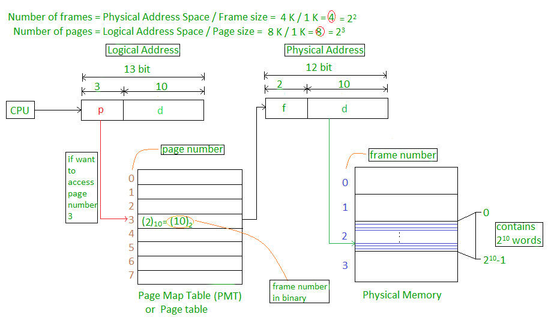
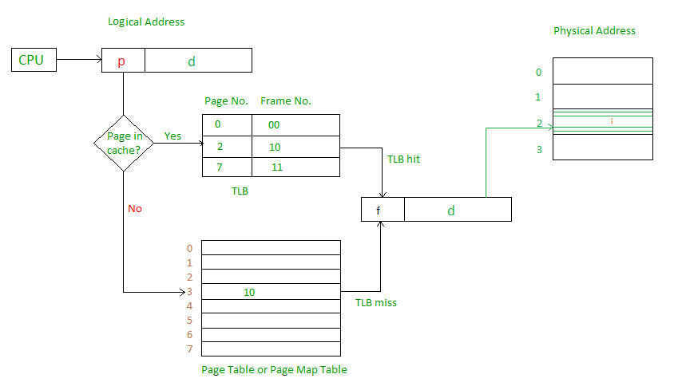
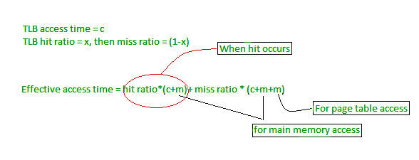
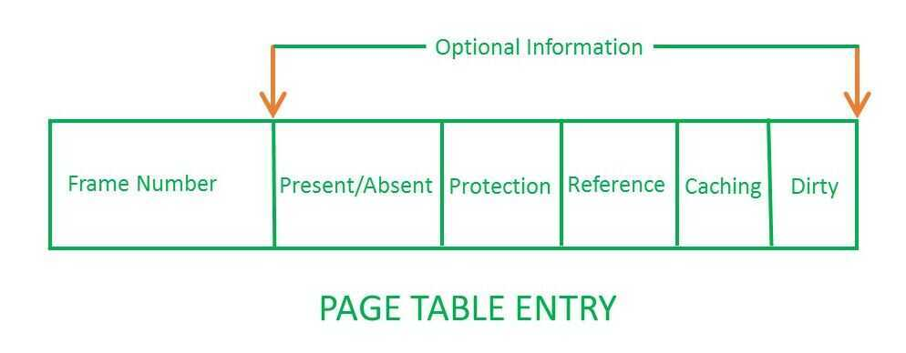
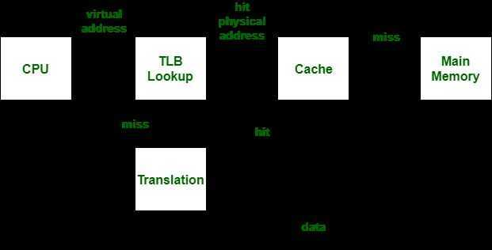

# Swap / Paging / Caching

## Paging

Paging is a memory management scheme that eliminates the need for contiguous allocation of physical memory. This scheme permits the physical address space of a process to be non-contiguous.

- Logical Address or Virtual Address (represented in bits): An address generated by the CPU
- Logical Address Space or Virtual Address Space( represented in words or bytes): The set of all logical addresses generated by a program
- Physical Address (represented in bits): An address actually available on memory unit
- Physical Address Space (represented in words or bytes): The set of all physical addresses corresponding to the logical addresses

Example:

- If Logical Address = 31 bit, then Logical Address Space = 231words = 2 G words (1 G = 230)
- If Logical Address Space = 128 M words = 27* 220words, then Logical Address = log2227= 27 bits
- If Physical Address = 22 bit, then Physical Address Space = 222words = 4 M words (1 M = 220)
- If Physical Address Space = 16 M words = 24* 220words, then Physical Address = log2224= 24 bits

The mapping from virtual to physical address is done by the memory management unit (MMU) which is a hardware device and this mapping is known as paging technique.

- The Physical Address Space is conceptually divided into a number of fixed-size blocks, calledframes.
- The Logical address Space is also splitted into fixed-size blocks, calledpages.
- Page Size = Frame Size

Let us consider an example:

- Physical Address = 12 bits, then Physical Address Space = 4 K words
- Logical Address = 13 bits, then Logical Address Space = 8 K words
- Page size = frame size = 1 K words (assumption)

Address generated by CPU is divided into

- Page number(p):Number of bits required to represent the pages in Logical Address Space or Page number
- Page offset(d):Number of bits required to represent particular word in a page or page size of Logical Address Space or word number of a page or page offset.

Physical Address is divided into

- Frame number(f):Number of bits required to represent the frame of Physical Address Space or Frame number.
- Frame offset(d):Number of bits required to represent particular word in a frame or frame size of Physical Address Space or word number of a frame or frame offset.

The hardware implementation of page table can be done by using dedicated registers. But the usage of register for the page table is satisfactory only if page table is small. If page table contain large number of entries then we can use TLB(translation Look-aside buffer), a special, small, fast look up hardware cache.

- The TLB is associative, high speed memory.
- Each entry in TLB consists of two parts: a tag and a value.
- When this memory is used, then an item is compared with all tags simultaneously.If the item is found, then corresponding value is returned.

Main memory access time = m

If page table are kept in main memory,

Effective access time = m(for page table) + m(for particular page in page table)

https://www.geeksforgeeks.org/operating-system-paging

https://en.wikipedia.org/wiki/Page_table

## Translation Lookaside Buffer (TLB)

Atranslation lookaside buffer(TLB) is a memory [cache](https://en.wikipedia.org/wiki/CPU_cache) that is used to reduce the time taken to access a user memory location.It is a part of the chip's [memory-management unit](https://en.wikipedia.org/wiki/Memory_management_unit)(MMU). The TLB stores the recent translations of [virtual memory](https://en.wikipedia.org/wiki/Virtual_memory) to [physical memory](https://en.wikipedia.org/wiki/Physical_memory) and can be called an address-translation cache. A TLB may reside between the [CPU](https://en.wikipedia.org/wiki/Central_processing_unit) and the [CPU cache](https://en.wikipedia.org/wiki/CPU_cache), between CPU cache and the main memory or between the different levels of the multi-level cache. The majority of desktop, laptop, and server processors include one or more TLBs in the memory-management hardware, and it is nearly always present in any processor that utilizes [paged](https://en.wikipedia.org/wiki/Paging) or [segmented](https://en.wikipedia.org/wiki/Memory_segmentation)[virtual memory](https://en.wikipedia.org/wiki/Virtual_memory).

The TLB is sometimes implemented as [content-addressable memory](https://en.wikipedia.org/wiki/Content-addressable_memory)(CAM). The CAM search key is the virtual address, and the search result is a [physical address](https://en.wikipedia.org/wiki/Physical_address). If the requested address is present in the TLB, the CAM search yields a match quickly and the retrieved physical address can be used to access memory. This is called a TLB hit. If the requested address is not in the TLB, it is a miss, and the translation proceeds by looking up the [page table](https://en.wikipedia.org/wiki/Page_table) in a process called apage walk. The page walk is time-consuming when compared to the processor speed, as it involves reading the contents of multiple memory locations and using them to compute the physical address. After the physical address is determined by the page walk, the virtual address to physical address mapping is entered into the TLB. The [PowerPC 604](https://en.wikipedia.org/wiki/PowerPC_604), for example, has a two-way [set-associative](https://en.wikipedia.org/wiki/Set-associative) TLB for data loads and stores.Some processors have different instruction and data address TLBs.

https://en.wikipedia.org/wiki/Translation_lookaside_buffer

## Page Table Entries

Page table has page table entries where each page table entry stores a frame number and optional status (like protection) bits. Many of status bits used in the virtual memory system. The mostimportantthing in PTE isframe Number.

Page table entry has the following information

1. **Frame Number --** It gives the frame number in which the current page you are looking for is present. The number of bits required depends on the number of frames.Frame bit is also known as address translation bit.
    Number of bits for frame = Size of physical memory/frame size

2. **Present/Absent bit --** Present or absent bit says whether a particular page you are looking for is present or absent. In case if it is not present, that is called Page Fault. It is set to 0 if the corresponding page is not in memory. Used to control page fault by the operating system to support virtual memory. Sometimes this bit is also known asvalid/invalidbits.

3. **Protection bit --** Protection bit says that what kind of protection you want on that page. So, these bit for the protection of the page frame (read, write etc).

4. **Referenced bit --** Referenced bit will say whether this page has been referred in the last clock cycle or not. It is set to 1 by hardware when the page is accessed.

5. **Caching enabled/disabled --** Some times we need the fresh data. Let us say the user is typing some information from the keyboard and your program should run according to the input given by the user. In that case, the information will come into the main memory. Therefore main memory contains the latest information which is typed by the user. Now if you try to put that page in the cache, that cache will show the old information. So whenever freshness is required, we don't want to go for caching or many levels of the memory.The information present in the closest level to the CPU and the information present in the closest level to the user might be different. So we want the information has to be consistency, which means whatever information user has given, CPU should be able to see it as first as possible. That is the reason we want to disable caching. So, this bitenables or disablecaching of the page.

6. **Modified bit --** Modified bit says whether the page has been modified or not. Modified means sometimes you might try to write something on to the page. If a page is modified, then whenever you should replace that page with some other page, then the modified information should be kept on the hard disk or it has to be written back or it has to be saved back. It is set to 1 by hardware on write-access to page which is used to avoid writing when swapped out. Sometimes this modified bit is also called as theDirty bit.

https://www.geeksforgeeks.org/operating-system-page-table-entries

## Swap

A swap file (or swap space or, in Windows NT, a pagefile) is a space on a [hard disk](http://searchstorage.techtarget.com/definition/hard-disk) used as the [virtual memory](http://searchstorage.techtarget.com/definition/virtual-memory) extension of a computer's real memory ([RAM](http://searchstorage.techtarget.com/definition/RAM-random-access-memory)). Having a swap file allows your computer's [operating system](http://whatis.techtarget.com/definition/operating-system-OS) to pretend that you have more RAM than you actually do. The least recently used files in RAM can be "swapped out" to your hard disk until they are needed later so that new files can be "swapped in" to RAM. In larger operating systems (such as IBM's [OS/390](http://searchdatacenter.techtarget.com/definition/OS-390)), the units that are moved are calledpages and the swapping is calledpaging.
One advantage of a swap file is that it can be organized as a single contiguous space so that fewer I/O operations are required to read or write a complete file.

In general, [Windows](http://searchwindowsserver.techtarget.com/definition/Windows) and [UNIX](http://searchdatacenter.techtarget.com/definition/Unix)-based operating systems provide a default swap file of a certain size that the user or a system administrator can usually change.

## Page replacement policies

Well Known Deterministic online paging algorithms -

1. FIFO (First-In First-Out) - Evict the page that has been in fast memory longest.
2. LRU (Least Recently Used) - On a fault, evict the page in fast memory that was requested least recently.
3. LFU (Least Frequently Used) - Evict the page that has been requested least frequently - https://arpitbhayani.me/blogs/lfu
4. MIN - On a fault, evict the page whose next request occurs furthest in the future.
5. ARC (Adaptive Replacement Cache)

    Adaptive Replacement Cache(ARC) is a [page replacement algorithm](https://en.wikipedia.org/wiki/Page_replacement_algorithm) with better performance than [LRU](https://en.wikipedia.org/wiki/Cache_algorithms) (least recently used). This is accomplished by keeping track of both frequently used and recently used pages plus a recent eviction history for both.

https://en.wikipedia.org/wiki/Adaptive_replacement_cache

## EC2 instances and Linux doesn't have swap

| **Amount of physical RAM**                | **Recommended swap space**                     |
|----------------------------------|--------------------------------------|
| 2 GB of RAM or less                       | 2x the amount of RAM but never less than 32 MB |
| More than 2 GB of RAM but less than 32 GB | 4 GB + (RAM -- 2 GB)                           |
| 32 GB of RAM or more                      | 1x the amount of RAM                           |

## What's difference between CPU Cache and TLB?

Both CPU Cache and TLB are hardware used in microprocessors but what's the difference, especially when someone says that TLB is also a type of Cache?

CPU Cache is a fast memory which is used to improve latency of fetching information from Main memory (RAM) to CPU registers. So CPU Cache sits between Main memory and CPU. And this cache stores information temporarily so that the next access to the same information is faster. A CPU cache which used to store executable instructions, it's called Instruction Cache (I-Cache). A CPU cache which is used to store data, it's called Data Cache (D-Cache). So I-Cache and D-Cache speeds up fetching time for instructions and data respectively. A modern processor contains both I-Cache and D-Cache. For completeness, let us discuss about D-cache hierarchy as well. D-Cache is typically organized in a hierarchy i.e. Level 1 data cache, Level 2 data cache etc.. It should be noted that L1 D-Cache is faster/smaller/costlier as compared to L2 D-Cache. But the basic idea of 'CPU cache' is to speed up instruction/data fetch time from Main memory to CPU

Translation Lookaside Buffer (i.e. TLB)is required only if Virtual Memory is used by a processor. In short, TLB speeds up translation of virtual address to physical address by storing page-table in a faster memory. In fact, TLB also sits between CPU and Main memory. Precisely speaking, TLB is used by MMU when physical address needs to be translated to virtual address. By keeping this mapping of virtual-physical addresses in a fast memory, access to page-table improves. It should be noted that page-table (which itself is stored in RAM) keeps track of where virtual pages are stored in the physical memory. In that sense, TLB also can be considered as a cache of the page-table

But the scope of operation for TLB and CPU Cache is different. TLB is about 'speeding up address translation for Virtual memory' so that page-table needn't to be accessed for every address. CPU Cache is about 'speeding up main memory access latency' so that RAM isn't accessed always by CPU. TLB operation comes at the time of address translation by MMU while CPU cache operation comes at the time of memory access by CPU. In fact, any modern processor deploys all I-Cache, L1 & L2 D-Cache and TLB.

https://www.geeksforgeeks.org/whats-difference-between-cpu-cache-and-tlb

## References

http://searchwindowsserver.techtarget.com/definition/swap-file-swap-space-or-pagefile

https://www.redhat.com/en/blog/do-we-really-need-swap-modern-systems

https://www.kernel.org/doc/gorman/html/understand/understand016.html

https://www.kernel.org/doc/gorman/html/understand/understand014.html

https://chrisdown.name/2018/01/02/in-defence-of-swap.html

[Your SSD lies but that's ok .. I think | Postgres fsync - YouTube](https://www.youtube.com/watch?v=JK2ZIx8jRu4)
