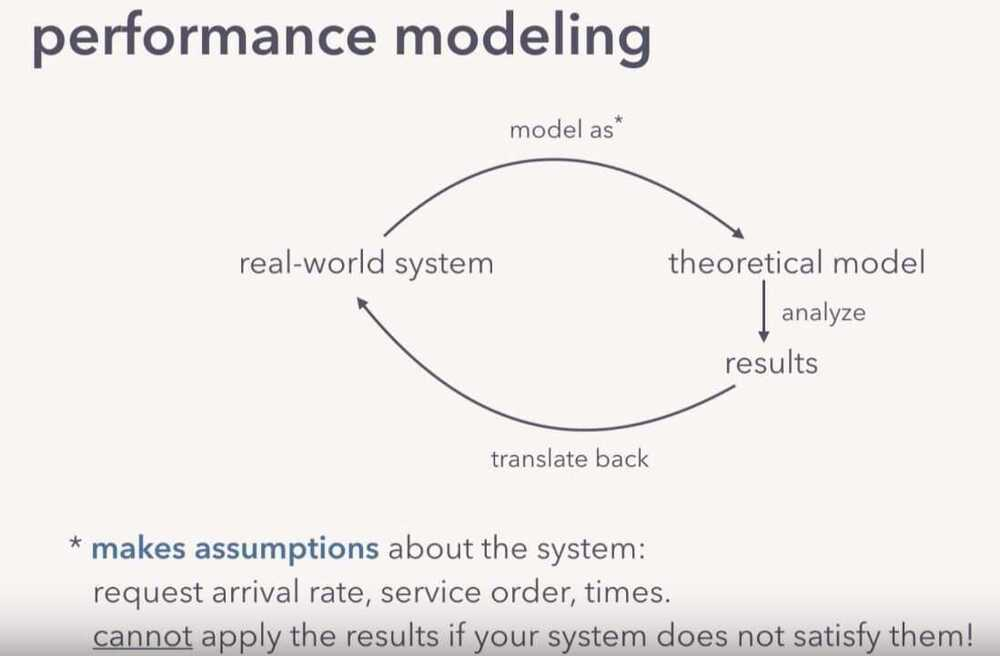
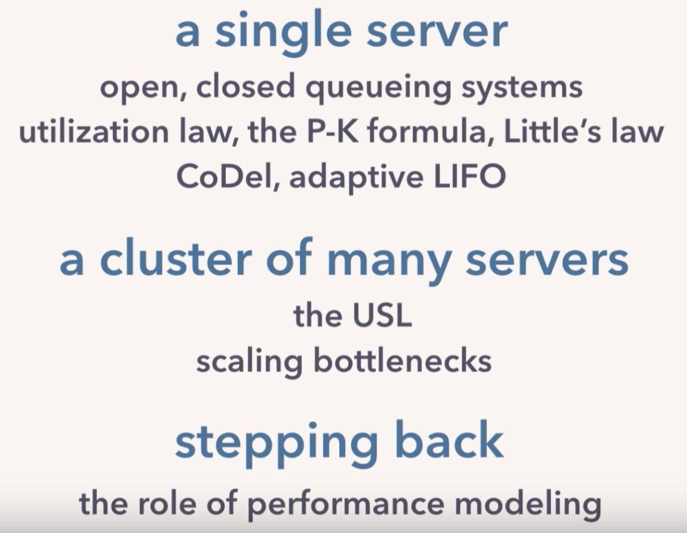
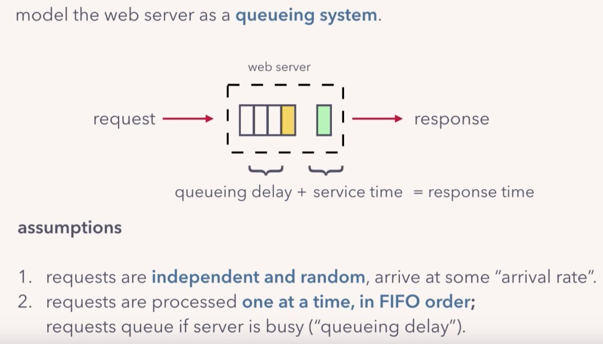
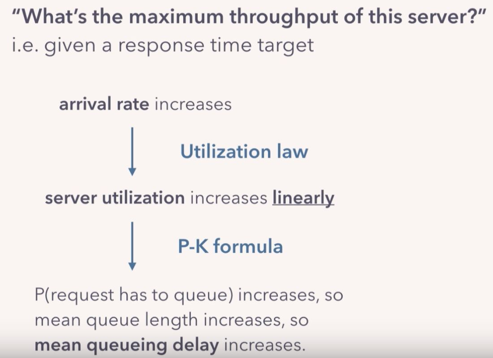
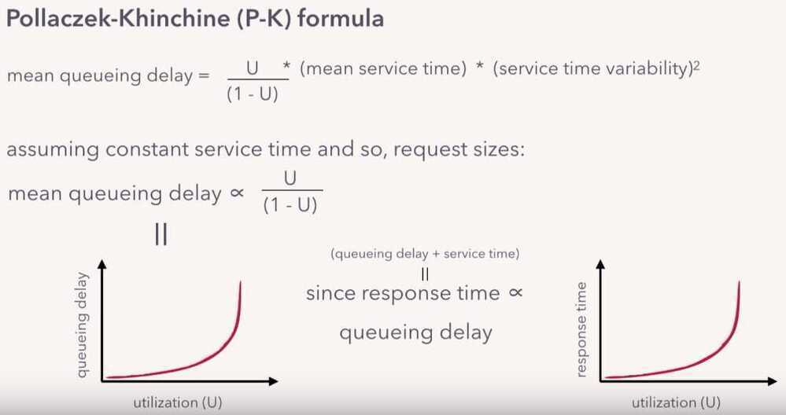

## Performance Modelling

## Software defined radio

### What Is Software-Defined Radio Used For?

Software-defined radio can be used for all traditional radio applications, but much more flexibly. This allows for the prototyping and development of next-generation radio applications. In this article, though, we use an RTL-SDR for simply receiving narrow-band FM signals.

### How Does Software-Defined Radio Work?

A software-defined radio works by implementing traditionally hardware components in software on a personal computer or embedded system.

### What Is A Waveform In Software-Defined Radio?

A waveform is a representation of a wave over a time period. In software-defined radio, it is the same as a waveform in regular radio. It can be used to represent the sound being modulated or demodulated, the signal being transmitted, radiated, or received, or any other waves in the process.

### What Is SDR In Ham Radio?

SDR can be used in ham radio like any other radio application. Amateur radio is a hobby about exploration, and so hams can use the SDR as a receiver, or as a transmitter. They can even use it to create completely new radio applications.

### What Is RTL In RTL-SDR?

RTL is short for RTL2832U. The Realtek RTL2832U chipset was a popular choice for digital video broadcast (DVB-T) receivers, whose original purpose was to receive video. It was discovered that these could be hacked and turned into wideband SDR receivers. These devices have come to be known as the RTL-SDR.

### Can You Transmit With Sdr?

It depends on the SDR. If you have the right hardware, yes you can, but not with the RTL-SDR. Some transmission capable SDRs include the HackRF, PlutoSDR, LimeSDR, LimeSDR Mini, and more.

https://www.toptal.com/software/software-defined-radio-tutorial-rtl-sdr

## Virtual Reality (VR / WebVR / AR - Augmented realityƒ)

[https://www.toptal.com/virtual-reality/webvr-and-edge-computing](https://www.toptal.com/virtual-reality/webvr-and-edge-computing?)

https://www.gather.town

[Augmented Reality Course - Take Your First Steps into the World of AR](https://www.freecodecamp.org/news/take-your-first-steps-into-the-world-of-augmented-reality/)

## GIS (Geographic Information System)

A Geographic Information System (GIS) is a system designed to capture, store, manipulate, analyze, and manage spatial data. See [Geographic Information Systems (GIS)](computer-science/others/gis-geographic-information-systems.md) for comprehensive coverage including data types, spatial analysis, software tools, and interview preparation.

**Quick facts:**

- The latitude and longitude coordinate with **five decimal digits** provides an accuracy of about **1.11 meters at the equator.**
- The latitude and longitude coordinate with **four decimal digits** provides an accuracy of about **11.1 meters at the equator.**

https://en.wikipedia.org/wiki/Geographic_information_system

## Supercomputer Architecture

Approaches to **supercomputer architecture** have taken dramatic turns since the earliest systems were introduced in the 1960s. Early [supercomputer](https://en.wikipedia.org/wiki/Supercomputer) architectures pioneered by [Seymour Cray](https://en.wikipedia.org/wiki/Seymour_Cray) relied on compact innovative designs and local [parallelism](https://en.wikipedia.org/wiki/Parallel_computing) to achieve superior computational peak performance. However, in time the demand for increased computational power ushered in the age of [massively parallel](https://en.wikipedia.org/wiki/Massively_parallel) systems.

https://en.wikipedia.org/wiki/Supercomputer_architecture
