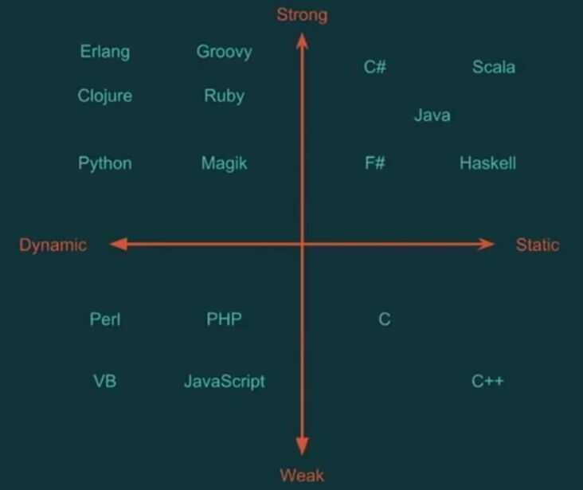

# Type Systems

In [programming languages](https://en.wikipedia.org/wiki/Programming_language), atype systemis a set of rules that assigns a property called [type](https://en.wikipedia.org/wiki/Type_(computer_science)) to the various constructs of a [computer program](https://en.wikipedia.org/wiki/Computer_program), such as [variables](https://en.wikipedia.org/wiki/Variable_(computer_science)), [expressions](https://en.wikipedia.org/wiki/Expression_(computer_science)), [functions](https://en.wikipedia.org/wiki/Function_(computer_science)) or [modules](https://en.wikipedia.org/wiki/Modular_programming).These types formalize and enforce the otherwise implicit categories the programmer uses for [algebraic data types](https://en.wikipedia.org/wiki/Algebraic_data_type), data structures, or other components (e.g. "string", "array of float", "function returning boolean").

## Type System Goals

- Check for bad program behavior
- Early detection of program errors
- Enable abstractions
- Protect integrity of user defined abstractions
- Documentation
    - Easy to reason code's purpose
    - Doesn't drift like code comments

Statically typed language

- Types must be defined for every variable at compile time

Dynamically typed language

- Types are not required to be defined at compile time

Weakly typed

- Types can be changed at run time.

Strongly typed

- Types are fixed and cannot be changed at run time

Dependent types (first class types)

## Statically Typed vs Dynamically Typed language

A language is statically typed if the **type of a variable is known at compile time**. For some languages this means that you as the programmer must specify what type each variable is (e.g.: Java, C, C++); other languages offer some form oftype inference, the capability of the type system to deduce the type of a variable (e.g.: OCaml, Haskell, Scala, Kotlin, Python)

The main advantage here is that all kinds of checking can be done by the compiler, and therefore a lot of trivial bugs are caught at a very early stage.

A language is dynamically typed if the **type is associated with run-time values,** and not named variables/fields/etc. This means that you as a programmer can write a little quicker because you do not have to specify types every time (unless using a statically-typed language withtype inference). Example: Perl, Ruby, Python.

**(In dynamically typed languages, types are associated with the variable's value, not the variable itself)**

Most scripting languages have this feature as there is no compiler to do static type-checking anyway, but you may find yourself searching for a bug that is due to the interpreter misinterpreting the type of a variable. Luckily, scripts tend to be small so bugs have not so many places to hide.

## Static Typing Checking

- Early feedback
- More reliable
- More optimizable
- Longer edit-test-compile cycle

## Dynamic Typing Checking

- Shorter edit-test-compile cycle
- More flexible
- Good for prototyping
- Better at metaprogramming
- Get ready for lots and lots of unit testing

### Static

- C
- C++
- Java
- C#
- Scala
- Haskell
- Rust
- Kotlin
- Go

### Dynamic

- JavaScript
- Ruby
- Python
- Perl
- PHP
- Lisp
- Closure
- R
- Bash

https://www.sitepoint.com/typing-versus-dynamic-typing

## Strong Typed vs Weak Typed language

In strongly typed languages, variables are necessarily bound to a particular data type. Python is strong typed, and so is Java.

As opposed to strong typed languages, weak typed languages are those in which variables are not of a specific data type. It should be noted that this does not imply that variables do not have types; it does mean that variables are not "bound" to a specific data type. PHP and C are examples of weak typed languages.

Thus, Python is dynamic typed and strong typed; Java is static typed and strong typed; PHP is dynamic typed and weak typed; C is static typed and weak typed (owing to its casting ability).

## Others

- Algebraic Data Types (ADT)

## References

Programming Styles > Duck typing

[Functional Programming: Type Systems](https://www.youtube.com/watch?v=hy1wjkcIBCU)
