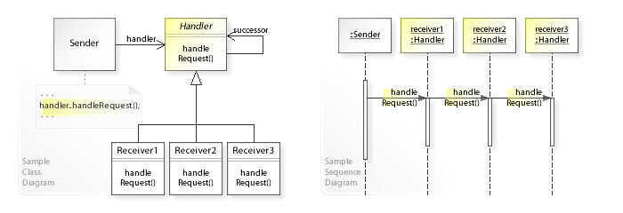

# Behavioral - Chain of Responsibility

Chain of Responsibility is a behavioral design pattern that lets you pass requests along a chain of handlers. Upon receiving a request, each handler decides either to process the request or to pass it to the next handler in thechain

In [object-oriented design](https://en.wikipedia.org/wiki/Object-oriented_design), thechain-of-responsibility patternis a [design pattern](https://en.wikipedia.org/wiki/Design_pattern_(computer_science)) consisting of a source of [command objects](https://en.wikipedia.org/wiki/Command_pattern) and a series ofprocessing objects.Each processing object contains logic that defines the types of command objects that it can handle; the rest are passed to the next processing object in the chain. A mechanism also exists for adding new processing objects to the end of this chain. Thus, the chain of responsibility is an object oriented version of theif ... else if ... else if ....... else ... endif idiom, with the benefit that the condition--action blocks can be dynamically rearranged and reconfigured at runtime.

In a variation of the standard chain-of-responsibility model, some handlers may act as [dispatchers](https://en.wikipedia.org/wiki/Dynamic_dispatch), capable of sending commands out in a variety of directions, forming atree of responsibility. In some cases, this can occur recursively, with processing objects calling higher-up processing objects with commands that attempt to solve some smaller part of the problem; in this case recursion continues until the command is processed, or the entire tree has been explored. An [XML](https://en.wikipedia.org/wiki/XML)[interpreter](https://en.wikipedia.org/wiki/Interpreter_(computing)) might work in this manner.

This pattern promotes the idea of [loose coupling](https://en.wikipedia.org/wiki/Loose_coupling).

The chain-of-responsibility pattern is structurally nearly identical to the [decorator pattern](https://en.wikipedia.org/wiki/Decorator_pattern), the difference being that for the decorator, all classes handle the request, while for the chain of responsibility, exactly one of the classes in the chain handles the request.

## Advantages of Chain of Responsibility Design Pattern

- To reduce the coupling degree. Decoupling it will request the sender and receiver.
- Simplified object. The object does not need to know the chain structure.
- Enhance flexibility of object assigned duties. By changing the members within the chain or change their order, allow dynamic adding or deleting responsibility.
- Increase the request processing new class of very convenient.

## Disadvantages of Chain of Responsibility Design Pattern

- The request must be received not guarantee.
- The performance of the system will be affected, but also in the code debugging is not easy may cause cycle call.
- It may not be easy to observe the characteristics of operation, due to debug.

https://en.wikipedia.org/wiki/Chain-of-responsibility_pattern

https://refactoring.guru/design-patterns/chain-of-responsibility

https://www.geeksforgeeks.org/chain-responsibility-design-pattern

https://www.tutorialspoint.com/design_pattern/chain_of_responsibility_pattern.htm
