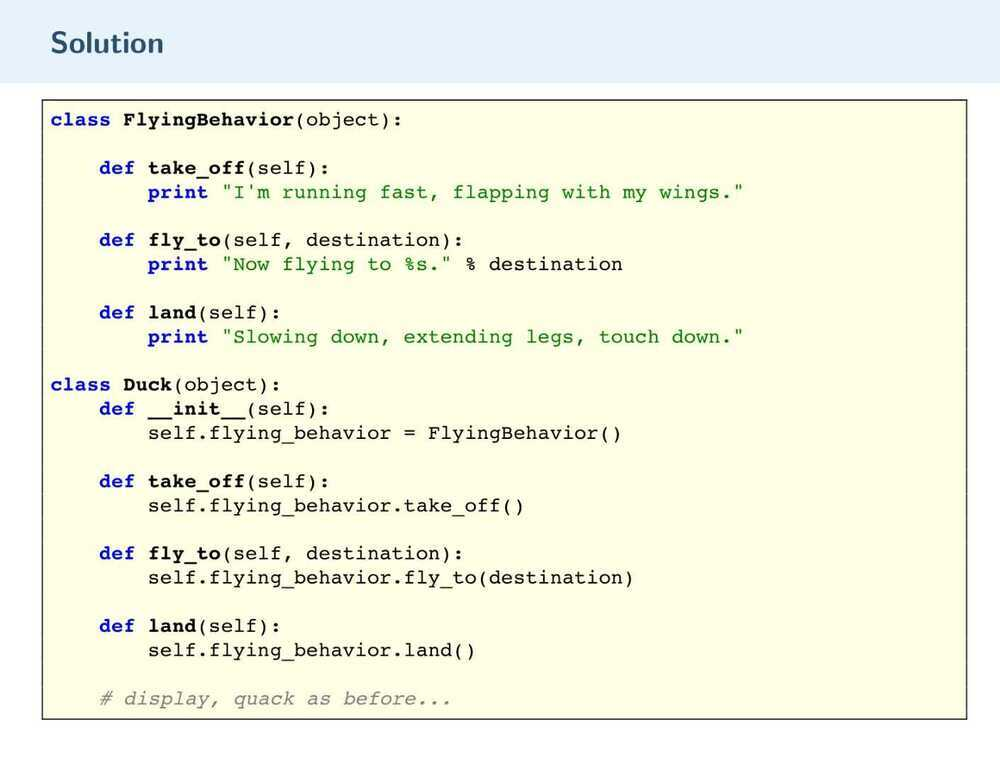
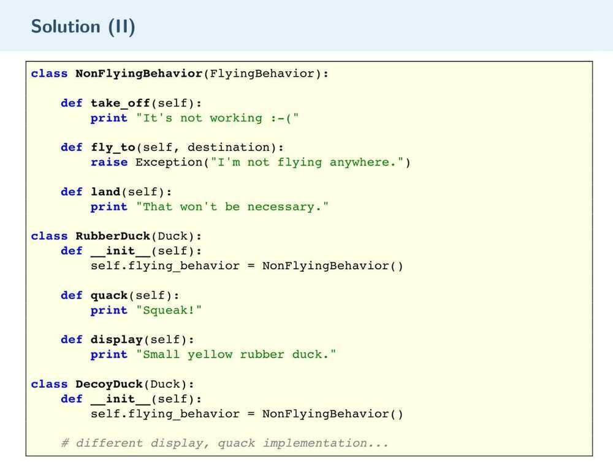
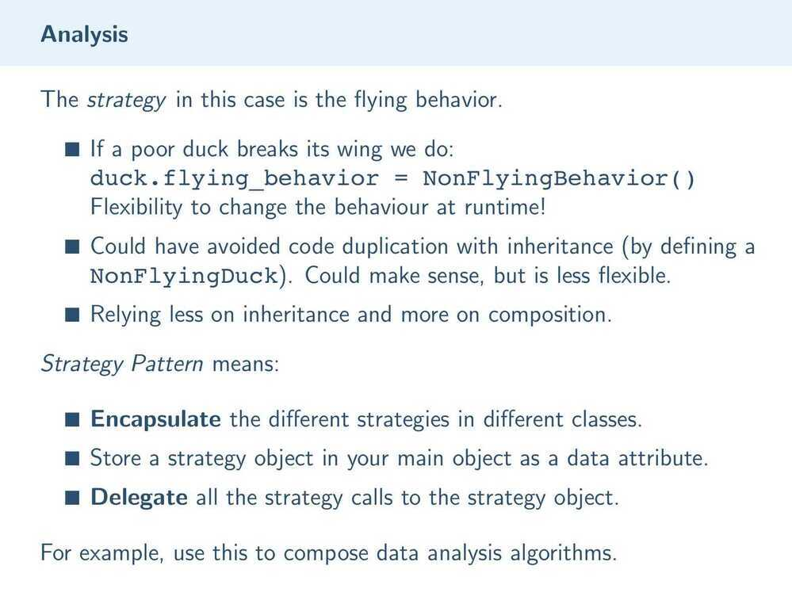

# Behavioral - Strategy

A strategy is a behavioral design pattern that defines a family of similar algorithms and places each of them in its own class, after which the algorithms can be interchanged right during the execution of the program.
Pros:

- "hot" algorithm replacement on the fly;

- the algorithms' code and data isolation from other classes.

Cons:

- complicates the program due to the additional classes.**References**

https://py.checkio.org/blog/design-patterns-part-1
