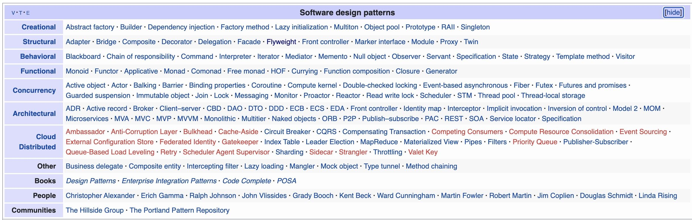
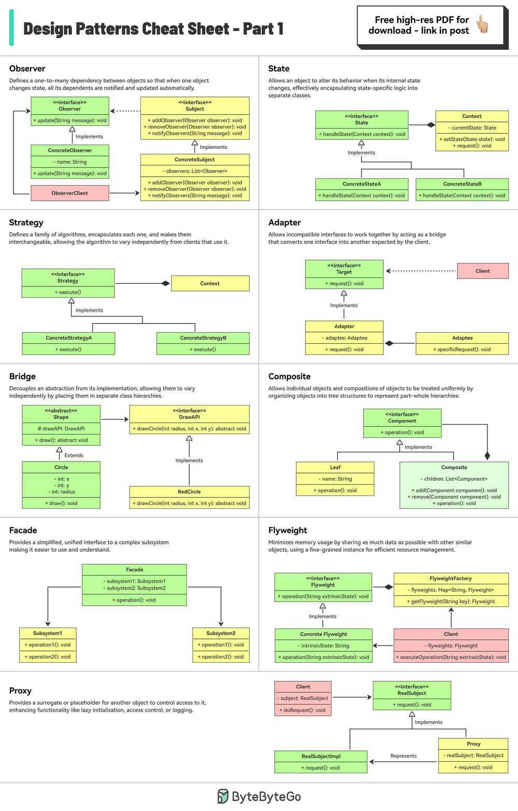
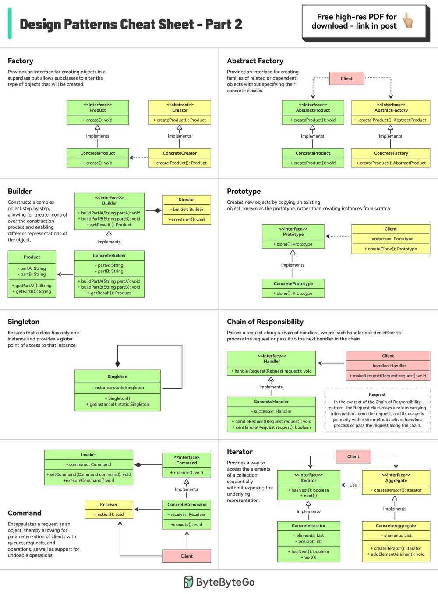

# Design Patterns

## Gang of Four (GOF)

Two main principles are in the bases of the design patterns defined by the GOF:

- Program to an interface not an implementation.
- Favor object composition over inheritance.

## Design Pattern Categorization

Design patterns can be categorized in multiple ways, but the most popular one is the following:

- Creational design patterns
- Structural design patterns
- Behavioraldesign patterns
- Concurrency design patterns
- Architectural design patterns

### Creational Design Patterns

These patterns deal with object creation mechanisms which optimize object creation compared to a basic approach. The basic form of object creation could result in design problems or in added complexity to the design. Creational design patterns solve this problem by somehow controlling object creation. Some of the popular design patterns in this category are:

- Abstract factory
- Builder
- Factory method
- Prototype
- Singleton (AntiPattern, Overused, replaced with dependency injection)
- Object Pool

### Structural Design Patterns

These patterns deal with object relationships. They ensure that if one part of a system changes, the entire system doesn't need to change along with it. The most popular patterns in this category are:

- Adapter
- Bridge
- Composite - [The Composite Pattern - Design Patterns Meet the Frontend - DEV Community](https://dev.to/coly010/the-composite-pattern-design-patterns-meet-the-frontend-445e)
- Decorator
- Facade
- Flyweight - Refers to an [object](https://en.wikipedia.org/wiki/Object_(computer_science)) that minimizes [memory](https://en.wikipedia.org/wiki/Computer_memory) usage by sharing some of its data with other similar objects. In other contexts, the idea of sharing data structures is called [hash consing](https://en.wikipedia.org/wiki/Hash_consing). https://en.wikipedia.org/wiki/Flyweight_pattern
- Proxy

### Behavioral Design Patterns

These types of patterns recognize, implement, and improve communication between disparate objects in a system. They help ensure that disparate parts of a system have synchronized information. (Behavioural patterns deal with inter-object communication, controlling how various objects interact and perform different tasks.) Popular examples of these patterns are:

- Chain of responsibility
- Command
- Interpreter (Python)
- Iterator
- Mediator
- Memento
- Observer
- Publisher Subscriber Pattern
- State
- Strategy
- Template (Python) (Composition is generally better)
- Visitor

### Concurrency Design Patterns

These types of design patterns deal with multi-threaded programming paradigms. Some of the popular ones are:

- Active object
- Nuclear reaction
- Scheduler
- Reactor design pattern

### Architectural Design Patterns

Design patterns which are used for architectural purposes. Some of the most famous ones are:

- MVC (Model-View-Controller)
- MVP (Model-View-Presenter) - Android
- MVVM (Model-View-ViewModel)
- MVVP
- Clean Architecture (Uncle Bob Android)

[10 Architecture Patterns Used In Enterprise Software Development Today - YouTube](https://www.youtube.com/watch?v=BrT3AO8bVQY&ab_channel=CodingTech)

## Others

### [The Revision Pattern: NoSQL Data Modeling](https://www.youtube.com/watch?v=AtPcQ-jpP6M)

### Parameterization - Python

In a parameterized function, one or more of the details of what the function does are defined as parameters instead of being defined in the function; they have to be passed in by the calling code.

https://www.toptal.com/python/python-parameterized-design-patterns

## The Scope

### Class-scope

when pattern is categorized as class-scope, it means that its goals are achieved at the compile time using inheritance

### Object-scope

when pattern is categorized as object-scope its goals are achieved through composition during the runtime

## Single Source of Truth (SSOT)

In order to centralize the data access, we need something called Single Source of Truth (SSOT).

In information systems design and theory, single source of truth (SSOT) is the practice of structuring information models and associated data schema such that every data element is mastered (or edited) in only one place.

It is basically a practice to centralize your data access into a single class (based on the usage of the data). For instance, you need to access the data aboutbook, then you have to centralize all the data access which related to book into a single class so that the other class (client) can easily fetch the book data by requesting to "source of truth" class.

And because all other locations of the data access just refer back to the primary "source of truth" location, updates to the data element in the primary location propagate to the entire system without the possibility of a duplicate value somewhere being forgotten.

Deployment of a SSOT is becoming increasingly important in enterprise settings where incorrectly linked duplicate or de-normalized data elements (a direct consequence of intentional or unintentional denormalization of any explicit data model) pose a risk for retrieval of outdated, and therefore incorrect, information.

A common example would be the [electronic health record](https://en.wikipedia.org/wiki/Electronic_health_record), where it is imperative to accurately validate patient identity against a single referential repository, which serves as the SSOT.

### Repository Pattern

https://medium.com/swlh/repository-pattern-in-android-c31d0268118c

## References

https://www.toptal.com/python/python-design-patterns

https://www.toptal.com/javascript/comprehensive-guide-javascript-design-patterns

https://github.com/faif/python-patterns

https://stackabuse.com/design-patterns-in-python

https://www.freecodecamp.org/news/4-design-patterns-to-use-in-web-development

https://en.wikipedia.org/wiki/Software_design_pattern

