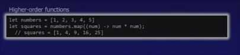

# Functional Programming

## Everything is immutable

[Why Functional Programming Matters](https://www.youtube.com/watch?v=oB8jN68KGcU)

[How Functional Programming Can Make You A Better Developer](https://www.youtube.com/watch?v=EqO4TcNLjl0&t=1s&ab_channel=CodingTech)

## Basic Concepts

- Functions are first class citizen/constructs
- Immutable values over mutable variables
- Functions as first-class values
- Currying, partial-application of functions
- Expressions-not-statements
- Laziness/deferred execution

## Some optional functional concepts

Strongly-typed, type-inferenced

Recursion

Tuples, lists

Pattern-matching

## Immutable values

Once bound, a binding remains constant throughout its lifetime, thus offers no opportunity for confusion/reassignment/etc

## Values over variables

"values" are not "variables"

Name/value binding is fixed once bound

## Functions as first-class values

- Pass code as function parameters
- Ex

Here map can use computers parallel programming capabilities and split the list in multiple lists and then perform parallel operation as opposed to for loop.

Hence Map-Reduce, without Reduce.

## Partial application

- Providing some of the parameters (but not all) to a function and capturing that as a function to be called

## Currying

- It turns out that all functions can be reduced to functions taking one parameter and either yielding a result or another function
- This permits easy "pipelining" and composition of functions in a highly reusable manner

## Tail recursion optimizations

## Monads

## What is the meaning/definition of a monad?

A monad is an abstract interface that defines "pure" and "flatMap" functions. Pure lets you convert an ordinary value to monadic value. FlatMap allows functions with ordinary arguments to be applied to monadic arguments.

## What are monads for?

Monads are used extensively in functional programming. Their key goal is isolating any unreliable and dangerous side effects in one place, so you can enjoy safe programming in all other parts of the app.

## What is a monad category?

Technically, a monad is an endofunctor, meaning that it's something that maps a category to itself. But you can think of an image of that functor as a new category with monadic side effect(s).

## What is monad programming?

Monad programming is a technique of composing different monadic values into one big monad. After that it's easy to process all side effects, because they are concentrated just in one monad, rather than many monads.

- https://www.toptal.com/javascript/option-maybe-either-future-monads-js
- [Functional Programming & Haskell - Computerphile](https://www.youtube.com/watch?v=LnX3B9oaKzw)
- [Cultivating an Engineering Dialect • George Wilson • YOW 2021 - YouTube](https://www.youtube.com/watch?v=L4h6VegK1BI)

## Others

[Lean - Microsoft Research](https://www.microsoft.com/en-us/research/project/lean/)

- Lean is a functional programming language and interactive theorem prover. Our project strives to revolutionize mathematics by empowering anyone with an interest to grow in the field using Lean as their assistant. Lean was developed by Microsoft Research in 2013 as an initial effort to help mathematicians and engineers solve complex math problems. Lean is an open-source development environment for formal mathematics, also known as machine-checkable mathematics, used by and contributed to by an active community of mathematicians around the world.
- [Programming Language and Theorem Prover — Lean](https://lean-lang.org/)
- [GitHub - leanprover/lean4: Lean 4 programming language and theorem prover](https://github.com/leanprover/lean4)
