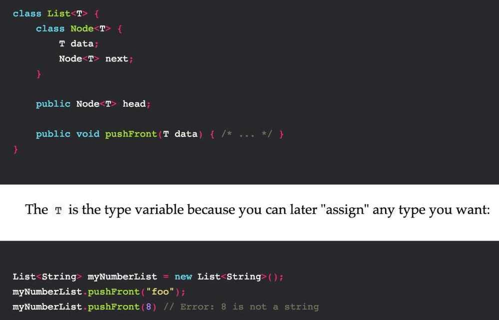

# OOPS / SOLID

AEIP - Abstraction, Encapsulation, Inheritance and Polymorphism

## Modularity

Modularity lets you define a **public interface** to hide **private implementation details**

## Objects

Combine state (data) and behavior (algorithms/business logic)

Means a real world entity (like a car, bus, pen, etc..)

## Classes

Collection of objects is called class. It is a logical entity.

A class defines the behavior of an object and the kind of information an object can store. The information in a class is stored in attributes, and functions that belong to a class are called methods. A child class inherits the attributes and methods from its parent class.

Classes are the foundation of object-oriented programming. Classes represent real-world things you want to model in your programs: for example dogs, cars, and robots. You can use a class to make objects, which are specific instances of dogs, cars and robots. A class defines the general behavior that a whole category of objects can have, and the information that can be associated with those objects.

Classes can inherit from each other - you can write a class that extends the functionality of an existing class. This allows you to code efficiently for a wide variety of situations.

Classes provide a means of bundling data and functionality together.

Creating a new class creates a new type of object, allowing new instances of that type to be made.

## Abstraction

Hiding internal details and showing functionalityis known as abstraction. For example: phone call, we don't know the internal processing.

In java, we use abstract class and interface to achieve abstraction.

### Leaky Abstraction

https://www.joelonsoftware.com/2002/11/11/the-law-of-leaky-abstractions

Abstractions fail. Sometimes a little, sometimes a lot. There's leakage. Things go wrong. It happens all over the place when you have abstractions.

All non-trivial abstractions, to some degree, are leaky.
TCP attempts to provide a complete abstraction of an underlying unreliable network, but sometimes, the network leaks through the abstraction and you feel the things that the abstraction can't quite protect you from. This is but one example of what I've dubbed the Law of Leaky Abstractions:

## Encapsulation

Encapsulation is defined as the wrapping up of data under a single unit. It is the mechanism that binds together code and the data it manipulates.Other way to think about encapsulation is, it is a protective shield that prevents the data from being accessed by the code outside this shield.
Encapsulation is a mechanism of wrapping the data (variables) and code acting on the data (methods) together as a single unit. In encapsulation, the variables of a class will be hidden from other classes, and can be accessed only through the methods of their current class. Therefore, it is also known asdata hiding.

## Inheritance

When one object acquires all the properties and behaviours of parent objecti.e. known as inheritance. It provides code reusability. It is used to achieve runtime polymorphism.

- Single Inheritance
- Multilevel Inheritance
- Hierarchical Inheritance
- Hybrid Inheritance

Interface Inheritance (aka subtyping)

Implementation Inheritance (aka inheritance)

## Polymorphism

When **one task is performed by different ways** i.e. known as polymorphism. For example: to convince the customer differently, to draw something e.g. shape or rectangle etc.

In java, we use method overloading and method overriding to achieve polymorphism.

Another example can be to speak something e.g. cat speaks meaw, dog barks woof etc.

Types of polymorphism

### 1. Parametric polymorphism

This is a pretty common technique in many languages, albeit better known as "Generics". The core idea is to allow programmers to use a wildcard type when defining data structures that can later be filled with any type.



### 2. Subtype polymorphism

Most used type, using shape like triangle, rectangle and calling area like traingle.area(), rectangle.area())

Subtyping is better known as object oriented inheritance. The classic example is a vehicle type, here in Java:

```java
abstract class Vehicle {
 abstract double getWeight();
}

class Car extends Vehicle {
 double getWeight() { return 10.0; }
}

class Truck extends Vehicle {
 double getWeight() { return 100.0; }
}

class Toyota extends Car { /* ... */ }

static void printWeight(Vehicle v) {
 // Allowed because all vehicles have to have this method
 System.out.println(v.getWeight());
}
```

### 3. Ad-Hoc polymorphism (AKA Type Classes)

This is more commonly known as function or operator overloading. In languages that allow this, you can define a function multiple times to deal with different input types. For example in Java:

```java
class Printer {
 public String prettyPrint(int x) { /*...*/ }
 public String prettyPrint(char c) { /*...*/ }
}
```

### Others

1. Row Polymorphism
2. Kind Polymorphism
3. Higher-rank Polymorphism
4. Linearity Polymorphism
5. Levity Polymorphism

https://dev.to/jvanbruegge/what-the-heck-is-polymorphism-nmh

## Inheritance, Encapsulation and Polymorphism are 3 pillars of OOPs

## Problems

### Inheritance

### Banana Monkey Jungle Problem

The problem with object-oriented languages is they've got all this implicit environment that they carry around with them. You wanted a banana but what you got was a gorilla holding the banana and the entire jungle.

Solution

- Contain
- Delegate

### Diamond Problem


Both Scanner and Printer has the same function, so Copier will inherit which function? (Most OO language doesn't let you do that)

### Fragile Base Class Problem

If a parent class is changed, than child class can stop working

### The Hierarchy Problem (Categorical Hierarchies)

Every time I start at a new company, I struggle with the problem when I'm creating a place to put my Company Documents, e.g. the Employee Handbook. Do I create a folder called Documents and then create a folder called Company in that. Or do I create a folder called Company and then create a folder called Documents in that?

Using tags we can solve this problem. A company document can be labelled as document and also company. So it's both. **Tags have no order or hierarchy.**

Don't use categorical hierarchies (Use containment hierarchies insted)

### Encapsulation - The Reference Problem

Object's reference is passed to functions and changing something to object can change the original object.

Solution - Deep Copy (But system objects cannot be copied)

## Others

- **Mixin**

In [object-oriented programming languages](https://en.wikipedia.org/wiki/Object-oriented_programming_language), a **Mixin** is a [class](https://en.wikipedia.org/wiki/Class_(computer_science)) that contains methods for use by other classes without having to be the parent class of those other classes. How those other classes gain access to the mixin's methods depends on the language. Mixins are sometimes described as being "included" rather than "inherited".
Mixins encourage [code reuse](https://en.wikipedia.org/wiki/Code_reuse) and can be used to avoid the inheritance ambiguity that multiple inheritance can cause(the "[diamond problem](https://en.wikipedia.org/wiki/Multiple_inheritance#The_diamond_problem)"), or to work around lack of support for multiple inheritance in a language. A mixin can also be viewed as an [interface](https://en.wikipedia.org/wiki/Interface_(object-oriented_programming)) with implemented [methods](https://en.wikipedia.org/wiki/Method_(computer_science)). This pattern is an example of enforcing the [dependency inversion principle](https://en.wikipedia.org/wiki/Dependency_inversion_principle).
Mixins are a language concept that allows a programmer to inject some code into a [class](https://en.wikipedia.org/wiki/Class_(computer_programming)). Mixin programming is a style of [software development](https://en.wikipedia.org/wiki/Software_development), in which units of functionality are created in a class and then mixed in with other classes.
A mixin class acts as the parent class, containing the desired functionality. A [subclass](https://en.wikipedia.org/wiki/Subclass_(computer_science)) can then inherit or simply reuse this functionality, but not as a means of specialization. Typically, the mixin will export the desired functionality to a [child class](https://en.wikipedia.org/wiki/Subclass_(computer_science)), without creating a rigid, single "is a" relationship. Here lies the important difference between the concepts of mixins and [inheritance](https://en.wikipedia.org/wiki/Inheritance_(object-oriented_programming)), in that the child class can still inherit all the features of the parent class, but, the semantics about the child "being a kind of" the parent need not be necessarily applied.

### Advantages

1. It provides a mechanism for [multiple inheritance](https://en.wikipedia.org/wiki/Multiple_inheritance) by allowing multiple classes to use the common functionality, but without the complex semantics of multiple inheritance.2. [Code reusability](https://en.wikipedia.org/wiki/Code_reuse): Mixins are useful when a programmer wants to share functionality between different classes. Instead of repeating the same code over and over again, the common functionality can simply be grouped into a mixin and then included into each class that requires it.3. Mixins allow inheritance and use of only the desired features from the parent class, not necessarily all of the features from the parent class.

## Delegation

Delegation means that an object shall perform only what it knows best, and leave the rest to other objects.

Delegation can be implemented with two different mechanisms: composition and inheritance. Sadly, very often only inheritance is listed among the pillars of OOP techniques, forgetting that it is an implementation of the more generic and fundamental mechanism of delegation; perhaps a better nomenclature for the two techniques could be explicit delegation(composition) and implicit delegation (inheritance).

### Inheritance

- Python does not implicitly call the parent implementation when you override a method.
- overriding is a way to block implicit delegation.

### Composition

- Composition means that an object knows another object, and explicitly delegates some tasks to it.
- Composition provides a superior way to manage delegation since it can selectively delegate the access, even mask some attributes or methods, while inheritance cannot.
- In Python you also avoid the memory problems that might arise when you put many objects inside another; Python handles everything through its reference, i.e. through a pointer to the memory position of the thing, so the size of an attribute is constant and very limited.

### Composition over Inheritance

Composition over inheritance(orcomposite reuse principle) in [object-oriented programming](https://en.wikipedia.org/wiki/Object-oriented_programming)(OOP) is the principle that classes should achieve [polymorphic](https://en.wikipedia.org/wiki/Polymorphism_(computer_science)) behavior and [code reuse](https://en.wikipedia.org/wiki/Code_reuse) by their [composition](https://en.wikipedia.org/wiki/Object_composition)(by containing instances of other classes that implement the desired functionality) rather than [inheritance](https://en.wikipedia.org/wiki/Inheritance_(computer_science)) from a base or parent class.This is an often-stated principle of OOP, such as in the influential book [Design Patterns](https://en.wikipedia.org/wiki/Design_Patterns).

https://en.wikipedia.org/wiki/Composition_over_inheritance

[The Flaws of Inheritance](https://www.youtube.com/watch?v=hxGOiiR9ZKg)

## Monkey Patching

- A MonkeyPatch is a piece of Python code which extends or modifies other code at runtime (typically at startup).
- For instance, consider a class that has a methodget_data. This method does an external lookup (on a database or web API, for example), and various other methods in the class call it. However, in a unit test, you don't want to depend on the external data source - so you dynamically replace theget_datamethod with a stub that returns some fixed data.
- Because Python classes are mutable, and methods are just attributes of the class, you can do this as much as you like - and, in fact, you can even replace classes and functions in a module in exactly the same way.

### Example

```python
from SomeOtherProduct.SomeModule import SomeClass

def speak(self):
    return "ook ook eee eee eee!"

SomeClass.speak = speak
```

https://thecodebits.com/monkey-patching-in-python-explained-with-examples

## OOAD (Object Oriented Analysis and Design)

Object-oriented analysis and design(OOAD) is a popular technical approach for analyzing and designing an application, system, or business by applying [object-oriented programming](https://en.wikipedia.org/wiki/Object-oriented_programming), as well as using visual modeling throughout the [development life cycles](https://en.wikipedia.org/wiki/Software_development_process) to foster better stakeholder communication and product quality.
According to the popular guide [Unified Process](https://en.wikipedia.org/wiki/Unified_Process), OOAD in modern software engineering is best conducted in an iterative and incremental way. Iteration by iteration, the outputs of OOAD activities, analysis models for OOA and design models for OOD respectively, will be refined and evolve continuously driven by key factors like risks and business value.

https://en.wikipedia.org/wiki/Object-oriented_analysis_and_design

## Important Points

- class, object (and the difference between the two)
- method (as opposed to, say, a C function)
- virtual method, pure virtual method
- class/static method
- static/class initializer
- constructor
- destructor/finalizer
- superclass or base class
- subclass or derived class

https://medium.com/@cscalfani/goodbye-object-oriented-programming-a59cda4c0e53

https://en.wikipedia.org/wiki/Mixin

http://blog.thedigitalcatonline.com/blog/2014/08/20/python-3-oop-part-3-delegation-composition-and-inheritance

## SOLID principles

### 1. Single Responsibility Principle

A class should have one and only one reason to change, meaning that a class should have only one job

### 2. Open Closed Principle

Objects or entities should be open for extension, but closed for modification

### 3. Liskov Substitution Principle

Objects in a program should be replaceable with instances of their subtypes without altering the correctness of that program

Letq(x)be a property provable about objects ofxof typeT. Thenq(y)should be provable for objectsyof type S where S is a subtype of T.

All this is stating is that every subclass/derived class should be substitutable for their base/parent class.

### 4. Interface Segregation Principle

Many client-specific interfaces are better than one general-purpose interface

A client should never be forced to implement an interface that it doesn't use or clients shouldn't be forced to depend on methods they do not use.

### 5. Dependency Inversion principle

Entities must depend on abstractions not on concretions

It states that the high level module must not depend on the low level module, but they should depend on abstractions.

The dependency inversion principle tells us that we should always try to have dependencies on interfaces (or Abstract Classes), not classes.

https://javapapers.com/oops/association-aggregation-composition-abstraction-generalization-realization-dependency

https://scotch.io/bar-talk/s-o-l-i-d-the-first-five-principles-of-object-oriented-design

## STUPID

STUPID is an acronym that describes bad practices in Oriented Object Programming:

- [Singleton](https://williamdurand.fr/2013/07/30/from-stupid-to-solid-code/#singleton)
- [Tight Coupling](https://williamdurand.fr/2013/07/30/from-stupid-to-solid-code/#tight-coupling)
- [Untestability](https://williamdurand.fr/2013/07/30/from-stupid-to-solid-code/#untestability)
- [Premature Optimization](https://williamdurand.fr/2013/07/30/from-stupid-to-solid-code/#premature-optimization)
- [Indescriptive Naming](https://williamdurand.fr/2013/07/30/from-stupid-to-solid-code/#indescriptive-naming)
- [Duplication](https://williamdurand.fr/2013/07/30/from-stupid-to-solid-code/#duplication)
