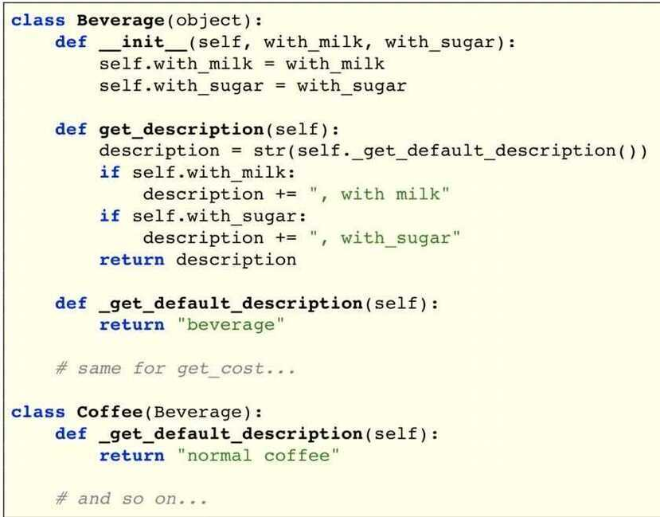

# Structural - Decorator

In [object-oriented programming](https://en.wikipedia.org/wiki/Object-oriented_programming), the **decorator pattern** is a [design pattern](https://en.wikipedia.org/wiki/Design_pattern_(computer_science)) that allows behavior to be added to an individual [object](https://en.wikipedia.org/wiki/Object_(computer_science)), either statically or dynamically, without affecting the behavior of other objects from the same [class](https://en.wikipedia.org/wiki/Class_(computer_science)).The decorator pattern is often useful for adhering to the [Single Responsibility Principle](https://en.wikipedia.org/wiki/Single_responsibility_principle), as it allows functionality to be divided between classes with unique areas of concern.The decorator pattern is structurally nearly identical to the [chain of responsibility pattern](https://en.wikipedia.org/wiki/Chain_of_responsibility_pattern), the difference being that in a chain of responsibility, exactly one of the classes handles the request, while for the decorator, all classes handle the request.

## Starbuzz Coffee

## Adding Ingredients: First Try

- But what if we want more ingredients? Open-closed principle?

## Adding Ingredients: Second Try

What we want:

- Adding a new ingredient like soy milk should not modify the original beverage classes
- Adding new ingredients should be simple and work automatically across all beverages

## Solution: Decorator Pattern

- Composition solves the problem
- Note: Do not confuse this with Python function decorators
