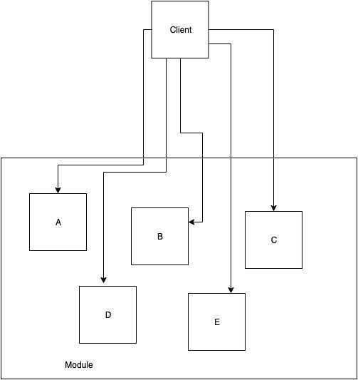
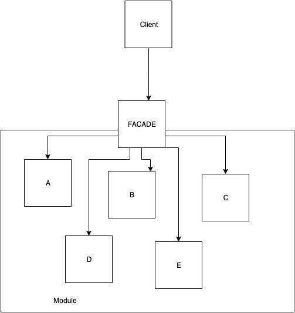

# Structural - Facade

According to [Gang of Four](https://en.wikipedia.org/wiki/Design_Patterns) definition, facade provides a simplified interface for a set of interfaces of a subsystem. It defines a convenient higher-level interface to interact with.

The facade decouples clients from subinterfaces of our modules. The client uses just one object - the facade, to delegate work to many separated components.The client doesn't have to know the details of our architecture - it is all hidden behind a clean interface of the facade.

Without Facade



The client knows the elements of module and orchestrates the work.

With Facade



The client doesn't know anything about subsystem, it communicates with the facade only.

When to use?

- when you want to provide an easy interface to interact with a more complicated system
- to decouple the clients from implementation details
- to use as an entry point to some submodule

Elements

- Facade- knows subsystem, orchestrates work, delegates requests to module components
- Submodule Class- elements of our module
- Client- uses facade to interact with the system

## Example implementation

Let's pretend that we're working on an e-commerce application. We want to implement product ordering. We already got a few services in our app, but they are not integrated.

```java
public interface InventoryService {
boolean isAvailable(int productId);
int order(int productId);
}
public interface ShipmentService {
void shipTo(int userId, int productId);
}
public interface NotificationService {
void notifyAboutOrder(int userId, int orderId);
void notifyAboutIssue(int userId);
}
```

(For simplicity, we use ints to represent users, orders etc.)
With those building blocks, we want to provide an API to order a product.

```java
public interface OrderFacade {
void order(int productId, int userId);
}
```

We don't want the client code to interact with all services just to make an order, so we provide nice and clean API with Facade.

Here's its implementation:

```java
public class DefaultOrderFacade implements OrderFacade {
// Dependencies could be injected using Dependency Injection tool
public DefaultOrderFacade(final InventoryService inventory,
final NotificationService notifications,
final ShipmentService shipments) {
this.inventory = inventory;
this.notifications = notifications;
this.shipments = shipments;
}

private final InventoryService inventory;
private final NotificationService notifications;
private final ShipmentService shipments;

@Override
public void order(int productId, int userId) {
if (inventory.isAvailable(productId)) {
final int orderId = inventory.order(productId);
shipments.shipTo(userId, productId);
notifications.notifyAboutOrder(userId, orderId);
} else {
notifications.notifyAboutIssue(userId);
}
}
}
```

In this way, instead of using three different services to make an order, we are using just one - the Facade. All services methods are hidden behind the facade - making an order is much simpler now.

```java
public class SomeClientCode {
// This could be injected by some DI framework
private OrderFacade orderfacde;
public static void main(String [] args) {
final int someProductId;
final int forSomeUserId;
// ordering product is much easier now with Facade
orderFacade.order(someProductId, forSomeUserId);
}
}
```

In real apps the services would have even more methods - we could hide them all and provide higher-level APIs by adding more methods to Facades.
