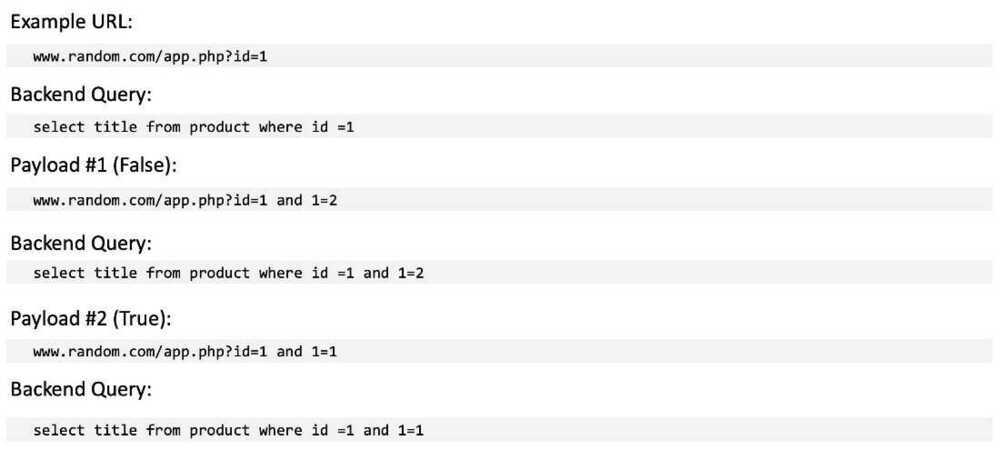

# Attacks

## Types of Security Attacks

### Passive Attack

They are having the nature of eavesdropping or monitoring of transmitting channel or packet sniffing

- Release of Message Content
- Traffic analysis used by intruder to gain the information

### Active Attack

Involves some modification of data stream or creation of false stream

- Masquerade
- Replay
- Modification
- Repudiation
- Denial of Service

## Return to Libc Attack (Buffer/Heap overflow attack)

It is a [computer security](https://en.wikipedia.org/wiki/Computer_security) attack usually starting with a [buffer overflow](https://en.wikipedia.org/wiki/Buffer_overflow) in which a subroutine [return address](https://en.wikipedia.org/wiki/Return_statement) on a [call stack](https://en.wikipedia.org/wiki/Call_stack) is replaced by an address of a subroutine that is already present in the process' executable memory, bypassing the [NX bit](https://en.wikipedia.org/wiki/NX_bit) feature (if present) and ridding the attacker of the need to inject their own code.- Modify the return address to point to some function already residing in memory. (This works because single stack is shared by all functions of a process (library or user program)).
Smashing the Stack for Fun and Profit by Aleph One

## MITM Attack (Meet in the Middle Attack)

MITM attack attempts to find a value using both of the range (ciphertext) and domain (plaintext) of the composition of several functions (or block cipher) such that forward mapping through the first functions is the same as backward mapping (inverse image) through the last functions, quite literally meeting in the middle of the composed function.
The Multidimensional MITM (MD-MITM) uses a combination of several simultaneous MITM-attacks as described above, where the meeting happens in the multiple positions in the composed function.
[Man in the Middle & Needham--Schroeder Protocol - Computerphile](https://youtu.be/EtpdLBeIaus)

## Return Oriented Programming

A technique by which an attacker can induce arbitrary behavior in a program whose control flow he has diverted - without injecting any code. A return-oriented programs chains together short instruction sequences already present in a program's address space, each of which ends in a "return" instruction.

## DNS Hijacking

Advertise malicious ip address for a DNS name

Where a different ip address is broadcasted for the DNS name, that is pointing to malicious attacker.

## SQL Injection

```python
Linwood_Cole\' OR 1=1;#
\'admin;--
```

## Types of SQL Injection


### In-Band SQL Injection

- In-band SQLi occurs when the attacker uses the same communication channel to both launch the attack and gather the result of the attack
    - Retrieved data is presented directly in the application web page
- Easier to exploit than other categories of SQLi
- Two common types of in-band SQLi
    - Error-based SQLi
    - Union-based SQLi

#### Error-Based SQLi

Error-based SQLi is an in-band SQLi technique that forces the database to generate an error, giving the attacker information upon which to refine their injection


#### Union-Based SQLi

Union-based SQLi is an in-band SQLi technique that leverages the UNION SQL operator to combine the results of two queries into a single result set


### Inferential (Blind) SQL Injection

- SQLi vulnerability where there is no actual transfer of data via the web application
- Just as dangerous as in-band SQL injection
    - Attacker able to recontrust the information by sending particular requests and observing the resulting behavior of the DB server
- Takes longer to exploit than in-band SQL injection
- Two common types of blind SQLi
    - Boolean-based SQLi
    - Time-based SQLi

#### Boolean-based Blind SQLi

Boolean-based SQLi is a blind SQLi technique that uses Boolean conditions to return a different result depending on whether the query returns a TRUE or FALSE result




#### Time-based Blind SQLi

- Time-based SQLi is a blind SQLi technique that relies on the database pausing for a specified amount of time, then returning the results, indicating a successful SQL query execution
- Example Query

If the first character of the administrator's hashed password is an 'a', wait for 10 seconds

- response takes 10 seconds -> first letter is 'a'
- response doesn't take 10 seconds -> first letter is not 'a'

### Out-of-band (OAST) SQLi

- Vulnerability that consists of triggering an out-of-band network connection to a system that you control
    - Not common
    - A variety of protocols can be used (ex. DNS, HTTP)
- Example Payload:


## Tools

[https://github.com/sqlmapproje ct/sqlmap](https://github.com/sqlmapproje%20ct/sqlmap)

[**https://www.netsparker.com/blog/web-security/sql-injection-cheat-sheet/**](https://www.netsparker.com/blog/web-security/sql-injection-cheat-sheet/)

https://dotweak.com/2019/08/16/sql-injection-tutorial-for-beginners-Zm5NSWw3MjJCUVMrT2hmWUdNeTZiQT09

https://www.freecodecamp.org/news/what-is-sql-injection-how-to-prevent-it

## Row Hammer Attack

Row hammer(also written asrowhammer) is a security exploit that takes advantage of an unintended and undesirable side effect in [dynamic random-access memory](https://en.wikipedia.org/wiki/Dynamic_random-access_memory)(DRAM) in which [memory cells](https://en.wikipedia.org/wiki/Memory_cell_(computing)) leak their charges by interactions between themselves, possibly leaking or changing the contents of nearby [memory rows](https://en.wikipedia.org/wiki/Memory_row) that were not [addressed](https://en.wikipedia.org/wiki/Memory_address) in the original memory access. This bypass of the isolation between DRAM memory cells results from the high cell density in modern DRAM, and can be triggered by specially crafted [memory access patterns](https://en.wikipedia.org/wiki/Memory_access_pattern) that rapidly activate the same memory rows numerous times. While cell charge leakage is normal and mitigated by refreshes, additional leakage occurs during a rowhammer attack which causes cells to leak enough charge to change its content within a refresh interval.

The row hammer effect has been used in some [privilege escalation](https://en.wikipedia.org/wiki/Privilege_escalation) computer security [exploits](https://en.wikipedia.org/wiki/Exploit_(computer_security)), and network-based attacks are also theoretically possible in a fast network connection between the attacker and victim.

Different hardware-based techniques exist to prevent the row hammer effect from occurring, including required support in some [processors](https://en.wikipedia.org/wiki/Central_processing_unit) and types of DRAM [memory modules](https://en.wikipedia.org/wiki/Memory_module). Row hammer rarely or never affects [DDR](https://en.wikipedia.org/wiki/DDR_SDRAM) and [DDR2](https://en.wikipedia.org/wiki/DDR2_SDRAM) SDRAM modules. It affects many [DDR3](https://en.wikipedia.org/wiki/DDR3_SDRAM) and [DDR4](https://en.wikipedia.org/wiki/DDR4_SDRAM) SDRAM modules.

https://en.wikipedia.org/wiki/Row_hammer

## HTTP Desync

Application Load Balancer (ALB) and Classic Load Balancer (CLB) now support HTTP Desync Mitigation Mode, a new feature that protects your application from issues due to HTTP Desync. Modern day web applications are typically built with a chain of proxies that ensure fast and reliable communication between clients and servers. While these proxies follow a standard mechanism to parse RFC 7230 compliant HTTP/1.1 requests, they may have differences in interpretation while parsing non-compliant requests. These differences in interpretation can cause Desync where different proxies in the chain may disagree on request boundaries and therefore may not process the same request. This could leave behind arbitrary messages that may be prepended to the next request in the queue and smuggled to the backend. Ultimately, request smuggling can make applications vulnerable to request queue or cache poisoning, which could lead to credential hijacking or execution of unauthorized commands.

https://portswigger.net/research/http-desync-attacks-request-smuggling-reborn

## Man-in-the-Middle attack (MITM)

A [man-in-the-middle attack](http://searchsecurity.techtarget.com/definition/man-in-the-middle-attack) is one in which the attacker secretly relays and possibly alters the communication between two parties who believe they are directly communicating with each other. One example is active eavesdropping, in which the attacker makes independent connections with the victims and relays messages between them to make them believe they are talking directly to each other over a private connection, when in fact the entire conversation is controlled by the attacker, who even has the ability to modify the content of each message. Often abbreviated to **MITM, MitM, orMITMA,** and sometimes referred to as asession hijacking attack, it has a strong chance of success if the attacker can impersonate each party to the satisfaction of the other. MITM attacks pose a serious threat to online security because they give the attacker the ability to capture and manipulate sensitive information in real-time while posing as a trusted party during transactions, conversations, and the transfer of data. This is straightforward in many circumstances; for example, an attacker within reception range of an unencrypted WiFi access point, can insert himself as a man-in-the-middle.

## Sybil attack

A **Sybil attack** is a type of attack on a computer [network service](https://en.wikipedia.org/wiki/Network_service "Network service") in which an attacker subverts the service's reputation system by creating a large number of [pseudonymous](https://en.wikipedia.org/wiki/Pseudonymity "Pseudonymity") identities and uses them to gain a disproportionately large influence. It is named after the subject of the book _[Sybil](https://en.wikipedia.org/wiki/Sybil_(Schreiber_book) "Sybil (Schreiber book)")_, a case study of a woman diagnosed with [dissociative identity disorder](https://en.wikipedia.org/wiki/Dissociative_identity_disorder "Dissociative identity disorder"). The name was suggested in or before 2002 by Brian Zill at [Microsoft Research](https://en.wikipedia.org/wiki/Microsoft_Research "Microsoft Research"). The term **pseudospoofing** had previously been coined by L. Detweiler on the [Cypherpunks mailing list](https://en.wikipedia.org/wiki/Cypherpunk#Etymology_and_the_Cypherpunks_mailing_list "Cypherpunk") and used in the literature on peer-to-peer systems for the same class of attacks prior to 2002, but this term did not gain as much influence as "Sybil attack".

[Sybil attack - Wikipedia](https://en.wikipedia.org/wiki/Sybil_attack)

## Network attacks

### Application Layer

- Pushing
- Malware injection
- DDos attacks

### Presentation Layer

- Encoding/decoding vulnerabilities
- Format string attacks
- Malicious code injection

### Session Layer

- Session hijacking
- Session fixation attacks
- Brute force attacks

### Transport Layer

- Man-in-the-middle attacks
- SYN/ACK flood

### Network Layer

- IP spoofing
- Route table manipulation
- DDos attacks

### Data Link Layer

- MAC address spoofing
- ARP spoofing
- VLAN hopping

### Physical Layer

- Wiretapping
- Physical tampering
- Electromagnetic interference


