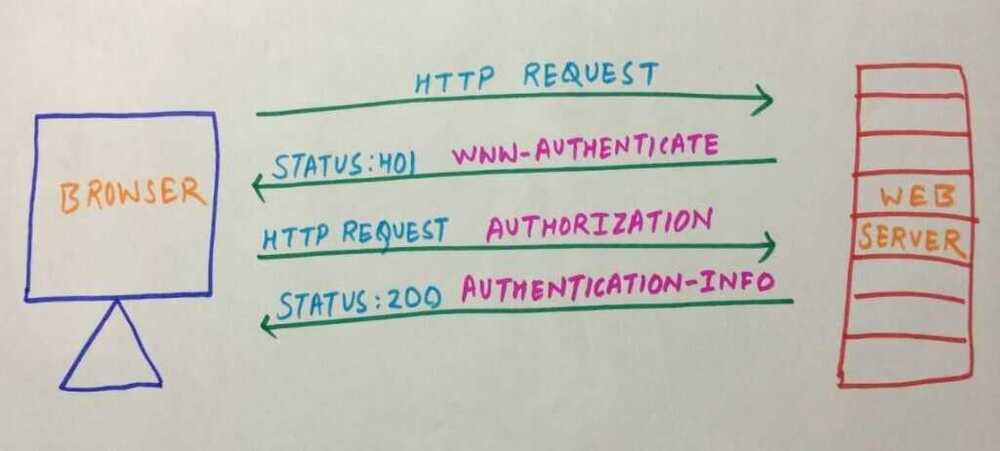

# HTTP Authentication

[RFC 7235](https://tools.ietf.org/html/rfc7235) defines the HTTP authentication framework which can be used by a server to [challenge](https://developer.mozilla.org/en-US/docs/Glossary/challenge) a client request and by a client to provide authentication information.
The general HTTP authentication framework is used by several authentication schemes. Schemes can differ in security strength and in their availability in client or server software.

The most common authentication scheme is the "Basic" authentication scheme which is introduced in more details below. IANA maintains a [list of authentication schemes](https://www.iana.org/assignments/http-authschemes/http-authschemes.xhtml), but there are other schemes offered by host services, such as Amazon AWS. Common authentication schemes include:

- Basic(see [RFC 7617](https://tools.ietf.org/html/rfc7617), base64-encoded credentials. See below for more information.),
- Bearer(see [RFC 6750](https://tools.ietf.org/html/rfc6750), bearer tokens to access OAuth 2.0-protected resources),
- Digest(see [RFC 7616](https://tools.ietf.org/html/rfc7616), only md5 hashing is supported in Firefox, see [bug472823](https://bugzilla.mozilla.org/show_bug.cgi?id=472823) for SHA encryption support),
- HOBA(see [RFC 7486](https://tools.ietf.org/html/rfc7486)(draft),HTTPOrigin-BoundAuthentication, digital-signature-based),
- Mutual(see [draft-ietf-httpauth-mutual](https://tools.ietf.org/html/draft-ietf-httpauth-mutual-11)),
- AWS4-HMAC-SHA256(see [AWS docs](http://docs.aws.amazon.com/AmazonS3/latest/API/sigv4-auth-using-authorization-header.html)).

## Phases

Basic and Digest authentication use a four step process to authenticate users.



First HTTP client makes a request to the web server. Request method doesn't has to be GET it can be any method. If web server sees that the requested resource need authentication to access then it sends backs 401 Unauthorized status code along with WWW-Authenticate header. And then client displays a dialog box to take username and password as input. Once the credentials has been enter the client sends it using the Authorization header. If the credentials are correct then server responds with 200 status code and Authentication-Info header.

If client sends wrong credentials in the Authorization request then server again responds with 401 status code. The client is allowed to try again and again.

This is the basic process followed by Basic and Digest models. Values assigned to the authentication headers is different for both models, this is why they differ.

## Basic Authentication

HTTP Basic authentication is a method for the client to provide a username and a password when making a request.

This is the simplest possible way to enforce access control as it doesn't require cookies, sessions or anything else. To use this, the client has to send theAuthorizationheader along with every request it makes. The username and password are not encrypted, but constructed this way:

- username and password are concatenated into a single string:username:password
- this string is encoded with Base64
- theBasickeyword is put before this encoded value

Example for a user named john with password secret:

```python
curl --header "Authorization: Basic am9objpzZWNyZXQ=" my-website.com

from requests.auth import HTTPBasicAuth

requests.get('https://api.github.com/user, auth=HTTPBasicAuth('user','pass'))
```

### Cons

- the username and password are sent with every request, potentially exposing them - even if sent via a secure connection
- connected to SSL/TLS, if a website uses weak encryption, or an attacker can break it, the usernames and passwords will be exposed immediately
- there is no way to log out the user using Basic auth
- expiration of credentials is not trivial - you have to ask the user to change password to do so

## Digest

In a digest authentication flow, the client sends a request to a server, which sends back nonce and realm values for the client to authenticate. The client sends back a hashed username and password with the nonce and realm. The server then sends back the requested data.

## References

https://developer.mozilla.org/en-US/docs/Web/HTTP/Authentication

http://docs.python-requests.org/en/master/user/authentication

http://qnimate.com/understanding-http-authentication-in-depth/#Basic_Authentication

https://nullsweep.com/http-security-headers-a-complete-guide

https://stackoverflow.blog/2021/10/06/best-practices-for-authentication-and-authorization-for-rest-apis
