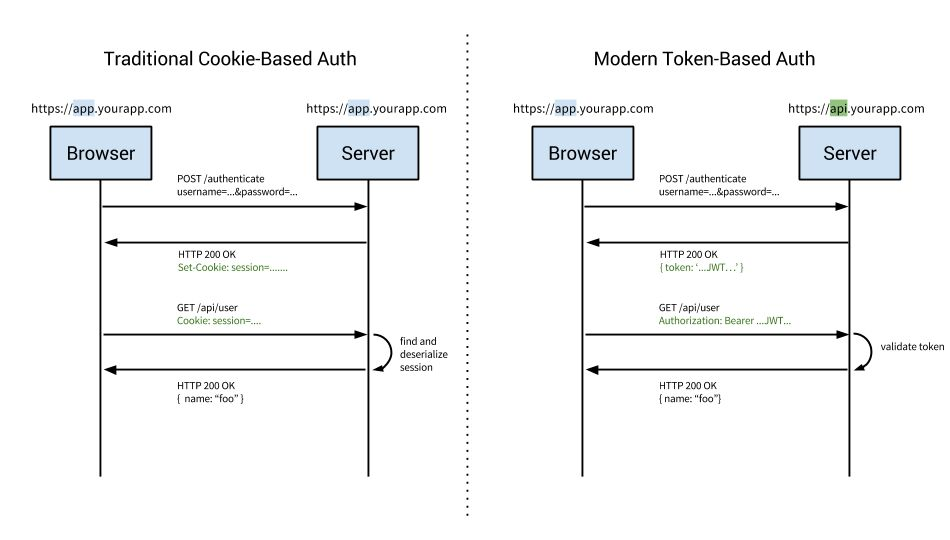

# Authentication

## Methods of Authentication

### Single Factor authentication

This is often used as the authentication process for lower risk systems. You only need a single factor to authenticate, with the most common being a password, so it's more vulnerable to phishing attacks and key loggers.

In addition to this, a recent [article](https://dataprot.net/statistics/password-statistics/) by DataProt showed that 78% of Gen-Z people utilize the same password for multiple services. This means that if an attacker gained access to one user account, they have a high probability of gaining access to others by simply using the same password.

### 2-Factor Authentication

This method is more secure, as it comprises two factors of authentication -- typically something you know, for example username and password , plus something you have / own, for example a phone SMS or a security token.

For 2-factor authentication, you would enter a one-time SMS password sent to your device, or perhaps a linked authenticator app code and provide an ever-changing access code.
As you can imagine, this is a lot more secure than simply entering a password, or a single authentication credential. You would need to know the login credentials, as well as have access to the physical device for the second part.

2-factor authentication has become very common amongst online services in recent years, and with many large companies it is the default authentication method. Many require that you setup 2-factor auth in order to even utilize the service.

[2FA - 2-Factor Authentication](two-2fa)

### Multi-Factor Authentication

Going one step further to make your authentication process even more secure is having 3 or more factors. This form of authentication usually works on the premise of:

- something you know (username + password or a username + security question and answer)
- something you have (mobile phone sms, authenticator app, USB key)
- something you are (like a fingerprint / face recognition)

For these reasons, multi-factor authentication offers the most protection, as you would need to compromise multiple factors, and these factors are a lot more difficult to "hack" or replicate.

The downside to this method of authentication, and the reason it's not utilized in many average systems, is it can be cumbersome to setup and maintain. So the data / system you're protecting really has to justify the need for such security.

https://auth0.com/learn/multifactor-authentication

## Types of Authentication

- Cookie-Based authentication
- Token-Based authentication
- Third party access(OAuth, API-token)
- OpenId
- SAML (Security Assertion Markup Language)

### Basic Access Authentication (BA)

In the context of an [HTTP](https://en.wikipedia.org/wiki/HTTP) transaction, basic access authentication is a method for an [HTTP user agent](https://en.wikipedia.org/wiki/User_agent)(e.g. a [web browser](https://en.wikipedia.org/wiki/Web_browser)) to provide a [user name](https://en.wikipedia.org/wiki/User_name) and [password](https://en.wikipedia.org/wiki/Password) when making a request. In basic HTTP authentication, a request contains a header field in the form of `Authorization: Basic <credentials>`, where credentials is the [Base64](https://en.wikipedia.org/wiki/Base64) encoding of ID and password joined by a single colon

HTTP Basic authentication (BA) implementation is the simplest technique for enforcing [access controls](https://en.wikipedia.org/wiki/Access_controls) to web resources because it does not require [cookies](https://en.wikipedia.org/wiki/HTTP_cookie), session identifiers, or login pages; rather, HTTP Basic authentication uses standard fields in the [HTTP header](https://en.wikipedia.org/wiki/HTTP_header).

The BA mechanism does not provide [confidentiality](https://en.wikipedia.org/wiki/Information_security#Confidentiality) protection for the transmitted credentials. They are merely encoded with [Base64](https://en.wikipedia.org/wiki/Base64) in transit and not [encrypted](https://en.wikipedia.org/wiki/Encryption) or [hashed](https://en.wikipedia.org/wiki/Cryptographic_hash) in any way. Therefore, basic authentication is typically used in conjunction with [HTTPS](https://en.wikipedia.org/wiki/HTTPS) to provide confidentiality.

Because the BA field has to be sent in the header of each HTTP request, the web browser needs to [cache](https://en.wikipedia.org/wiki/Cache_(computing)) credentials for a reasonable period of time to avoid constantly prompting the user for their username and password. Caching policy differs between browsers.

This is the simplest to implement and for some implementations can work well, however it requires transport level encryption as the user name and password are presented with ever request.

https://en.wikipedia.org/wiki/Basic_access_authentication

### Digest Access Authentication

Digest access authenticationis one of the agreed-upon methods a [web server](https://en.wikipedia.org/wiki/Web_server) can use to negotiate credentials, such as username or password, with a user's [web browser](https://en.wikipedia.org/wiki/Web_browser). This can be used to confirm the identity of a user before sending sensitive information, such as online banking transaction history. It applies a [hash function](https://en.wikipedia.org/wiki/Hash_function) to the username and [password](https://en.wikipedia.org/wiki/Password) before sending them over the network. In contrast, [basic access authentication](https://en.wikipedia.org/wiki/Basic_access_authentication) uses the easily reversible [Base64](https://en.wikipedia.org/wiki/Base64) encoding instead of hashing, making it non-secure unless used in conjunction with [TLS](https://en.wikipedia.org/wiki/Transport_Layer_Security).

Technically, digest authentication is an application of [MD5](https://en.wikipedia.org/wiki/MD5)[cryptographic hashing](https://en.wikipedia.org/wiki/Cryptographic_hash) with usage of [nonce](https://en.wikipedia.org/wiki/Cryptographic_nonce) values to prevent [replay attacks](https://en.wikipedia.org/wiki/Replay_attack). It uses the [HTTP](https://en.wikipedia.org/wiki/Hypertext_Transfer_Protocol) protocol.

https://en.wikipedia.org/wiki/Digest_access_authentication

### Cookie-Based Authentication (Stateful)

The client posts the login credential to the server, server verifies the credential and creates session id which is stored in server(state-full) and returned to client via set-cookie. On subsequent request the session id from the cookie is verified in the server and the request get processed. Upon logout session id will be cleared from both client cookie and server.

#### Flow

- Enter login credentials
- Server verifies given credentials, creates a session and stores in database.
- Cookie + Session ID will be kept in client side(User browser)
- For consequent requests, session ID will be verified against database.
- Session will be destroyed from client and server side once the use logs out
When a server receives an HTTP request in the response, it can send aSet-Cookie header. The browser puts it into a cookie jar, and the cookie will be sent along with every request made to the same origin in theCookieHTTP header.

#### Tips

- HttpOnly Cookies - To mitigate the possibility of XSS attacks always use theHttpOnlyflag when setting cookies. This way they won't show up indocument.cookies.
- Signed Cookies - With signed cookies, a server can tell if a cookie was modified by the client.

#### Cons

- The main disadvantage of using this authentication method is, server has to store all the session data for each and every user and increases the overhead in the server.
- Need to make extra effort to mitigate [CSRF attacks](https://www.owasp.org/index.php/Cross-Site_Request_Forgery_(CSRF))
- Incompatibility with REST - as it introduces a state into a stateless protocol

[Cookies - YouTube](https://www.youtube.com/playlist?list=PLQnljOFTspQXaimjxx6uGLJz6lR25abZn)

### Token-Based Authentication (Stateless)

Token based authenticationis gaining in popularity because of the rise in single page applications (SPA) and statelessness (RESTful API's) of the application. There are different ways to implement token based authentication, we will focussing on most commonly used JSON Web Token(JWT). On receiving the credentials from client the server validates the credentials and generates a signed JWT which contains the user information. Note, the token will never get stored in server(stateless). On subsequent request the token will be passed to server and gets verified(decoded) in the server. The token can be maintained at client side in local storage, session storage or even in cookies.

#### Flow

- User provides credentials
- Server verifies credentials and returns a signed token.
- Token is stored in client side
- Subsequent requests to the server will be sent with the token as authentication header (HTTP header).
- Server verifies the token (JSON web token) and return required data.
- Token is destroyed in client, once the user logs out.
- Ex - JWT

### Third-party Access

If we have a need to expose our API's outside of our system like third party app or even to access it from mobile apps we end up in two common ways to share the user information. Via *API-token* which is same as *JWT token*, where the token will be send via Authorization header which will get handled at API gateway to authenticate the user. And the other option is via *Open Authentication(OAuth)*, OAuth is a protocol that allows an application to authenticate against server as a user. The recommendation is to implement OAuth 1.0a or OAuth 2.0. OAuth 2.0 relies on HTTPS for security and it currently implemented by Google, Facebook, Twitter etc., OAuth 2 provides secured delegate access to a resource based on user. OAuth 2 does this by allowing a token to be issued by Identity provider to these third party applications, with the approval of user. The client then uses the token to access the resource on behalf of that user.

### SAML (Security Assertion Markup Language)

Makes use of the same Identity provider which we saw in OpenId, but it is XML based and more flexible. The recommended version for SAML is 2.0. SAML also provides a way to achieve Single SignOn(SSO), user can make use of the Identity provider URL to login into the system which redirects with XML data back to your application page which can then be decoded to get the user information. We have SAML providers like G Suite, Office 365, OneLogin, Okta etc.,
SAML is an XML-based open-standard for transferring identity data between two parties: an identity provider (IdP) and a service provider (SP).

Identity Provider - Performs authentication and passes the user's identity and authorization level to the service provider.

Service Provider - Trusts the identity provider and authorizes the given user to access the requested resource.

#### Benefits

- Improved User Experience:Users only need to sign in one time to access multiple service providers.
- Increased Security:SAML provides a single point of authentication, which happens at a secure identity provider, SAML provider can apply context-based policies to access applications.
- Loose Coupling of Directories:SAML doesn't require user information to be maintained and synchronized between directories.
- Reduced Costs for Service Providers:With SAML, you don't have to maintain account information across multiple services. The identity provider bears this burden.

https://duo.com/blog/the-beer-drinkers-guide-to-saml

#### Tricks

- For Single SignOn OpenId has taken most of the consumer market, SAML is often the choice for many enterprise application.
- If you have to support only web application go for Cookie or Token based authentication.
- If you have to support both web as well mobile client go with API-token with that of Cookie based authentication.
- On top of above authentication methods if needed we can also implement One Time Password(OTP), Two Factor Authentication(2FA), Email verification etc.,

### SSO

[Single Sign On Authentication](https://auth0.com/blog/what-is-and-how-does-single-sign-on-work/) provides your users with a seamless authentication experience when they navigate either through the applications you have built and/or third party apps. That is once you log into one of these applications, you won't have to enter your credentials again when entering another one, as you will be automatically logged in all of them, regardless of the platform, technology, or domain. Don't make your internal employees nor your external users go through the hassle of maintaining and remembering yet another credential.

Single Sign On works by having a central server, which all the applications trust. When you login for the first time a cookie gets created on this central server. Then, whenever you try to access a second application, you get redirected to the central server, if you already have a cookie there, you will get redirected directly to the app with a token, without login prompts, which means you're already logged in.

For example, Google implements Single Sign On in its services. Google's central server is [https://accounts.google.com](https://accounts.google.com/). Once you are logged in this server, you will be able to access Gmail, Youtube, and Google Docs without entering your credentials again.

## IAM - Identity and Access Management

- IdP - Identity Provider
- [ORY Hydra](https://www.ory.sh/) - https://github.com/ory/hydra
- [Keycloak](https://www.keycloak.org/)
- Okta
- Auth0
	- [FusionAuth: Auth. Built for Devs, by Devs](https://fusionauth.io/)
- Supertokens - https://supertokens.io
- **jumpcloud (Oyster)** - https://jumpcloud.com/daas-glossary/identity-management
- https://magic.link

https://withblue.ink/2020/04/08/stop-writing-your-own-user-authentication-code.html

## Signed Request

Request signing is the process to add authentication information to Credit Saison India requests sent by HTTP.

For security, all requests to Credit Saison India must be signed with your credentials, which consists of an Client ID and Client Secret. These two keys are commonly referred to as your security credentials.

When an Credit Saison India service receives the request, it performs the same steps that you did to calculate the signature you sent in your request. Credit Saison India then compares its calculated signature to the one you sent with the request. If the signatures match, the request is processed. If the signatures don't match, the request is denied. To get started with the signing process, see [Signing Credit Saison India Requests](http://ksf-documentation.s3-website.ap-south-1.amazonaws.com/#authentication-signing-credit-saison-india-requests)

1. Generate a Hash of your Request Body. Encode the body of your request using UTF-8 and generate a hash for it using the SHA256 algorithm and then converting into a Hex Digest. The Output would then be standardised into Uppercase. This would be called H1. Note: If your request contains no body. Your signature should be a hash of the literal  `null`
2. Adding a TimeStamp to the the request. Using this Credit Saison India's Servers would validate that the request that has been sent by you has been received by us with 10 minutes of your application having sent it. The TimeStamp needs to be in the [UNIX Time](http://unixtimestamp.50x.eu/about.php) milliseconds (13-digit) format. Denoted assignedDateand added to the request as a query parameter.
3. Create a Canonical Request to generate the Signature. Arrange the contents of your request (host, action, headers, etc.) into a standard (canonical) format. A Canonical request is just the representation of the all parts of a request in a single string seperated using annew line character. We will call this canonical request as C1. Note: We would not be using the header as part of the canonical request. Note: All query parameters need to be URL Encoded. Query parameters needs to be in a sorted in an ascending order while generating the canonical request
4. Generate a hash of the canonical request. Similar to Step 1 here we create a SHA256 Hash of C1 by first converting it to UTF-8 encoded string and then hashing it. We will call this hash as H2.
5. Generate a keyed Hash for the whole Request. The output of Step 4 (H2) is the final string that needs to be hashed using the client secret already shared with you.[HMAC](https://en.wikipedia.org/wiki/HMAC) requires a key and a hashing algorithm to create a signature. We are using the SHA256 algorithm and the client secret to create a signature here. We will call this signature asP1. P1 in turn needs to be BASE64 Encoded.
6. Add the Signature to the HTTP Request After you calculate the signature, add it to an HTTP header of the request to Credit Saison India' Servers using the header signature
7. Add Authentication Headers As part of the of your request to the Credit Saison India Servers. You would also have to pass the APIKey and Username as x-api-key and username Headers respectively.

## Passkeys / Passkey

[Passkeys](https://security.googleblog.com/2023/05/so-long-passwords-thanks-for-all-phish.html) are a new way to sign in to apps and websites. They’re both easier to use and more secure than passwords, so users no longer need to rely on the names of pets, birthdays or the infamous "password123." Instead, passkeys let users sign in to apps and sites the same way they unlock their devices: with a fingerprint, a face scan or a screen lock PIN. And, unlike passwords, passkeys are resistant to online attacks like phishing, making them more secure than things like SMS one-time codes.

Passkeys are easier:

- Users can select an account to sign in with. Typing the username is not required.
- Users can authenticate using device's screen lock such as a fingerprint sensor, facial recognition or PIN.
- Once a passkey is created and registered, the user can seamlessly switch to a new device and immediately use it without needing to re-enroll (unlike traditional biometric auth, which requires setup on each device).

Passkeys are safer:

- Developers only save a public key to the server instead of a password, meaning there's far less value for a bad actor to hack into servers, and far less cleanup to do in the event of a breach.
- Passkeys protect users from phishing attacks. Passkeys work only on their registered websites and apps; a user cannot be tricked into authenticating on a deceptive site because the browser or OS handles verification.
- Passkeys reduce costs for sending SMS, making them a safer and more cost-effective means for two-factor authentication.

[Passkeys Demo](https://passkeys-demo.appspot.com/)

[Passkeys: What they are and how to use them](https://blog.google/technology/safety-security/the-beginning-of-the-end-of-the-password/)

[Passwordless login with passkeys  |  Authentication  |  Google for Developers](https://developers.google.com/identity/passkeys)

## Summary

- Session - The server stores your identity and gives the browser a session ID cookie. This allows the server to track login state. But cookies don't work well across devices.
- Token - Your identity is encoded into a token sent to the browser. The browser sends this token on future requests for authentication. No server session storage is required. But tokens need encryption/decryption.
- JWT - JSON Web Tokens standardize identity tokens using digital signatures for trust. The signature is contained in the token so no server session is needed.
- SSO - Single Sign On uses a central authentication service. This allows a single login to work across multiple sites.
- OAuth2 - Allows limited access to your data on one site by another site, without giving away passwords.
- QR Code - Encodes a random token into a QR code for mobile login. Scanning the code logs you in without typing a password.

## Links

https://medium.com/@vivekmadurai/different-ways-to-authenticate-a-web-application-e8f3875c254a

https://blog.risingstack.com/web-authentication-methods-explained

[Identity and Access Management: Technical Overview](https://www.youtube.com/watch?v=Tcvsefz5DmA)
