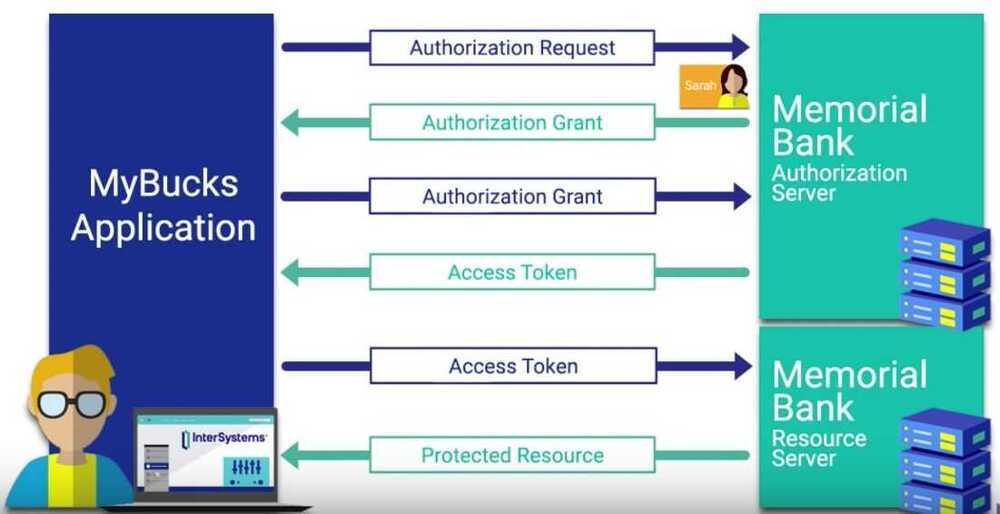
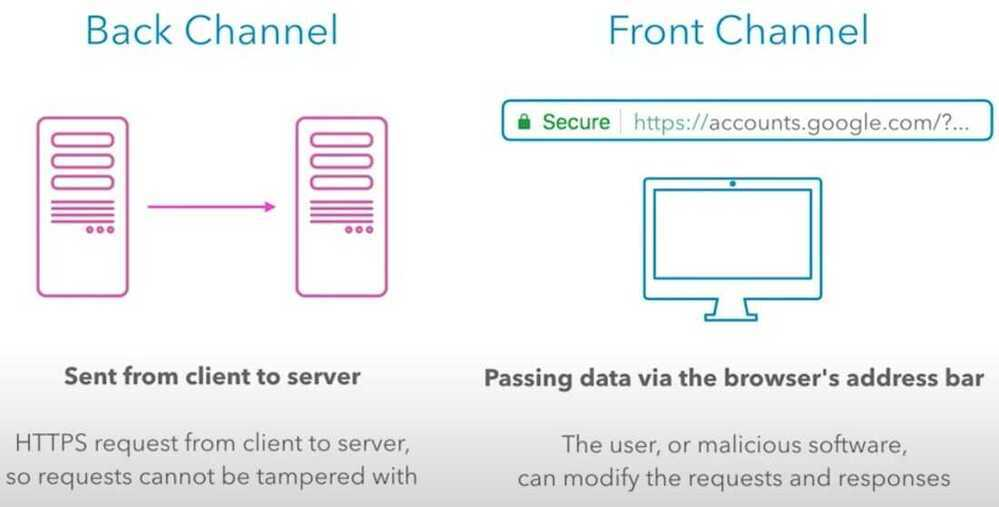

# OAuth

- OAuth is an open standard for access delegation
- OAuth provides to clients a "secure delegated access" to server resources on behalf of a resource owner
- OAuth2 is more of a framework than a defined protocol

[OAuth 2.0](https://oauth.net/2/) is a protocol that allows a user to grant limited access to their resources on one site, to another site, without having to expose their credentials.

According to [OAuth's website](http://oauth.net/about/) the protocol is not unlike a valet key.

Many luxury cars today come with a valet key. It is a special key you give the parking attendant and unlike your regular key, will not allow the car to drive more than a mile or two. Some valet keys will not open the trunk, while others will block access to your onboard cell phone address book. Regardless of what restrictions the valet key imposes, the idea is very clever. You give someone limited access to your car with a special key, while using your regular key to unlock everything.

## Workflow of OAuth 2.0

Throughout this workflow OAuth 2.0 serves as an authorization framework, the actual authentication of user occurs through OpenID Connect, through the use of ID tokens that are passed along with the access token.

## 4 Grant Types

Define how an application can retrieve tokens from your OAuth server and are used in different use cases.

### Authorization Code Grant

The Authorization Code flow is the most powerful and most secure by default. When the application redirects the user to the Identity Provider to authenticate, the IdP passes back a short-lived, one-time use authorization code. The application uses the authorization code to retrieve the Access Token.

The important part is twofold: First, by the time the user sees the authorization code, it's already been consumed and therefore can't be used again. Second, the Access Token is kept by the application in the backend. Assuming the application is built securely, a malicious user has to find another way to attack it.

Unfortunately, this doesn't work for client side applications such as many Javascript apps or most mobile apps as the application itself can be attacked or decompiled for sensitive information. Therefore, we need a different approach.

### Implicit Grant

The Implicit flow is designed specifically for mobile apps or client side Javascript apps where embedded credentials could be compromised. The mechanics are simple in that the application redirects the user to the Identity Provider to authenticate, the IdP passes back token(s), and the application uses it according to the scopes it has.

Since it's quite likely that the user could interact with the token(s), it's important that our use cases reflect that. If we have a banking app, allowing the send_wire_transfers_to_russia scope may be a bad idea unless we have additional factors baked into our authentication process to validate that the right user is using it. The next time you lose your phone, you'll appreciate that.

As a result, this is often used for OpenID Connect scenarios where a user wants to provide trusted profile information to a third party but not necessarily access or permissions to other systems. Since the underlying concepts are the same and the implementation looks very similar, it's most of the benefit for the same effort.

### Resource Owner Password (Password Grant)

Compared to the previous grant types, Resource Owner Password makes me nervous. With both the Authorization Code and Implicit flows, the application redirects the user to the Identity Provider to submit their username and password. As a result, the application never sees their credentials. With the Resource Owner Password flow, the application itself accepts the credentials and submits them on behalf of the user.

If the application is malicious or even just poorly developed, it could store those credentials and compromise the user's information. Therefore, you should only use this if you're building applications for your users to interact with your legacy systems. For example, a bank may implement this for an internal employee portal.

But remember: Fundamentally, you're training users to put their credentials into applications they may not trust which is a bad habit at best and a security risk at all times.

### Client Credential

The Client Credential grant type is designed exclusively for backend server to server operations. Think of it as a server's username and password. Conceptually, it's not far from how your application connects to other backend systems such as your database or Twilio. The benefit is that your OAuth provider can return configuration information or other details within the token itself.

Finally, since there's not a user involved, it doesn't support OpenID Connect.

https://auth0.com/docs/protocols/oauth2

Youtube - [OAuth 2.0: An Overview](https://www.youtube.com/watch?v=CPbvxxslDTU)

Youtube - [What is OAuth2? How does OAuth2 work? | Tech Primers](https://www.youtube.com/watch?v=bzGKgC3N7SY)

## OAuth

### Authorization Code

- Only valid for one-time use, since its only usage is to exchange it for an access token
- Expires very quickly (according to this [article](https://www.oauth.com/oauth2-servers/authorization/the-authorization-response/), the OAuth protocol's recommended maximum is 10 minutes, and many services' authorization codes expire even earlier)- **Access Token**
- Can be obtained using the authorization code
- Put in the headers of any API requests to Google on behalf of the user
- Expires after one hour (the expiration time may vary if you're using something besides Google)
- carry the necessary information to access a resource directly. In other words, when a client passes an access token to a server managing a resource, that server can use the information contained in the token to decide whether the client is authorized or not. Access tokens usually have an expiration date and are short-lived.- **Refresh Token**
- allows you to get new access tokens
- carry the information necessary to get a new access token. In other words, whenever an access token is required to access a specific resource, a client may use a refresh token to get a new access token issued by the authentication server. Common use cases include getting new access tokens after old ones have expired, or getting access to a new resource for the first time. Refresh tokens can also expire but are rather long-lived. Refresh tokens are usually subject to strict storage requirements to ensure they are not leaked. They can also be **blacklisted** by the authorization server.

## Sliding-sessions

Sliding-sessions are sessions that expire after aperiod of inactivity. As you can imagine, this is easily implemented using access tokens and refresh tokens. When a user performs an action, a new access token is issued. If the user uses an expired access token, the session is considered inactive and a new access token is required. Whether this token can be obtained with a refresh token or a new authentication round is required is defined by the requirements of the development team.

## OAuth vs OpenID Connect (OIDC)

The [OAuth 2.0 Framework](https://www.oauth.com/oauth2-servers/map-oauth-2-0-specs/) describes overarching patterns for granting authorization but does not define how to actually perform authentication. The application using OAuth constructs a specific request for permissions to a third party system - usually called an Identity Provider (IdP) - which handles the authentication process and returns an Access Token representing success. The IdP may require additional factors such as SMS or email but that is entirely outside the scope of OAuth. Finally, the contents and structure of that Access Token are undefined by default. This ambiguity guarantees that Identity Providers will build incompatible systems.

Luckily, [OpenID Connect](https://openid.net/connect/) or OIDC brings some sanity to the madness. It is an OAuth extension which adds and strictly defines an ID Token for returning user information. Now when we log in with our Identity Provider, it can return specific fields that our applications can expect and handle. The important thing to remember is that OIDC is just a special, simplified case of OAuth, not a replacement. It uses the same terminology and concepts.

https://blog.runscope.com/posts/understanding-oauth-2-and-openid-connect

## Map of OAuth 2.0 Specs

https://www.oauth.com/oauth2-servers/map-oauth-2-0-specs

https://tools.ietf.org/html/rfc6749

## PKCE - Proof-Key for Code Exchange (pronounced - pixie)

## OAuth 2.1

- Authorization Code + PKCE
- Client Credentials
- Tokens in HTTP Header
- Tokens in POST Form Body- RFC6749 - OAuth 2.0 Core
- RFC6750 - Bearer Token Usage
- RFC7636 - PKCE
- Native app and brower-based app BCPs (Best Current Practices)
- Security BCP
    - Must support PKCE for all client types
    - No password grant
    - No implicit flow
    - Exact string matching for redirect URIs
    - No access tokens in query strings
    - Refresh tokens must be sender-contrained or one-time use

https://www.youtube.com/watch?v=g_aVPdwBTfw

## OAuth2

OAuth2 is a specification that defines several ways to handle authentication and authorization.

It is quite an extensive specification and covers several complex use cases.

It includes ways to authenticate using a "third party".

That's what all the systems with "login with Facebook, Google, Twitter, GitHub" use underneath.

## OAuth 1

There was an OAuth 1, which is very different from OAuth2, and more complex, as it included directly specifications on how to encrypt the communication.

It is not very popular or used nowadays.

OAuth2 doesn't specify how to encrypt the communication, it expects you to have your application served with HTTPS.

## Others

https://developer.okta.com/docs/concepts/api-access-management

https://www.youtube.com/watch?v=996OiexHze0

