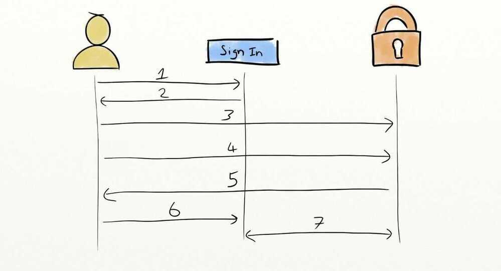

# OpenID

OpenIdis HTTP based protocol that uses identity provider to validate a user. The user password is secured with one identity provider, this allows other service providers a way to achieve Single SignOn(SSO) without requiring password from user. There are many OpenId enabled account on the internet and organizations such as Google, Facebook, Wordpress, Yahoo, PayPal etc., uses OpenId to authenticate users. The latest version of OpenId is OpenId Connect (OIDC), which provides OpenId(authentication) on top of OAuth 2.0 (authorization) for complete security solution.

## OIDC

It is an OAuth extension which adds and strictly defines an ID Token for returning user information. Now when we log in with our Identity Provider, it can return specific fields that our applications can expect and handle. The important thing to remember is that OIDC is just a special, simplified case of OAuth, not a replacement. It uses the same terminology and concepts.

[OpenID Connect](https://openid.net/connect/) is a flavor of OAuth2 supported by some OAuth2 providers, notably Azure Active Directory, Salesforce, and Google. The protocol's main extension of OAuth2 is an additional field returned with the access token called an [ID Token](https://openid.net/specs/openid-connect-core-1_0.html#IDToken). This token is a JSON Web Token (JWT) with well known fields, such as a user's email, signed by the server.

To identify the user, the authenticator uses theid_token(not theaccess_token) from the OAuth2 [token response](https://openid.net/specs/openid-connect-core-1_0.html#TokenResponse) as a bearer token. See [above](https://kubernetes.io/docs/reference/access-authn-authz/authentication/#putting-a-bearer-token-in-a-request) for how the token is included in a request.

https://openid.net/specs/openid-connect-core-1_0.html

The normal process of generating these tokens is much the same as it is in [OAuth 2.0](https://oauth.net/2/):

1. User hits the sign in button on the website,
2. The website redirects them to the Identity Provider,
3. Browser loads the Identity Provider login screen,
4. User logs in using their username and password,
5. Identity Provider redirects them back to the website with an authentication code in the query string,
6. Browser loads website with the authentication code in query string,
7. Website server exchanges the code for the ID token.

Once the server has this token, it can either use it to authenticate the user itself or it can provide it back to the user such that they can provide it to other services that trust the identity provider.
Kubernetes itself does not provide any sort of login website for OIDC authentication. It only consumes the tokens once you have retrieved them from some other means. This may leave you wondering where the trust relationship is formed between Kubernetes and the Identity Provider.

As mentioned earlier, the third part of the token is a signature, every ID token generated by an OIDC provider comes signed with a cryptographic key (usually RS256, generated and rotated periodically by the provider). By providing Kubernetes with the URL of the OIDC provider, Kubernetes can retrieve the public half of this key and verify that the token was indeed signed by the OIDC provider. At this point, Kubernetes will accept the token and trust the token's claim as to who the user is.

## Limitations

The id-token once generated cannot be revoked. Much like issuing certificates for auth, the id-token has an expiry time and it will authenticate the user until that time comes. This means the tokens are often only issued for 1 hour, but some providers do support requests for refresh tokens. Refresh tokens can be used (often indefinitely) to grant a new id-token and continue usage of the service.

[An Illustrated Guide to OAuth and OpenID Connect](https://www.youtube.com/watch?v=t18YB3xDfXI)

## OpenID Connect

OpenID Connect is another specification, based onOAuth2.
It just extends OAuth2 specifying some things that are relatively ambiguous in OAuth2, to try to make it more interoperable.
For example, Google login uses OpenID Connect (which underneath uses OAuth2).
But Facebook login doesn't support OpenID Connect. It has its own flavor of OAuth2.

## OpenID (not "OpenID Connect")

There was also an "OpenID" specification. That tried to solve the same thing asOpenID Connect, but was not based on OAuth2.

So, it was a complete additional system.

It is not very popular or used nowadays.

https://fastapi.tiangolo.com/tutorial/security
