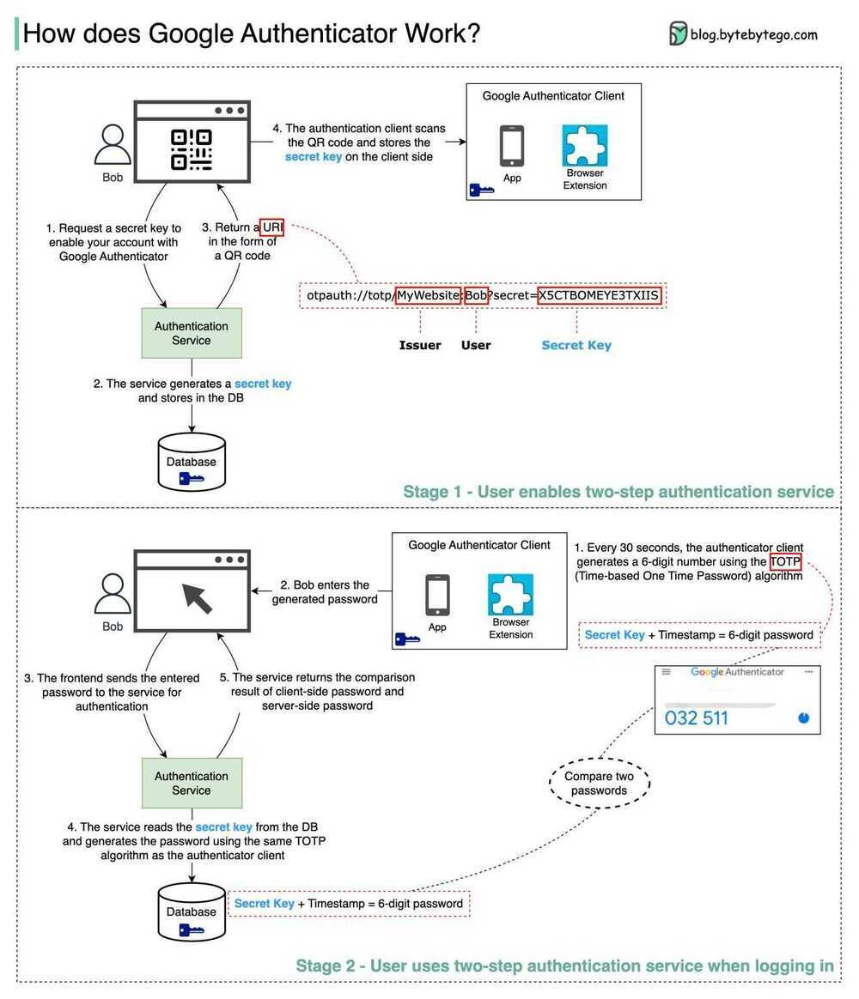

# 2FA  / 2-Factor Authentication

How does Google Authenticator (or other types of 2-factor authenticators) work?

Google authenticator is commonly used for logging into our accounts when 2-factor authentication is enabled. How does it guarantee security?

Google Authenticator is a software-based authenticator that implements a two-step verification service. The diagram below provides detail.

There are two stages involved:

- Stage 1 - The user enables Google two-step verification
- Stage 2 - The user uses the authenticator for logging in, etc.

### Stage 1

Steps 1 and 2: Bob opens the web page to enable two-step verification. The front end requests a secret key. The authentication service generates the secret key for Bob and stores it in the database.

Step 3: The authentication service returns a URI to the front end. The URI is composed of a key issuer, username, and secret key. The URI is displayed in the form of a QR code on the web page.

Step 4: Bob then uses Google Authenticator to scan the generated QR code. The secret key is stored in the authenticator.

### Stage 2

Steps 1 and 2: Bob wants to log into a website with Google two-step verification. For this, he needs the password. Every 30 seconds, Google Authenticator generates a 6-digit password using TOTP (Time-based One Time Password) algorithm. Bob uses the password to enter the website.

Steps 3 and 4: The front end sends Bob's password to the backend for authentication. The authentication service reads the secret key from the database and generates a 6-digit password using the same TOTP algorithm as the client.

Step 5: The authentication service compares the two passwords generated by the client and the server, and returns the comparison result to the front. Bob can proceed with the login process only if the two passwords match.

### Is this authentication mechanism safe?

- Can the secret key be obtained by others?

    We need to make sure the secret key is transmitted using HTTPS. The authenticator client and the database store the secret key, and we need to ensure the secret keys are encrypted.

- Can the 6-digit password be guessed by hackers?

    No. The password has 6 digits, so the generated password has 1 million potential combinations. Plus, the password changes every 30 seconds. If hackers want to guess the password in 30 seconds, they need to enter 30,000 combinations per second.
