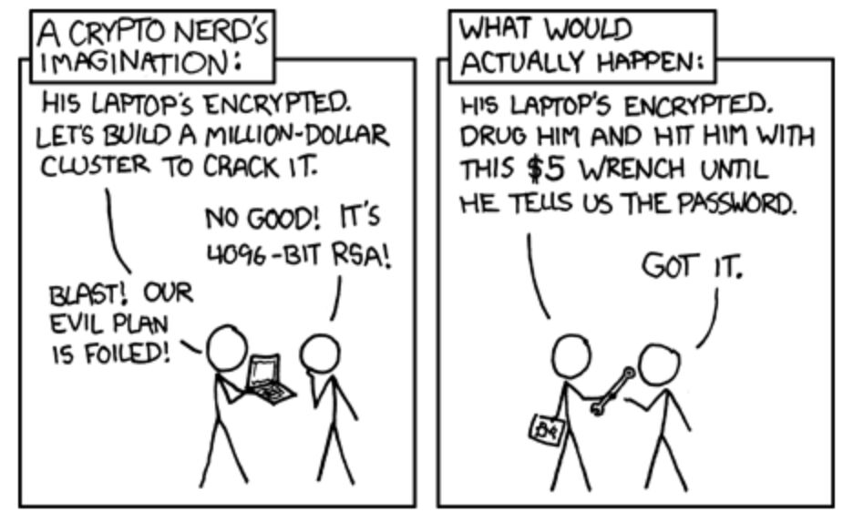
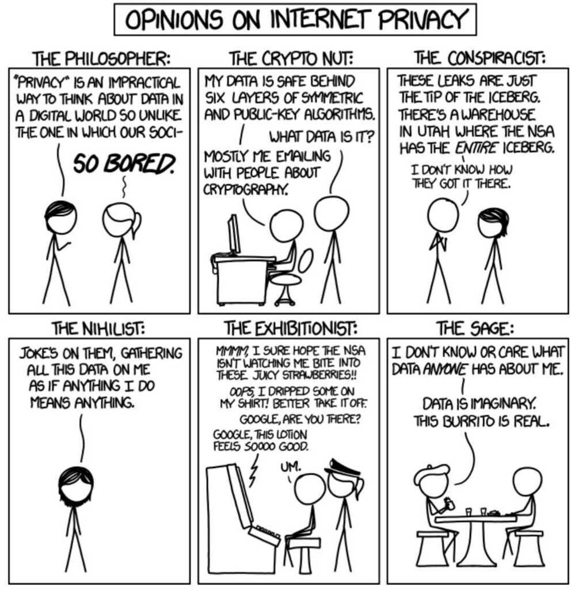

# Concepts

## Security Services

1. Data confidentiality
2. Data integrity
3. Authentication
4. Non-repudiation
5. Access Control

Alice, Bob and Trudy (Adversary)

## Authenticity vs Non-repudiation

Authenticity and non-repudiation are two of the five pillars of information assurance (IA) that are closely related but distinct security concepts

### Authenticity

Verifies the legitimacy of a sender or source of a message. Techniques used to establish authenticity include authentication, digital certificates, and biometric identification.

### Non-repudiation

Confirms the validity and legitimacy of a message, and binds an entity to a transaction so that it cannot later be repudiated. Non-repudiation is important to ensure that a party cannot deny having sent or received a message or transaction, and protects against message tampering and replay attacks.

[authentication - What is the difference between authenticity and non-repudiation? - Information Security Stack Exchange](https://security.stackexchange.com/questions/6730/what-is-the-difference-between-authenticity-and-non-repudiation)

## Managing Passwords and Application Secrets: Common Anti-Patterns

1. The Shared Password
2. The FILE
3. Sharing Over Email
4. Sharing Over Slack, Skype, SMS, iMessage, Whatsapp, etc.
5. Web-based Pastebin, Exploding Message, and Encrypted Chat Services
6. The Git Repo, Unencrypted
7. Gitignored Files and Environment Variables (The 12-Factor App Methodology)
8. The Git Repo, Encrypted
9. Not Protecting Development-Level Secrets
10. Custom Secrets Management
11. **Faith-based security (FBS)**, a cousin of Security Through Obscurity (STO)

https://blog.envkey.com/managing-passwords-and-secrets-common-anti-patterns-2d5d2ab8e8ca

## Access control models

### [Attribute-based Access Control](https://en.wikipedia.org/wiki/Attribute-based_access_control)(ABAC)

An access control paradigm whereby access rights are granted to users through the use of policies which evaluate attributes (user attributes, resource attributes and environment conditions)

### [Discretionary Access Control](https://en.wikipedia.org/wiki/Discretionary_Access_Control)(DAC)

In DAC, the data owner determines who can access specific resources. For example, a system administrator may create a hierarchy of files to be accessed based on certain permissions.

### [History-Based Access Control](https://en.wikipedia.org/w/index.php?title=History-based_Access_Control&action=edit&redlink=1)(HBAC)

Access is granted or declined based on the real-time evaluation of a history of activities of the inquiring party, e.g. behavior, time between requests, content of requests.For example, the access to a certain service or data source can be granted or declined on the personal behavior, e.g. the request interval exceeds one query per second.

### [History-of-Presence Based Access Control](https://en.wikipedia.org/w/index.php?title=History-of-Presence_Based_Access_Control&action=edit&redlink=1)(HPBAC)

Access control to resources is defined in terms of presence policies that need to be satisfied by presence records stored by the requestor. Policies are usually written in terms of frequency, spread and regularity. An example policy would be "The requestor has made k separate visitations, all within last week, and no two consecutive visitations are apart by more than T hours."

### [Identity-Based Access Control](https://en.wikipedia.org/wiki/Identity-based_security)(IBAC)

Using this network administrators can more effectively manage activity and access based on individual needs.

### [Mandatory Access Control](https://en.wikipedia.org/wiki/Mandatory_Access_Control)(MAC)

In MAC, users do not have much freedom to determine who has access to their files. For example, security clearance of users and classification of data (as confidential, secret or top secret) are used as security labels to define the level of trust.

### [Organization-Based Access control](https://en.wikipedia.org/wiki/Organisation-based_access_control)(OrBAC)

OrBAC model allows the policy designer to define a security policy independently of the implementation

### [Role-Based Access Control](https://en.wikipedia.org/wiki/Role-based_access_control)(RBAC)

RBAC allows access based on the job title. RBAC largely eliminates discretion when providing access to objects. For example, a human resources specialist should not have permissions to create network accounts; this should be a role reserved for network administrators.

- RABAC: Role-Centric Attribute-Based Access Control

https://en.wikipedia.org/wiki/Role-based_access_control

### [Rule-Based Access Control](https://en.wikipedia.org/w/index.php?title=Rule-based_access_control&action=edit&redlink=1)(RAC)

RAC method is largely context based. Example of this would be only allowing students to use the labs during a certain time of day.

### Responsibility Based Access control

Information is accessed based on the responsibilities assigned to an actor or a business role

https://en.wikipedia.org/wiki/Access_control

## Entity vs Identity

Entity is a **thing** that exists as an **individual unit** while identity is a **set of attributes that can be used to distinguish the entity within a context**.

Let's assume we know Mike. He is a young man who lives in Poland. He is working as a software engineer for one of the local IT startups. **Mike is the entity.He has many identities**i.e. he can be defined as a young polish man in one context and as a promising software engineer in another. Other people may perceive Mike (entity) using different subsets of his attributes (identities).

In the software world, your backend could be described as an entity. It's thething. Your UI application perceives it as a URL and a certificate (one identity). Your database, on the other hand, sees it as a different identity -- a set of credentials that grants access to the database.

## Authentication vs Authorization (AuthN vs AuthZ)

**Authentication** is the process of ascertaining that somebody really is who he claims to be.In practical terms, it's the process of verifying username and password (login)

Authentication is a form of confirming the identity of the entity.

**Authorization** refers to rules that determine who is allowed to do what. E.g. Adam may be authorized to create and delete databases, while Usama is only authorized to read

Authorization is a process of verifying if a given entity can access or perform actions on a given resource

## AAA (Authentication, Authorization and Audit)

AAA refers to [Authentication](https://en.wikipedia.org/wiki/Authentication), [Authorization](https://en.wikipedia.org/wiki/Authorization) and [Accounting](https://en.wikipedia.org/wiki/Accounting). It is used to refer to a family of protocols that mediate network access

## Auditing

- What happened?
- When it happened?
- Who initiated it?
- On what did it happen?
- Where was it observed?
- From where was it initiated?
- To where was it going?

https://en.wikipedia.org/wiki/AAA_(computer_security)

## Certificate Authority

CA - Trusted entity that if the public key is from the correct target.

A certificate authority (CA) is a third-party organization with 3 main objectives:

1. Issuing certificates
2. Confirming the identity of the certificate owner
3. Providing proof that the certificate is valid

A root store is basically a database of trusted CAs.

Apple, Windows, and Mozilla run their own root stores that they pre-install in your computer or device.

Which certificate should you buy? You have basically 3 flavors.

1. Domain validated. The certificate just verifies the domain name, and nothing else. You probably need this one.
2. Organization validated. The certificate requires the validation and manual verification of the organization behind the certificate.
3. Extended validation. The certificate requires an exhaustive verification of the business.

How do certificates get validated?

- When a CA issues a certificate, they sign the certificate with their root certificate pre-installed in the root store.
- Most of the time it's an intermediate certificate signed with a root certificate.
- If a cat-astrophy would occur and the root certificate is compromised, it's easier to revoke the intermediate certificates, since the root certificates are installed on each device.
- Let's walk through how a certificate is validated. The process is based on a 'chain of trust'.
- Your browser connects to a site via HTTPS and downloads the certificate. (The certificate is not a root certificate.)
- Your browser downloads the certificate that was used to sign the certificate on the site. (But this certificate is still not the root certificate.)
- Your browser once more looks up the certificate that signed the intermediate certificate. (It's the root certificate!)
- The entire certificate chain is trusted, and thus the site certificate is trusted as well.
- In the event that the last certificate is not a root certificate, and there are no more certificates to download, the chain is untrusted.

https://howhttps.works/certificate-authorities

[GitHub - letsencrypt/boulder: An ACME-based certificate authority, written in Go.](https://github.com/letsencrypt/boulder)

- This is an implementation of an ACME-based CA. The [ACME protocol](https://github.com/ietf-wg-acme/acme/) allows the CA to automatically verify that an applicant for a certificate actually controls an identifier, and allows domain holders to issue and revoke certificates for their domains. Boulder is the software that runs [Let's Encrypt](https://letsencrypt.org/).

## CSR (Certificate Signing Request)

A CSR or Certificate Signing request is a block of encoded text that is given to a Certificate Authority when applying for an SSL Certificate. It is usually generated on the server where the certificate will be installed and contains information that will be included in the certificate such as the organization name, common name (domain name), locality, and country. It also contains the public key that will be included in the certificate. A private key is usually created at the same time that you create the CSR, making a key pair. A CSR is generally encoded using ASN.1 according to the PKCS #10 specification.

A [certificate authority](https://www.sslshopper.com/certificate-authority-reviews.html) will use a CSR to create your SSL certificate, but it does not need your private key. You need to keep your private key secret. The certificate created with a particular CSR will only work with the private key that was generated with it. So if you lose the private key, the certificate will no longer work.

https://www.sslshopper.com/what-is-a-csr-certificate-signing-request.html

## Server Name Indication(SNI)

Server Name Indication(SNI) is an extension to the [Transport Layer Security](https://en.wikipedia.org/wiki/Transport_Layer_Security)(TLS) computer [networking protocol](https://en.wikipedia.org/wiki/Networking_protocol) by which a [client](https://en.wikipedia.org/wiki/Client_(computing)) indicates which [hostname](https://en.wikipedia.org/wiki/Hostname) it is attempting to connect to at the start of the handshaking process.This allows a server to present multiple [certificates](https://en.wikipedia.org/wiki/Public_key_certificate) on the same [IP address](https://en.wikipedia.org/wiki/IP_address) and [TCP port](https://en.wikipedia.org/wiki/TCP_port) number and hence allows multiple secure ([HTTPS](https://en.wikipedia.org/wiki/HTTP_Secure)) websites (or any other [service](https://en.wikipedia.org/wiki/Server_(computing)#Types_of_servers) over TLS) to be served by the same IP address without requiring all those sites to use the same certificate. It is the conceptual equivalent to HTTP/1.1 name-based [virtual hosting](https://en.wikipedia.org/wiki/Virtual_hosting), but for HTTPS. The desired hostname is not encrypted in the original SNI extension, so an eavesdropper can see which site is being requested.

Server Name Indication (SNI) is an extension to the TLS protocol by which a client indicates the hostname to connect to at the start of the TLS handshake. The load balancer can present multiple certificates through the same secure listener, which enables it to support multiple secure websites using a single secure listener. Application Load Balancers also support a smart certificate selection algorithm with SNI. If the hostname indicated by a client matches multiple certificates, the load balancer determines the best certificate to use based on multiple factors including the capabilities of the client.

https://en.wikipedia.org/wiki/Server_Name_Indication

## What is ESNI (Encrypted Server Name Indication)?

Encrypted Server Name Indication (ESNI) is an extension to TLS 1.3 which prevents eavesdroppers from knowing the domain name of the website network users are connecting to. When combined with encrypted DNS, it is not possible to know which websites a user is visiting.

## Security Certificates

1. .csr (Certificate Signing Request)
2. .pem (Privacy Enhanced Mail)
3. .key
4. .pkcs12 .pfx .p12 (contain both private and public certificate pair)
5. .cert (recognized by windows explorer)

https://serverfault.com/questions/9708/what-is-a-pem-file-and-how-does-it-differ-from-other-openssl-generated-key-file/9717#9717

https://cryptopals.com/sets/1

## PEM file

Privacy-Enhanced Mail(PEM) is a [de facto](https://en.wikipedia.org/wiki/De_facto) file format for storing and sending cryptographic [keys](https://en.wikipedia.org/wiki/Key_(cryptography)), [certificates](https://en.wikipedia.org/wiki/Public_key_certificate), and other data, based on a set of 1993 [IETF](https://en.wikipedia.org/wiki/Internet_Engineering_Task_Force) standards defining "privacy-enhanced mail." While the original standards were never broadly adopted, and were supplanted by [PGP](https://en.wikipedia.org/wiki/Pretty_Good_Privacy) and [S/MIME](https://en.wikipedia.org/wiki/S/MIME), the textual encoding they defined became very popular.

PEM data is commonly stored in files with a ".pem" suffix, a ".cer" or ".crt" suffix (for certificates), or a ".key" suffix (for public or private keys).The label inside a PEM file represents the type of the data more accurately than the file suffix, since many different types of data can be saved in a ".pem" file.

A PEM file may contain multiple instances. For instance, an operating system might provide a file containing a list of trusted [CA certificates](https://en.wikipedia.org/wiki/CA_certificate), or a web server might be configured with a "chain" file containing an end-entity certificate plus a list of intermediate certificates.

https://en.wikipedia.org/wiki/Privacy-Enhanced_Mail

## IAM

Identity and Access Management (IAM) is the security discipline that enables the right individuals to access the right resources at the right times for the right reasons. IAM addresses the mission-critical need to ensure appropriate access to resources across increasingly heterogeneous technology environments.

Enterprises traditionally used on-premises IAM software to manage identity and access policies, but nowadays, as companies add more cloud services to their environments, the process of managing identities is getting more complex. Therefore, adopting cloud-based Identity-as-a-Service (IDaaS) and cloud IAM solutions becomes a logical step.

Cloud IAM typically includes the following features:

- Single Access Control Interface. Cloud IAM solutions provide a clean and consistent access control interface for all cloud platform services. The same interface can be used for all cloud services.
- Enhanced Security. You can define increased security for critical applications.
- Resource-level Access Control. You can define roles and grant permissions to users to access resources at different granularity levels.

https://auth0.com/learn/cloud-identity-access-management

## Privacy

Privacy is not for the passive. -- Jeffrey Rosen

Privacy-enhancing technologies (PETs)

The problem of matching records using an identifier while preserving privacy has been well studied as a class of algorithms called private set intersection.

https://engineering.fb.com/open-source/private-matching

Secret Introduction Problem

## Differential Privacy

Differential privacy aims to maximize the accuracy of queries from statistical databases while minimizing the chances of identifying its records - it adds noise and provides guarantees against a "privacy budget"

## Clients

- Confidential Client
    - Applications running on the server
- Public Client
    - SPA / JS apps running in browsers / Mobile apps / Embedded devices

https://www.youtube.com/watch?v=5cQNwifDq1U

## pwned

The word "pwned" has origins in video game culture and is a [leetspeak](https://en.wikipedia.org/wiki/Leetspeak) derivation of the word "owned", due to the proximity of the "o" and "p" keys. It's typically used to imply that someone has been controlled or compromised, for example "I was pwned in the Adobe data breach".

[Have I Been Pwned: FAQs](https://haveibeenpwned.com/FAQs)
