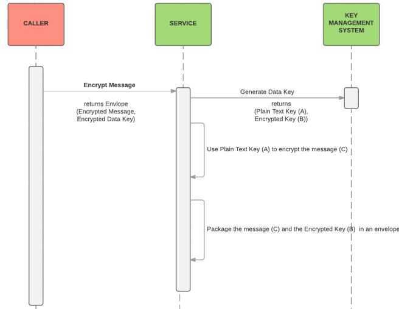
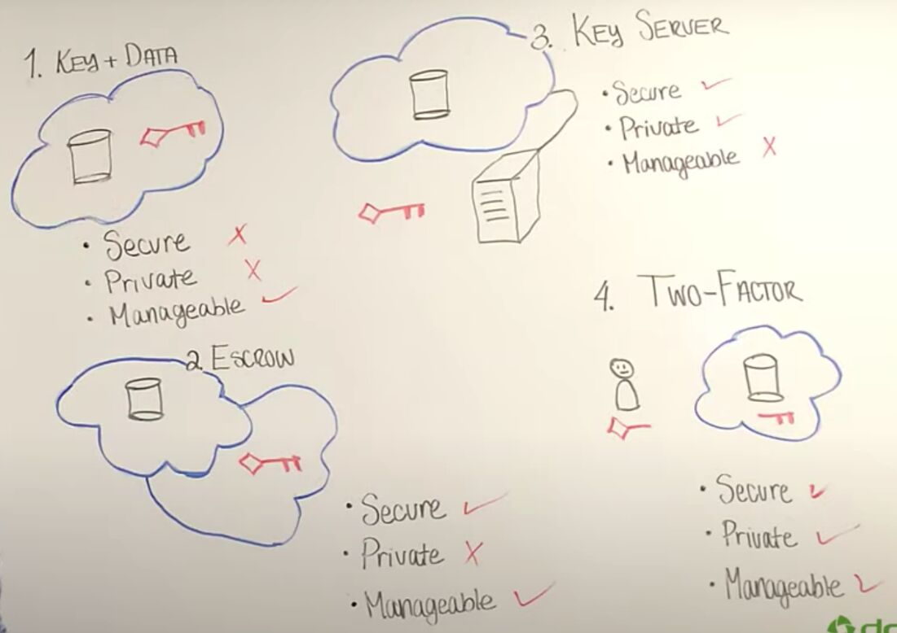
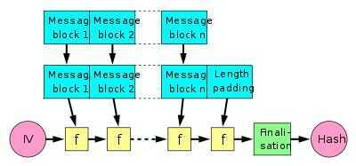

# Cryptography Terms

## Cryptographic Techniques

1. Substitution - is one in which the letters of the plaintext are replace by other letters

   - Mono Alphabetic Substitution
   - Poly Alphabetic Substitution

2. Transposition (Permutation) - Method of disguising text or alphabet by shuffling or exchanging their position

CSPRNGs (Cryptographically Secure Pseudo-Random Number Generators), also known as Deterministic Random Bit Generators (DRBGs)

1. PRNG (Psuedo-random)

   - Generates a random number with an even distribution
   - Can be seeded to "re-roll" the same random values
   - Random.new and rand()

2. Gaussian/Normal distribution

   - Generates random numbers but distributes them closed to the "center" mark of zero

3. Perlin Noise

   - Takes an (x), (x,y), (x,y,z) coordinate and returns a value from Float32:Max to Float32:Min
   - Attempts to normally distribute, at least from my understanding of the rubygem I ported

## Semantic Security

In [cryptography](https://en.wikipedia.org/wiki/Cryptography), asemantically secure [cryptosystem](https://en.wikipedia.org/wiki/Cryptosystem) is one where only negligible information about the [plaintext](https://en.wikipedia.org/wiki/Plaintext) can be feasibly extracted from the [ciphertext](https://en.wikipedia.org/wiki/Ciphertext). Specifically, any [probabilistic, polynomial-time algorithm](https://en.wikipedia.org/wiki/PP_(complexity))(PPTA) that is given the ciphertext of a certain messagem (taken from any distribution of messages), and the message's length, cannot determine any partial information on the message with probability [non-negligibly](https://en.wikipedia.org/wiki/Negligible_function) higher than all other PPTA's that only have access to the message length (and not the ciphertext).This concept is the computational complexity analogue to [Shannon's](https://en.wikipedia.org/wiki/Claude_Shannon) concept of [perfect secrecy](https://en.wikipedia.org/wiki/Perfect_secrecy). Perfect secrecy means that the ciphertext reveals no information at all about the plaintext, whereas semantic security implies that any information revealed cannot be feasibly extracted.

https://en.wikipedia.org/wiki/Semantic_security

## Forward Secrecy

In cryptography, **forward secrecy(FS), also known as perfect forward secrecy(PFS)**, is a feature of specific key agreement protocols that gives assurances that session keys will not be compromised even if the private key of the server is compromised.Forward secrecy protects past sessions against future compromises of secret keys or passwords.By generating a unique session key for every session a user initiates, the compromise of a single session key will not affect any data other than that exchanged in the specific session protected by that particular key.

Forward secrecy further protects data on the transport layer of a network that uses common SSL/TLS protocols, including [OpenSSL](https://en.wikipedia.org/wiki/OpenSSL), which had previously been affected by the [Heartbleed](https://en.wikipedia.org/wiki/Heartbleed) security bug. If forward secrecy is used, encrypted communications and sessions recorded in the past cannot be retrieved and decrypted should long-term secret keys or passwords be compromised in the future, even if the adversary actively interfered, for example via a [man-in-the-middle attack](https://en.wikipedia.org/wiki/Man-in-the-middle_attack).

The value of forward secrecy depends on the assumed capabilities of an adversary. Forward secrecy has value if an adversary is assumed to be able to obtain secret keys from a device (READ access) but not modify the way keys are generated in a device (WRITE access). In some cases an adversary who can read keys from a device may also be able to modify the functioning of the session key generator. In these cases forward secrecy has no value.

https://en.wikipedia.org/wiki/Forward_secrecy

## Envelope Encryption

Envelope encryption is the practice of encrypting data with a data encryption key (DEK) and then encrypting the DEK with a root key that you can fully manage.

Envelope Encryption is an approach/process used within many applications to encrypt data. Using this approach your data is protected two-fold.

## How does this work ?

- Typically there are manylong term keys or master keysthat isheld in a key management system (KMS).
- When you need to encrypt some message :
    - A request is sent to the KMS to generate a data keybased on one of the master keys.
    - KMS returns a data key, which usually contains both the plain text version and the encrypted version of the data key.
    - The message is encrypted using the plain text key.
    - Then both the encrypted message and the encrypted data key are packaged into a structure (sometimes called envelope) and written.
    - The plain text key is immediately removed from memory.
- When it comes time to decrypt the message:
    - The encrypted data key is extracted from the envelope.
    - KMS is requested to decrypt the data key using the same master key as that was used to generate it.
    - Once the plain text version of the data key is obtained then the encrypted message itself is decrypted.

Using this approach if one wants to decrypt data, they need be authenticated with the KMS, since the master keys are only held there and never exported, and only the KMS can decrypt the data keys.

https://devender.me/2016/07/13/envelope-encryption

https://www.druva.com/blog/druva-tech-moments-digital-envelope-encryption https://crypto.stackexchange.com/questions/3965/what-is-the-main-difference-between-a-key-an-iv-and-a-nonce

A [key](https://en.wikipedia.org/wiki/Key_(cryptography)), in the context of [symmetric cryptography](https://en.wikipedia.org/wiki/Symmetric-key_algorithm), is something you keep secret. Anyone who knows your key (or can guess it) can decrypt any data you've encrypted with it (or forge any authentication codes you've calculated with it, etc.)

(There's also "asymmetric" or [public key cryptography](https://en.wikipedia.org/wiki/Public-key_encryption), where the key effectively has two parts: the private key, which allows decryption and/or signing, and a public key (derived from the corresponding private key) which allows encryption and/or signature verification.)

An [IV](https://en.wikipedia.org/wiki/Initialization_vector) or initialization vector is, in its broadest sense, just the initial value used to start some iterated process. The term is used in a couple of different contexts and implies different security requirements in each of them. For example, [cryptographic hash functions](https://en.wikipedia.org/wiki/Cryptographic_hash_function) typically have a fixed IV, which is just an arbitrary constant which is included in the hash function specification and is used as the initial hash value before any data is fed in

Conversely, most [block cipher modes of operation](https://en.wikipedia.org/wiki/Block_cipher_modes_of_operation) require an IV which is random and unpredictable, or at least unique for each message encrypted with a given key. (Of course,ifeach key is only ever used to encrypt a single message, one can get away with using a fixed IV.) This random IV ensures that each message encrypts differently, such that seeing multiple messages encrypted with the same key doesn't give the attacker any more information than just seeing a single long message. In particular, it ensures that encrypting thesamemessage twice yields two completely different ciphertexts, which is necessary in order for the encryption scheme to be [semantically secure](https://en.wikipedia.org/wiki/Semantic_security).

In any case, the IV never needs to be kept secret - if it did, it would be a key, not an IV. Indeed, in most cases, keeping the IV secret would not be practical even if you wanted to since the recipient needs to know it in order to decrypt the data (or verify the hash, etc.).

A [nonce](https://en.wikipedia.org/wiki/Cryptographic_nonce), in the broad sense, is just "a number used only once". The only thing generally demanded of a nonce is that it should never be used twice (within the relevant scope, such as encryption with a particular key). The unique IVs used for block cipher encryption qualify as nonces, but various other cryptographic schemes make use of nonces as well

There's some variation about which of the terms "IV" and "nonce" is used for different block cipher modes of operation: some authors use exclusively one or the other, while some make a distinction between them. For CTR mode, in particular, some authors reserve the term "IV" for the full cipher input block formed by the concatenation of the nonce and the initial counter value (usually a block of all zero bits), while others prefer not to use the term "IV" for CTR mode at all. This is all complicated by the fact that there are several variations on how the nonce/IV sent with the message in CTR mode is actually mapped into the initial block cipher input.
Conversely, for modes other than CTR (or related modes such as EAX or GCM), the term "IV" is almost universally preferred over "nonce". This is particularly true for CBC mode since it has requirements on its IV (specifically, that they are unpredictable) which go beyond the usual requirement of uniqueness expected of nonces.

## Initialization vector

In [cryptography](https://en.wikipedia.org/wiki/Cryptography), aninitialization vector(IV) orstarting variable(SV) is an input to a [cryptographic primitive](https://en.wikipedia.org/wiki/Cryptographic_primitive) being used to provide the initial state. The IV is typically required to be [random](https://en.wikipedia.org/wiki/Random) or [pseudorandom](https://en.wikipedia.org/wiki/Pseudorandom), but sometimes an IV only needs to be unpredictable or unique.[Randomization](https://en.wikipedia.org/wiki/Randomization) is crucial for some [encryption](https://en.wikipedia.org/wiki/Encryption) schemes to achieve [semantic security](https://en.wikipedia.org/wiki/Semantic_security), a property whereby repeated usage of the scheme under the same [key](https://en.wikipedia.org/wiki/Cryptographic_key) does not allow an attacker to infer relationships between (potentially similar) segments of the encrypted message. For [block ciphers](https://en.wikipedia.org/wiki/Block_cipher), the use of an IV is described by the [modes of operation](https://en.wikipedia.org/wiki/Block_cipher_mode_of_operation).

Some cryptographic primitives require the IV only to be non-repeating, and the required randomness is derived internally. In this case, the IV is commonly called a [nonce](https://en.wikipedia.org/wiki/Cryptographic_nonce)(number used once), and the primitives (e.g.[CBC](https://en.wikipedia.org/wiki/Block_cipher_mode_of_operation#CBC)) are consideredstatefulrather thanrandomized. This is because an IV need not be explicitly forwarded to a recipient but may be derived from a common state updated at both sender and receiver side. (In practice, a short nonce is still transmitted along with the message to consider message loss.) An example of stateful encryption schemes is the [counter mode](https://en.wikipedia.org/wiki/Counter_mode) of operation, which has a [sequence number](https://en.wikipedia.org/wiki/Sequence_number) for a nonce.

The IV size depends on the cryptographic primitive used; for block ciphers it is generally the cipher's block-size. In encryption schemes, the unpredictable part of the IV has at best the same size as the key to compensate for [time/memory/data tradeoff attacks](https://en.wikipedia.org/wiki/Time/memory/data_tradeoff_attack). When the IV is chosen at random, the probability of collisions due to the [birthday problem](https://en.wikipedia.org/wiki/Birthday_problem) must be taken into account. Traditional stream ciphers such as [RC4](https://en.wikipedia.org/wiki/RC4) do not support an explicit IV as input, and a custom solution for incorporating an IV into the cipher's key or internal state is needed. Some designs realized in practice are known to be insecure; the [WEP](https://en.wikipedia.org/wiki/Wired_Equivalent_Privacy) protocol is a notable example, and is prone to related-IV attacks.

Two of the same messages encrypted with the same key, but different IVs, will result in different ciphertext. This makes an attacker's job more difficult

A random IV is not a secret. It is no more sensitive than the ciphertext itself. You can transmit it along with the ciphertext without concern

The only secret in a properly designed crypto system is the key (and obviously the plaintext). Everything else (IVs, salts, algorithms, padding, everything) is assumed be be known by attackers.

https://stackoverflow.com/questions/38059749/handling-transfer-of-iv-initialization-vectors

https://en.wikipedia.org/wiki/Initialization_vector

## MAC (Message Authentication Code)

In [cryptography](https://en.wikipedia.org/wiki/Cryptography), a**message authentication code**(**MAC**), sometimes known as a*tag*, is a short piece of information used to [authenticate a message](https://en.wikipedia.org/wiki/Message_authentication) - in other words, to confirm that the message came from the stated sender (its authenticity) and has not been changed. The MAC value protects both a message's [data integrity](https://en.wikipedia.org/wiki/Data_integrity) as well as its [authenticity](https://en.wikipedia.org/wiki/Message_authentication), by allowing verifiers (who also possess the secret key) to detect any changes to the message content.
Informally, a message authentication code consists of three algorithms:

- A key generation algorithm selects a key from the key space uniformly at random.
- A signing algorithm efficiently returns a tag given the key and the message.
- A verifying algorithm efficiently verifies the authenticity of the message given the key and the tag. That is, return *accepted*when the message and tag are not tampered with or forged, and otherwise return *rejected*
https://en.wikipedia.org/wiki/Message_authentication_code

## Message Integrity Codes (MIC) / MACs (Message Authentication Code)

- Attacks
    - Existential Forgery
    - Selective Forgery
    - Key recovery
- Merkle-Damgard Iterated Construction
- HMAC (Hash-MAC)
- Encrypted CBC-MAC (ECBC-MAC)s
- NMAC (nested MAC)

## HMAC (Hash MAC)

In [cryptography](https://en.wikipedia.org/wiki/Cryptography), anHMAC(sometimes expanded as eitherkeyed-hash message authentication codeorhash-based message authentication code) is a specific type of [message authentication code](https://en.wikipedia.org/wiki/Message_authentication_code)(MAC) involving a [cryptographic hash function](https://en.wikipedia.org/wiki/Cryptographic_hash_function) and a secret [cryptographic key](https://en.wikipedia.org/wiki/Cryptographic_key). It may be used to simultaneously verify both **the [data integrity](https://en.wikipedia.org/wiki/Data_integrity) and the [authentication](https://en.wikipedia.org/wiki/Authentication) of a [message](https://en.wikipedia.org/wiki/Cleartext),** as with any MAC. Any cryptographic hash function, such as [SHA-256](https://en.wikipedia.org/wiki/SHA-256) or [SHA-3](https://en.wikipedia.org/wiki/SHA-3), may be used in the calculation of an HMAC; the resulting MAC algorithm is termed HMAC-X, where X is the hash function used (e.g. HMAC-SHA256 or HMAC-SHA3). The cryptographic strength of the HMAC depends upon the [cryptographic strength](https://en.wikipedia.org/wiki/Cryptographic_strength) of the underlying hash function, the size of its hash output, and the size and quality of the key.

HMAC uses two passes of hash computation. The secret key is first used to derive two keys -- inner and outer. The first pass of the algorithm produces an internal hash derived from the message and the inner key. The second pass produces the final HMAC code derived from the inner hash result and the outer key. Thus the algorithm provides better immunity against [length extension attacks](https://en.wikipedia.org/wiki/Length_extension_attack).

https://en.wikipedia.org/wiki/HMAC
