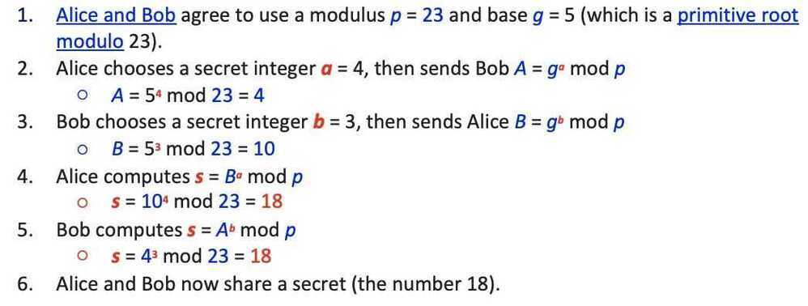

# Diffie-Hellman Key Exchange

Diffie-Hellman key exchange (DH)is a method of securely exchanging [cryptographic keys](https://en.wikipedia.org/wiki/Key_(cryptography)) over a public channel and was one of the first [public-key protocols](https://en.wikipedia.org/wiki/Public-key_cryptography) as originally conceptualized by [Ralph Merkle](https://en.wikipedia.org/wiki/Ralph_Merkle) and named after [Whitfield Diffie](https://en.wikipedia.org/wiki/Whitfield_Diffie) and [Martin Hellman](https://en.wikipedia.org/wiki/Martin_Hellman)

The simplest and the original implementation of the protocol uses the [multiplicative group of integers modulo](https://en.wikipedia.org/wiki/Multiplicative_group_of_integers_modulo_n)*p*, where *p* is [prime](https://en.wikipedia.org/wiki/Prime_number), and *g* is a [primitive root](https://en.wikipedia.org/wiki/Primitive_root_modulo_n)[modulo](https://en.wikipedia.org/wiki/Modular_arithmetic) *p*. These two values are chosen in this way to ensure that the resulting shared secret can take on any value from 1 to *p* --1. Here is an example of the protocol, with non-secret values in blue, and secret values in **red**.

Both Alice and Bob have arrived at the same value s, because, under mod p,
More specifically,

Note that only *a*, *b*, and (*g^ab^*mod*p*=*g^ba^*mod*p*) are kept secret. All the other values -- *p*,*g*,*g^a^*mod*p*, and *g^b^*mod*p* -- are sent in the clear. Once Alice and Bob compute the shared secret they can use it as an encryption key, known only to them, for sending messages across the same open communications channel.
