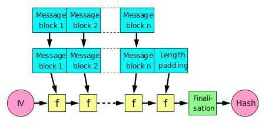

# Hash Function Design

### Merkle--Damgård construction

A hash function must be able to process an arbitrary-length message into a fixed-length output. This can be achieved by breaking the input up into a series of equal-sized blocks, and operating on them in sequence using a [one-way compression function](https://en.wikipedia.org/wiki/One-way_compression_function). The compression function can either be specially designed for hashing or be built from a block cipher. A hash function built with the Merkle--Damgård construction is as resistant to collisions as is its compression function; any collision for the full hash function can be traced back to a collision in the compression function.
The last block processed should also be unambiguously [length padded](https://en.wikipedia.org/wiki/Padding_(cryptography)); this is crucial to the security of this construction. This construction is called the [Merkle--Damgård construction](https://en.wikipedia.org/wiki/Merkle%E2%80%93Damg%C3%A5rd_construction). Most common classical hash functions, including [SHA-1](https://en.wikipedia.org/wiki/SHA-1) and [MD5](https://en.wikipedia.org/wiki/MD5), take this form.

#### Wide pipe vs narrow pipe

A straightforward application of the Merkle--Damgård construction, where the size of hash output is equal to the internal state size (between each compression step), results in anarrow-pipehash design. This design causes many inherent flaws, including [length-extension](https://en.wikipedia.org/wiki/Length_extension_attack), multicollisions, long message attacks, generate-and-paste attacks, and also cannot be parallelized. As a result, modern hash functions are built on wide-pipe constructions that have a larger internal state size - which range from tweaks of the Merkle--Damgård construction to new constructions such as the [sponge construction](https://en.wikipedia.org/wiki/Sponge_construction) and [HAIFA construction](https://en.wikipedia.org/wiki/HAIFA_construction).None of the entrants in the [NIST hash function competition](https://en.wikipedia.org/wiki/NIST_hash_function_competition) use a classical Merkle--Damgård construction.
Meanwhile, truncating the output of a longer hash, such as used in SHA-512/256, also defeats many of these attacks.

### Salt

A "salt" is a random piece of data that is often added to the data you want to hash before you actually hash it. Adding a salt to your data before hashing it will make the output of the hash function different than it would be if you had only hashed the data.
When a user sets their password (often on signing up), a random salt should be generated and used to compute the password hash. The salt should then be stored with the password hash. When the user tries to log in, combine the salt with the supplied password, hash the combination of the two, and compare it to the hash in the database.

#### Why should you use a salt?

Without going into too much detail, hackers commonly use [rainbow table attacks](https://www.geeksforgeeks.org/understanding-rainbow-table-attack/), [dictionary attacks](https://en.wikipedia.org/wiki/Dictionary_attack), and [brute-force attacks](http://www.tenminutetutor.com/data-formats/cryptography/attacks-on-hash-algorithms/) to try and crack password hashes. While hackers can't compute the original password given only a hash, they can take a long list of possible passwords and compute hashes for them to try and match them with the passwords in the database. This is effectively how these types of attacks work, although each of the above works somewhat differently.

A salt makes it much more difficult for hackers to perform these types of attacks. Depending on the hash function, salted hashes take nearly exponentially more time to crack than unsalted ones. They also make rainbow table attacks nearly impossible. It's therefore important to always use salts in your hashes.

https://dev.to/kmistele/how-to-securely-hash-and-store-passwords-in-your-next-application-4e2f

## Key derivation function

In [cryptography](https://en.wikipedia.org/wiki/Cryptography), a key derivation function (KDF) is a [cryptographic hash function](https://en.wikipedia.org/wiki/Cryptographic_hash_function) that derives one or more [secret keys](https://en.wikipedia.org/wiki/Key_(cryptography)) from a secret value such as a main key, a [password](https://en.wikipedia.org/wiki/Password), or a [passphrase](https://en.wikipedia.org/wiki/Passphrase) using a [pseudorandom function](https://en.wikipedia.org/wiki/Pseudorandom_function). KDFs can be used to stretch keys into longer keys or to obtain keys of a required format, such as converting a group element that is the result of a [Diffie--Hellman key exchange](https://en.wikipedia.org/wiki/Diffie%E2%80%93Hellman_key_exchange) into a symmetric key for use with [AES](https://en.wikipedia.org/wiki/Advanced_Encryption_Standard). [Keyed cryptographic hash functions](https://en.wikipedia.org/wiki/HMAC) are popular examples of pseudorandom functions used for key derivation.

There are many forms of KDF's, and not all functions used as KDF are explicitly named as KDF's. For instance, the KDF of TLS is simply called "the PRF" for Pseudo-Random-Functions, which is a much more generic term.

Key derivation functions derive bytes suitable for cryptographic operations from passwords or other data sources using a pseudo-random function (PRF). Different KDFs are suitable for different tasks such as:

#### Cryptographic key derivation

Deriving a key suitable for use as input to an encryption algorithm. Typically this means taking a password and running it through an algorithm such as [PBKDF2HMAC](https://cryptography.io/en/latest/hazmat/primitives/key-derivation-functions/#cryptography.hazmat.primitives.kdf.pbkdf2.PBKDF2HMAC) or [HKDF](https://cryptography.io/en/latest/hazmat/primitives/key-derivation-functions/#cryptography.hazmat.primitives.kdf.hkdf.HKDF). This process is typically known as [key stretching](https://en.wikipedia.org/wiki/Key_stretching).

#### Password storage

When storing passwords you want to use an algorithm that is computationally intensive. Legitimate users will only need to compute it once (for example, taking the user's password, running it through the KDF, then comparing it to the stored value), while attackers will need to do it billions of times. Ideal password storage KDFs will be demanding on both computational and memory resources.

[What is a Cryptographic Hashing Function? (Example + Purpose) - YouTube](https://www.youtube.com/watch?v=gTfNtop9vzM)
