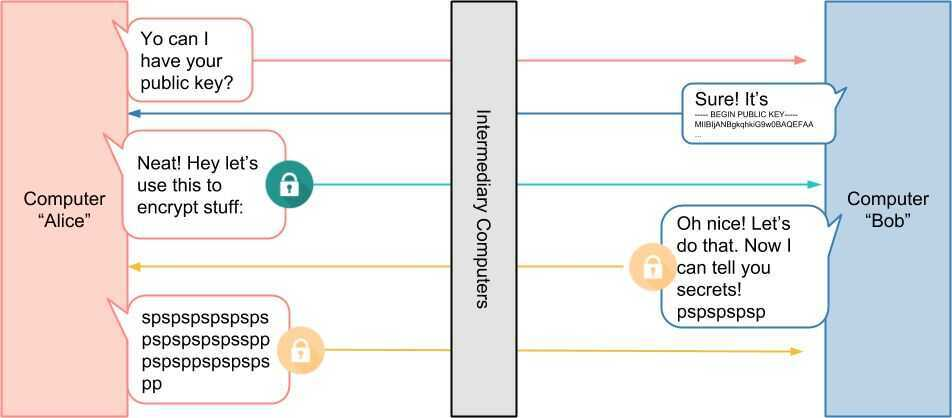
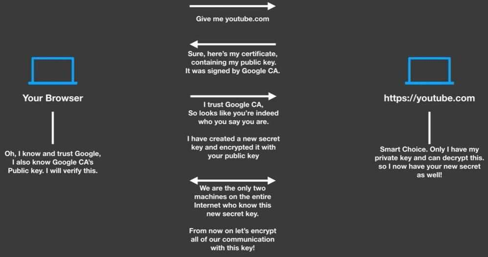

# Public-key cryptography

Public key cryptography, orasymmetrical cryptography, is any cryptographic system that uses pairs of [keys](https://en.wikipedia.org/wiki/Cryptographic_key):public keyswhich may be disseminated widely, andprivate keyswhich are known only to the owner. This accomplishes two functions:[authentication](https://en.wikipedia.org/wiki/Authentication_protocol), where the public key verifies that a holder of the paired private key sent the message, and [encryption](https://en.wikipedia.org/wiki/Encryption), where only the paired private key holder can decrypt the message encrypted with the public key

In a public key encryption system, any person can encrypt a message using the receiver's public key. That encrypted message can only be decrypted with the receiver's private key. To be practical, the generation of a public and private key-pair must be computationally economical. The strength of a public key cryptography system relies on the computational effort (work factorin cryptography) required to find the private key from its paired public key. Effective security only requires keeping the private key private; the public key can be openly distributed without compromising security

## Public Key Infrastructure (PKI)

- Relies on a centralized authority, aka Certificate Authority (CA)
- Users generally have their own identities - public-private key pair which is attested by the CA and stored in the form of certificates
- X.509 certificate format

https://medium.com/sitewards/the-magic-of-tls-x509-and-mutual-authentication-explained-b2162dec4401

