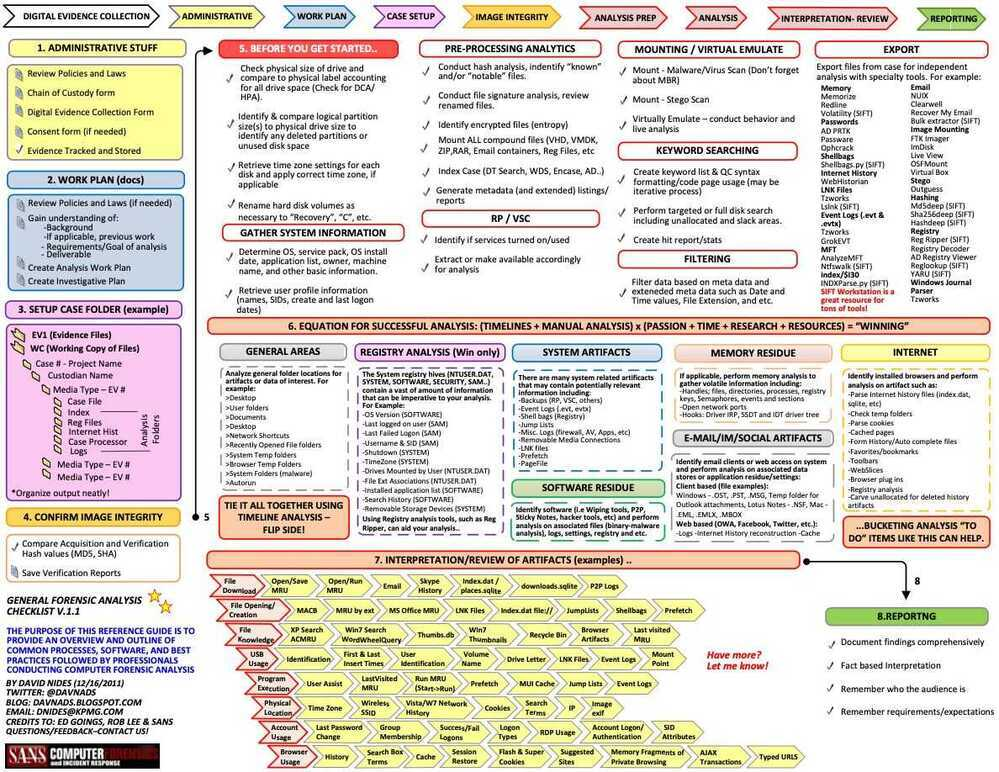
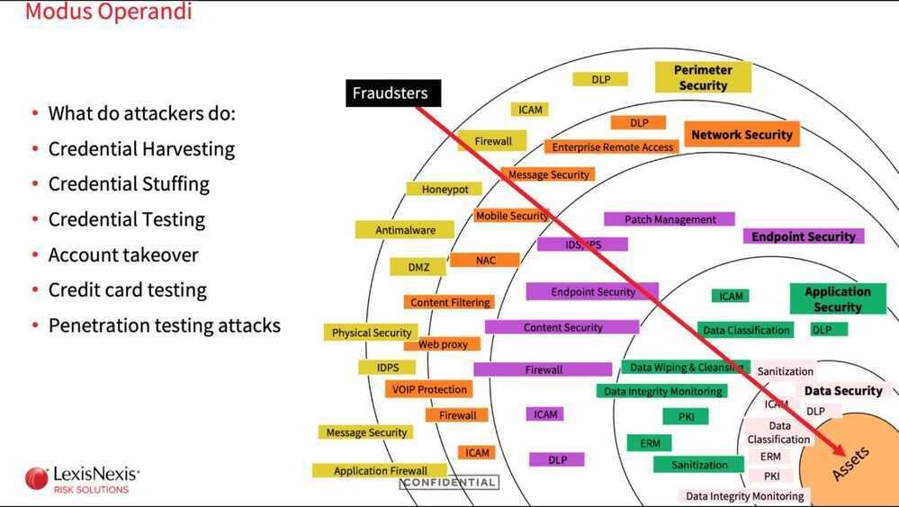

# Ethical Hacking

- https://www.shodan.io/host/182.71.91.174
- [jenkins - Shodan Search](https://www.shodan.io/search?query=jenkins)
- https://github.com/arthaud/git-dumper/blob/master/git-dumper.py
- https://securitytrails.com/domain/example.com/history/a
- https://www.youtube.com/watch?v=3Kq1MIfTWCE
- [GitHub - Hack-with-Github/Awesome-Hacking: A collection of various awesome lists for hackers, pentesters and security researchers](https://github.com/Hack-with-Github/Awesome-Hacking)

## CISSP

CISSP is a popular cyber security certification. Risk Management, Security Architecture, Network Security, Identity & Access Management, SecOps, and more

https://www.freecodecamp.org/news/get-ready-to-pass-cissp-exam

## White Hat hackers

A white hat hacker is an individual who uses hacking skills to identify security vulnerabilities in hardware, software or networks. However, unlike black hat hackers, white hat hackers respect the rule of law as it applies to hacking.

## Gray Hat Hackers

Gray hat hackers fall between white and black hats on the moral spectrum. Gray hats generally consider themselves good guys who are more flexible about the rules under which they operate. For example, a gray hat hacker may be more likely than a white hat hacker to access systems without getting permission or authorization from the owners, but would be less likely than a black hat hacker to cause damage to those systems. While not typically motivated by financial gain, gray hat hackers may try to get the owners of a system they've hacked to pay them to patch or fix those systems.

## Black Hat Hackers

A black hat hacker has no qualms about selling vulnerabilities and exploits to the highest bidder, such as a criminal organization, usually for the purpose of exploiting them. Black hat hackers are willing to break the law to discover, create and use security flaws maliciously for personal gain or to make a political statement.

## Websites

- https://www.quora.com/Are-there-any-website-that-I-can-hack-legally-for-practice
- [**https://hack.me/**](https://hack.me/)
- https://hackthissite.org
- https://w3challs.com
- https://dst.com.ng/15-vulnerable-sites-legally-practice-hacking-skills
- [**https://tryhackme.com/**](https://tryhackme.com/)
- https://haveibeenpwned.com
- Damn Vulnerable Web Application (DVWA) - http://www.dvwa.co.uk

## Tools

- Festin - FestIn is a tool for discovering open S3 Buckets starting from a domains. - https://github.com/cr0hn/festin
- [GitHub - swisskyrepo/PayloadsAllTheThings: A list of useful payloads and bypass for Web Application Security and Pentest/CTF](https://github.com/swisskyrepo/PayloadsAllTheThings)

## Digital Forensics

| **SOLUTIONS** | **PARTNERS/OEM's** |
|---|---|
| **Cloud Security(WAF, NGFW), Email Security, Firewall** | Cisco/ PaloAlto/Fortinet/Sophos/Barracuda |
| **DLP** | Forcepoint, Cososys, Netskope |
| **End Point** | Sophos, TrendMicro, Crowdstrike, FireEye |
| **Collaboration** | Cisco/ Polycom |
| **Enterprise Networking** | Cisco/Hpe |
| **Network Access Control** | Cisco ISE, FortiNac |
| **MultiFactor Authentication** | Cisco Duo, RSA |
| **Back up Solutions** | Veeam |
| **Web Security** | NetSkope, Forcepoint |
| **Micro Segmentation** | Cisco Teteration, Color Token |
| **Storage Solutions** | Dell, Netapp |
| **Inventory& Ticketing Tool** | Motadata, Sapphire IMS |
| **Vulnerability Assessment** | Tenable, Holmsecurity |
| **Network Monitoring Tool** | Motadata, Whatsup Gold, Solarwinds |
| **Performance Monitoring & Analytics** | Acreedian |
| **Load Balancing & WAF** | F5, Array Networks |
| **SD-WAN** | Cisco Viptela, CATO Networks |
| **CASB** | Netskope, Forcepoint, Paloalto |
| **MDM** | Vmware, SOTI, Citrix, Meraki |
| **Structured Cabling** | Belden, Siemon, Saffron Networks |

## Master data management (MDM)

Master data management (MDM) is a technology-enabled discipline in which business and IT work together to ensure the uniformity, accuracy, stewardship, semantic consistency and accountability of the enterprise's official shared master data assets. Master data is the consistent and uniform set of identifiers and extended attributes that describes the core entities of the enterprise including customers, prospects, citizens, suppliers, sites, hierarchies and chart of accounts.

## Bug bounty

- [Immunefi](https://immunefi.com/)
- [The Lido Bug Bounty Program](https://lido.fi/bug-bounty)

## Hacks

- [WazirX Hack](https://etherscan.io/advanced-filter?fadd=0x27fD43BABfbe83a81d14665b1a6fB8030A60C9b4&tadd=!0x27fD43BABfbe83a81d14665b1a6fB8030A60C9b4&age=2024-07-18%7e2024-08-14&fs=1&ps=100&p=1)

## Links

- [How The Hack? • Ben Sadeghipour @NahamSec • GOTO 2023 - YouTube](https://www.youtube.com/watch?v=3D8AEUmUXag&ab_channel=GOTOConferences)
